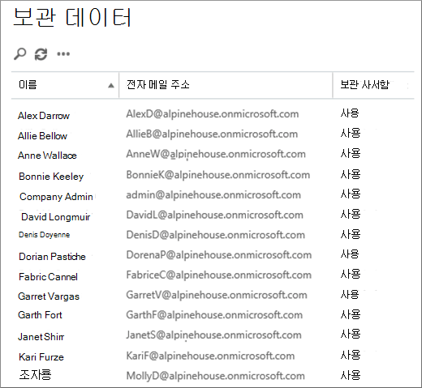
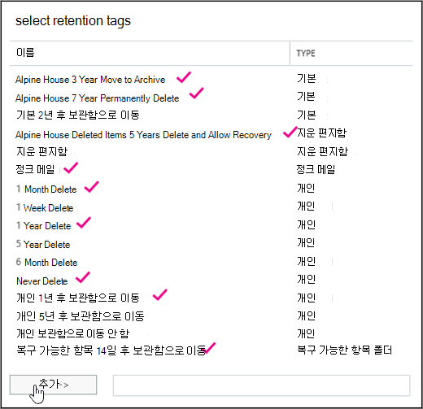
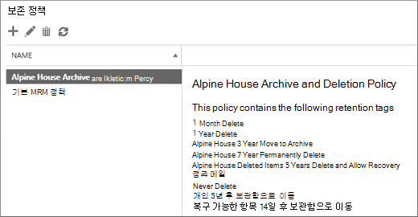

# <a name="set-up-an-archive-and-deletion-policy-for-mailboxes-in-your-organization"></a>조직에서 사서함에 대한 보관 및 삭제 정책 설정하기

Microsoft 365에서 관리자는 항목을 사용자의 보관 사서함으로 자동으로 이동하고 사서함에서 항목을 자동으로 삭제하는 보관 및 삭제 정책을 만들 수 있습니다. 관리자는 사서함에 할당된 보존 정책을 만들고 특정 기간이 지난 후 항목을 사용자의 보관 사서함으로 이동하고 특정 보존 기간에 도달한 후에도 사서함에서 항목을 삭제합니다. 이동 또는 삭제되는 항목과 이 경우를 결정하는 실제 규칙을 보존 태그라고 합니다. 보존 태그는 보존 정책에 연결되어 사용자 사서함에 차례로 할당됩니다. 보존 태그는 사용자 사서함의 개별 메시지 및 폴더에 보존 설정을 적용합니다. 사서함에 메시지가 남아 있는 기간 및 메시지가 지정된 보존 기간에 도달하면 수행되는 작업을 정의합니다. 메시지가 보존 기간에 도달하면 사용자의 보관 사서함으로 이동되거나 삭제됩니다.
  
이 문서의 단계에서는 Alpine House라는 인명 조직에 대한 보관 및 보존 정책을 설정할 것입니다. 이 정책을 설정하는 작업에는 다음 작업이 포함됩니다.
  
- 조직의 모든 사용자에 대해 보관 사서함을 사용하도록 설정 이렇게 하면 사용자에게 사서함 저장소가 추가되어 보존 정책이 항목을 보관 사서함으로 이동할 수 있도록 필요합니다. 또한 항목을 보관 사서함으로 이동하여 보관 정보를 저장할 수 있습니다.

- 다음을 하는 세 개의 사용자 지정 보존 태그 만들기

  - 3년이 지난 항목은 사용자의 보관 사서함으로 자동으로 이동됩니다. 항목을 보관 사서함으로 이동하면 사용자의 기본 사서함에 공간을 비우게 됩니다.

  - 지우기 항목 폴더에서 5년 된 항목을 자동으로 삭제합니다. 이렇게 하여 사용자의 기본 사서함에 공간을 비울 수도 있습니다. 사용자는 필요한 경우 이러한 항목을 복구할 수 있습니다. 자세한 내용은 추가 정보 [](#more-information) 섹션의 각주를 참조하십시오. 

  - 기본 사서함과 보관 사서함 모두에서 7년 된 항목을 자동으로(영구적으로) 삭제합니다. 규정 준수 규정 때문에 특정 기간 동안 전자 메일을 보존해야 하는 조직도 있습니다. 이 기간이 만료되면 조직에서 이러한 항목 사용자 사서함을 영구적으로 제거할 수 있습니다.

- 새 보존 정책을 만들고 새 사용자 지정 보존 태그를 추가합니다. 또한 새 보존 정책에 기본 제공 보존 태그를 추가합니다. 여기에는 사용자가 사서함의 항목에 할당할 수 있는 개인 태그가 포함됩니다. 또한 사용자의 기본 사서함에 있는 복구 가능한 항목 폴더의 항목을 보관 사서함의 복구 가능한 항목 폴더로 이동하는 보존 태그를 추가합니다. 이렇게 하면 사서함이 보류된 경우 사용자의 복구 가능한 항목 폴더에서 공간을 비우는 데 도움이 됩니다.

이 문서의 일부 또는 전체 단계를 수행하여 조직 내 사서함에 대한 보관 및 삭제 정책을 설정할 수 있습니다. 조직의 모든 사서함에서 구현하기 전에 몇 개의 사서함에서 이 프로세스를 테스트하는 것이 좋습니다.
  
## <a name="before-you-set-up-an-archive-and-deletion-policy"></a>보관함 및 삭제 정책을 설정하기 전에

- 이 항목의 단계를 수행하기 위해 조직의 전역 관리자로 설정해야 합니다. 

- 새 사용자 계정을 만들고 사용자에게 Exchange Online 라이선스를 할당하면 사용자에 대한 사서함이 자동으로 만들어집니다. 사서함을 만들면 기본 MRM 정책이라는 기본 보존 정책이 자동으로 할당됩니다. 이 문서에서는 새 보존 정책을 만든 다음 사용자 사서함에 할당하여 기본 MRM 정책을 대체합니다. 사서함에는 한 번만 보존 정책이 할당될 수 있습니다.

- Exchange Online의 보존 태그 및 보존 정책에 대한 자세한 내용은 보존 태그 [및 보존 정책을 참조하세요.](https://go.microsoft.com/fwlink/p/?LinkId=404424)

## <a name="step-1-enable-archive-mailboxes-for-users"></a>1단계: 사용자에 대해 보관 사서함 사용

첫 번째 단계는 조직의 각 사용자에 대해 보관 사서함을 사용하도록 설정하는 것입니다. 보존 기간이 만료된 후 "보관함으로 이동" 보존 작업이 있는 보존 태그가 항목을 이동할 수 있도록 사용자의 보관 사서함을 사용하도록 설정해야 합니다.
  
> [!NOTE]
> 프로세스를 완료하기 전에 특정 시점에 보관 사서함을 사용하도록 설정하는 한 이 프로세스 중에 보관 사서함을 사용하도록 설정할 수 있습니다. 보관 사서함을 사용하도록 설정하지 않은 경우 보관함 또는 삭제 정책이 할당된 항목에 대해 아무 작업도 수행되지 않습니다.
  
1. [https://protection.office.com](https://protection.office.com)으로 이동합니다.

2. 전역 관리자 계정을 사용하여 로그인합니다.
    
3. 보안 및 & 센터에서 정보 **거버넌스 보관으로** \> **이동하십시오.**

    조직의 사서함 목록과 해당 보관 사서함을 사용할 수 있는지 여부가 표시됩니다.

4. 목록의 첫 번째 사서함을 클릭하고 **Shift** 키를 잡고 목록에서 마지막 사서함을 클릭하여 모든 사서함을 선택합니다.

    > [!TIP]
    > 이 단계에서는 보관 사서함이 사용되지 않습니다. 보관함이 사용하도록 설정된 사서함이 있는 경우 **Ctrl** 키를 유지하고 사용하지 않도록 설정된 보관 사서함이 있는 각 사서함을 클릭합니다. 또는 보관 사서함  열 헤더를 클릭하여 보관 사서함을 보다 쉽게 선택할 수 있도록 보관 사서함을 사용할지 여부를 기준으로 행을 정렬할 수 있습니다.
  
5. 세부 정보 창의 대량 편집 **아래에서** 사용 **을 클릭합니다.**

    2년이 지난 항목은 새 보관 사서함으로 이동될 것임에 대한 경고가 표시됩니다. 이는 새 사용자 사서함을 만들 때 할당된 기본 보존 정책에 보존 기간이 2년인 보관 기본 정책 태그가 있기 때문에입니다. 2단계에서 만들 사용자 지정 보관 기본 정책 태그의 보존 기간은 3년입니다. 즉, 3년 이상 된 항목이 보관 사서함으로 이동됩니다.

6. **예를** 클릭하여 경고 메시지를 닫고 선택한 각 사서함에 대해 보관 사서함을 사용하도록 설정하는 프로세스를 시작합니다.

7. 프로세스가 완료되면 새로 고침을 **클릭하여** 보관 페이지의  **업데이트합니다.**

    보관 사서함은 조직의 모든 사용자에 대해 사용하도록 설정됩니다.

    

## <a name="step-2-create-new-retention-tags-for-the-archive-and-deletion-policies"></a>2단계: 보관 및 삭제 정책에 대한 새 보존 태그 만들기

이 단계에서는 이전에 설명한 세 가지 사용자 지정 보존 태그를 생성합니다.
  
- 알파인 하우스 3년 후 보관함으로 이동(사용자 지정 보관 정책)

- 알파인 하우스 7년 영구 삭제(사용자 지정 삭제 정책)

- Alpine House Deleted Items 5 Years Delete and Allow Recovery (custom tag for the Deleted Items folder)

새 보존 태그를 만들하려면 Exchange Online 조직에서 EAC(Exchange 관리 센터)를 사용하게 됩니다. EAC의 클래식 버전을 사용해야 합니다.
  
1. 이동한 [https://admin.protection.outlook.com/ecp/](https://admin.protection.outlook.com/ecp/) 후 자격 증명을 사용하여 로그인합니다.
  
2. EAC에서 준수 **관리** 보존  >  **태그로 이동**

    조직의 보존 태그 목록이 표시됩니다.

### <a name="create-a-custom-archive-default-policy-tag"></a>사용자 지정 보관 기본 정책 태그 만들기
  
먼저 3년 후에 항목을 보관 사서함으로 이동하는 사용자 지정 보관 기본 정책 태그(DPT)를 만들어야 합니다.
  
1. 보존 태그 **페이지에서** 새 태그 새 아이콘을 클릭한 다음 전체 사서함에 자동으로  **적용(기본값)을 선택합니다.**

2. 전체 **사서함(기본값) 페이지에** 자동으로 적용된 새 태그에서 다음 필드를 입력합니다. 

    
  
   1. **이름** 새 보존 태그의 이름을 입력합니다. 

   2. **보존 작업** 보존 **기간이** 만료되면 항목을 보관 사서함으로 이동하려면 보관함으로 이동을 선택합니다.

   3. **보존 기간** 항목이 다음 기간(일)에 도달하면 선택한 다음 보존 기간을 입력합니다. 이 시나리오에서는 항목이 1095일(3년) 후에 보관 사서함으로 이동됩니다.

   4. **설명(선택** 사항) 사용자 지정 보존 태그의 용도를 설명하는 설명을 입력합니다.

3. **저장을** 클릭하여 사용자 지정 보관 DPT를 만들 수 있습니다.

    새 보관 DPT는 보존 태그 목록에 표시됩니다.

### <a name="create-a-custom-deletion-default-policy-tag"></a>사용자 지정 지우기 기본 정책 태그 만들기
  
다음으로 다른 사용자 지정 DPT를 만들지만 이 정책은 7년 후에 항목을 영구적으로 삭제하는 삭제 정책입니다.
  
1. 보존 태그 **페이지에서** 새 태그 새 아이콘을 클릭한 다음 전체 사서함에 자동으로  **적용(기본값)을 선택합니다.**

2. 전체 **사서함(기본값) 페이지에** 자동으로 적용된 새 태그에서 다음 필드를 입력합니다. 

    
  
   1. **이름** 새 보존 태그의 이름을 입력합니다. 

   2. **보존 작업** 보존 **기간이** 만료될 때 사서함에서 항목을 제거하려면 영구 삭제를 선택합니다.

   3. **보존 기간** 항목이 다음 기간(일)에 도달하면 선택한 다음 보존 기간을 입력합니다. 이 시나리오에서는 2555일(7년) 후에 항목이 제거됩니다.

   4. **설명(선택** 사항) 사용자 지정 보존 태그의 용도를 설명하는 설명을 입력합니다. 

3. **저장을** 클릭하여 사용자 지정 지우기 DPT를 만들 수 있습니다. 

    새 삭제 DPT는 보존 태그 목록에 표시됩니다.

### <a name="create-a-custom-retention-policy-tag-for-the-deleted-items-folder"></a>지우기 항목 폴더에 대한 사용자 지정 보존 정책 태그 만들기
  
마지막으로 만들 보존 태그는 지우기 항목 폴더에 대한 RPT(사용자 지정 보존 정책 태그)입니다. 이 태그는 5년 후에 지우기 항목 폴더의 항목을 삭제하고 사용자가 지우기 항목 복구 도구를 사용하여 항목을 복구할 수 있는 복구 기간을 제공합니다.
  
1. 보존 태그 **페이지에서** 새  태그 새 아이콘을 클릭한 다음 기본 폴더에 자동으로  **적용된 태그를 선택합니다.**

2. 기본 폴더 페이지에 자동으로 적용된 **새** 태그에서 다음 필드를 입력합니다.

    
  
   1. **이름** 새 보존 태그의 이름을 입력합니다. 

   2. **다음 기본 폴더에 이 태그 적용** 드롭다운 목록에서 **지우기 항목을 선택합니다.**

   3. **보존 작업** 보존 **기간이** 만료될 때 항목을 삭제하려면 삭제 및 복구 허용을 선택하지만 사용자가 삭제된 항목 보존 기간(기본적으로 14일) 내에 삭제된 항목을 복구할 수 있도록 허용합니다.

   4. **보존 기간** 항목이 다음 기간(일)에 도달하면 선택한 다음 보존 기간을 입력합니다. 이 시나리오에서는 1825일(5년) 후에 항목이 삭제됩니다.

   5. **설명(선택** 사항) 사용자 지정 보존 태그의 용도를 설명하는 설명을 입력합니다. 

3. **저장을** 클릭하여 지우기 항목 폴더에 대한 사용자 지정 RPT를 만들 수 있습니다.

    새 RPT는 보존 태그 목록에 표시됩니다.

## <a name="step-3-create-a-new-retention-policy"></a>3단계: 새 보존 정책 만들기

사용자 지정 보존 태그를 만든 후 다음 단계는 새 보존 정책을 만들고 보존 태그를 추가하는 것입니다. 2단계에서 만든 세 가지 사용자 지정 보존 태그와 첫 번째 섹션에서 언급한 기본 제공 태그를 추가합니다. 4단계에서는 이 새 보존 정책을 사용자 사서함에 할당합니다.
  
1. EAC에서 준수 관리 보존  >  **정책으로 이동 합니다.**

2. 보존 정책 **페이지에서** 새 **아이콘을**  클릭합니다.

3. 이름 **상자에** 새 보존 정책의 이름을 입력합니다. 예: **Alpine House Archive and Deletion Policy**.

4. 보존 **태그 아래에서** 새로 **추가**  클릭합니다.

    조직의 보존 태그 목록이 표시됩니다. 2단계에서 만든 사용자 지정 태그가 표시됩니다.

5. 다음 스크린샷에 강조 표시된 9개 보존 태그를 추가합니다(추가 정보 섹션에서 이러한 태그에 대해 자세히 [설명).](#more-information) 보존 태그를 추가하려면 해당 태그를 선택하고 추가를 **클릭합니다.**

    
  
    > [!TIP]
    > **Ctrl** 키를 잡고 각 태그를 클릭하여 여러 보존 태그를 선택할 수 있습니다. 
  
6. 보존 태그를 추가한 후 확인을 **클릭합니다.**

7. 새 보존 **정책 페이지에서** 저장을 **클릭하여** 새 정책을 만드십시오.

    새 보존 정책이 목록에 표시됩니다. 세부 정보 창에 연결된 보존 태그를 표시하려면 선택합니다.

    
  
## <a name="step-4-assign-the-new-retention-policy-to-user-mailboxes"></a>4단계: 사용자 사서함에 새 보존 정책 할당

새 사서함을 만들면 기본 MRM 정책이라는 보존 정책이 기본적으로 할당됩니다. 이 단계에서는 3단계에서 만든 새 보존 정책을 조직의 사용자 사서함에 할당하여 이 보존 정책(사서함에 보존 정책이 하나만 할당될 수 있기 때문에)을 대체합니다. 이 단계에서는 조직의 모든 사서함에 새 정책을 할당할 것으로 가정합니다.
  
1. EAC에서 **받는** 사람  >  **사서함으로 이동 합니다.**

    조직의 모든 사용자 사서함 목록이 표시됩니다.

2. 목록의 첫 번째 사서함을 클릭하고 **Shift** 키를 잡고 목록에서 마지막 사서함을 클릭하여 모든 사서함을 선택합니다. 

3. EAC 오른쪽의 세부 정보 창에서 대량 편집 **아래에서** 추가 옵션을 **클릭합니다.**

4. **보존 정책** 에서 **업데이트** 를 클릭합니다.

5. 보존 정책 **대량** 할당 페이지의 보존 정책 선택 **드롭다운** 목록에서 3단계에서 만든 보존 정책을 선택합니다. 예: **Alpine House Archive and Retention Policy**.

6. **저장을** 클릭하여 새 보존 정책 할당을 저장합니다.

7. 새 보존 정책이 사서함에 할당되어 있는지 확인하기 위해 다음을 할 수 있습니다.

   1. 사서함 페이지에서 사서함을 **선택하고** **편집을**  클릭합니다.

   2. 선택한 사용자의 사서함 속성 페이지에서 사서함 **기능을 클릭합니다.**

   사서함에 할당된 새 정책의 이름이 보존 정책 **드롭다운** 목록에 표시됩니다.

## <a name="optional-step-5-run-the-managed-folder-assistant-to-apply-the-new-settings"></a>(선택 사항) 5단계: 관리되는 폴더 도우미를 실행하여 새 설정 적용

4단계에서 사서함에 새 보존 정책을 적용한 후 Exchange Online에서 새 보존 설정을 사서함에 적용하는 데 최대 7일이 걸릴 수 있습니다. 관리되는 폴더 도우미라는 프로세스가 7일마다 한 번 이상 사서함을 처리하기 때문에입니다.  관리되는 폴더 도우미가 실행될 때까지 기다리지 않고 Exchange Online PowerShell에서 **Start-ManagedFolderAssistant** cmdlet을 실행하여 강제로 이 일이 발생하게 할 수 있습니다.

 **관리되는 폴더 도우미를 실행하면 어떻게 하나요?** 사서함의 항목을 검사하고 보존이 적용되는지 여부를 확인하여 보존 정책의 설정을 적용합니다. 그런 다음 적절한 보존 태그를 사용하여 보존이 적용된 항목을 스탬프 처리한 다음 보존 기간이 지난 항목에 대해 지정된 보존 작업을 실행합니다.
  
다음은 Exchange Online PowerShell에 연결한 다음 조직의 모든 사서함에서 관리되는 폴더 도우미를 실행하기 위한 단계입니다.

1. [Exchange Online PowerShell에 연결합니다](https://go.microsoft.com/fwlink/p/?LinkId=517283).
  
2. 다음 두 명령을 실행하여 조직의 모든 사용자 사서함에 대해 관리되는 폴더 도우미를 시작할 수 있습니다.

    ```powershell
    $Mailboxes = Get-Mailbox -ResultSize Unlimited -Filter {RecipientTypeDetails -eq "UserMailbox"}
    ```

    ```powershell
    $Mailboxes.Identity | Start-ManagedFolderAssistant
    ```

모두 완료되었습니다. Alpine House 조직에 대한 보관 및 삭제 정책을 설정했습니다.

> [!NOTE]
> 앞서 설명한 것 처럼 관리되는 폴더 도우미는 적어도 7일마다 한 번씩 사서함을 처리합니다. 따라서 관리되는 폴더 도우미가 사서함을 더 자주 처리하게 될 수 있습니다. 또한 다음에 관리되는 폴더 도우미가 사서함을 처리하면 관리자가 예측할 수 없습니다. 이는 수동으로 실행해야 하는 이유 중 하나입니다. 그러나 관리되는 폴더 도우미가 새 보존 설정을 사서함에 적용하지 못하게 일시적으로 방지하려면 명령을 실행하여 관리되는 폴더 도우미가 사서함을 처리하지 못하게 일시적으로 사용하지 않도록 설정할 수 `Set-Mailbox -ElcProcessingDisabled $true` 있습니다. 사서함에 대해 관리되는 폴더 도우미를 다시 사용하도록 설정하려면 명령을 `Set-Mailbox -ElcProcessingDisabled $false` 실행합니다. 마지막으로, 사서함 사용자가 사용하지 않도록 설정한 계정이 있는 경우 해당 사서함에 대한 보관 작업을 보관하기 위한 이동 항목을 처리하지 않습니다.
  
## <a name="optional-step-6-make-the-new-retention-policy-the-default-for-your-organization"></a>(선택 사항) 6단계: 새 보존 정책을 조직의 기본값으로 설정

4단계에서 기존 사서함에 새 보존 정책을 할당해야 합니다. 하지만 새 보존 정책이 향후 만들어지도록 Exchange Online을 구성할 수 있습니다. 이 작업을 위해 Exchange Online PowerShell을 사용하여 조직의 기본 사서함 계획을 업데이트합니다. 사서함 *계획은* 새 사서함의 속성을 자동으로 구성하는 템플릿입니다.  이 선택적 단계에서는 사서함 계획에 할당된 현재 보존 정책(기본적으로 기본 MRM 정책)을 3단계에서 만든 보존 정책으로 바꿀 수 있습니다. 사서함 계획을 업데이트하면 새 보존 정책이 새 사서함에 할당됩니다.

1. [Exchange Online PowerShell에 연결합니다](https://go.microsoft.com/fwlink/p/?LinkId=517283).

2. 다음 명령을 실행하여 조직의 사서함 계획에 대한 정보를 표시합니다.

    ```powershell
    Get-MailboxPlan | Format-Table DisplayName,RetentionPolicy,IsDefault
    ```

    기본값으로 설정된 사서함 계획을 유의합니다.

3. 다음 명령을 실행하여 3단계에서 만든 새 보존 정책(예: **알파인** 하우스 보관함 및 보존 정책)을 기본 사서함 계획에 할당합니다. 이 예에서는 기본 사서함 계획의 이름이 **ExchangeOnlineEnterprise로 가정합니다.**

    ```powershell
    Set-MailboxPlan "ExchangeOnlineEnterprise" -RetentionPolicy "Alpine House Archive and Retention Policy"
    ```

4. 2단계의 명령을 다시 실행하여 기본 사서함 계획에 할당된 보존 정책이 변경되어 있는지 확인할 수 있습니다.

## <a name="more-information"></a>추가 정보

- 보존 기간은 어떻게 계산되나요? 사서함 항목의 보존 기간은 전송되지 않지만 사용자가 만든 초안 메시지와 같은 항목에 대한 배달 날짜 또는 만든 날짜부터 계산됩니다. 관리되는 폴더 도우미가 사서함의 항목을 처리할 때 보존 태그가 있는 모든 항목의 시작 날짜 및 만료 날짜에 삭제 및 복구 허용 또는 영구 삭제 보존 작업으로 스탬프 처리합니다. 보관 태그가 있는 항목은 이동 날짜로 스탬프가 지정됩니다. 

- 다음 표에서는 이 항목의 단계를 수행하여 만든 사용자 지정 보존 정책에 추가되는 각 보존 태그에 대한 자세한 정보를 제공합니다.

    | 보존 태그 | 이 태그가 하는 일 | 기본 제공 여부 또는 사용자 지정 여부 | 유형 |
    |:-----|:-----|:-----|:-----|
    |알파인 하우스 3년 후 보관함으로 이동  <br/> |1095일(3년) 이전의 항목을 보관 사서함으로 이동합니다.  <br/> |사용자 [지정(2단계: 보관](#step-2-create-new-retention-tags-for-the-archive-and-deletion-policies)및 삭제 정책에 대한 새 보존 태그 만들기 참조)  <br/> |기본 정책 태그(보관) 이 태그는 전체 사서함에 자동으로 적용됩니다.  <br/> |
    |알파인 하우스 7년 영구 삭제  <br/> |기본 사서함 또는 보관 사서함의 항목은 7년이 지난 경우 영구적으로 삭제합니다.  <br/> |사용자 [지정(2단계: 보관](#step-2-create-new-retention-tags-for-the-archive-and-deletion-policies)및 삭제 정책에 대한 새 보존 태그 만들기 참조)  <br/> |기본 정책 태그(지우기); 이 태그는 전체 사서함에 자동으로 적용됩니다.  <br/> |
    |알파인 하우스 삭제된 항목 5년 삭제 및 복구 허용  <br/> |지우기 항목 폴더에서 5년 된 항목을 삭제합니다. 사용자는 삭제 후 최대 14일 동안 이러한 항목을 복구할 수 있습니다.<sup>\*</sup> <br/> |사용자 [지정(2단계: 보관](#step-2-create-new-retention-tags-for-the-archive-and-deletion-policies)및 삭제 정책에 대한 새 보존 태그 만들기 참조)  <br/> |보존 정책 태그(삭제된 항목) 이 태그는 지우기 항목 폴더의 항목에 자동으로 적용됩니다.  <br/> |
    |복구 가능한 항목 14일 보관함으로 이동  <br/> |14일 동안 복구 가능한 항목 폴더에 있는 항목을 보관 사서함의 복구 가능한 항목 폴더로 이동합니다.  <br/> |기본 제공  <br/> |보존 정책 태그(복구 가능한 항목) 이 태그는 복구 가능한 항목 폴더의 항목에 자동으로 적용됩니다.  <br/> |
    |정크 메일  <br/> |30일 동안 정크 메일 폴더에 있는 항목을 영구적으로 삭제합니다. 사용자는 삭제 후 최대 14일 동안 이러한 항목을 복구할 수 있습니다.<sup>\*</sup> <br/> |기본 제공  <br/> |보존 정책 태그(정크 메일); 이 태그는 정크 메일 폴더의 항목에 자동으로 적용됩니다.  <br/> |
    |1개월 삭제  <br/> |30일이 지난 항목을 영구적으로 삭제합니다. 사용자는 삭제 후 최대 14일 동안 이러한 항목을 복구할 수 있습니다.<sup>\*</sup> <br/> |기본 제공  <br/> |개인; 이 태그는 사용자가 적용할 수 있습니다.  <br/> |
    |1년 삭제  <br/> |365일이 지난 항목을 영구적으로 삭제합니다. 사용자는 삭제 후 최대 14일 동안 이러한 항목을 복구할 수 있습니다.<sup>\*</sup> <br/> |기본 제공  <br/> |개인; 이 태그는 사용자가 적용할 수 있습니다.  <br/> |
    |삭제 안  <br/> |이 태그는 보존 정책에 의해 항목이 삭제되지 않도록 합니다.  <br/> |기본 제공  <br/> |개인; 이 태그는 사용자가 적용할 수 있습니다.  <br/> |
    |개인 1년 후 보관함으로 이동  <br/> |1년 후 항목을 보관 사서함으로 Moves items.  <br/> |기본 제공  <br/> |개인; 이 태그는 사용자가 적용할 수 있습니다.  <br/> |

    > <sup>\*</sup> 사용자는 Outlook 및 웹용 Outlook(이전의 Outlook Web App)에서 지우기 항목 복구 도구를 사용하여 삭제된 항목 보존 기간(Exchange Online에서 기본적으로 14일)의 삭제된 항목을 복구할 수 있습니다. 관리자는 이 Windows PowerShell 사용하여 삭제된 항목 보존 기간을 최대 30일로 늘일 수 있습니다. 자세한 내용은 다음을 참조하십시오. [Windows용 Outlook에서](https://support.office.com/article/49e81f3c-c8f4-4426-a0b9-c0fd751d48ce) 삭제된 항목 복구 및 [Exchange Online의](https://www.microsoft.com/?ref=go) 사서함에 대한 삭제된 항목 보존 기간 변경
  
- 복구할 수 있는 항목 **14일 이동** 보존 태그를 사용하면 사용자의 기본 사서함에 있는 복구 가능한 항목 폴더의 저장소 공간을 비우는 데 도움이 됩니다. 이는 사용자의 사서함이 보류 상태일 때 유용합니다. 즉, 사용자의 사서함은 영구적으로 삭제되지 않습니다. 항목을 보관 사서함으로 이동하지 않으면 기본 사서함의 복구 가능한 항목 폴더에 대한 저장소 할당량에 도달할 수 있습니다. 이 문제를 방지하는 방법에 대한 자세한 내용은 보류된 사서함에 대한 복구 가능한 항목 할당량 [늘리기 항목을 참조하십시오.](https://go.microsoft.com/fwlink/p/?LinkId=786479)
