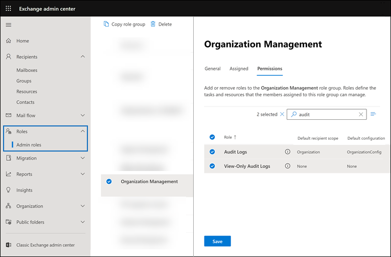

# 2013에서 기본 감사 Microsoft 365Set up Basic Audit in Microsoft 365

기본 감사 Microsoft 365 사용하여 사용자 및 관리자가 다양한 Microsoft 365 수행한 활동에 대한 감사 레코드를 검색할 수 있습니다.Basic Audit in Microsoft 365 lets you search for audit records for activities performed in the different Microsoft 365 services by users and admins. 기본 감사는 대부분의 Microsoft 365 Office 365 조직에서 기본적으로 사용하도록 설정되기 때문에 사용자 및 조직의 다른 사람이 감사 로그를 검색하기 전에 몇 가지만 해야 합니다.Because Basic Audit is enabled by default for most Microsoft 365 and Office 365 organizations, there's only a few things you need to do before you and others in your organization can search the audit log.

이 문서에서는 기본 감사를 설정하는 데 필요한 다음 단계에 대해 논의합니다.This article discusses the following steps necessary to set up Basic Audit.

이러한 단계에는 감사 레코드를 생성하고 보존하는 데 필요한 적절한 조직 구독 및 사용자 라이선스를 보장하고 감사 로그를 검색할 수 있도록 보안 운영, IT, 규정 준수 및 법률 팀의 팀 구성원에게 사용 권한을 할당하는 작업이 포함됩니다.These steps include ensuring the proper organizational subscriptions and user licensing required to generate and preserve audit records and assigning permissions to team members of your security operations, IT, compliance, and legal teams so that can search the audit log.

자세한 내용은 에서 [기본 감사를 Microsoft 365.](auditing-solutions-overview.md#basic-audit)For more information, see [Basic Audit in Microsoft 365](auditing-solutions-overview.md#basic-audit).

## 1단계: 조직 구독 및 사용자 라이선스 확인Step 1: Verify organization subscription and user licensing

기본 감사에 대한 라이선스를 사용하려면 감사 로그 검색 도구 및 감사 레코드를 기록하고 보존하는 데 필요한 사용자당 라이선스에 대한 액세스를 제공하는 적절한 조직 구독이 필요합니다.Licensing for Basic Audit requires the appropriate organization subscription that provides access to audit log search tool and per-user licensing that's required to log and retain audit records.

사용자 또는 관리자가 감사되는 활동을 수행하면 감사 레코드가 생성되어 조직의 감사 로그에 저장됩니다.When an audited activity is performed by a user or admin, an audit record is generated and stored in the audit log for your organization. 기본 감사에서 감사 레코드는 90일 동안 감사 로그에 보존되고 검색할 수 있습니다.In Basic Audit, audit records are retained and searchable in the audit log for 90 days.

기본 감사에 대한 구독 및 라이선스 요구 사항 목록은 에서 감사 [솔루션을 Microsoft 365.](auditing-solutions-overview.md#licensing-requirements)For a list of subscription and licensing requirements for Basic Audit, see [Auditing solutions in Microsoft 365](auditing-solutions-overview.md#licensing-requirements).

## 2단계: 감사 로그 검색에 대한 사용 권한 할당Step 2: Assign permissions to search the audit log

감사 로그를 검색하려면 조사 팀의 관리자와 구성원에게 View-Only 감사 로그 또는 감사 Exchange Online 역할이 할당되어야 합니다.Admins and members of investigation teams must be assigned the View-Only Audit Logs or Audit Logs role in Exchange Online to search the audit log. 기본적으로 이러한 역할은 Exchange 관리 센터의 **사용 권한** 페이지에서 규정 준수 관리 및 조직 관리 역할 그룹에 할당됩니다.By default, these roles are assigned to the Compliance Management and Organization Management role groups on the **Permissions** page in the Exchange admin center. 조직 및 Office 365 Microsoft 365 전역 관리자가 조직의 조직 관리 역할 그룹의 구성원으로 Exchange Online.Global administrators in Office 365 and Microsoft 365 are automatically added as members of the Organization Management role group in Exchange Online. 최소 권한 수준을 사용하여 감사 로그를 검색할 수 있는 권한을 사용자에게 제공하려면 Exchange Online에서 사용자 지정 역할 그룹을 만들고, 보기 전용 감사 로그 또는 감사 로그 역할을 추가한 다음, 새 역할 그룹의 구성원으로 사용자를 추가할 수 있습니다.To give a user the ability to search the audit log with the minimum level of privileges, you can create a custom role group in Exchange Online, add the View-Only Audit Logs or Audit Logs role, and then add the user as a member of the new role group. 자세한 내용은 [Exchange Online에서 역할 그룹 관리](/Exchange/permissions-exo/role-groups)를 참조하세요.For more information, see [Manage role groups in Exchange Online](/Exchange/permissions-exo/role-groups).

다음 스크린샷은 조직 관리 센터의 조직 관리 역할 그룹에 할당된 두 가지 감사 관련 역할을 Exchange 보여줍니다.The following screenshot shows the two audit-related roles assigned to the Organization Management role group in the Exchange admin center.

## 3단계: 감사 로그 검색Step 3: Search the audit log

이제 준수 센터에서 감사 로그를 검색할 Microsoft 365 있습니다.Now you're ready to search the audit log in the Microsoft 365 compliance center.

1. 으로 이동한 후 적절한 감사 권한이 할당된 계정을 사용하여 <https://compliance.microsoft.com> 로그인합니다.Go to <https://compliance.microsoft.com> and sign in using an account that has been assigned the appropriate audit permissions.

2. Microsoft 365 센터의 왼쪽 탐색 창에서 모두 표시를 클릭한 **다음** 감사를 **클릭합니다.**In the left navigation pane of the Microsoft 365 compliance center, click **Show all** and then click **Audit**.

3. 감사 **페이지에서** 검색 탭의 다음 조건을 사용하여 검색을 **구성합니다.**On the **Audit** page, configure the search using the following conditions on the **Search** tab. 

   

   1. **날짜 및 시간 범위입니다.****Date and time range**. 날짜 및 시간 범위를 선택하여 해당 기간 내에 발생한 이벤트를 표시합니다.Select a date and time range to display the events that occurred within that period. 날짜 및 시간은 현지 시간으로 표시됩니다.The date and time are presented in local time. 기본적으로 지난 7일이 선택됩니다.The last seven days are selected by default.
  
   2. **활동**.**Activities**. 검색할 활동을 선택합니다.Select the activities to search for. 검색 상자를 사용하여 목록에 추가할 활동을 검색합니다.Use the search box to search for activities to add to the list. 감사된 활동의 일부 목록은 감사된 활동을 [참조하세요.](search-the-audit-log-in-security-and-compliance.md#audited-activities)For a partial list of audited activities, see [Audited activities](search-the-audit-log-in-security-and-compliance.md#audited-activities). 감사된 모든 활동에 대한 항목을 반환하기 위해 이 상자를 비워 두십시오.Leave this box blank to return entries for all audited activities.
  
   3. **사용자**.**Users**.  이 상자를 클릭하고 검색 결과를 표시할 사용자 이름을 입력합니다.Click in this box and start typing the name of users to display search results for. 이 상자에서 선택한 사용자가 수행한 선택한 활동에 대한 감사 로그 항목이 결과 목록에 표시됩니다.The audit log entries for the selected activities performed by the users you select in this box are displayed in the list of results. 조직의 모든 사용자(및 서비스 계정)에 대한 항목을 반환하려면 이 상자를 비워 둡니다.Leave this box blank to return entries for all users (and service accounts) in your organization.
  
   4. **파일, 폴더 또는 사이트**.**File, folder, or site**. 파일 또는 폴더 이름을 일부 또는 모두 입력하여 지정된 키워드가 포함된 폴더 파일과 관련된 활동을 검색합니다.Type some or all of a file or folder name to search for activity related to the file of folder that contains the specified keyword. 파일 또는 폴더의 URL을 지정할 수도 있습니다.You can also specify a URL of a file or folder. 파일 또는 폴더의 URL을 사용하는 경우 전체 URL 경로를 입력해야 합니다. 또는 URL의 일부를 입력하는 경우 특수 문자나 공백을 포함하지 않습니다.If you use a URL of a file or folder, be sure the type the full URL path or if you type a portion of the URL, don't include any special characters or spaces. 조직의 모든 파일 및 폴더에 대한 항목을 반환하려면 이 상자를 비워 둡니다.Leave this box blank to return entries for all files and folders in your organization.

4. 검색을 **클릭하여** 검색을 실행합니다.Click **Search** to run the search.

감사 로그 검색이 실행되고 있는 새 페이지가 표시됩니다.A new page is display that shows the audit log search is running. 검색이 완료되면 감사 레코드가 페이지에 표시됩니다.When the search is completed, audit records are displayed on the page. 레코드를 클릭하여 자세한 속성이 있는 플라이아웃 페이지를 표시합니다.Click a record to display a flyout page with detailed properties.

자세한 지침은 준수 센터에서 감사 로그 [검색을 참조하세요.](search-the-audit-log-in-security-and-compliance.md)For more detailed instructions, see [Search the audit log in the compliance center](search-the-audit-log-in-security-and-compliance.md).
