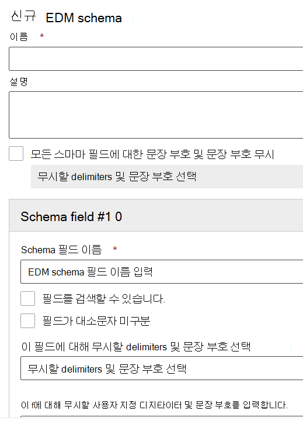

# 정확한 데이터 일치 스키마 및 중요한 정보 유형 마법사 사용

[EDM(정확한 데이터 일치) 기반 분류](create-custom-sensitive-information-types-with-exact-data-match-based-classification.md)를 사용하여 사용자 지정 중요한 정보 유형을 생성하려면 여러 단계를 거쳐야 합니다.  이 마법사를 사용하여 프로세스를 간소화하는 데 도움이 되는 Schema 및 SIT(중요한 정보 유형) 패턴(규칙 패키지) 파일을 만들 수 있습니다.

이 마법사는 다음 대신 사용할 수 있습니다.

- [중요한 정보 데이터베이스의 스키마 정의](create-custom-sensitive-information-types-with-exact-data-match-based-classification.md#define-the-schema-for-your-database-of-sensitive-information)
- [패턴 설정(규칙 패키지)](create-custom-sensitive-information-types-with-exact-data-match-based-classification.md#set-up-a-rule-package)

[1단계: EDM 기반 분류 설정](create-custom-sensitive-information-types-with-exact-data-match-based-classification.md#part-1-set-up-edm-based-classification).

## 필수 구성 요소

1. EDM [ 워크플로 한 눈에 보기](create-custom-sensitive-information-types-with-exact-data-match-based-classification.md#the-work-flow-at-a-glance)를 통해 사용자 지정 중요한 정보 유형을 생성하는 단계를 숙지하세요.

2. 중요한 데이터를 파일 또는 [.tsv 형식으로 .csv 단계를 수행합니다.](create-custom-sensitive-information-types-with-exact-data-match-based-classification.md#save-sensitive-data-in-csv-or-tsv-format)

## 정확한 데이터 일치 스키마 및 중요한 정보 유형 패턴 마법사 사용

1. 테넌트에 대한 Microsoft 365 규정 준수 센터에서 **데이터 분류** > **일치 데이터 추출** 로 이동하세요.

2. **EDM 스키마 생성** 을 선택하여 스키마 마법사 구성 플라이아웃을 선택합니다.

3. 적절한 **이름** 과 **설명** 을 입력합니다.

4. 해당 동작을 사용하려는 경우 모든 **Schema** 필드에 대해 문장 부호 및 문장 부호 무시를 선택 합니다. 대소문자나 구분 구분을 무시하기 위해 EDM을 구성하는 방법을 알아보는 자세한 내용은 [EDM(Exact Data Match)](create-custom-sensitive-information-types-with-exact-data-match-based-classification.md)기반 분류를 사용하여 사용자 지정 중요한 정보 유형 만들기를 참조하세요.

5. **Schema 필드 #1** 에 대해 원하는 값을 입력하고 필요에 따라 필드를 추가합니다. 

> [!IMPORTANT]
> 하나 이상의 스키마 필드를 검색 가능으로 지정해야 합니다.

6. 저장을 선택합니다. 스키마가 나열됩니다.

7. **EDM 중요한 정보 유형** 과 **EDM 중요한 정보 유형** 을 선택하고 중요한 정보 유형 구성 마법사를 선택합니다.

8. **기존 EDM 스키마** 를 선택하고 목록에서 2-6단계에서 생성한 스키마를 선택합니다.

9. **다음** 을 선택하고 **패턴 생성** 을 선택합니다.

10. **신뢰 수준** 및 **기본 요소** 를 선택합니다.  패턴을 구성하는 방법에 대한 자세한 내용은 [규정 준수 센터에서 사용자 지정 중요한 정보 유형 생성](create-a-custom-sensitive-information-type.md)을 참조하세요.

11.  연결할 **기본 요소에 대한 중요한 정보 유형** 을 선택합니다. 사용 가능한 중요한 정보 유형에 대한 자세한 내용은 [중요한 정보 유형 엔티티 정의](sensitive-information-type-entity-definitions.md)를 참조하세요.

12. **완료** 를 선택합니다.

13. 원하는 **신뢰 수준 및 문자 근접성** 을 선택합니다.  이 값은 전체 EDM 중요한 정보 유형에 대한 기본값이 됩니다.

13. EDM 중요한 **정보** 유형에 대한 추가 패턴을 만들 경우 패턴 만들기를 선택하십시오.

14. **다음** 을 선택하고 **이름** 과 **관리자 설명** 을 입력합니다.

15. 검토하고 **제출** 을 선택합니다.

중요한 정보 유형 패턴을 선택하여 편집 및 삭제 컨트롤의 표면을 선택하여 삭제하거나 편집할 수 있습니다.

> [!IMPORTANT]
> 스키마를 제거하려면 해당 스키마가 EDM에 중요한 정보 유형과 이미 연결되어 있는 경우 먼저 EDM에 중요한 정보 유형을 삭제한 후 스키마를 삭제할 수 있습니다.

## 만들기 후 단계

이 마법사를 사용하여 EDM 스키마 및 패턴(규칙 패키지) 파일을 생성한 후에도 [2 단계: 중요 데이터 해시 및 업로드](create-custom-sensitive-information-types-with-exact-data-match-based-classification.md#part-2-hash-and-upload-the-sensitive-data)를 완료해야 EDM 사용자 지정 정보 유형을 사용할 수 있습니다.

중요한 정보 테이블이 올바르게 업로드되었는지 확인한 후 제대로 작동하고 있는지 테스트할 수 있습니다.

1. 개방형 **준수 센터**  >  **데이터 분류 중요한** 정보  >  **유형입니다.**
2. 목록에서 EDM SIT를 선택한  다음 플라이아웃 창에서 테스트를 선택합니다. 
3. 업로드 중요한 정보 테이블의 일부 데이터가 포함된 항목을 만드는 경우를 예로 들 수 있습니다. Schema에서 구성 가능한 일치 기능을 사용하여 무시된 개별 항목을 정의한 경우 항목에 해당 개별 항목과 함께 및 포함하지 않는 예제를 포함해야 합니다.
4. 파일을 업로드하고 검사한 후 EDM SIT와 일치하는지 검사합니다.
5. SIT의 **Test** 함수에서 일치가 검색되면 해당 일치가 잘리거나 올바르게 추출되지 않는지 검사합니다. 예를 들어 전체 문자열의 하위 문자열만 추출하여 검색하거나 다중 단어 문자열의 첫 번째 단어만 선택하거나 추출에 추가 기호나 문자를 포함해야 합니다. 정규식 [언어 참조에](/dotnet/standard/base-types/regular-expression-language-quick-reference) 대한 자세한 내용은 정규식 언어 - 빠른 참조를 참조합니다. 

### 문제 해결

일치하는 일치가 없는 경우 다음을 시도합니다.
- EDM 도구를 사용하여 중요한 데이터를 업로드하기 위한 지침에 설명된 명령을 사용하여 중요한 데이터가 올바르게 [업로드된지 확인합니다.](create-custom-sensitive-information-types-with-exact-data-match-based-classification.md)
- 항목에 입력한 예제가 중요한 정보 표에 있으며 무시된 구분선이 올바른지 확인합니다.
- **각** 패턴에서 기본 요소를 구성할 때 사용한 SIT를 테스트합니다. 그러면 SIT가 항목의 예제와 일치할 수 있습니다. 
  -  EDM 형식의 기본 요소에 대해 선택한 SIT가 항목에서 일치 항목을 찾지 못하거나 예상보다 적은 일치 항목을 찾으면 콘텐츠에 있는 구분 및 구분기를 지원하는지 검사합니다. 해당 schema에 정의된 무시된 디지타이터를 포함해야 합니다. 
  -  Test **함수에서** 콘텐츠를 검색하지 못하면 선택한 SIT에 추가 키워드 또는 기타 유효성 검사에 대한 요구 사항이 포함되어 있지 않은지 확인합니다. 기본 제공 SITS에 대한  자세한 내용은 중요한 정보 유형 엔터티 정의를 참조하여 각 유형과 일치하기 위한 최소 요구 사항을 확인합니다.
