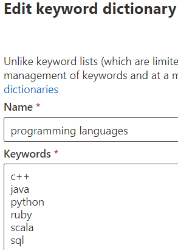

# <a name="modify-a-keyword-dictionary"></a>키워드 사전 수정

키워드 사전 중 하나에 있는 키워드를 수정하거나 기본 제공 사전 중 하나에서 키워드를 수정해야 할 수 있습니다. PowerShell 또는 준수 센터를 통해 이 작업을 할 수 있습니다.

## <a name="modify-a-keyword-dictionary-in-compliance-center"></a>준수 센터에서 키워드 사전 수정

키워드 사전은 SIT(중요한 정보 유형) 패턴으로 또는 중요한 `Primary elements` `Supporting elements` 정보 유형으로 사용할 수 있습니다. SIT를 만드는 동안 또는 기존 SIT에서 키워드 사전을 편집할 수 있습니다. 예를 들어 기존 키워드 사전을 편집하려면 다음을 입력합니다.

1. 업데이트할 키워드 사전이 있는 패턴을 열 수 있습니다.
2. 업데이트할 키워드 사전을 찾아 편집을 선택하세요. 
3.  한 줄에 하나의 키워드를 사용하여 편집합니다.



4. 를 `Done` 선택.

## <a name="modify-a-keyword-dictionary-using-powershell"></a>PowerShell을 사용하여 키워드 사전 수정 

예를 들어 PowerShell에서 일부 용어를 수정하고, 용어를 수정할 수 있는 위치에 로컬로 저장한 다음 이전 용어를 제자리에 업데이트합니다. 

먼저 사전 개체를 검색합니다.
  
```powershell
$dict = Get-DlpKeywordDictionary -Name "Diseases"
```

`$dict`을(를) 인쇄하면 다양한 변수가 표시됩니다. 키워드 자체는 백엔드의 개체에 저장되지만 `$dict.KeywordDictionary`에는 키워드에 대한 문자열 표현이 포함되어 있어 사전을 수정하는 데 사용됩니다. 

사전을 수정하기 전에 `.split(',')` 방법을 사용하여 용어 문자열을 어레이로 다시 변환해야 합니다. 그런 다음 `.trim()` 메서드를 사용하여 키워드 사이의 원치 않는 공백을 정리합니다. 
  
```powershell
$terms = $dict.KeywordDictionary.split(',').trim()
```

이제 사전에서 몇 가지 용어를 제거해봅니다. 예제 사전에는 키워드가 몇 개만 포함되어 있으므로 사전을 내보내고 메모장에서 편집하는 과정으로 쉽게 건너뛸 수 있습니다. 그렇지만 사전에는 많은 용어가 들어 있는 것이 일반적이므로 먼저 이 방법을 배워 PowerShell에서 쉽게 편집할 수 있도록 합니다.
  
마지막 단계에서는 키워드를 배열로 저장했습니다. [배열에서 항목을 제거](/previous-versions/windows/it-pro/windows-powershell-1.0/ee692802(v=technet.10))하는 방법에는 여러 가지가 있지만 사전에서 제거하려는 용어의 배열을 만든 후 용어 목록에 없는 사전 용어만 복사하여 제거할 수 있습니다.
  
명령 `$terms`를 실행하여 현재 용어 목록을 표시합니다. 명령 출력은 다음과 같습니다. 
  
`aarskog's syndrome`
`abandonment`
`abasia`
`abderhalden-kaufmann-lignac`
`abdominalgia`
`abduction contracture`
`abetalipoproteinemia`
`abiotrophy`
`ablatio`
`ablation`
`ablepharia`
`abocclusion`
`abolition`
`aborter`
`abortion`
`abortus`
`aboulomania`
`abrami's disease`

다음 명령을 실행하여 제거하려는 용어를 지정합니다.
  
```powershell
$termsToRemove = @('abandonment', 'ablatio')
```

목록에서 용어를 실제로 제거하려면 다음 명령을 실행합니다.
  
```powershell
$updatedTerms = $terms | Where-Object{ $_ -notin $termsToRemove }
```

명령 `$updatedTerms`를 실행하여 업데이트된 용어 목록을 표시합니다. 명령 출력은 다음과 같습니다(지정된 용어가 제거됨). 
  
`aarskog's syndrome`
`abasia`
`abderhalden-kaufmann-lignac`
`abdominalgia`
`abduction contracture`
`abetalipo proteinemia`
`abiotrophy`
`ablation`
`ablepharia`
`abocclusion`
`abolition`
`aborter`
`abortion`
`abortus`
`aboulomania`
`abrami's disease`
```

Now save the dictionary locally and add a few more terms. You could add the terms right here in PowerShell, but you'll still need to export the file locally to ensure it's saved with Unicode encoding and contains the BOM.
  
Save the dictionary locally by running the following:
  
```powershell
Set-Content $updatedTerms -Path "C:\myPath\terms.txt"
```

이제 파일을 열고 영어를 더 추가한 후 유니코드 인코딩(UTF-16)으로 저장하면 됩니다. 업데이트된 용어를 업로드하고 사전을 업데이트합니다.
  
```powershell
PS> Set-DlpKeywordDictionary -Identity "Diseases" -FileData (Get-Content -Path "C:myPath\terms.txt" -Encoding Byte -ReadCount 0)
```

사전이 업데이트되었습니다. `Identity` 필드가 사전의 이름을 사용합니다. `set-`cmdlet을 사용하여 사전 이름도 변경하려면 위 명령에서 새 사전 이름과 함께 `-Name` 매개 변수만 추가하면 됩니다. 

참고 항목
- [키워드 사전 만들기](create-a-keyword-dictionary.md)
- [사용자 지정 중요한 정보 유형 만들기](create-a-custom-sensitive-information-type.md)
