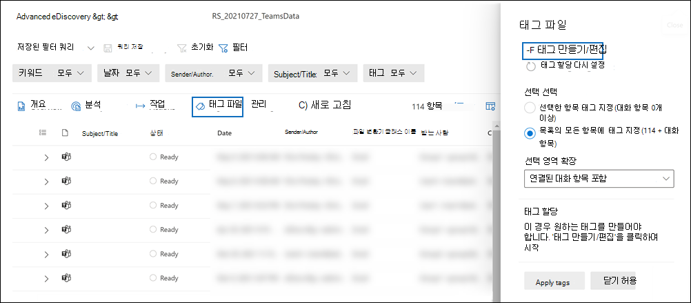
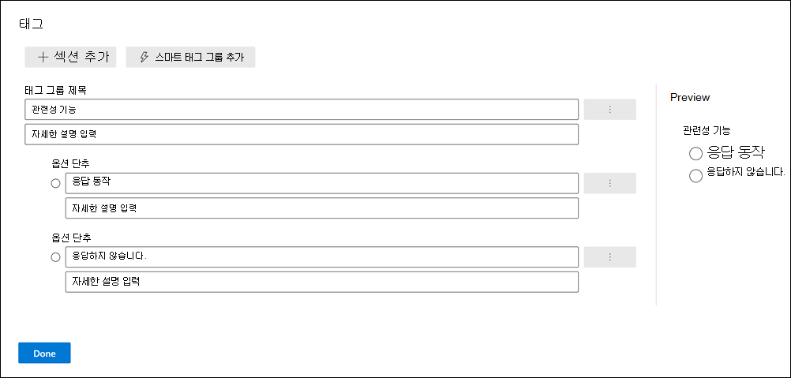
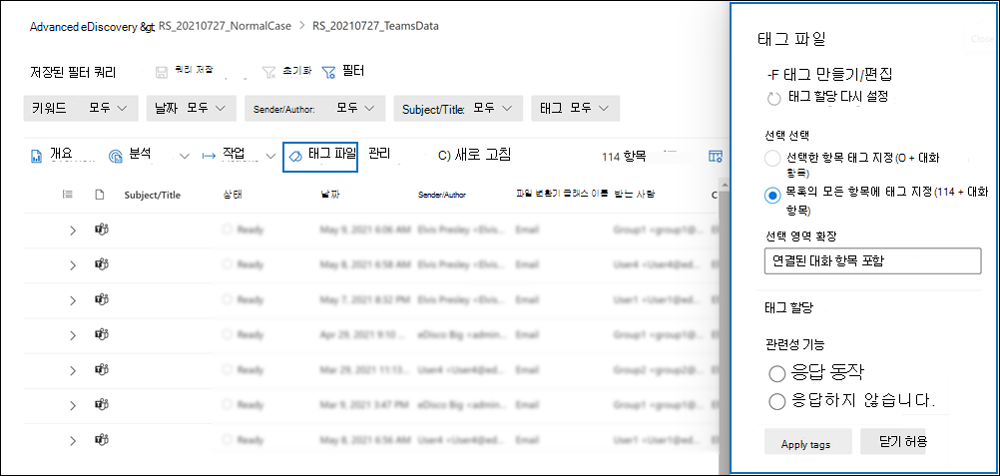

# 문서의 검토 집합에 문서 Advanced eDiscovery

검토 집합에서 콘텐츠를 구성하는 것은 eDiscovery 프로세스에서 다양한 워크플로를 완료하는 데 중요합니다. 여기에는 다음이 포함됩니다.

- 불필요한 콘텐츠 컬링

- 관련 콘텐츠 식별

- 전문가 또는 변호사가 검토해야 하는 콘텐츠 식별

전문가, 변호사 또는 기타 사용자가 검토 집합의 콘텐츠를 검토할 때 콘텐츠와 관련된 의견은 태그를 사용하여 캡처할 수 있습니다. 예를 들어 불필요한 콘텐츠를 선회하기 위한 경우 사용자는 "응답하지 않는" 등의 태그가 있는 문서에 태그를 지정합니다. 콘텐츠를 검토하고 태그를 지정한 후 검토 집합 검색을 만들어 "응답하지 않는" 것으로 태그가 지정된 콘텐츠를 제외할 수 있습니다. 이 프로세스는 eDiscovery 워크플로의 다음 단계에서 응답하지 않는 콘텐츠를 제거합니다. 검토 집합의 태그 지정 패널은 모든 사례에 대해 사용자 지정하여 태그가 사례에 대해 의도한 검토 워크플로를 지원하도록 할 수 있습니다.

> [!NOTE]
> 태그의 범위는 Advanced eDiscovery 있습니다. 즉, 검토자는 검토 집합 문서에 태그를 지정하는 데 사용할 수 있는 태그 집합을 하나만 사례에 사용할 수 있습니다. 동일한 경우 다른 검토 집합에서 사용할 다른 태그 집합을 설정할 수 없습니다.

## 태그 형식

Advanced eDiscovery 두 가지 유형의 태그를 제공합니다.

- **단일 선택 태그:** 검토자는 그룹 내에서 단일 태그를 선택하도록 제한합니다. 이러한 유형의 태그는 검토자는 "응답" 및 "응답하지 않는" 등의 충돌하는 태그를 선택하지 않도록 하는 데 유용할 수 있습니다. 단일 선택 태그는 라디오 단추로 표시됩니다.

- **다중 선택 태그:** 리뷰에서 그룹 내에서 여러 태그를 선택할 수 있도록 허용합니다. 이러한 유형의 태그는 확인란으로 표시됩니다.

## 태그 구조

태그 유형 외에도 태그 패널에서 태그를 구성하는 방법의 구조를 사용하여 문서 태그 지정을 보다 직관적으로 만들 수 있습니다. 태그는 섹션으로 그룹화됩니다. 검토 집합 검색에서는 태그 및 태그 섹션을 통해 검색할 수 있습니다. 즉, 검토 집합 검색을 만들어 섹션에 태그가 지정되어 있는 문서를 검색할 수 있습니다.

태그를 섹션 내에 중첩하여 태그를 추가로 구성할 수 있습니다. 예를 들어 권한 있는 콘텐츠를 식별하고 태그를 지정하기 위한 경우 중첩을 사용하여 검토자에서 문서에 "Privileged"로 태그를 지정하고 적절한 중첩된 태그를 확인하여 권한 유형을 선택할 수 있습니다.

## 태그 만들기 및 적용

검토 집합의 항목에 태그를 지정하는 과정은 2단계 프로세스입니다. 첫 번째 단계는 집합 항목을 검토하는 데 적용되는 태그를 만드는 것입니다. 태그를 만든 후 사용자와 다른 검토자는 검토 집합의 항목에 태그를 적용할 수 있습니다. 앞서 설명한 Advanced eDiscovery 사례는 검토자 집합 항목에 태그를 지정하는 데 사용할 수 있는 하나의 태그 집합만 사용할 수 있습니다.

### 태그 만들기

검토 집합의 항목에 태그를 적용하기 전에 태그 구조를 만들어야 합니다.

1. 검토 집합을 열고 명령 표시줄로 이동한 다음 태그 파일을 **선택합니다.**

2. 태그 파일 **플라이아웃** 페이지에서 태그 **만들기/편집을 클릭합니다.**

   

3. 태그 **페이지에서** 섹션 **추가를 선택합니다.**

4. 태그 그룹 제목과 설명(선택 사항)을 입력한 다음 저장을 **클릭합니다.**

5. 태그 그룹 제목 옆에 있는 트리플 점 드롭다운 메뉴를 선택하고 추가 **확인란** 또는 옵션 추가 **단추를 클릭합니다.**

6. 확인란 또는 옵션 단추의 이름과 설명을 입력합니다.

7. 이 프로세스를 반복하여 새 태그 섹션, 태그 옵션 및 확인란을 만들 수 있습니다. 예를 들어 다음 스크린샷은 Review라는 태그 그룹을  보여 주며, 이 그룹은 응답 및 응답하지 않는 **확인란으로** 구성됩니다.

   

### Apply tags

태그 구조를 적용하면 검토자는 태그 설정을 구성하여 검토 집합의 항목에 태그를 적용할 수 있습니다.

1. 검토 집합 명령 표시줄에서 태그 파일을 선택하여 태그 파일 **플라이아웃** 페이지(태그 지정 패널이라고도 합니다.)를 *표시합니다.* 

   

2. 태그 **파일 플라이아웃** 페이지에서 다음 옵션을 설정하여 검토 집합에 표시된 항목에 태그를 지정하는 방법을 구성할 수 있습니다. 검토 집합에 현재 적용된 필터 또는 필터 쿼리에 따라 표시되는 항목과 태그를 적용할 수 있는 항목이 결정됩니다. 자세한 내용은 검토 집합의 콘텐츠 쿼리 [및 필터링을 참조하세요.](review-set-search.md)

   - **선택 을 선택합니다.** 다음 옵션 중 하나를 선택하면 태그를 적용할 항목 범위를 결정할 수 있습니다.

      - **선택한 항목에 태그 지정:** 이 옵션은 선택한 항목에 태그를 적용합니다. 태그 지정 패널을 시작하기 전이나 후에 항목을 선택할 수 있습니다. 이 옵션은 실시간으로 태그가 지정될 선택한 항목 수를 표시됩니다.

      - **목록의 모든 항목에** 태그 지정: 이 옵션은 검토 집합에 표시되는 모든 항목에 태그를 적용합니다. 이 옵션에는 태그가 지정될 총 항목 수가 표시됩니다.

   - **선택 영역 확장:** 다음 옵션을 사용하여 검토 집합의 태그가 지정된 항목과 관련된 추가 항목에 태그를 지정합니다.

      - **연결된 패밀리 항목 포함:** 이 옵션은 태그가 지정되는 항목의 연결된 패밀리 항목에 동일한 태그를 적용합니다.  *패밀리 항목은* 동일한 **FamilyId** 메타데이터 속성 값을 공유하는 항목입니다. 예를 들어 전자 메일 메시지에 첨부된 문서는 전자 메일 메시지와 **동일한 FamilyId를** 공유합니다. 따라서 이 예제에 대해 이 옵션을 선택하면 문서가 검토 집합 항목 목록에 포함되지 않을 수 있는 경우에도 전자 메일 메시지와 문서에 태그가 지정됩니다.

      - **연결된** 대화 항목 포함: 이 옵션은 태그가 지정한 항목과 동일한 Teams Yammer 대화에 있는 모든 항목에 동일한 태그를 적용합니다. *대화 항목은* 동일한 **ConversationId** 메타데이터 속성 값을 공유하는 항목입니다. 대화의 모든 메시지, 게시물 및 해당 대화의 대화 대화 파일에서 동일한 **ConversationId를 공유합니다.** 이 옵션을 선택하면 해당 대화 항목 중 일부가 검토 집합 항목 목록에 포함되지 않을 수 있는 경우에도 동일한 대화(및 대화 파일)의 모든 항목에 태그가 지정됩니다. 대화 항목에 대한 자세한 내용은 Advanced eDiscovery 워크플로의 "그룹화" [섹션을 Microsoft Teams.](teams-workflow-in-advanced-ediscovery.md#grouping)

      - **없음:** 이 옵션은 가족 항목 또는 대화 항목에 태그를 적용하지 않습니다. 선택된 항목이나 검토 집합 목록의 모든 항목에만 태그를 적용합니다.

   > [!NOTE]
   > 연결된 가족 또는 대화 항목을 포함하면 선택 항목  태그 또는 목록 옵션의 모든 항목에 태그 지정에 표시되는 항목 수가 **변경되지** 않습니다. 즉, 태그가 지정될 관련 항목의 수가 표시되지 않습니다.

   - **태그 할당:** 이 섹션에는 문서에 적용할 수 있는 태그(태그 그룹별로 구성)가 표시됩니다. 태그 그룹당 하나의 단일 선택 태그(라디오 단추로 식별)만 적용할 수 있습니다. 그러나 여러 선택 태그(확인란으로 식별)를 적용할 수 있습니다.

3. 태그 **적용을 클릭하여** 설정에 따라 태그를 적용합니다.

   태그 **지정 작업이** 시작된 것을 나타내기 위해 태그 지정 패널의 각 태그 그룹에 대해 태그 적용 상태 메시지가 표시됩니다. 태그 할당 섹션의 각  태그 그룹에 대한 태그는 작업이 완료될 때까지 회색으로 표시됩니다.

> [!TIP]
> 태그 지정 패널에서 설정을 구성하는 중이지만 다시 시작하려면 태그 할당 다시  설정을 클릭하여 현재 설정을 지우면 됩니다. 이 컨트롤은 이미 태그가 지정되어 있는 항목에는 적용되지 않습니다. 이전에 태그가 지정한 항목에서 태그를 변경하거나 제거하지 않습니다.  

#### 태그 지정 작업 모니터링

많은 수의 항목에 태그를 지정하거나 목록의 모든 항목에 태그 지정 **옵션을** 선택하면 문서 태그 지정 **작업이** 만들어집니다. 이 경우 작업 탭에서  이 작업의 상태를 볼 수 있습니다. 이렇게 하면 완료하는 데 시간이 오래 걸릴 수 있는 큰 태그 지정 작업을 추적하는 데 도움이 됩니다. 경우에 따라 태그 지정 작업이 완료될 수  있지만 태그 지정 패널에 태그 적용 상태 메시지가 계속 표시됩니다. 태그 지정 작업의 상태를 업데이트하려면 검토 **집합** 명령 표시줄에서 새로 고침을 클릭합니다.

## 태그 제거

검토 집합의 항목에서 태그를 제거할 수 있습니다. 그러나 검토 집합 항목에 적용된 단일 선택 태그는 제거할 수 없습니다. 단일 선택 태그를 동일한 태그 그룹 내의 다른 단일 선택 태그로만 변경할 수 있습니다.

태그를 제거하려면

1. 태그를 제거할 항목을 선택합니다.

2. 태그 **지정 패널을 표시하려면** 태그 파일을 클릭합니다.

3. 태그 **할당에서** 태그를 선택하지 않은 다음 태그 **적용을 클릭합니다.**

이전 절차에 따라 선택한 항목에 적용된 태그를 변경할 수도 있습니다. 현재 태그를 선택하지 않은 후 다른 태그를 선택할 수 있습니다.
