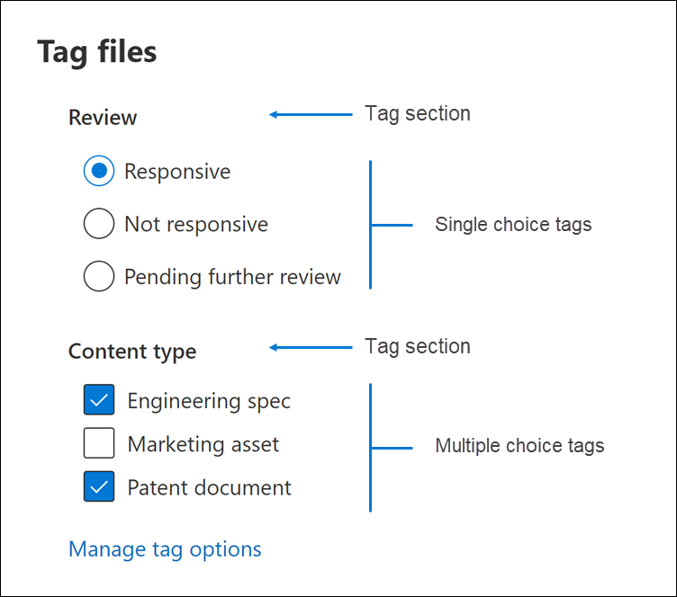
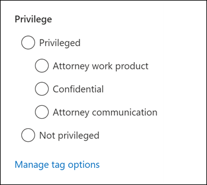

# 검토 집합에서 문서 태그 지정Tag documents in a review set

콘텐츠를 검토 집합으로 구성 하는 것은 eDiscovery 프로세스에서 다양 한 워크플로를 완료 하는 것이 중요 합니다.Organizing content in a review set is important to complete various workflows in the eDiscovery process. 여기에는 다음이 포함됩니다.This includes:

- Culling 불필요 한 콘텐츠Culling unnecessary content

- 관련 콘텐츠 식별Identifying relevant content
 
- 전문가 또는 변호사가 검토 해야 하는 콘텐츠 식별Identifying content that must be reviewed by an expert or an attorney

전문가, 변호사 또는 다른 사용자가 검토 집합의 콘텐츠를 검토 하는 경우 태그를 사용 하 여 콘텐츠와 관련 된 해당 의견을 캡처할 수 있습니다.When experts, attorneys, or other users review content in a review set, their opinions related to the content can be captured by using tags. 예를 들어 불필요 한 콘텐츠를 cull 하는 경우 사용자가 "응답성"과 같은 태그를 사용 하 여 문서에 태그를 지정할 수 있습니다.For example, if the intent is to cull unnecessary content, a user can tag documents with a tag such as “non-responsive”. 콘텐츠를 검토 하 고 태그를 지정 하 고 나면 검토 집합 검색을 작성 하 여 "응답 안 함"으로 태그가 지정 된 콘텐츠를 제외 하 여 eDiscovery 워크플로의 다음 단계에서이 콘텐츠를 제거할 수 있습니다.After content has been reviewed and tagged, a review set search can be created to exclude any content tagged as “non-responsive”, which eliminates this content from the next steps in the eDiscovery workflow. 태그를 원하는 검토 워크플로를 지원할 수 있도록 모든 경우에 태그 패널을 사용자 지정할 수 있습니다.The tag panel can be customized for every case so that the tags can support the intended review workflow.

## 태그 유형Tag types

고급 eDiscovery에서는 두 가지 유형의 태그를 제공 합니다.Advanced eDiscovery provides two types of tags:

- **단일 choice 태그** -사용자가 그룹 내에서 단일 태그를 선택 하는 것을 제한 합니다.**Single choice tags** - Restricts users to select a single tag within a group. 이는 "응답성" 및 "응답 없음"과 같은 충돌 하는 태그를 선택 하지 않도록 하는 데 유용할 수 있습니다.This can be useful to ensure users don’t select conflicting tags such as “responsive” and “non-responsive”. 이러한 단추는 라디오 단추로 표시 됩니다.These will appear as radio buttons.

- **여러 선택 태그** -사용자가 그룹 내에서 여러 태그를 선택할 수 있습니다.**Multiple choice tags** - Allow users to select multiple tags within a group. 이러한 것은 checkboxes로 표시 됩니다.These will appear as checkboxes.

## 태그 구조Tag structure

태그 형식 외에 태그 패널에서 태그를 구성 하는 방법의 구조를 사용 하 여 문서에 태그를 지정 하는 방법을 보다 직관적으로 만들 수 있습니다.In addition to the tag types, the structure of how tags are organized in the tag panel can be used to make tagging documents more intuitive. 태그는 섹션 별로 그룹화 됩니다.Tags are grouped by sections. 검토 설정 검색은 태그별 및 태그별 섹션으로 검색 기능을 지원 합니다.Review set search supports the ability to search by tag and by tag section. 즉, 섹션의 태그로 태그가 지정 된 문서를 검색 하기 위해 검토 집합 검색을 만들 수 있습니다.This means you can create a review set search to retrieve documents tagged with any tag in a section.

태그를 섹션 내에 중첩 시켜 더 체계적으로 구성할 수 있습니다.Tags can be further organized by nesting them within a section. 예를 들어 권한 있는 콘텐츠를 식별 하 고 태그를 지정 하는 경우에는 중첩을 사용 하 여 사용자가 문서에 "특권" 태그를 지정 하 고 적절 한 중첩 태그를 확인 하 여 권한 유형을 선택할 수 있음을 확인할 수 있습니다.For example, if the intent is to identify and tag privileged content, nesting can be used to make it clear that a user can tag a document as “Privileged” and select the type of privilege by checking the appropriate nested tag.

## 태그 적용Applying tags

여러 가지 방법으로 콘텐츠에 태그를 적용할 수 있습니다.There are several ways to apply a tag to content.

### 단일 문서 태그 지정Tagging a single document

문서를 검토 집합에서 볼 때 **태그 지정 패널**을 클릭 하 여 검토에 사용할 수 있는 태그를 표시할 수 있습니다.When viewing a document in a review set, you can display the tags that a review can use by clicking **Tagging panel**.

이렇게 하면 뷰어에 표시 된 문서에 태그를 적용할 수 있습니다.This will enable you to apply tags to the document displayed in the viewer.

### 대량 태그 지정Bulk tagging

대량 태그 지정은 결과 표에서 여러 파일을 선택한 다음 태그 지정 **패널** 에서 단일 문서 태그 지정과 비슷한 태그를 사용 하 여 수행할 수 있습니다.Bulk tagging can be done by selecting multiple files in the results grid and then using the tags in the **Tagging panel** similar to tagging single documents. 대량 태깅은 태그를 두 번 선택 하 여 수행할 수 있습니다. 첫 번째 클릭은 태그를 적용 하 고 두 번째 선택 옵션을 선택 하면 선택한 모든 파일에 대해 태그의 선택이 취소 됩니다.Bulk un-tagging can be done by selecting tags twice; the first click will apply the tag, and the second selection will ensure that tag is cleared for all selected files.

> [!NOTE]
> 대량 태그를 지정 하면 태그 패널에는 패널의 각 태그에 대해 태그 있는 파일 수가 표시 됩니다.When bulk tagging, the tagging panel will display a count of files that are tagged for each tag in the panel.

### 다른 검토 패널의 태그 지정Tagging in other review panels

문서를 검토할 때 다른 검토 패널을 사용 하 여 결과 표에서 문서의 기타 특성을 검토할 수 있습니다.When reviewing documents, you can use the other review panels to review other characteristics of documents in the results grid. 여기에는 기타 관련 문서, 전자 메일 스레드, 중복 항목 및 해시 중복을 검토 하는 작업이 포함 됩니다.This includes reviewing other related documents, email threads, near duplicates, and hash duplicates. 예를 들어 **문서 패밀리** 검토 패널을 사용 하 여 관련 문서를 검토 하는 경우 관련 문서를 대량으로 태그 지정 하 여 검토 시간을 크게 줄일 수 있습니다.For example, when you're reviewing related documents (by using the **Document family** review panel), you can significantly reduce review time by bulk tagging related documents. 예를 들어 전자 메일 메시지에 첨부 파일이 여러 개 있고 전체 패밀리가 일관성 있게 태그 처리 되도록 하려는 경우For example, if an email message has several attachments and you want to ensure that the entire family is tagged consistently.

예를 들어 **문서 패밀리** 검토 패널을 사용할 때 **태그 지정 패널** 을 표시 하는 방법은 다음과 같습니다.For example, here's how to display the **Tagging panel** when using the **Document family** review panel:

1. 선택한 문서에 대해 검토 패널 열기 (예: **문서 패밀리** 검토 패널에 관련 콘텐츠 목록 표시)를 사용 하 여 문서 모음 검토 패널 아래의 **태그 문서** 를 클릭 합니다.With the review panel open for a selected document (for example, displaying the list of related content in the **Document family** review panel, click **Tag documents** under the document family review panel.

   태그 지정 패널이 팝업 창으로 표시 됩니다.The tagging panel is displayed as a pop-up window.

2. 선택한 문서를 적용할 태그를 하나 이상 선택 합니다.Choose one or more tags to apply the selected document. 

3. 모든 문서에 태그를 적용 하려면 **문서 모음** 패널에서 모든 문서를 선택 하 고 **태그 문서**를 클릭 한 다음 전체 문서 패밀리에 적용할 태그를 선택 합니다.To tag all documents, select all documents in the **Document family** panel, click **Tag documents**, and then choose the tags to apply to the entire family of documents.

