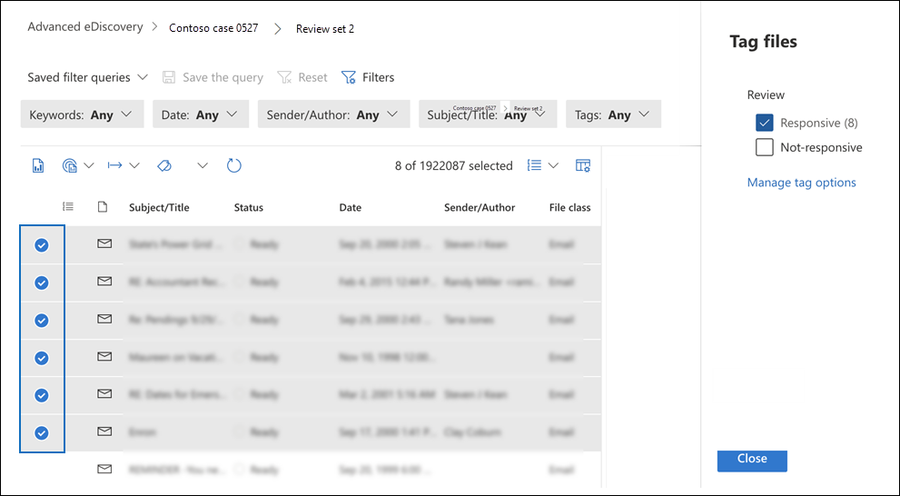

# 문서의 검토 집합에 문서 Advanced eDiscoveryTag documents in a review set in Advanced eDiscovery

검토 집합에서 콘텐츠를 구성하는 것은 eDiscovery 프로세스에서 다양한 워크플로를 완료하는 데 중요합니다.Organizing content in a review set is important to complete various workflows in the eDiscovery process. 여기에는 다음이 포함됩니다.This includes:

- 불필요한 콘텐츠 컬링Culling unnecessary content

- 관련 콘텐츠 식별Identifying relevant content

- 전문가 또는 변호사가 검토해야 하는 콘텐츠 식별Identifying content that must be reviewed by an expert or attorney

전문가, 변호사 또는 기타 사용자가 검토 집합의 콘텐츠를 검토할 때 콘텐츠와 관련된 의견은 태그를 사용하여 캡처할 수 있습니다.When experts, attorneys, or other users review content in a review set, their opinions related to the content can be captured by using tags. 예를 들어 불필요한 콘텐츠를 선회하기 위한 경우 사용자는 "응답하지 않는" 등의 태그가 있는 문서에 태그를 지정합니다.For example, if the intent is to cull unnecessary content, a user can tag documents with a tag such as "non-responsive". 콘텐츠를 검토하고 태그를 지정한 후 검토 집합 검색을 만들어 "응답하지 않는" 것으로 태그가 지정된 콘텐츠를 제외할 수 있습니다.After content has been reviewed and tagged, a review set search can be created to exclude any content tagged as "non-responsive". 이 프로세스는 eDiscovery 워크플로의 다음 단계에서 응답하지 않는 콘텐츠를 제거합니다.This process eliminates the non-responsive content from the next steps in the eDiscovery workflow. 검토 집합의 태그 지정 패널은 모든 사례에 대해 사용자 지정하여 태그가 사례에 대해 의도한 검토 워크플로를 지원하도록 할 수 있습니다.The tagging panel in a review set can be customized for every case so that the tags support the intended review workflow for the case.

> [!NOTE]
> 태그의 범위는 Advanced eDiscovery 있습니다.The scope of tags is an Advanced eDiscovery case. 즉, 검토자는 검토 집합 문서에 태그를 지정하는 데 사용할 수 있는 태그 집합을 하나만 사례에 사용할 수 있습니다.That means a case can only have one set of tags that reviewers can use to tag review set documents. 동일한 경우 다른 검토 집합에서 사용할 다른 태그 집합을 설정할 수 없습니다.You can't set up a different set of tags for use in different review sets in the same case.

## 태그 형식Tag types

Advanced eDiscovery 두 가지 유형의 태그를 제공합니다.Advanced eDiscovery provides two types of tags:

- **단일 선택 태그:** 검토자는 그룹 내에서 단일 태그를 선택하도록 제한합니다.**Single choice tags**: Restricts reviewers to selecting a single tag within a group. 이러한 유형의 태그는 검토자는 "응답" 및 "응답하지 않는" 등의 충돌하는 태그를 선택하지 않도록 하는 데 유용할 수 있습니다.These types of tags can be useful to ensure that reviewers don't select conflicting tags such as "responsive" and "non-responsive". 단일 선택 태그는 라디오 단추로 표시됩니다.Single choice tags appear as radio buttons.

- **다중 선택 태그:** 리뷰에서 그룹 내에서 여러 태그를 선택할 수 있도록 허용합니다.**Multiple choice tags**: Allow reviews to select multiple tags within a group. 이러한 유형의 태그는 확인란으로 표시됩니다.These types of tags appear as checkboxes.

## 태그 구조Tag structure

태그 유형 외에도 태그 패널에서 태그를 구성하는 방법의 구조를 사용하여 문서 태그 지정을 보다 직관적으로 만들 수 있습니다.In addition to the tag types, the structure of how tags are organized in the tag panel can be used to make tagging documents more intuitive. 태그는 섹션으로 그룹화됩니다.Tags are grouped by sections. 검토 집합 검색에서는 태그 및 태그 섹션을 통해 검색할 수 있습니다.Review set search supports the ability to search by tag and by tag section. 즉, 검토 집합 검색을 만들어 섹션에 태그가 지정되어 있는 문서를 검색할 수 있습니다.This means you can create a review set search to retrieve documents tagged with any tag in a section.

태그를 섹션 내에 중첩하여 태그를 추가로 구성할 수 있습니다.You can further organize tags by nesting them within a section. 예를 들어 권한 있는 콘텐츠를 식별하고 태그를 지정하기 위한 경우 중첩을 사용하여 검토자에서 문서에 "Privileged"로 태그를 지정하고 적절한 중첩된 태그를 확인하여 권한 유형을 선택할 수 있습니다.For example, if the intent is to identify and tag privileged content, nesting can be used to make it clear that a reviewer can tag a document as "Privileged" and select the type of privilege by checking the appropriate nested tag.

## 태그 만들기Create tags

검토 집합의 문서에 태그를 적용하기 전에 태그 구조를 만들어야 합니다.Before applying tags to documents in the review set, you need to create a tag structure.

1. 검토 집합을 열고 명령 표시줄로 이동한 다음 **쿼리로 태그를 선택합니다.**Open a review set and navigate to the command bar and select **Tag by query**.

2. 태그 지정 패널에서 태그 **옵션 관리를 선택합니다.**In the tagging panel, select **Manage tag options**

3. 태그 **추가 섹션을 선택합니다.**Select **Add tag section**.

4. 태그 그룹 제목과 설명(선택 사항)을 입력한 다음 저장을 **클릭합니다.**Type a tag group title and an optional description, and then click **Save**.

5. 태그 그룹 제목 옆에 있는 트리플 점 드롭다운 메뉴를 선택하고 추가 **확인란** 또는 옵션 추가 **단추를 클릭합니다.**Select the triple dot dropdown menu next to the tag group title and click **Add check box** or **Add option button**.

6. 확인란 또는 옵션 단추의 이름과 설명을 입력합니다.Type a name and description for the checkbox or option button.

7. 이 프로세스를 반복하여 새 태그 섹션, 태그 옵션 및 확인란을 만들 수 있습니다.Repeat this process to create new tag sections, tag options, and checkboxes.

   

## 태그 적용Applying tags

태그 구조를 적용하면 검토자는 검토 집합의 문서에 태그를 적용할 수 있습니다.With the tag structure in place, reviewers can apply tags to documents in a review set. 태그를 적용하는 방법에는 두 가지가 있습니다.There are two different ways to apply tags:

- 태그 파일Tag files

- 쿼리로 태그 지정Tag by query

### 태그 파일Tag files

검토 집합에서 단일 항목을 선택하거나 여러 항목을 선택하는 경우 명령 표시줄에서  태그 파일을 클릭하여 선택 항목에 태그를 적용할 수 있습니다.Whether you select a single item or several items in a review set, you can apply tags to their selection by clicking **Tag files** in the command bar. 태그 지정 패널에서 태그를 선택할 수 있으며 선택한 문서에 태그가 자동으로 적용됩니다.In the tagging panel, you can select a tag and it is automatically applied to the selected documents.

> [!NOTE]
> 태그는 항목 목록에서 선택한 항목에만 적용됩니다.Tags will be applied only to selected items in the list of items.

### 쿼리로 태그 지정Tag by query

쿼리로 태그를 지정하면 현재 검토 집합에 적용된 필터 쿼리에 의해 표시되는 모든 항목에 태그를 적용할 수 있습니다.Tagging by query lets you apply tags to all items displayed by a filter query that's currently applied in the review set.

1. 검토 집합의 모든 항목을 선택하지 않은 후 명령 표시줄로 이동하여 **쿼리로 태그를 선택합니다.**Unselect all items in the review set and go to the command bar and select **Tag by query**.

2. 태그 지정 패널에서 적용할 태그를 선택합니다.In the tagging panel, select the tag that you want to apply.

3. 태그 **선택 드롭다운 아래에는** 태그를 적용할 항목을 지정하는 세 가지 옵션이 있습니다.Under the **Tag selection** dropdown, there are three options that dictate which items to apply the tag to.

   - **적용된 쿼리와 일치하는 항목:** 필터 쿼리 조건과 일치하는 특정 항목에 태그를 적용합니다.**Items that match applied query**: Applies tags to specific items that match the filter query conditions.

   - **연결된 패밀리 항목 포함:** 필터 쿼리 조건 및 관련 패밀리 항목과 일치하는 특정 항목에 태그를 적용합니다.**Include associated family items**: Applies tags to specific items that match the filter query conditions and their associated family items. *패밀리 항목은* 동일한 FamilyId 메타데이터 값을 공유하는 항목입니다.*Family items* are items that share the same FamilyId metadata value.  

   - 연결된 대화 항목 **포함:** 필터 쿼리 조건 및 관련 대화 항목과 일치하는 항목에 태그를 적용합니다.**Include associated conversation items**: Applies tags to items that match the filter query conditions and their associated conversation items. *대화 항목은* 동일한 ConversationId 메타데이터 값을 공유하는 항목입니다.*Conversation items* are items that share the same ConversationId metadata values.

   

4. 태그 **지정 작업 시작을 클릭하여** 태그 지정 작업을 트리거합니다.Click **Start tagging job** to trigger the tagging job.

## 태그 필터Tag filter

검토 집합의 태그 필터를 사용하면 항목에 태그가 지정되는 방식에 따라 쿼리 결과에서 항목을 빠르게 찾거나 제외할 수 있습니다.Use the tag filter in review set to quickly find or exclude items from the query results based on how an item is tagged. 

1. 필터를 **선택하여** 필터 패널을 확장합니다.Select **Filters** to expand the filter panel.

2. 항목 속성을 **선택하고 확장합니다.**Select and expand **Item properties**.

3. 아래로 스크롤하여 **Tag** 이라는 필터를 찾은 다음 확인란을 선택한 다음 완료를 **클릭합니다.**Scroll down to find the filter named **Tag**, select the checkbox, and then click **Done**.

4. 쿼리에서 특정 태그가 있는 항목을 포함하거나 제외하기 위해 다음 중 하나를 수행하십시오.To include or exclude items with a specific tag from a query, do one of the following:

   - **항목 포함:** 태그 값을  선택하고 드롭다운 메뉴에서 동일을 선택합니다.**Include items**: Select the tag value and select **Equal any of** in the dropdown menu.

      또는Or

   - **항목 제외:** 태그 값을  선택하고 드롭다운 메뉴에서 모두 같음 메뉴를 선택합니다.**Exclude items**: Select the tag value and select **Equals none of** in dropdown menu.

     

> [!NOTE]
> 태그 필터에 태그 구조에 대한 최신 변경 내용이 표시되도록 페이지를 새로 고쳐야 합니다.Be sure to refresh the page to ensure that the tag filter displays the latest changes to the tag structure.
