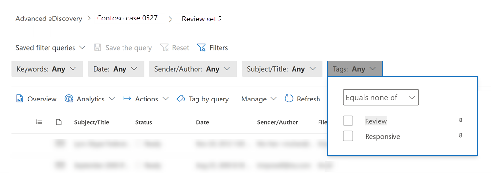

# 문서의 검토 집합에 문서 Advanced eDiscovery

검토 집합에서 콘텐츠를 구성하는 것은 eDiscovery 프로세스에서 다양한 워크플로를 완료하는 데 중요합니다. 여기에는 다음이 포함됩니다.

- 불필요한 콘텐츠 컬링

- 관련 콘텐츠 식별

- 전문가 또는 변호사가 검토해야 하는 콘텐츠 식별

전문가, 변호사 또는 기타 사용자가 검토 집합의 콘텐츠를 검토할 때 콘텐츠와 관련된 의견은 태그를 사용하여 캡처할 수 있습니다. 예를 들어 불필요한 콘텐츠를 선회하기 위한 경우 사용자는 "응답하지 않는" 등의 태그가 있는 문서에 태그를 지정합니다. 콘텐츠를 검토하고 태그를 지정한 후 검토 집합 검색을 만들어 "응답하지 않는" 것으로 태그가 지정된 콘텐츠를 제외할 수 있습니다. 이 프로세스는 eDiscovery 워크플로의 다음 단계에서 응답하지 않는 콘텐츠를 제거합니다. 검토 집합의 태그 지정 패널은 모든 사례에 대해 사용자 지정하여 태그가 사례에 대해 의도한 검토 워크플로를 지원하도록 할 수 있습니다.

> [!NOTE]
> 태그의 범위는 Advanced eDiscovery 있습니다. 즉, 검토자는 검토 집합 문서에 태그를 지정하는 데 사용할 수 있는 태그 집합을 하나만 사례에 사용할 수 있습니다. 동일한 경우 다른 검토 집합에서 사용할 다른 태그 집합을 설정할 수 없습니다.

## 태그 형식

Advanced eDiscovery 두 가지 유형의 태그를 제공합니다.

- **단일 선택 태그:** 검토자는 그룹 내에서 단일 태그를 선택하도록 제한합니다. 이러한 유형의 태그는 검토자는 "응답" 및 "응답하지 않는" 등의 충돌하는 태그를 선택하지 않도록 하는 데 유용할 수 있습니다. 단일 선택 태그는 라디오 단추로 표시됩니다.

- **다중 선택 태그:** 리뷰에서 그룹 내에서 여러 태그를 선택할 수 있도록 허용합니다. 이러한 유형의 태그는 확인란으로 표시됩니다.

## 태그 구조

태그 유형 외에도 태그 패널에서 태그를 구성하는 방법의 구조를 사용하여 문서 태그 지정을 보다 직관적으로 만들 수 있습니다. 태그는 섹션으로 그룹화됩니다. 검토 집합 검색에서는 태그 및 태그 섹션을 통해 검색할 수 있습니다. 즉, 검토 집합 검색을 만들어 섹션에 태그가 지정되어 있는 문서를 검색할 수 있습니다.

태그를 섹션 내에 중첩하여 태그를 추가로 구성할 수 있습니다. 예를 들어 권한 있는 콘텐츠를 식별하고 태그를 지정하기 위한 경우 중첩을 사용하여 검토자에서 문서에 "Privileged"로 태그를 지정하고 적절한 중첩된 태그를 확인하여 권한 유형을 선택할 수 있습니다.

## 태그 만들기

검토 집합의 문서에 태그를 적용하기 전에 태그 구조를 만들어야 합니다.

1. 검토 집합을 열고 명령 표시줄로 이동한 다음 **쿼리로 태그를 선택합니다.**

2. 태그 지정 패널에서 태그 **옵션 관리를 선택합니다.**

3. 태그 **추가 섹션을 선택합니다.**

4. 태그 그룹 제목과 설명(선택 사항)을 입력한 다음 저장을 **클릭합니다.**

5. 태그 그룹 제목 옆에 있는 트리플 점 드롭다운 메뉴를 선택하고 추가 **확인란** 또는 옵션 추가 **단추를 클릭합니다.**

6. 확인란 또는 옵션 단추의 이름과 설명을 입력합니다.

7. 이 프로세스를 반복하여 새 태그 섹션, 태그 옵션 및 확인란을 만들 수 있습니다.

   

## 태그 적용

태그 구조를 적용하면 검토자는 검토 집합의 문서에 태그를 적용할 수 있습니다. 태그를 적용하는 방법에는 두 가지가 있습니다.

- 태그 파일

- 쿼리로 태그 지정

### 태그 파일

검토 집합에서 단일 항목을 선택하거나 여러 항목을 선택하는 경우 명령 표시줄에서  태그 파일을 클릭하여 선택 항목에 태그를 적용할 수 있습니다. 태그 지정 패널에서 태그를 선택할 수 있으며 선택한 문서에 태그가 자동으로 적용됩니다.

> [!NOTE]
> 태그는 항목 목록에서 선택한 항목에만 적용됩니다.

### 쿼리로 태그 지정

쿼리로 태그를 지정하면 현재 검토 집합에 적용된 필터 쿼리에 의해 표시되는 모든 항목에 태그를 적용할 수 있습니다.

1. 검토 집합의 모든 항목을 선택하지 않은 후 명령 표시줄로 이동하여 **쿼리로 태그를 선택합니다.**

2. 태그 지정 패널에서 적용할 태그를 선택합니다.

3. 태그 **선택 드롭다운 아래에는** 태그를 적용할 항목을 지정하는 세 가지 옵션이 있습니다.

   - **적용된 쿼리와 일치하는 항목:** 필터 쿼리 조건과 일치하는 특정 항목에 태그를 적용합니다.

   - **연결된 패밀리 항목 포함:** 필터 쿼리 조건 및 관련 패밀리 항목과 일치하는 특정 항목에 태그를 적용합니다. *패밀리 항목은* 동일한 FamilyId 메타데이터 값을 공유하는 항목입니다.  

   - 연결된 대화 항목 **포함:** 필터 쿼리 조건 및 관련 대화 항목과 일치하는 항목에 태그를 적용합니다. *대화 항목은* 동일한 ConversationId 메타데이터 값을 공유하는 항목입니다.

   

4. 태그 **지정 작업 시작을 클릭하여** 태그 지정 작업을 트리거합니다.

## 태그 필터

검토 집합의 태그 필터를 사용하면 항목에 태그가 지정되는 방식에 따라 쿼리 결과에서 항목을 빠르게 찾거나 제외할 수 있습니다. 

1. 필터를 **선택하여** 필터 패널을 확장합니다.

2. 항목 속성을 **선택하고 확장합니다.**

3. 아래로 스크롤하여 **Tag** 이라는 필터를 찾은 다음 확인란을 선택한 다음 완료를 **클릭합니다.**

4. 쿼리에서 특정 태그가 있는 항목을 포함하거나 제외하기 위해 다음 중 하나를 수행하십시오.

   - **항목 포함:** 태그 값을  선택하고 드롭다운 메뉴에서 동일을 선택합니다.

      또는

   - **항목 제외:** 태그 값을  선택하고 드롭다운 메뉴에서 모두 같음 메뉴를 선택합니다.

     

> [!NOTE]
> 태그 필터에 태그 구조에 대한 최신 변경 내용이 표시되도록 페이지를 새로 고쳐야 합니다.
