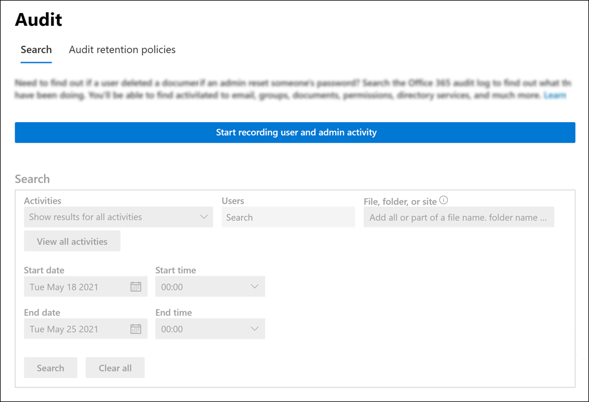

# <a name="turn-audit-log-search-on-or-off"></a><span data-ttu-id="a280f-103">감사 로그 검색 켜기 또는 끄기</span><span class="sxs-lookup"><span data-stu-id="a280f-103">Turn audit log search on or off</span></span>

<span data-ttu-id="a280f-104">감사 로깅은 Microsoft 365 및 Office 365 엔터프라이즈 조직에 대해 기본적으로 설정됩니다.</span><span class="sxs-lookup"><span data-stu-id="a280f-104">Audit logging is turned on by default for Microsoft 365 and Office 365 enterprise organizations.</span></span> <span data-ttu-id="a280f-105">여기에는 E3/G3 또는 E5/G5 구독이 있는 조직이 포함됩니다.</span><span class="sxs-lookup"><span data-stu-id="a280f-105">This includes organizations with E3/G3 or E5/G5 subscriptions.</span></span> <span data-ttu-id="a280f-106">준수 센터에서 감사 로그 검색을 설정하면 조직의 사용자 및 관리자 활동이 감사 로그에 기록되고 90일 동안 보존되고 사용자에게 할당된 라이선스에 따라 최대 1년 동안 보존됩니다.</span><span class="sxs-lookup"><span data-stu-id="a280f-106">When audit log search in the compliance center is turned on, user and admin activity from your organization is recorded in the audit log and retained for 90 days, and up to one year depending on the license assigned to users.</span></span> <span data-ttu-id="a280f-107">그러나 조직에 감사 로그 데이터를 기록하고 보존하지 않을 이유가 있을 수 있습니다.</span><span class="sxs-lookup"><span data-stu-id="a280f-107">However, your organization may have reasons for not wanting to record and retain audit log data.</span></span> <span data-ttu-id="a280f-108">이러한 경우 전역 관리자는 Microsoft 365에서 감사를 해제할 수 있습니다.</span><span class="sxs-lookup"><span data-stu-id="a280f-108">In those cases, a global admin may decide to turn off auditing in Microsoft 365.</span></span>

> [!IMPORTANT]
> <span data-ttu-id="a280f-109">Microsoft 365에서 감사 로그 검색을 끄면 Office 365 관리 활동 API 또는 Azure Sentinel을 사용하여 조직의 감사 데이터에 액세스할 수 없습니다.</span><span class="sxs-lookup"><span data-stu-id="a280f-109">If you turn off audit log search in Microsoft 365, you can't use the Office 365 Management Activity API or Azure Sentinel to access auditing data for your organization.</span></span> <span data-ttu-id="a280f-110">이 문서의 단계를 수행하여 감사 로그 검색을 끄면 보안 및 준수 센터를 사용하여 감사 로그를 검색하거나 Exchange Online PowerShell에서 **Search-UnifiedAuditLog** cmdlet을 & 결과가 반환되지 않습니다.</span><span class="sxs-lookup"><span data-stu-id="a280f-110">Turning off audit log search by following the steps in this article means that no results will be returned when you search the audit log using the Security & Compliance Center or when you run the **Search-UnifiedAuditLog** cmdlet in Exchange Online PowerShell.</span></span> <span data-ttu-id="a280f-111">즉, Office 365 관리 활동 API 또는 Azure Sentinel을 통해 감사 로그를 사용할 수 없습니다.</span><span class="sxs-lookup"><span data-stu-id="a280f-111">This also means that audit logs won't be available through the Office 365 Management Activity API or Azure Sentinel.</span></span>
  
## <a name="before-you-turn-audit-log-search-on-or-off"></a><span data-ttu-id="a280f-112">감사 로그 검색을 켜거나 끄기 전에</span><span class="sxs-lookup"><span data-stu-id="a280f-112">Before you turn audit log search on or off</span></span>

- <span data-ttu-id="a280f-113">Microsoft 365 조직에서 감사 로그 검색을 설정하거나 해제하려면 Exchange Online에서 감사 로그 역할을 할당해야 합니다.</span><span class="sxs-lookup"><span data-stu-id="a280f-113">You have to be assigned the Audit Logs role in Exchange Online to turn audit log search on or off in your Microsoft 365 organization.</span></span> <span data-ttu-id="a280f-114">기본적으로 이 역할은 Exchange 관리 센터의 사용 권한  페이지에서 준수 관리 및 조직 관리 역할 그룹에 할당됩니다.</span><span class="sxs-lookup"><span data-stu-id="a280f-114">By default, this role is assigned to the Compliance Management and Organization Management role groups on the **Permissions** page in the Exchange admin center.</span></span> <span data-ttu-id="a280f-115">Microsoft 365의 전역 관리자는 Exchange Online의 조직 관리 역할 그룹의 구성원입니다.</span><span class="sxs-lookup"><span data-stu-id="a280f-115">Global admins in Microsoft 365 are members of the Organization Management role group in Exchange Online.</span></span> 
    
    > [!NOTE]
    > <span data-ttu-id="a280f-116">감사 로그 검색을 설정하거나 해제하려면 사용자에게 Exchange Online에서 사용 권한을 할당해야 합니다.</span><span class="sxs-lookup"><span data-stu-id="a280f-116">Users have to be assigned permissions in Exchange Online to turn audit log search on or off.</span></span> <span data-ttu-id="a280f-117">보안 및 준수 센터의 사용  권한 페이지에서 사용자에게 감사 로그 역할을 & 감사 로그 검색을 설정하거나 해제할 수 없습니다.</span><span class="sxs-lookup"><span data-stu-id="a280f-117">If you assign users the Audit Logs role on the **Permissions** page in the Security & Compliance Center, they won't be able to turn audit log search on or off.</span></span> <span data-ttu-id="a280f-118">이는 주 cmdlet이 Exchange Online PowerShell cmdlet이기 때문에입니다.</span><span class="sxs-lookup"><span data-stu-id="a280f-118">This is because the underlying cmdlet is an Exchange Online PowerShell cmdlet.</span></span> 
    
- <span data-ttu-id="a280f-119">감사 로그 검색에 대한 단계별 지침은 보안 및 준수 센터에서 감사 [로그를 & 참조하세요.](search-the-audit-log-in-security-and-compliance.md)</span><span class="sxs-lookup"><span data-stu-id="a280f-119">For step-by-step instructions on searching the audit log, see [Search the audit log in the Security & Compliance Center](search-the-audit-log-in-security-and-compliance.md).</span></span> <span data-ttu-id="a280f-120">Microsoft 365 관리 활동 API에 대한 자세한 내용은 [Microsoft 365 관리 API 시작을 참조하세요.](https://docs.microsoft.com/office/office-365-management-api/get-started-with-office-365-management-apis)</span><span class="sxs-lookup"><span data-stu-id="a280f-120">For more information about the Microsoft 365 Management Activity API, see [Get started with Microsoft 365 Management APIs](https://docs.microsoft.com/office/office-365-management-api/get-started-with-office-365-management-apis).</span></span>

- <span data-ttu-id="a280f-121">감사 로그 검색이 켜져 있는지 확인하려면 Exchange Online PowerShell에서 다음 명령을 실행할 수 있습니다.</span><span class="sxs-lookup"><span data-stu-id="a280f-121">To verify that audit log search is turned on, you can run the following command in Exchange Online PowerShell:</span></span>

    ```powershell
    Get-AdminAuditLogConfig | FL UnifiedAuditLogIngestionEnabled
    ```

    <span data-ttu-id="a280f-122">`True` _UnifiedAuditLogIngestionEnabled_ 속성의 값은 감사 로그 검색이 켜져 있는지를 나타냅니다.</span><span class="sxs-lookup"><span data-stu-id="a280f-122">The value of  `True` for the  _UnifiedAuditLogIngestionEnabled_ property indicates that audit log search is turned on.</span></span> 
    
## <a name="turn-on-audit-log-search"></a><span data-ttu-id="a280f-123">감사 로그 검색 켜기</span><span class="sxs-lookup"><span data-stu-id="a280f-123">Turn on audit log search</span></span>

<span data-ttu-id="a280f-124">조직에 대해 감사 로그 검색이 설정되어 있지 않은 경우 준수 센터에서 또는 Exchange Online PowerShell을 사용하여 로그 검색을 켜면 됩니다.</span><span class="sxs-lookup"><span data-stu-id="a280f-124">If audit log search is not turned on for your organization, you can turn it on in the compliance center or by using Exchange Online PowerShell.</span></span> <span data-ttu-id="a280f-125">감사 로그를 검색할 때 결과를 반환하려면 감사 로그 검색을 켜고 몇 시간이 걸릴 수 있습니다.</span><span class="sxs-lookup"><span data-stu-id="a280f-125">It may take several hours after you turn on audit log search before you can return results when you search the audit log.</span></span>
  
### <a name="use-the-compliance-center-to-turn-on-audit-log-search"></a><span data-ttu-id="a280f-126">준수 센터를 사용하여 감사 로그 검색 켜기</span><span class="sxs-lookup"><span data-stu-id="a280f-126">Use the compliance center to turn on audit log search</span></span>

1. <span data-ttu-id="a280f-127">[준수 센터로 이동하여](https://protection.office.com) 로그인합니다.</span><span class="sxs-lookup"><span data-stu-id="a280f-127">[Go to the compliance center](https://protection.office.com) and sign in.</span></span>

2. <span data-ttu-id="a280f-128">준수 센터에서 검색 감사 로그  >  **검색으로 이동 합니다.**</span><span class="sxs-lookup"><span data-stu-id="a280f-128">In the compliance center, go to **Search** > **Audit log search**.</span></span>

   <span data-ttu-id="a280f-129">조직에 대해 감사 로그 검색이 설정되어 있지 않은 경우 사용자 및 관리자 활동을 기록하기 위해 감사를 설정해야 하다는 배너가 표시됩니다.</span><span class="sxs-lookup"><span data-stu-id="a280f-129">If audit log search is not turned on for your organization, a banner is displayed saying that auditing has to be turned on to record user and admin activity.</span></span>

3. <span data-ttu-id="a280f-130">감사 **켜기 를 클릭합니다.**</span><span class="sxs-lookup"><span data-stu-id="a280f-130">Click **Turn on auditing**.</span></span>

    
  
    <span data-ttu-id="a280f-132">감사 로그가 준비되고 있으며 몇 시간 후에 사용자 및 관리자 활동을 검색할 수 있도록 배너가 업데이트되었습니다.</span><span class="sxs-lookup"><span data-stu-id="a280f-132">The banner is updated to say the audit log is being prepared and that you can search for user and admin activity in a few hours.</span></span>

### <a name="use-powershell-to-turn-on-audit-log-search"></a><span data-ttu-id="a280f-133">PowerShell을 사용하여 감사 로그 검색 켜기</span><span class="sxs-lookup"><span data-stu-id="a280f-133">Use PowerShell to turn on audit log search</span></span>

1. [<span data-ttu-id="a280f-134">Exchange Online PowerShell에 연결</span><span class="sxs-lookup"><span data-stu-id="a280f-134">Connect to Exchange Online PowerShell</span></span>](https://go.microsoft.com/fwlink/p/?LinkID=396554)

2. <span data-ttu-id="a280f-135">다음 PowerShell 명령을 실행하여 Office 365에서 감사 로그 검색을 켜야 합니다.</span><span class="sxs-lookup"><span data-stu-id="a280f-135">Run the following PowerShell command to turn on audit log search in Office 365.</span></span>

    ```powershell
    Set-AdminAuditLogConfig -UnifiedAuditLogIngestionEnabled $true
    ```

    <span data-ttu-id="a280f-136">변경이 적용되는 데 최대 60분이 걸릴 수 있습니다.</span><span class="sxs-lookup"><span data-stu-id="a280f-136">A message is displayed saying that it may take up to 60 minutes for the change to take effect.</span></span>
  
## <a name="turn-off-audit-log-search"></a><span data-ttu-id="a280f-137">감사 로그 검색 끄기</span><span class="sxs-lookup"><span data-stu-id="a280f-137">Turn off audit log search</span></span>

<span data-ttu-id="a280f-138">Exchange Online PowerShell을 사용하여 감사 로그 검색을 해제해야 합니다.</span><span class="sxs-lookup"><span data-stu-id="a280f-138">You have to use Exchange Online PowerShell to turn off audit log search.</span></span>
  
1. [<span data-ttu-id="a280f-139">Exchange Online PowerShell에 연결</span><span class="sxs-lookup"><span data-stu-id="a280f-139">Connect to Exchange Online PowerShell</span></span>](https://go.microsoft.com/fwlink/p/?LinkID=396554)

2. <span data-ttu-id="a280f-140">다음 PowerShell 명령을 실행하여 감사 로그 검색을 해제합니다.</span><span class="sxs-lookup"><span data-stu-id="a280f-140">Run the following PowerShell command to turn off audit log search.</span></span>

    ```powershell
    Set-AdminAuditLogConfig -UnifiedAuditLogIngestionEnabled $false
    ```

3. <span data-ttu-id="a280f-141">잠시 후 감사 로그 검색이 꺼져 있는지(사용하지 않도록 설정) 확인해야 합니다.</span><span class="sxs-lookup"><span data-stu-id="a280f-141">After a while, verify that audit log search is turned off (disabled).</span></span> <span data-ttu-id="a280f-142">이 작업은 다음 두 가지 방법으로 수행할 수 있습니다.</span><span class="sxs-lookup"><span data-stu-id="a280f-142">There are two ways to do this:</span></span>

    - <span data-ttu-id="a280f-143">Exchange Online PowerShell에서 다음 명령을 실행합니다.</span><span class="sxs-lookup"><span data-stu-id="a280f-143">In Exchange Online PowerShell, run the following command:</span></span>

      ```powershell
      Get-AdminAuditLogConfig | FL UnifiedAuditLogIngestionEnabled
      ```

      <span data-ttu-id="a280f-144">`False` _UnifiedAuditLogIngestionEnabled_ 속성의 값은 감사 로그 검색이 꺼져 있는 것입니다.</span><span class="sxs-lookup"><span data-stu-id="a280f-144">The value of  `False` for the  _UnifiedAuditLogIngestionEnabled_ property indicates that audit log search is turned off.</span></span> 

    - <span data-ttu-id="a280f-145">준수 [센터에서](https://protection.office.com)검색 감사 로그  \> **검색으로 이동 합니다.**</span><span class="sxs-lookup"><span data-stu-id="a280f-145">In the [compliance center](https://protection.office.com), go to **Search** \> **Audit log search**.</span></span>

      <span data-ttu-id="a280f-146">사용자 및 관리자 활동을 기록하기 위해 감사를 설정해야 하다는 배너가 표시됩니다.</span><span class="sxs-lookup"><span data-stu-id="a280f-146">A banner is displayed saying that auditing has to be turned on in order to record user and admin activity.</span></span>
