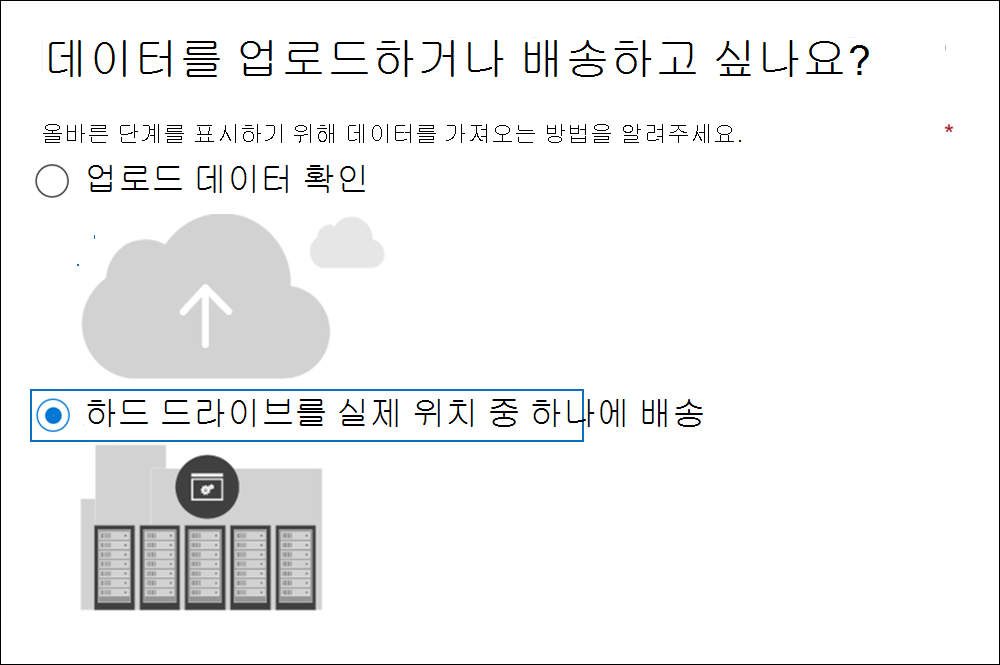
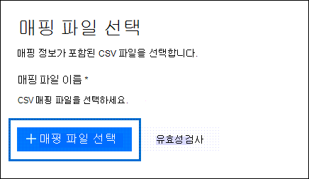
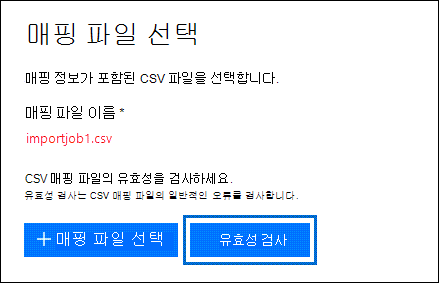
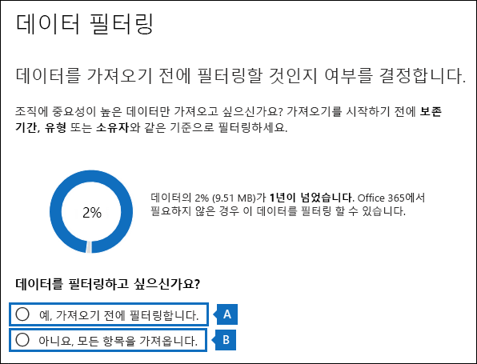

# <a name="use-drive-shipping-to-import-your-organizations-pst-files"></a>드라이브 배송을 사용하여 조직의 PST 파일 가져오기

**이 문서는 관리자를 위한 것입니다. PST 파일을 자신의 사서함으로 가져오려고 하나요? [.pst 파일에서](https://go.microsoft.com/fwlink/p/?LinkID=785075) 전자 메일, 연락처 및 일정 Outlook 참조**
   
가져오기 Office 365 드라이브 배송을 사용하여 PST 파일을 사용자 사서함으로 대량으로 가져올 수 있습니다. 드라이브 발송은 PST 파일을 하드 디스크 드라이브로 복사한 후 실제로 해당 드라이브를 Microsoft로 발송하는 것을 의미합니다. Microsoft가 하드 드라이브를 받으면 데이터 센터 직원이 하드 드라이브의 데이터를 Microsoft 클라우드의 저장소 영역에 복사합니다. 그런 다음 가져올 데이터를 제어하는 필터를 설정하여 대상 사서함으로 가져온 PST 데이터를 자르는 기회를 얻게 됩니다. 가져오기 작업을 시작한 후 가져오기 서비스는 저장소 영역의 PST 데이터를 사용자 사서함으로 가져올 수 있습니다. 드라이브 배송을 사용하여 PST 파일을 사용자 사서함으로 가져오는 것은 조직의 전자 메일을 사용자 사서함으로 마이그레이션하는 Office 365.
  
다음은 드라이브 배송을 사용하여 PST 파일을 사서함으로 가져오는 Microsoft 365 단계입니다.
  
[1단계: PST 가져오기 도구 다운로드](#step-1-download-the-pst-import-tool)

[2단계: PST 파일을 하드 드라이브에 복사](#step-2-copy-the-pst-files-to-the-hard-drive)

[3단계: PST 가져오기 매핑 파일 만들기](#step-3-create-the-pst-import-mapping-file)

[4단계: Office 365에서 PST 가져오기 작업 만들기](#step-4-create-a-pst-import-job-in-office-365)

[5단계: Microsoft로 하드 드라이브 발송](#step-5-ship-the-hard-drive-to-microsoft)

[6단계: 데이터 필터링 및 PST 가져오기 작업 시작](#step-6-filter-data-and-start-the-pst-import-job)
  
> [!IMPORTANT]
> 가져오기 도구를 다운로드하려면 1단계를 한 번 수행해야 합니다. 이러한 단계를 수행한 후 Microsoft에 하드 드라이브를 배송할 때마다 2~6단계를 수행합니다. 
  
For frequently asked questions about using drive shipping to import PST files to Office 365, see [FAQs for using drive shipping to import PST files](./faqimporting-pst-files-to-office-365.yml#using-drive-shipping-to-import-pst-files). 
  
## <a name="before-you-import-pst-files"></a>PST 파일을 가져오기 전에

- PST 파일을 Microsoft 365 사서함으로 가져오려면 Exchange Online에서 사서함 가져오기/내보내기 역할을 할당받아야 합니다. 기본적으로이 역할은 Exchange Online의 어떤 역할 그룹에도 할당되지 않습니다. 조직 관리 역할 그룹에 사서함 가져오기/내보내기 역할을 추가할 수 있습니다. 또는 역할 그룹을 만들고 사서함 가져오기/내보내기 역할을 할당한 후 구성원으로 자신을 추가할 수 있습니다. 자세한 내용은 [역할 그룹 관리](/Exchange/permissions-exo/role-groups)의 “역할 그룹에 역할 추가” 또는 “역할 그룹 만들기” 섹션을 참조하세요.
    
    또한 Microsoft 365 규정 준수 센터에서 가져오기 작업을 만들려면 다음 중 하나를 충족해야 합니다.
    
  - Exchange Online에서 전자 메일 받는 사람 역할을 할당받아야 합니다. 이 역할은 조직 관리 및 받는 사람 관리 역할 그룹에 기본값으로 할당됩니다.
    
    또는
    
  - 조직의 전역 관리자여야 합니다.
    
    > [!TIP]
    > Exchange Online에서 PST 파일을 Office 365로 가져오기 위한 새로운 역할 그룹을 만드는 것이 좋습니다. PST 파일을 가져오는 데 필요한 최소 수준의 권한만 할당하려면 새 역할 그룹에 사서함 가져오기/내보내기 역할 및 메일 받는 사람 역할을 할당하고 구성원을 추가합니다. 
  
- 조직의 파일 서버의 하드 드라이브 또는 공유 폴더에 복사하려면 PST 파일을 저장해야 합니다. 2단계에서 이 파일 서버 또는 공유 폴더에 저장된 PST 파일을 하드 드라이브에 복사하는 Azure 가져오기 내보내기 도구(WAImportExport.exe)를 실행합니다.

- 큰 PST 파일은 PST 가져오기 프로세스의 성능에 영향을 줄 수 있습니다. 따라서 2단계에서 하드 드라이브에 복사하는 각 PST 파일은 20GB보다 크지 말아야 합니다.
    
- 2.5인치 SDD(Solid-State Drive) 또는 2.5인치 또는 3.5인치 SATA II/III 내부 하드 드라이브만 Office 365 가져오기 서비스에서 사용할 수 있습니다. 최대 10TB의 하드 드라이브를 사용할 수 있습니다. 가져오기 작업의 경우에는 하드 드라이브의 첫 번째 데이터 볼륨만 처리됩니다. 데이터 볼륨은 NTFS 형식으로 포맷되어야 합니다. 하드 드라이브에 데이터를 복사할 때 2.5인치 SSD 또는 2.5인치 또는 3.5인치 SATA II/III 커넥터를 사용하여 직접 첨부하거나 외부 2.5인치 SSD 또는 2.5인치 또는 3.5인치 SATA II/III USB 어댑터를 사용하여 외부에 연결할 수 있습니다.
    
    > [!IMPORTANT]
    > USB 어댑터가 내장되어 함께 제공되는 외장 하드 드라이브는 Office 365 가져오기 서비스에서 지원하지 않습니다. 또한, 외장 하드 드라이브 케이스에 들어 있는 디스크는 사용할 수 없습니다. 외장 하드 드라이브는 발송하지 마시기 바랍니다. 
  
- PST 파일을 복사하는 하드 드라이브는 BitLocker로 암호화되어야 합니다. 2단계에서 실행하는 WAImportExport.exe 도구는 BitLocker를 설정하는 데 도움이 됩니다. 또한 Microsoft 데이터 센터 직원이 드라이브에 액세스하여 PST 파일을 Microsoft 클라우드의 Azure Storage 영역에 업로드하는 데 사용하는 BitLocker 암호화 키도 생성합니다.
    
- Drive shipping is available through a Microsoft 기업계약 (EA). MPSA(Microsoft 제품 및 서비스 계약)를 통해서는 드라이브 배송이 가능하지 않습니다.
    
- 드라이브 발송을 사용하여 Microsoft 365 사서함에 PST 파일을 가져오는 데 드는 비용은 1GB의 데이터당 2,000원입니다. 예를 들어 1,000GB(1TB)의 PST 파일이 포함된 하드 드라이브를 배송하는 경우 비용은 2,000,000원입니다. 파트너와 협의하여 가져오기 요금을 지불할 수 있습니다. 파트너를 찾는 방법에 대한 내용은 [Microsoft 파트너 또는 대리점 찾기](../admin/manage/find-your-partner-or-reseller.md)를 참조하세요.
    
- 사용자나 조직은 FedEx 또는 DHL 계정이 있어야 합니다. 
    
  - 미국, 브라질 및 유럽의 조직에는 FedEx 계정이 있어야 합니다.
    
  - 동아시아, 동남 아시아, 일본, 대한민국 및 오스트레일리아의 조직에는 DHL 계정이 있어야 합니다.
    
    Microsoft는 이 계정을 사용하여 하드 드라이브를 다시 반환합니다.
    
- The hard drive that you ship to Microsoft may cross international borders. 이 경우 귀하는 해당 법률에 따라 하드 드라이브 및 해당 드라이브에 포함된 데이터를 가져오고/또는 내보낼 책임이 있습니다. 하드 드라이브를 발송하기 전에 드라이브 및 데이터가 확인된 Microsoft 데이터 센터에 합법적으로 발송될 수 있는지를 관리자에게 문의하세요. 이렇게 하면 시기 적절한 방식으로 Microsoft에 도달하는 데 도움이 됩니다.
    
- 이 절차에서는 BitLocker 암호화 키를 복사하고 저장합니다. 암호나 기타 보안 관련 정보를 보호하는 것처럼 특히 주의해서 이러한 키를 보호해야 합니다. 예를 들어 암호로 보호된 Microsoft Word 문서에 저장하거나 암호화된 USB 드라이브에 저장할 수 있습니다. 이러한 [키의 예는 추가](#more-information) 정보 섹션을 참조하세요. 
    
- PST 파일을 Microsoft 365 사서함으로 가져오면 사서함에 대한 보존 설정이 무기한으로 설정됩니다. 즉, 보존 유지를 끄거나 날짜를 설정하여 보존을 해제할 때까지 사서함에 할당된 보존 정책은 처리되지 않습니다. 이렇게 하는 이유가 무엇인가요? 사서함으로 가져온 메시지가 오래된 경우 사서함에 대해 구성된 보존 설정에 따라 보존 기간이 만료되어 영구적으로 삭제(제거) 될 수 있습니다. 사서함을 보존 보류 상태로 두면 사서함 소유자에게 새로 가져온 메시지를 관리 할 수 있는 시간을 제공하거나 사서함의 보존 설정을 변경할 시간을 제공합니다. 보존 보존 [관리에](#more-information) 대한 제안 사항은 추가 정보 섹션을 참조하세요. 
    
- 기본적으로 Microsoft 365 사서함에서 받을 수 있는 최대 메시지 크기는 35MB입니다. 이는 사서함의 *MaxReceiveSize* 속성 기본값이 35MB로 설정되어 있기 때문입니다. 그러나 Microsoft 365의 최대 메시지 수신 크기 제한은 150MB입니다. 따라서 35MB보다 큰 항목이 포함된 PST 파일을 가져오는 경우 Office 365 가져오기 서비스는 대상 사서함의 *MaxReceiveSize* 속성 값을 150MB로 자동 변경합니다. 이를 통해 최대 150MB의 메시지를 사용자 사서함으로 가져올 수 있습니다. 
    
    > [!TIP]
    > 사서함의 메시지 수신 크기를 확인하려면 Exchange Online PowerShell `Get-Mailbox <user mailbox> | FL MaxReceiveSize`에서 이 명령을 실행합니다. 
  
- Office 365의 비활성 사서함으로 PST 파일을 가져올 수 있습니다. PST 가져오기 매핑 파일의 `Mailbox` 매개 변수에 비활성 사서함의 GUID를 지정하여 이 작업을 수행합니다. 자세한 [내용은 3단계: PST 가져오기](#step-3-create-the-pst-import-mapping-file) 매핑 파일 만들기를 참조하세요. 
    
- Exchange 하이브리드 배포에서는 기본 사서함이 온-프레미스인 사용자의 PST 파일을 클라우드 기반 보관 사서함으로 가져올 수 있습니다. PST 가져오기 매핑 파일에서 다음을 수행하여 이 작업을 수행합니다.
    
  - 사용자의 온-프레미스 사서함에 대한 전자 메일 주소를 `Mailbox`매개 변수에 지정합니다. 
    
  - `IsArchive`매개 변수에 **TRUE** 값을 지정합니다. 
    
    자세한 [내용은 3단계: PST 가져오기](#step-3-create-the-pst-import-mapping-file) 매핑 파일 만들기를 참조하세요. 

## <a name="step-1-download-the-pst-import-tool"></a>1단계: PST 가져오기 도구 다운로드

첫 번째 단계는 도구를 다운로드하고 2단계에서 사용하여 PST 파일을 하드 드라이브에 복사하는 것입니다.
  
> [!IMPORTANT]
> WAimportExportV1(Azure Import/Export 도구 버전 1)을 사용하여 드라이브 배송 방법을 사용하여 PST 파일을 가져와야 합니다. Azure Import/Export 버전 2는 지원되지 않습니다. 이 도구를 사용하면 가져오기 작업을 위해 하드 드라이브를 잘못 준비하게 됩니다. 이 단계의 절차를 Import/Export Azure Microsoft 365 규정 준수 센터 도구를 다운로드해야 합니다. 
  
1. <https://compliance.microsoft.com>으로 이동한 후 조직의 관리자 계정 자격 증명을 사용하여 로그인합니다.

2. 창의 왼쪽 탐색 창에서 Microsoft 365 규정 준수 센터 **거버넌스 가져오기 를** \> **클릭합니다.**
    
    > [!NOTE]
    > 앞서 설명한 것 처럼 가져오기 페이지에 액세스하려면  적절한 사용 권한을 할당해야 Microsoft 365 규정 준수 센터. 
  
3. **가져오기** 탭에서  **새 가져오기 작업** 을 클릭합니다.
    
4. 가져오기 작업 마법사에서 PST 가져오기 작업의 이름을 입력하고 다음 을 **클릭합니다.** 소문자, 숫자, 하이픈 및 밑줄을 사용하세요. 이름에는 대문자를 사용하거나 공백을 포함할 수 없습니다.
    
5. 가져오기 **작업 유형** 선택  페이지에서 실제 위치 중 하나에 하드 드라이브 배송을 클릭하고 다음을 **클릭합니다.**
    
    
  
6. 데이터 **가져오기 페이지에서** 다음을 클릭합니다.     
    
    **Azure Import/Export 도구를** 다운로드하여 Azure Import/Export(버전 1) 도구를 다운로드하고 설치합니다.
    
    - 팝업 창에서 다른 저장을 클릭하여 로컬 컴퓨터의 폴더에 WaImportExportV1.zip 파일을  \>  저장합니다. 
    
    - 파일 WaImportExportV1.zip 추출합니다.
    
7. 취소를 **클릭하여** 마법사를 닫습니다. 
    
    4단계에서  가져오기 작업을 만들 때 Microsoft 365 규정 준수 센터 가져오기 페이지로 돌아온 것입니다. 

## <a name="step-2-copy-the-pst-files-to-the-hard-drive"></a>2단계: PST 파일을 하드 드라이브에 복사

다음 단계는 WAImportExport.exe 도구를 사용하여 하드 드라이브에 PST 파일을 복사하는 것입니다. 이 도구는 BitLocker로 하드 드라이브를 암호화하고 PST를 하드 드라이브에 복사한 다음 복사 프로세스에 대한 정보를 저장하는 저널 파일을 만듭니다. 이 단계를 완료하려면 PST 파일이 조직의 파일 공유 또는 파일 서버에 있어야 합니다. 다음 절차에서는 이것을 원본 디렉터리라고 합니다. 

 앞서 설명한 것 처럼 하드 드라이브에 복사하는 각 PST 파일은 20GB를 넘지 말아야 합니다. 20GB보다 큰 PST 파일은 6단계에서 시작하는 PST 가져오기 프로세스의 성능에 영향을 줄 수 있습니다.
  
> [!IMPORTANT]
> 하드 드라이브에 대해 처음으로 WAImportExport.exe 도구를 실행한 후에는 매번 다른 구문을 사용해야 합니다. 이 구문은 PST 파일을 하드 드라이브에 복사하기 위해 이 절차의 4단계에서 설명됩니다. 
  
1. 로컬 컴퓨터에서 명령 프롬프트를 엽니다.
    
    > [!TIP]
    > 관리자 권한으로 명령 프롬프트를 실행하는 경우(열 때 "관리자 권한으로 실행" 선택) 명령 프롬프트 창에 오류 메시지가 표시됩니다. 이 메시지는 WAImportExport.exe 도구를 실행할 때 발생하는 문제를 해결하는 데 도움이 됩니다. 
  
2. 1단계에서 WAImportExport.exe 도구를 설치한 디렉터리로 이동합니다.
    
3. WAImportExport.exe를 사용하여 하드 드라이브에 PST 파일을 처음 복사할 때 다음 명령을 실행합니다.

    ```powershell
    WAImportExport.exe PrepImport /j:<Name of journal file> /t:<Drive letter> /id:<Name of session> /srcdir:<Location of PST files> /dstdir:<PST file path> /blobtype:BlockBlob /encrypt /logdir:<Log file location>
    ```

    다음 표에서는 매개 변수와 해당 필수 값에 대해 설명합니다.
    
    |**매개 변수**|**설명**|**예**|
    |:-----|:-----|:-----|
    | `/j:` <br/> |저널 파일의 이름을 지정합니다. 이 파일은 WAImportExport.exe 도구가 있는 동일한 폴더에 저장됩니다. Microsoft로 발송하는 각 하드 드라이브에는 하나의 저널 파일이 있어야 합니다. WAImportTool.exe를 실행하여 PST 파일을 하드 드라이브에 복사할 때마다 해당 드라이브에 대한 저널 파일에 정보가 추가됩니다. 
  <br/> Microsoft 데이터 센터 직원은 저널 파일의 정보를 사용하여 하드 드라이브를 4단계에서 만든 가져오기 작업과 연결하고 PST 파일을 Microsoft 클라우드의 Azure Storage 영역에 업로드합니다.  <br/> | `/j:PSTHDD1.jrn` <br/> |
    | `/t:` <br/> |로컬 컴퓨터에 연결될 때 하드 드라이브의 드라이브 문자를 지정합니다.  <br/> | `/t:h` <br/> |
    | `/id:` <br/> |복사 세션의 이름을 지정합니다. 세션은 WAImportExport.exe 도구를 실행하여 하드 드라이브에 파일을 복사할 때마다 정의됩니다. PST 파일이 이 매개 변수로 지정된 세션 이름의 폴더에 복사됩니다.   <br/> | `/id:driveship1` <br/> |
    | `/srcdir:` <br/> |조직에서 세션 중에 복사될 PST 파일이 들어 있는 원본 디렉터리를 지정합니다. 이 매개 변수의 값을 큰따옴표(" ")로 묶으세요.  <br/> | `/srcdir:"\\FILESERVER01\PSTs"` <br/> |
    | `/dstdir:` <br/> |PSTS를 업로드할 Microsoft Azure Storage 영역의 대상 디렉터리를 지정합니다. 을(를) 사용해야  `ingestiondata/` 합니다. 이 매개 변수의 값을 큰따옴표(" ")로 묶으세요.  <br/> 원하는 경우 이 매개 변수 값에 추가 파일 경로를 추가할 수도 있습니다. 예를 들어 매개 변수에 지정된 하드 드라이브(URL 형식으로 변환)에 원본 디렉터리의 파일 경로를 사용할 수  `/srcdir:` 있습니다. 예를 들어  `\\FILESERVER01\PSTs` 을 로  `FILESERVER01/PSTs` 변경합니다. 이 경우 파일 경로에  `ingestiondata` 포함해야 합니다. 따라서 이 예제에서 매개 변수의 값은  `/dstdir:`  `"ingestiondata/FILESERVER01/PSTs"` 입니다.  <br/> 다른 파일 경로를 추가하는 한 가지 이유는 파일 이름이 같은 PST 파일이 있는 경우입니다.  <br/> > [!NOTE]> 경로 이름을 포함하는 경우 PST 파일이 Azure Storage 영역에 업로드된 후의 PST 파일의 네임스페이스에는 PST 파일의 경로 이름과 이름이 포함됩니다. 예를 들면 `FILESERVER01/PSTs/annb.pst` 입니다. 경로 이름을 포함하지 않는 경우 네임스페이스는 PST 파일 이름만 됩니다. 예를 들면  `annb.pst` 입니다.           | `/dstdir:"ingestiondata/"` <br/> 또는  <br/>  `/dstdir:"ingestiondata/FILESERVER01/PSTs"` <br/> |
    | `/blobtype:` <br/> |PST 파일을 가져올 Azure Storage 영역의 Blob 유형을 지정합니다. PST 파일을 가져오는 경우 **BlockBlob** 값을 사용 합니다. 이 매개 변수는 필수입니다.   <br/> | `/blobtype:BlockBlob` <br/> |
    | `/encrypt` <br/> |이 스위치는 하드 드라이브에 대해 BitLocker를 켭니다. 이 매개 변수는 WAImportExport.exe 도구를 처음 실행할 때 필요합니다.  <br/> BitLocker 암호화 키는 매개 변수를 사용하는 경우 만들어진 로그 파일 및 저널 파일에  `/logfile:` 복사됩니다. 앞서 설명한 것처럼 저널 파일은 WAImportExport.exe 도구가 있는 동일한 폴더에 저장됩니다.  <br/> | `/encrypt` <br/> |
    | `/logdir:` <br/> |이 선택적 매개 변수는 로그 파일을 저장할 폴더를 지정합니다. 지정하지 않으면 로그 파일은 로그 파일이 WAImportExport.exe 폴더에 저장됩니다. 이 매개 변수의 값을 큰따옴표(" ")로 묶으세요.  <br/> | `/logdir:"c:\users\admin\desktop\PstImportLogs"` <br/> |
   
    다음은 각 매개 변수에 대한 실제 값을 사용하는 WAImportExport.exe 도구에 대한 구문 예입니다.
    
    ```powershell
    WAImportExport.exe PrepImport /j:PSTHDD1.jrn /t:f /id:driveship1 /srcdir:"\\FILESERVER01\PSTs" /dstdir:"ingestiondata/" blobtype:BlockBlob /encrypt /logdir:"c:\users\admin\desktop\PstImportLogs"
    ```

    이 명령을 실행한 후 하드 드라이브에 대한 PST 파일 복사 진행률을 보여 주는 상태 메시지가 표시됩니다. 마지막 상태 메시지에는 성공적으로 복사된 파일의 총 수가 표시됩니다. 
    
4. WAImportExport.ext 도구를 실행하여 PST 파일을 동일한 하드 드라이브에 복사한 이후에 매번 이 명령을 실행합니다.

    ```powershell
    WAImportExport.exe PrepImport /j:<Name of journal file> /id:<Name of new session> /srcdir:<Location of PST files> /dstdir:<PST file path> /blobtype:BlockBlob 
    ```

    다음은 PST 파일을 동일한 하드 드라이브에 복사하기 위한 후속 세션 실행 구문의 예입니다.  

    ```powershell
    WAImportExport.exe PrepImport /j:PSTHDD1.jrn /id:driveship2 /srcdir:"\\FILESERVER01\PSTs\SecondBatch" /dstdir:"ingestiondata/" /blobtype:BlockBlob
    ```

## <a name="step-3-create-the-pst-import-mapping-file"></a>3단계: PST 가져오기 매핑 파일 만들기

Microsoft 데이터 센터 직원이 하드 드라이브의 PST 파일을 Azure Storage 영역으로 업로드하면 가져오기 서비스는 PST 파일을 가져올 사용자 사서함을 지정하는 CSV(콤보로 구분된 값) 파일인 PST 가져오기 매핑 파일의 정보를 사용합니다. PST 가져오기 작업을 만드는 다음 단계에서 이 CSV 파일을 제출합니다.
  
1. [PST 가져오기 매핑 파일의 사본을 다운로드](https://go.microsoft.com/fwlink/p/?LinkId=544717).
    
2. CSV 파일을 열거나 로컬 컴퓨터에 저장합니다. 다음 예에서는 완료된 PST 가져오기 매핑 파일(메모장에서 열림)을 보여 줍니다. CSV 파일을 편집할 경우 Microsoft Excel을 사용하는 것이 훨씬 더 쉽습니다.

    ```text
    Workload,FilePath,Name,Mailbox,IsArchive,TargetRootFolder,ContentCodePage,SPFileContainer,SPManifestContainer,SPSiteUrl
    Exchange,FILESERVER01/PSTs,annb.pst,annb@contoso.onmicrosoft.com,FALSE,/,,,,
    Exchange,FILESERVER01/PSTs,annb_archive.pst,annb@contoso.onmicrosoft.com,TRUE,/ImportedPst,,,,
    Exchange,FILESERVER01/PSTs,donh.pst,donh@contoso.onmicrosoft.com,FALSE,/,,,,
    Exchange,FILESERVER01/PSTs,donh_archive.pst,donh@contoso.onmicrosoft.com,TRUE,/ImportedPst,,,,
    Exchange,FILESERVER01/PSTs,pilarp.pst,pilarp@contoso.onmicrosoft.com,FALSE,/,,,,
    Exchange,FILESERVER01/PSTs,pilarp_archive.pst,pilarp@contoso.onmicrosoft.com,TRUE,/ImportedPst,,,,
    Exchange,,tonyk.pst,tonyk@contoso.onmicrosoft.com,FALSE,/,,,,
    Exchange,,tonyk_archive.pst,tonyk@contoso.onmicrosoft.com,TRUE,,,,,
    Exchange,,zrinkam.pst,zrinkam@contoso.onmicrosoft.com,FALSE,/,,,,
    Exchange,,zrinkam_archive.pst,zrinkam@contoso.onmicrosoft.com,TRUE,,,,,
    ```

    CSV 파일의 첫 번째 행 또는 머리글 행은 PST 가져오기 서비스에서 PST 파일을 사용자 사서함으로 가져오는 데 사용하는 매개 변수를 나열합니다. 각 매개 변수 이름은 쉼표로 구분됩니다. 머리글 행 아래의 각 행은 PST 파일을 특정 사서함으로 가져오기 위한 매개 변수 값을 나타냅니다. 하드 드라이브에 복사된 각 PST 파일에 대한 행이 필요합니다. 매핑 파일의 자리 표시자 데이터를 실제 데이터로 바꾸어야 합니다.

    > [!NOTE]
    > SharePoint 매개 변수를 포함하여 머리글 행의 어떤 내용도 변경하지 않도록 합니다. 변경한 내용은 PST 가져오기 프로세스를 진행하는 동안 무시됩니다. 
  
3. 다음 표의 정보를 사용하여 CSV 파일을 필요한 정보로 채웁니다.
    
    |**매개 변수**|**설명**|**예**|
    |:-----|:-----|:-----|
    | `Workload` <br/> |데이터를 가져올 서비스를 지정합니다. PST 파일을 사용자 사서함으로 가져오려면 `Exchange`를 사용합니다.  <br/> | `Exchange` <br/> |
    | `FilePath` <br/> | 하드 드라이브를 Microsoft로 Azure Storage PST 파일을 복사할 폴더 위치를 지정합니다.  <br/>  CSV 파일의 이 열에 추가하는 항목은 이전 단계에서 매개 변수에 대해 지정한 값에  `/dstdir:` 따라 다를 수 있습니다. 원본 위치에 하위 폴더가 있는 경우 매개 변수의 값에 하위 폴더의 상대 경로(예: `FilePath` /folder1/user1/)가 포함되어야 합니다.  <br/>  를 사용한 경우 CSV 파일에 이 매개 변수를  `/dstdir:"ingestiondata/"` 비워 두십시오.  <br/>  매개 변수 값에 대한 선택적 경로 이름(예: 을 포함하면 CSV 파일에서 이 매개 변수에  `/dstdir:` "ingestiondata"를 포함하지 않음)을  `/dstdir:"ingestiondata/FILESERVER01/PSTs"` 사용합니다. 이 매개 변수의 값은 대/소문자를 구분합니다.  <br/>  어느 쪽이든 `FilePath` 매개 변수 값에 "ingestiondata"를 포함하지 *마세요*. 이 매개 변수를 비워 두거나 선택적 경로 이름만 지정합니다.  <br/> > [!IMPORTANT]> 파일 경로 이름의 경우 이전 단계에서 매개 변수에 지정한 사례와  `/dstdir:` 같아야 합니다. 예를 들어 이전 단계에서 하위폴더 이름을 사용했지만 CSV 파일의 매개 변수에 사용한 경우 PST 파일 가져오기에는  `"ingestiondata/FILESERVER01/PSTs"`  `fileserver01/psts`  `FilePath` 실패합니다. 두 가지 경우 모두 같은 대/소문자를 사용해야 합니다.           |(공백으로 둠)  <br/> 또는  <br/>  `FILESERVER01/PSTs` <br/> |
    | `Name` <br/> |사용자 사서함으로 가져올 PST 파일의 이름을 지정합니다. 이 매개 변수의 값은 대/소문자를 구분합니다.  <br/> > [!IMPORTANT]> CSV 파일의 PST 파일 이름에 대한 사례는 2단계의 Azure Storage PST 파일과 동일해야 합니다. 예를 들어 CSV 파일의 `Name` 매개 변수에서 `annb.pst`을 사용했지만 실제 PST 파일의 이름은 `AnnB.pst`인 경우 해당 PST 파일의 가져오기가 실패합니다. CSV 파일의 PST 이름은 실제 PST 파일과 동일한 대/소문자를 사용해야 합니다.           | `annb.pst` <br/> |
    | `Mailbox` <br/> |PST 파일을 가져올 사서함의 전자 메일 주소를 지정합니다. PST 가져오기 서비스는 공용 폴더에 PST 파일 가져오기를 지원하지 않으므로 공용 폴더를 지정할 수 없습니다.  <br/> PST 파일을 비활성 사서함으로 가져오려면 이 매개 변수의 사서함 GUID를 지정해야 합니다. 이 GUID를 얻으려면 Exchange Online에서 다음 PowerShell 명령을 실행합니다. `Get-Mailbox <identity of inactive mailbox> -InactiveMailboxOnly | FL Guid` <br/> > [!NOTE]> 경우에 따라 하나의 사서함이 활성 사서함이고 다른 사서함이 소프트 삭제(또는 비활성) 상태인 동일한 전자 메일 주소를 사용하는 사서함이 여러 개 있을 수 있습니다. 이러한 상황에서는 PST 파일을 가져올 사서함을 고유하게 식별하기 위해 사서함 GUID를 지정해야 합니다. 활성 사서함에 대한 GUID를 얻으려면 다음 PowerShell 명령을 실행합니다. `Get-Mailbox <identity of active mailbox> | FL Guid` 소프트 삭제(또는 비활성) 사서함의 GUID를 구하려면 다음 명령을  `Get-Mailbox <identity of soft-deleted or inactive mailbox> -SoftDeletedMailbox | FL Guid` 실행합니다. .           | `annb@contoso.onmicrosoft.com` <br/> 또는  <br/>  `2d7a87fe-d6a2-40cc-8aff-1ebea80d4ae7` <br/> |
    | `IsArchive` <br/> | PST 파일을 사용자의 보관 사서함으로 가져올 것인지 여부를 지정합니다. 다음 두 가지 옵션이 있습니다.<br/> **FALSE** PST 파일을 사용자의 기본 사서함으로 가져올 수 있습니다.  <br/> **TRUE** PST 파일을 사용자의 보관 사서함으로 가져올 수 있습니다. [사용자의 보관 사서함이 활성화](enable-archive-mailboxes.md)되어 있다고 가정합니다. 사용자의 보관 사서함이 활성화되지 않은 상태에서 이 매개 변수를 `TRUE`로 설정하면 해당 사용자의 가져오기가 실패합니다. (보관 사서함이 활성화되지 않은 상태에서 매개 변수를 `TRUE`로 설정하여) 한 사용자의 가져오기가 실패하더라도 다른 사용자의 가져오기 작업에는 영향을 주지 않습니다.  <br/>  매개 변수를 공란으로 두면 PST 파일을 사용자의 기본 사서함으로 가져옵니다.  <br/> **참고:** 기본 사서함이 온-프레미스에 존재하는 사용자에 대해 PST 파일을 클라우드 기반 보관 사서함으로 가져오려면 이 매개 변수를 `TRUE`로 설정하고 `Mailbox` 매개 변수에 대해 사용자의 온-프레미스 사서함의 전자 메일 주소를 지정합니다.  <br/> | `FALSE` <br/> 또는  <br/>  `TRUE` <br/> |
    | `TargetRootFolder` <br/> | PST 파일을 가져올 사서함 폴더를 지정합니다.  <br/>  이 매개 변수를 비워 두면 사서함의 루트 수준(받은 편지함 폴더 및 다른 기본 사서함 폴더와 같은 수준)에 있는 **Imported라는** 새 폴더로 PST를 가져올 수 있습니다.  <br/>  를 지정하면 PST 파일의 항목을 사용자의 받은 편지함 폴더로 직접  `/` 가져올 수 있습니다.  <br/>  를 지정하면 PST 파일의 항목을 라는  `/<foldername>` 폴더로 가져오게  *\<foldername\>* 됩니다. 예를 들어 `/ImportedPst`을 사용하는 경우 항목을 **importedPst** 라는 폴더로 가져오게 됩니다. 이 폴더는 받은 편지함 폴더와 같은 수준의 사용자 사서함에 있습니다.  <br/> |(공백으로 둠)  <br/> 또는  <br/>  `/` <br/> 또는  <br/>  `/ImportedPst` <br/> |
    | `ContentCodePage` <br/> |이 선택적 매개 변수는 ANSI 파일 형식으로 PST 파일을 가져오는 데 사용할 코드 페이지의 숫자 값을 지정합니다. 이 매개 변수는 중국어, 일본어 및 한국어 (CJK) 조직에서 PST 파일을 가져오는 데 사용됩니다. 이러한 언어는 일반적으로 문자 인코딩에 2 바이트 문자 세트 (DBCS)를 사용하기 때문입니다. 사서함 폴더 이름으로 DBCS를 사용하는 언어의 PST 파일을 가져오는 데 이 매개 변수를 사용하지 않으면, 가져온 후에 폴더 이름이 왜곡되는 경우가 많습니다.  <br/> 이 매개 변수를 사용하는 데 지원되는 값의 목록은 [코드 페이지 식별자](/windows/win32/intl/code-page-identifiers)를 참조하세요.  <br/> > [!NOTE]> 앞서 언급했듯이 이 매개 변수는 선택적 매개 변수이며 CSV 파일에 포함할 사항이 없습니다. 또는 포함하고 하나 이상의 행에 대해 값을 비워둘 수 있습니다.           |(공백으로 둠)  <br/> 또는  <br/>  `932` (ANSI/OEM 일본어에 대한 코드 페이지 식별자)  <br/> |
    | `SPFileContainer` <br/> |PST 가져오기의 경우 이 매개 변수를 비워 둡니다.  <br/> |해당 없음  <br/> |
    | `SPManifestContainer` <br/> |PST 가져오기의 경우 이 매개 변수를 비워 둡니다.  <br/> |해당 없음  <br/> |
    | `SPSiteUrl` <br/> |PST 가져오기의 경우 이 매개 변수를 비워 둡니다.  <br/> |해당 없음  <br/> |

## <a name="step-4-create-a-pst-import-job-in-office-365"></a>4단계: Office 365에서 PST 가져오기 작업 만들기

다음 단계는 Office 365의 가져오기 서비스에서 PST 가져오기 작업을 만드는 것입니다. 앞서 설명한 것 3단계에서 만든 PST 가져오기 매핑 파일을 제출합니다. 작업을 만든 후 가져오기 서비스는 매핑 파일의 정보를 사용하여 PST 파일을 하드 드라이브에서 Azure Storage 영역으로 복사한 후 가져오기 작업을 만들고 시작한 후에 지정된 사용자 사서함으로 PST 파일을 가져오게 됩니다.
  
1. <https://compliance.microsoft.com>으로 이동한 후 조직의 관리자 계정 자격 증명을 사용하여 로그인합니다.

2. 창의 왼쪽 탐색 창에서 Microsoft 365 규정 준수 센터 **거버넌스 가져오기 를** \> **클릭합니다.**

3. **가져오기** 탭에서  **새 가져오기 작업** 을 클릭합니다.

    > [!NOTE]
    > 앞서 설명한 것 처럼 가져오기 페이지에 액세스하려면  적절한 사용 권한을 할당해야 Microsoft 365 규정 준수 센터.
  
4. PST 가져오기 작업의 이름을 입력하고 **다음** 을 클릭합니다. 소문자, 숫자, 하이픈 및 밑줄을 사용하세요. 이름에는 대문자를 사용하거나 공백을 포함할 수 없습니다.

5. 가져오기 **작업 유형** 선택  페이지에서 실제 위치 중 하나에 하드 드라이브 배송을 클릭하고 다음을 **클릭합니다.**
  
6. 6단계에서 내  하드 드라이브를 준비하고 필요한 드라이브 저널 파일에 액세스할  수 있으며 매핑 파일에 대한 액세스 권한이 있습니다. 확인란을 클릭한 후 다음 을 **클릭합니다.**

    
  
7. 드라이브 **파일 선택 페이지에서** 드라이브 파일 선택을 클릭한 다음 드라이브 도구가 WAImportExport.exe 폴더로 이동합니다. 2단계에서 만든 저널 파일이 이 폴더에 복사되었습니다.

    
  
8. 저널 파일을 선택합니다. 예를 들면 `PSTHDD1.jrn` 입니다.

    > [!TIP]
    > 2단계에서 WAImportExport.exe 도구를 실행한 경우 매개 변수에 의해 저널 파일의 이름이  `/j:` 지정되었습니다.
  
9. 드라이브 파일 이름 아래에 드라이브 파일의 이름이 **나타나면** 유효성 검사를 클릭하여 드라이브 파일에 오류가 있는지 검사합니다. 

    
  
    드라이브 파일의 유효성을 검사하여 PST 가져오기 작업을 만들어야 합니다. 파일의 유효성 검사를 성공적으로 완료하면 파일 이름이 녹색으로 변경됩니다. 유효성 검사에 실패할 경우 **로그 보기** 링크를 클릭합니다. 파일이 실패한 이유에 대한 정보가 있는 오류 메시지가 있는 유효성 검사 오류 보고서가 열립니다. 

    > [!NOTE]
    > Microsoft에 발송하는 각 하드 드라이브에 대해 저널 파일을 추가하고 유효성을 검사해야 합니다. 
  
10. Microsoft에 발송하는 각 하드 드라이브에 대해 저널 파일을 추가하고 유효성을 검사한 후 다음 을 **클릭합니다.**
    
11. 아이콘  **매핑 파일을 선택하여** 3단계에서 만든 PST 가져오기 매핑 파일을 제출합니다. 

    
  
12. CSV 파일 이름이 **매핑 파일 이름** 아래에 나타나면 **유효성 검사** 를 클릭하여 CSV 파일에 오류가 있는지 확인합니다. 

    
  
    PST 가져오기 작업을 만들려면 CSV 파일의 유효성 검사를 성공적으로 완료해야 합니다. 파일의 유효성 검사를 성공적으로 완료하면 파일 이름이 녹색으로 변경됩니다. 유효성 검사에 실패할 경우 **로그 보기** 링크를 클릭합니다. 실패한 파일의 각 행에 대한 오류 메시지를 포함한 유효성 검사 오류 보고서가 열립니다. 

13. PST 매핑 파일의 유효성이 검사된 후 다음 을 **클릭합니다.**

14. 연락처 **정보 제공 페이지의** 해당 상자에 연락처 정보를 입력합니다. 

    하드 드라이브를 배송할 Microsoft 위치의 주소가 표시됩니다. 이 주소는 Microsoft 데이터 센터 위치에 따라 자동으로 생성됩니다. 이 주소를 파일에 복사하거나 스크린샷을 작성합니다.

15. 사용 약관 문서를 읽고 확인란을 클릭한  다음 저장을 클릭하여 가져오기 작업을 제출합니다. 

    가져오기 작업이 만들어지면 드라이브 배송 프로세스의 다음 단계를 설명하는 상태 페이지가 표시됩니다.

16. 가져오기 **탭에서** 새로  **새로** 고쳐서 가져오기 작업 목록에 새 드라이브 배송 가져오기 작업을 표시합니다. 상태는 추적 번호 **대기 중으로 설정됩니다.** 가져오기 작업을 클릭하여 가져오기 작업의 자세한 정보가 포함된 상태 플라이아웃 페이지를 표시할 수 있습니다.

## <a name="step-5-ship-the-hard-drive-to-microsoft"></a>5단계: Microsoft로 하드 드라이브 발송

다음 단계는 하드 드라이브를 Microsoft로 발송한 다음 배송 추적 번호를 제공하고 드라이브 배송 작업의 배송 정보를 반환하는 것입니다. Microsoft에서 드라이브를 받은 후 데이터 센터 직원이 PST 파일을 조직의 Azure Storage 영역에 업로드하는 데 영업일로부터 7~10일이 소요됩니다.
  
> [!NOTE]
> 가져오기 작업을 만들고 14일 이내에 추적 번호를 제공하지 않은 경우 가져오기 작업이 만료됩니다. 이 경우 새 드라이브 배송 가져오기 작업을 만들어야 [합니다(4단계: Office 365에서 PST](#step-4-create-a-pst-import-job-in-office-365)가져오기 작업 만들기 참조) 드라이브 파일 및 PST 가져오기 매핑 파일을 다시 제출해야 합니다.
  
### <a name="ship-the-hard-drive"></a>하드 드라이브 발송

Microsoft로 하드 드라이브를 발송할 때는 다음 사항에 유의하세요.
  
- SATA-USB 어댑터를 배송하지 않습니다. you only have to ship the hard drive.

- 드라이브를 제대로 포장했는지 확인합니다(예: 정전기 방지 포장 백 또는 완충 비닐 사용).

- 선택한 배송업체를 사용하여 Microsoft로 하드 드라이브를 발송합니다.

- 4단계에서 가져오기 작업을 만들 때 표시된 Microsoft 위치의 주소로 하드 드라이브를 발송합니다. 배송지 주소에 "Office 365 가져오기 서비스"를 포함해야 합니다.

- 하드 드라이브를 발송한 후 추적 번호와 운송업체 이름을 적어 둡니다. 다음 단계에 이러한 정보를 제공합니다.
    
### <a name="enter-the-tracking-number-and-other-shipping-information"></a>추적 번호 및 기타 발송 정보 입력

Microsoft에 하드 드라이브를 발송한 후 가져오기 서비스 페이지에서 다음 절차를 완료합니다.
  
1. <https://compliance.microsoft.com>으로 이동한 후 조직의 관리자 계정 자격 증명을 사용하여 로그인합니다.

2. 창의 왼쪽 탐색 창에서 가져오기 Microsoft 365 규정 준수 센터 **거버넌스 > 클릭합니다.**

3. 가져오기 **탭에서** 추적 번호를 입력할 드라이브 발송 작업을 클릭합니다.

4. 상태 플라이아웃 페이지에서 추적 **번호 입력을 클릭합니다.**

5. 다음 발송 정보를 제공합니다.

   1. **배송업체** 하드 드라이브를 Microsoft로 배송하는 데 사용한 배송업체의 이름을 입력합니다. 

   2. **추적 번호** 하드 드라이브 발송의 추적 번호를 입력합니다. 

   3. **반송 통신 사업자 계정 번호** 반송업체 아래에 나열된 통신 사업자에 대한 조직의 계정 **번호를 입력합니다.** Microsoft는 이 계정을 사용하여 하드 드라이브를 다시 발송합니다. 미국 및 유럽의 조직은 FedEx 계정이 있어야 합니다. 아시아 및 나머지 세계의 조직은 DHL 계정이 있어야 합니다.

6. **저장** 을 클릭하여 가져오기 작업에 대한 이 정보를 저장합니다. 

    가져오기 **탭에서** 새로  **Refresh** to update the information for your drive shipping import job. 상태는 이제 **드라이브 전송 중** 으로 설정됩니다.

## <a name="step-6-filter-data-and-start-the-pst-import-job"></a>6단계: 데이터 필터링 및 PST 가져오기 작업 시작

Microsoft에서 하드 드라이브를 받은 후 **PST** 파일 가져오기 페이지에서 가져오기 작업의 상태가 받은 **드라이브로 변경됩니다.** 데이터 센터 직원은 저널 파일의 정보를 사용하여 PST 파일을 조직의 Azure Storage 영역에 업로드합니다. 이때 상태는 가져오기 **진행 중으로 변경됩니다.** 앞서 언급했듯이 PST 파일을 업로드하는 데 하드 드라이브를 받은 후 영업일로부터 7~10일이 소요됩니다.
  
PST 파일이 Azure에 업로드되고 나면 상태가 **Analysis in progress로 변경됩니다.** 이는 Microsoft 365 안전한 방식으로 PST 파일의 데이터를 분석하여 항목의 사용 기한 및 PST 파일에 포함된 다양한 메시지 유형을 식별하고 있는 것입니다. 분석이 완료되어 데이터를 가져올 준비가 완료되면 가져오기 작업의 상태가 분석 **완료로 변경됩니다.** 이제 PST 파일에 포함된 모든 데이터를 가져오거나 가져올 데이터를 제어하는 필터를 설정하여 가져온 데이터를 트리밍할 수 있습니다.
  
1. <https://compliance.microsoft.com>으로 이동한 후 조직의 관리자 계정 자격 증명을 사용하여 로그인합니다.

2. In the left navigation pane of the Microsoft 365 규정 준수 센터, click **Information governance** \> **Import****.

3. 가져오기 **탭에서** 4단계에서 만든 가져오기 작업을 선택하고 가져오기를 클릭하여 **Office 365.**
  
    PST 파일에 대한 정보 및 가져오기 작업에 대한 기타 정보가 포함된 플라이 아웃 페이지가 표시됩니다.

4. 가져오기 **를 클릭하여 Office 365.**

5. **데이터 필터링** 페이지가 표시됩니다. 여기에는 데이터 수명에 대한 정보를 포함하여 Office 365의 PST 파일에서 수행한 분석에서 얻은 데이터 인사이트가 포함되어 있습니다. 이 시점에서 모든 데이터를 그대로 가져 오거나 가져올 데이터를 필터링할 수 있습니다. 

    
  
6. 다음 중 하나를 수행합니다.

   1. 가져온 데이터를 트리밍하려면 **예, 가져오기 전에 필터링하고 싶습니다** 를 클릭합니다.

      PST 파일에서 데이터를 필터링한 다음 가져오기 작업을 시작하는 방법에 대한 자세한 단계별 지침은 [PST 파일을 Office 365로 가져올 때 데이터 필터링](filter-data-when-importing-pst-files.md)을 참조합니다.

      또는

   1. PST 파일의 모든 데이터를 가져오려면 **아니오, 모든 것을 가져오겠습니다** 를 클릭하고 **다음** 을 클릭합니다.

7. 모든 데이터를 가져 오도록 선택한 경우 **데이터 가져오기** 를 클릭하여 가져오기 작업을 시작합니다. 

    가져오기 작업의 상태가 PST 파일 **가져오기 페이지에** 표시됩니다. 을 클릭합니다. **새로 고침** **상태** 열에 표시되는 상태 정보를 업데이트합니다. 가져오기 작업을 클릭하여 가져오는 각 PST 파일에 대한 상태 정보를 표시하는 상태 플라이 아웃 페이지를 표시합니다. 가져오기가 완료되고 PST 파일이 사용자 사서함으로 가져오기되면 상태는 **완료** 로 바뀝니다.

## <a name="view-a-list-of-the-pst-files-uploaded-to-microsoft-365"></a>서버에 업로드된 PST 파일 목록을 Microsoft 365

Microsoft Microsoft Azure Storage Explorer(무료 오픈 소스 도구)를 설치하고 사용하여 조직에 대한 Azure Storage 영역에 업로드한 PST 파일 목록을 볼 수 있습니다. 이 작업을 통해 Microsoft에 전송한 하드 드라이브의 PST 파일이 파일 영역에 성공적으로 업로드 Azure Storage 있습니다.
  
> [!IMPORTANT]
> PST 파일을 업로드하거나 수정하는 데 Azure 저장소 탐색기를 사용할 수 없습니다. PST 파일을 가져오기 위해 지원되는 유일한 방법은 Microsoft 365 AzCopy를 사용하는 것입니다. 또한 Azure Blob에 업로드한 PST 파일을 삭제할 수 없습니다. PST 파일을 삭제하려고 할 경우 필요한 사용 권한이 없는 경우 오류가 발생합니다. 모든 PST 파일은 사용자 영역의 Azure Storage 삭제됩니다. If there are no import jobs in progress, then all PST files in the ** ingestiondata ** container are deleted 30 days after the most recent import job was created.
  
다음 단계를 수행하여 조직의 SAS(공유 액세스 서명) URL을 얻습니다. 이 URL은 조직의 Microsoft 클라우드에 있는 Azure Storage 위치의 네트워크 URL과 SAS 키의 조합입니다. 이 키는 조직의 특정 위치에 액세스하는 데 필요한 권한을 Azure Storage 제공합니다.

Azure 저장소 탐색기를 설치하고 Azure 저장소 영역에 연결하려면 다음을 수행합니다.

1. <https://compliance.microsoft.com>으로 이동한 후 조직의 관리자 계정 자격 증명을 사용하여 로그인합니다.

2. Microsoft 365 규정 준수 센터의 왼쪽 창에서 **정보 거버넌스 > 가져오기** 를 클릭합니다.

3. **가져오기** 탭에서  **새 가져오기 작업** 을 클릭합니다.

4. 가져오기 작업 마법사에서 PST 가져오기 작업의 이름을 입력하고 다음 을 **클릭합니다.** 소문자, 숫자, 하이픈 및 밑줄을 사용하세요. 이름에는 대문자를 사용하거나 공백을 포함할 수 없습니다.

5. 가져오기 **작업 유형 선택 페이지에서** 데이터 업로드 클릭하고 다음 **을** **클릭합니다.**

6. 2단계에서 **네트워크 업로드 SAS URL 표시** 를 클릭합니다.

7. URL이 표시되면 URL을 복사하여 파일에 저장합니다. 전체 URL을 복사해야 합니다.

    > [!IMPORTANT]
    > SAS URL을 보호하기 위해 예방 조치를 취하세요. 모든 사람이 조직의 Azure 저장소 영역에 액세스하는 데 사용할 수 있습니다.
  
8. **취소를** 클릭하여 가져오기 작업 마법사를 닫습니다.

9. [Microsoft Azure 저장소 탐색기 도구](https://go.microsoft.com/fwlink/p/?LinkId=544842)를 다운로드 및 설치합니다.

10. Microsoft Azure 저장소 탐색기를 시작하고 왼쪽 창에서 **저장소 계정** 을 마우스 오른쪽 단추로 클릭한 다음 **Azure 저장소에 연결** 을 클릭합니다.

    
  
11. **SAS (공유 액세스 서명) URI 또는 연결 문자열 사용** 을 클릭하고 **다음** 을 클릭합니다.

12. **SAS URI** 사용을 클릭하고 1단계에서 획득한 SAS URL을 URI 아래의 상자에 붙여 넣은 후 다음 **을** **클릭합니다.**

13. **연결 요약** 페이지에서 연결 정보를 검토할 수 있습니다. 그 다음 **연결** 을 클릭합니다.

    **Ingestiondata** 컨테이너를 엽니다. 하드 드라이브의 PST 파일이 들어 있습니다. **ingestiondata** 컨테이너는 **저장소 계정** \> **(SAS 연결 서비스)** \> **Blob 컨테이너** 아래에 있습니다.

    
  
14. Microsoft Azure 저장소 탐색기 사용을 마치게 되면 **ingestiondata** 를 마우스 오른쪽 단추로 클릭한 다음 **분리** 를 클릭하여 Azure 저장소 영역에서 연결을 끊습니다. 그렇지 않으면 다음에 연결할 때 오류가 발생합니다. 

    

## <a name="troubleshooting-tips"></a>문제 해결 팁

- **PST 가져오기 CSV 매핑 파일의 오류로 인하여 가져오기 작업이 실패하면 어떻게 하나요?** 매핑 파일의 오류로 인하여 가져오기 작업이 실패하는 경우 가져오기 작업을 만들기 위해 하드 드라이브를 Microsoft에 다시 배포할 않아도 됩니다. 이는 드라이브 배송 가져오기 작업을 위해 제출한 하드 드라이브의 PST 파일이 조직의 Azure Storage 영역에 이미 업로드되어 있기 때문에입니다. 이 경우 PST 가져오기 CSV 매핑 파일의 오류만 수정한 다음 새 "네트워크 업로드" 가져오기 작업을 만들고 수정된 CSV 매핑 파일을 제출하면 됩니다. 새 네트워크 업로드 가져오기 작업을 만들고 시작하려면 [Step 5: Create a PST Import job in Microsoft 365](use-network-upload-to-import-pst-files.md#step-5-create-a-pst-import-job) and Step [6: Filter data and start the PST Import job in](use-network-upload-to-import-pst-files.md#step-6-filter-data-and-start-the-pst-import-job) the topic "Use network upload to import PST files to Office 365"를 참조하십시오. 
    
    > [!NOTE]
    > PST 가져오기 CSV 매핑 파일의 문제를 [](#view-a-list-of-the-pst-files-uploaded-to-microsoft-365) 해결하려면 Azure Storage Explorer 도구를 사용하여 Azure 저장소 영역에 업로드된 하드 드라이브의 PST 파일에 대한 **ingestiondata** 컨테이너의 폴더 구조를 확인합니다. 매핑 파일 오류는 일반적으로 FilePath 매개 변수의 잘못된 값으로 인해 발생합니다. 이 매개 변수는 Azure 저장소 영역에 있는 PST 파일의 위치를 지정합니다. 3단계의 표에서 FilePath 매개 변수에 대한 [설명을 참조하세요.](#step-3-create-the-pst-import-mapping-file) 앞서 설명한 것 처럼 Azure 저장소 영역의 PST 파일의 위치는 2단계에서 WAImportExport.exe 도구를 실행한 경우 매개 변수에 `/dstdir:` 의해 [지정되었습니다.](#step-2-copy-the-pst-files-to-the-hard-drive) 
  
## <a name="more-information"></a>추가 정보

- 드라이브 발송은 조직에서 사용할 수 있는 규정 준수 기능을 활용하기 위해 많은 양의 보관 Microsoft 365 데이터를 가져올 수 있는 효과적인 방법입니다. 보관 데이터를 사용자 사서함으로 가져온 후 다음을 할 수 있습니다.

  - 보관 [사서함](enable-archive-mailboxes.md) 및 [](enable-autoexpanding-archiving.md) 자동 확장 보관을 사용하도록 설정하여 사용자에게 데이터에 대한 더 많은 사서함 저장소 공간을 제공합니다. 

  - 데이터를 보존하기 [](./create-a-litigation-hold.md) 위해 사서함을 소송 보존으로 설정합니다. 

  - Microsoft [eDiscovery 도구를 사용하여](search-for-content.md) 데이터를 검색합니다. 

  - Microsoft 365 [](retention.md) 정책을 적용하여 데이터가 보존되는 기간 및 보존 기간이 만료된 후 취할 조치를 제어합니다. 

  - 감사 [로그에서](search-the-audit-log-in-security-and-compliance.md) 이 데이터와 관련된 이벤트를 검색합니다. 

  - 데이터를 비활성 [사서함으로 가져와](create-and-manage-inactive-mailboxes.md) 규정 준수를 위해 데이터를 보관합니다. 

  - 중요한 정보의 [데이터 손실로부터](dlp-learn-about-dlp.md) 조직을 보호합니다. 

- 다음은 보안 저장소 계정 키와 BitLocker 암호화 키의 예입니다. 이 예에는 PST 파일을 하드 드라이브에 복사하기 위해 실행하는 WAImportExport.exe 명령 구문도 포함되어 있습니다. 암호나 기타 보안 관련 정보를 보호하는 것처럼 특히 주의해서 이러한 항목을 보호해야 합니다.

    ```text
    Secure storage account key: 

    yaNIIs9Uy5g25Yoak+LlSHfqVBGOeNwjqtBEBGqRMoidq6/e5k/VPkjOXdDIXJHxHvNoNoFH5NcVUJXHwu9ZxQ==

    BitLocker encryption key:

    397386-221353-718905-535249-156728-127017-683716-083391

  COMMAND SYNTAX

  First time:

  WAImportExport.exe PrepImport /j:<Name of journal file> /t:<Drive letter> /id:<Name of session> /srcdir:<Location of PST files> /dstdir:<PST file path> /blobtype:BlockBlob /encrypt /logdir:<Log file location>

  Subsequent times:

  WAImportExport.exe PrepImport /j:<Name of journal file> /id:<Name of new session> /srcdir:<Location of PST files> /dstdir:<PST file path> /blobtype:BlockBlob 

  EXAMPLES

  First time:

  WAImportExport.exe PrepImport /j:PSTHDD1.jrn /t:f /id:driveship1 /srcdir:"\\FILESERVER1\PSTs" /dstdir:"ingestiondata/"
  /blobtype:BlockBlob /encrypt /logdir:"c:\users\admin\desktop\PstImportLogs"

  Subsequent times:

  WAImportExport.exe PrepImport /j:PSTHDD1.jrn /id:driveship2 /srcdir:"\\FILESERVER1\PSTs\SecondBatch" /dstdir:"ingestiondata/" /blobtype:BlockBlob
    ```

- 앞서 설명한 것처럼 Office 365 가져오기 서비스는 PST 파일을 사서함으로 가져온 후 보존 보류 설정(무기한으로)을 사용하도록 설정합니다. 즉, 사서함에 할당된 보존 정책이 처리되지 못하게  *RetentionionHoldEnabled*  속성이 로  `True` 설정됩니다. 이는 삭제 또는 보관 정책이 오래된 메시지를 삭제하거나 보관하지 못하도록 하여 사서함 소유자가 새로 가져온 메시지를 관리할 수 있는 시간을 제공합니다. 다음은 이 보존 보류를 관리하기 위해 수행할 수 있는 몇 가지 단계입니다. 

  - 특정 기간이 지난 후 명령을 실행하여 보존 보류를 해제할 수  `Set-Mailbox -RetentionHoldEnabled $false` 있습니다. 자세한 내용은 [사서함을 보존 보류 상태로 두기](/exchange/security-and-compliance/messaging-records-management/mailbox-retention-hold)를 참조하십시오.

  - 차후의 특정 날짜에 해제되도록 보존 보류를 구성할 수 있습니다. 명령을 실행하여 이 작업을  `Set-Mailbox -EndDateForRetentionHold <date>` 실행합니다. 예를 들어 오늘 날짜가 2016년 6월 1일로, 30일 동안 보존 보류를 해제하려는 경우 다음 명령을 실행합니다.  `Set-Mailbox -EndDateForRetentionHold 7/1/2016` . 이 시나리오에서는 *해당 PropertyionHoldEnabled* 속성을 *True로 설정한 으로 떠날 수 있습니다.* 자세한 내용은 [설정-사서함](/powershell/module/exchange/set-mailbox)을 참조하세요.

  - 사용자는 이전에 가져온 항목을 즉시 삭제하거나 사용자의 보관 사서함으로 옮기지 않도록 사서함에 할당된 보존 정책 설정을 변경할 수 있습니다. 예를 들어 사서함에 할당된 삭제 또는 보관 정책의 보존 기간을 늘릴 수 있습니다. 이 시나리오에서는 보존 정책의 설정을 변경한 후 사서함의 보존 보류를 해제합니다. 자세한 내용은 [조직에서 사서함에 대한 보관 및 삭제 정책 설정하기](set-up-an-archive-and-deletion-policy-for-mailboxes.md)를 참조하세요.
