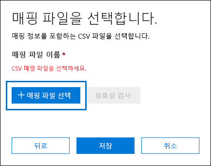
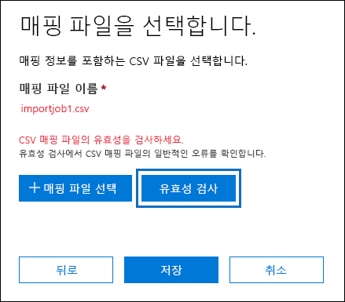
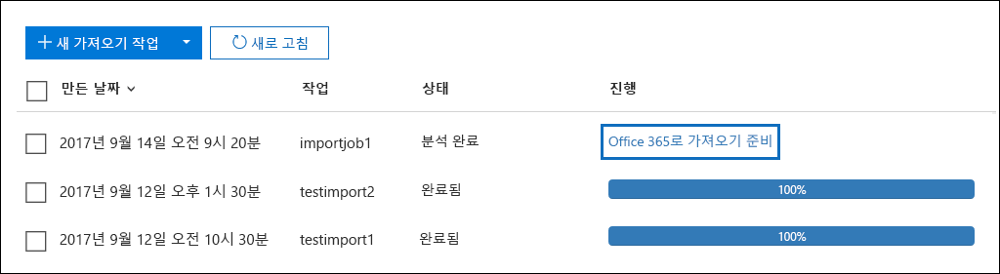
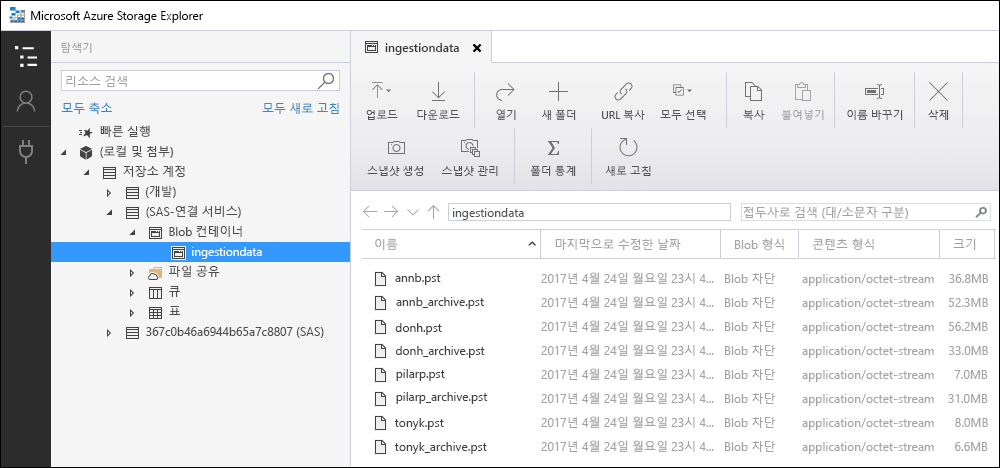
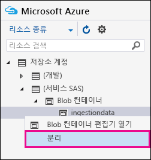

# <a name="use-drive-shipping-to-import-your-organization-pst-files-to-office-365"></a><span data-ttu-id="c5b11-103">드라이브 전달을 사용 하 여 조직 PST 파일을 Office 365로 가져오기</span><span class="sxs-lookup"><span data-stu-id="c5b11-103">Use drive shipping to import your organization PST files to Office 365</span></span>

<span data-ttu-id="c5b11-104">**이 문서는 관리자를 위한 것입니다. PST 파일을 자체 사서함으로 가져오시겠습니까? [Outlook .pst 파일에서 전자 메일, 연락처 및 일정 가져오기를](https://go.microsoft.com/fwlink/p/?LinkID=785075) 참조 하세요.**</span><span class="sxs-lookup"><span data-stu-id="c5b11-104">**This article is for administrators. Are you trying to import PST files to your own mailbox? See [Import email, contacts, and calendar from an Outlook .pst file](https://go.microsoft.com/fwlink/p/?LinkID=785075)**</span></span>
   
<span data-ttu-id="c5b11-105">Office 365 가져오기 서비스 및 드라이브 전달을 사용 하 여 사용자 사서함에 PST 파일을 대량으로 가져옵니다.</span><span class="sxs-lookup"><span data-stu-id="c5b11-105">Use the Office 365 Import service and drive shipping to bulk-import PST files to user mailboxes.</span></span> <span data-ttu-id="c5b11-106">드라이브 발송은 PST 파일을 하드 디스크 드라이브로 복사한 후 실제로 해당 드라이브를 Microsoft로 발송하는 것을 의미합니다.</span><span class="sxs-lookup"><span data-stu-id="c5b11-106">Drive shipping means that you copy the PST files to a hard disk drive and then physically ship the drive to Microsoft.</span></span> <span data-ttu-id="c5b11-107">Microsoft에서 하드 드라이브를 받으면 데이터 센터 직원은 하드 드라이브의 데이터를 Microsoft 클라우드의 저장소 영역으로 복사 합니다.</span><span class="sxs-lookup"><span data-stu-id="c5b11-107">When Microsoft receives your hard drive, data center personnel copies the data from the hard drive to a storage area in the Microsoft cloud.</span></span> <span data-ttu-id="c5b11-108">그런 다음 가져올 데이터를 제어 하는 필터를 설정 하 여 대상 사서함으로 가져온 PST 데이터를 잘라낼 수 있습니다.</span><span class="sxs-lookup"><span data-stu-id="c5b11-108">Then you have the opportunity to trim the PST data that's imported to the target mailboxes by setting filters that control what data gets imported.</span></span> <span data-ttu-id="c5b11-109">가져오기 작업을 시작한 후에는 가져오기 서비스가 저장소 영역에서 사용자 사서함으로 PST 데이터를 가져옵니다.</span><span class="sxs-lookup"><span data-stu-id="c5b11-109">After you start the import job, the Import service imports the PST data from the storage area to user mailboxes.</span></span> <span data-ttu-id="c5b11-110">드라이브 전달을 사용 하 여 PST 파일을 사용자 사서함으로 가져오는 것은 조직의 전자 메일을 Office 365로 마이그레이션하는 한 가지 방법입니다.</span><span class="sxs-lookup"><span data-stu-id="c5b11-110">Using drive shipping to import PST files to user mailboxes is one way to migrate your organization's email to Office 365.</span></span>
  
<span data-ttu-id="c5b11-111">드라이브 전달을 사용 하 여 PST 파일을 Office 365 사서함으로 가져오는 데 필요한 단계는 다음과 같습니다.</span><span class="sxs-lookup"><span data-stu-id="c5b11-111">Here are the steps required to use drive shipping to import PST files to Office 365 mailboxes:</span></span>
  
[<span data-ttu-id="c5b11-112">1 단계: 보안 저장소 키 및 PST 가져오기 도구 다운로드</span><span class="sxs-lookup"><span data-stu-id="c5b11-112">Step 1: Download the secure storage key and PST Import tool</span></span>](#step-1-download-the-secure-storage-key-and-pst-import-tool)

[<span data-ttu-id="c5b11-113">2 단계: PST 파일을 하드 드라이브에 복사</span><span class="sxs-lookup"><span data-stu-id="c5b11-113">Step 2: Copy the PST files to the hard drive</span></span>](#step-2-copy-the-pst-files-to-the-hard-drive)

[<span data-ttu-id="c5b11-114">3 단계: PST 가져오기 매핑 파일 만들기</span><span class="sxs-lookup"><span data-stu-id="c5b11-114">Step 3: Create the PST Import mapping file</span></span>](#step-3-create-the-pst-import-mapping-file)

[<span data-ttu-id="c5b11-115">4단계: Office 365에서 PST 가져오기 작업 만들기</span><span class="sxs-lookup"><span data-stu-id="c5b11-115">Step 4: Create a PST Import job in Office 365</span></span>](#step-4-create-a-pst-import-job-in-office-365)

[<span data-ttu-id="c5b11-116">5단계: Microsoft로 하드 드라이브 발송</span><span class="sxs-lookup"><span data-stu-id="c5b11-116">Step 5: Ship the hard drive to Microsoft</span></span>](#step-5-ship-the-hard-drive-to-microsoft)

[<span data-ttu-id="c5b11-117">6 단계: 데이터 필터링 및 PST 가져오기 작업 시작</span><span class="sxs-lookup"><span data-stu-id="c5b11-117">Step 6: Filter data and start the PST Import job</span></span>](#step-6-filter-data-and-start-the-pst-import-job)
  
> [!IMPORTANT]
> <span data-ttu-id="c5b11-118">보안 저장소 키 및 가져오기 도구를 로드 하기 위해 1 단계를 한 번 수행 해야 합니다.</span><span class="sxs-lookup"><span data-stu-id="c5b11-118">You have to perform Step 1 once to down load the secure storage key and the import tool.</span></span> <span data-ttu-id="c5b11-119">이러한 단계를 수행한 후에는 Microsoft에 하드 드라이브를 출시할 때마다 2 단계부터 6 단계까지 수행 합니다.</span><span class="sxs-lookup"><span data-stu-id="c5b11-119">After you perform these steps, follow Step 2 through Step 6 each time you want to ship a hard drive to Microsoft.</span></span> 
  
<span data-ttu-id="c5b11-120">드라이브 발송을 사용 하 여 PST 파일을 Office 365로 가져오는 방법에 대 한 질문과 대답은 [faq for drive 발송을 사용 하 여 pst 파일 가져오기](faqimporting-pst-files-to-office-365.md#using-drive-shipping-to-import-pst-files)를 참조 하세요.</span><span class="sxs-lookup"><span data-stu-id="c5b11-120">For frequently asked questions about using drive shipping to import PST files to Office 365, see [FAQs for using drive shipping to import PST files](faqimporting-pst-files-to-office-365.md#using-drive-shipping-to-import-pst-files).</span></span> 
  
## <a name="before-you-begin"></a><span data-ttu-id="c5b11-121">시작하기 전에</span><span class="sxs-lookup"><span data-stu-id="c5b11-121">Before you begin</span></span>

- <span data-ttu-id="c5b11-122">PST 파일을 Office 365 사서함으로 가져오려면 Exchange Online의 사서함 가져오기 내보내기 역할을 할당 받아야 합니다.</span><span class="sxs-lookup"><span data-stu-id="c5b11-122">You have to be assigned the Mailbox Import Export role in Exchange Online to import PST files to Office 365 mailboxes.</span></span> <span data-ttu-id="c5b11-123">기본적으로이 역할은 Exchange Online의 어떠한 역할 그룹에도 할당 되지 않습니다.</span><span class="sxs-lookup"><span data-stu-id="c5b11-123">By default, this role isn't assigned to any role group in Exchange Online.</span></span> <span data-ttu-id="c5b11-124">You can add the Mailbox Import Export role to the Organization Management role group.</span><span class="sxs-lookup"><span data-stu-id="c5b11-124">You can add the Mailbox Import Export role to the Organization Management role group.</span></span> <span data-ttu-id="c5b11-125">또는 역할 그룹을 만들고 사서함 가져오기 내보내기 역할을 할당 한 다음 자신을 구성원으로 추가할 수 있습니다.</span><span class="sxs-lookup"><span data-stu-id="c5b11-125">Or you can create a role group, assign the Mailbox Import Export role, and then add yourself as a member.</span></span> <span data-ttu-id="c5b11-126">자세한 내용은 [Manage role groups](https://go.microsoft.com/fwlink/p/?LinkId=730688)의 "역할 그룹에 역할 추가" 또는 "역할 그룹 만들기" 섹션을 참조 하십시오.</span><span class="sxs-lookup"><span data-stu-id="c5b11-126">For more information, see the "Add a role to a role group" or the "Create a role group" sections in [Manage role groups](https://go.microsoft.com/fwlink/p/?LinkId=730688).</span></span>
    
    <span data-ttu-id="c5b11-127">또한 보안 & 준수 센터에서 가져오기 작업을 만들려면 다음 중 하나가 충족 되어야 합니다.</span><span class="sxs-lookup"><span data-stu-id="c5b11-127">Additionally, to create import jobs in the Security & Compliance Center, one of the following must be true:</span></span>
    
  - <span data-ttu-id="c5b11-128">Exchange Online에서 Mail Recipients 역할을 할당 받아야 합니다.</span><span class="sxs-lookup"><span data-stu-id="c5b11-128">You have to be assigned the Mail Recipients role in Exchange Online.</span></span> <span data-ttu-id="c5b11-129">By default, this role is assigned to the Organization Management and Recipient Management roles groups.</span><span class="sxs-lookup"><span data-stu-id="c5b11-129">By default, this role is assigned to the Organization Management and Recipient Management roles groups.</span></span>
    
    <span data-ttu-id="c5b11-130">또는</span><span class="sxs-lookup"><span data-stu-id="c5b11-130">Or</span></span>
    
  - <span data-ttu-id="c5b11-131">Office 365 조 직의 전역 관리자 여야 합니다.</span><span class="sxs-lookup"><span data-stu-id="c5b11-131">You have to be a global administrator in your Office 365 organization.</span></span>
    
    > [!TIP]
    > <span data-ttu-id="c5b11-132">Exchange Online에서 PST 파일을 Office 365로 가져오는 데 특별히 만들어진 새 역할 그룹을 만드는 것이 좋습니다.</span><span class="sxs-lookup"><span data-stu-id="c5b11-132">Consider creating a new role group in Exchange Online that's specifically intended for importing PST files to Office 365.</span></span> <span data-ttu-id="c5b11-133">PST 파일을 가져오는 데 필요한 최소 수준의 권한으로는 사서함 가져오기 내보내기 및 메일 받는 사람 역할을 새 역할 그룹에 할당 하 고 구성원을 추가 합니다.</span><span class="sxs-lookup"><span data-stu-id="c5b11-133">For the minimum level of privileges required to import PST files, assign the Mailbox Import Export and Mail Recipients roles to the new role group, and then add members.</span></span> 
  
- <span data-ttu-id="c5b11-134">조직의 파일 서버의 하드 드라이브 또는 공유 폴더에 복사하려면 PST 파일을 저장해야 합니다.</span><span class="sxs-lookup"><span data-stu-id="c5b11-134">You need to store the PST files that you want to copy to a hard drive on a file server or shared folder in your organization.</span></span> <span data-ttu-id="c5b11-135">2 단계에서는이 파일 서버 또는 공유 폴더에 저장 된 PST 파일을 하드 드라이브에 복사 하는 WAImportExport 도구를 실행 합니다.</span><span class="sxs-lookup"><span data-stu-id="c5b11-135">In Step 2, you run the Azure Import Export tool (WAImportExport.exe) that copies the PST files that are stored on this file server or shared folder to the hard drive.</span></span>
    
- <span data-ttu-id="c5b11-136">Office 365 가져오기 서비스와 함께 사용할 수 있도록 Ssd (반도체 드라이브) 또는 2.5-인치 또는 3.5-인치 SATA II/III 내부 하드 드라이브만 지원 됩니다. 2.5</span><span class="sxs-lookup"><span data-stu-id="c5b11-136">Only 2.5-inch solid-state drives (SSDs) or 2.5-inch or 3.5-inch SATA II/III internal hard drives are supported for use with the Office 365 Import service.</span></span> <span data-ttu-id="c5b11-137">You can use hard drives up to 10 TB.</span><span class="sxs-lookup"><span data-stu-id="c5b11-137">You can use hard drives up to 10 TB.</span></span> <span data-ttu-id="c5b11-138">가져오기 작업의 경우에는 하드 드라이브의 첫 번째 데이터 볼륨만 처리 됩니다.</span><span class="sxs-lookup"><span data-stu-id="c5b11-138">For import jobs, only the first data volume on the hard drive will be processed.</span></span> <span data-ttu-id="c5b11-139">The data volume must be formatted with NTFS.</span><span class="sxs-lookup"><span data-stu-id="c5b11-139">The data volume must be formatted with NTFS.</span></span> <span data-ttu-id="c5b11-140">데이터를 하드 드라이브에 복사할 때는 2.5 인치 SSD 또는 3.5 2.5-인치 SATA II/III 커넥터를 사용 하 여 직접 연결 하거나 외부 2.5 인치 SSD 또는 2.5-인치 또는 3.5-인치 SATA II/III USB 어댑터를 사용 하 여 외부에서 연결할 수 있습니다.</span><span class="sxs-lookup"><span data-stu-id="c5b11-140">When copying data to a hard drive, you can attach it directly using a 2.5-inch SSD or 2.5-inch or 3.5-inch SATA II/III connector or you can attach it externally using an external 2.5-inch SSD or 2.5-inch or 3.5-inch SATA II/III USB adaptor.</span></span>
    
    > [!IMPORTANT]
    > <span data-ttu-id="c5b11-141">기본 제공 USB 어댑터와 함께 제공 되는 외부 하드 드라이브는 Office 365 가져오기 서비스에서 지원 되지 않습니다.</span><span class="sxs-lookup"><span data-stu-id="c5b11-141">External hard drives that come with an built-in USB adaptor aren't supported by the Office 365 Import service.</span></span> <span data-ttu-id="c5b11-142">Additionally, the disk inside the casing of an external hard drive can't be used.</span><span class="sxs-lookup"><span data-stu-id="c5b11-142">Additionally, the disk inside the casing of an external hard drive can't be used.</span></span> <span data-ttu-id="c5b11-143">Please don't ship external hard drives.</span><span class="sxs-lookup"><span data-stu-id="c5b11-143">Please don't ship external hard drives.</span></span> 
  
- <span data-ttu-id="c5b11-144">PST 파일을 복사하는 하드 드라이브는 BitLocker로 암호화되어야 합니다.</span><span class="sxs-lookup"><span data-stu-id="c5b11-144">The hard drive that you copy the PST files to must be encrypted with BitLocker.</span></span> <span data-ttu-id="c5b11-145">2단계에서 실행하는 WAImportExport.exe 도구는 BitLocker를 설정하는 데 도움이 됩니다.</span><span class="sxs-lookup"><span data-stu-id="c5b11-145">The WAImportExport.exe tool that you run in Step 2 will help you set up BitLocker.</span></span> <span data-ttu-id="c5b11-146">또한 Microsoft data center 직원이 Microsoft 클라우드의 Azure Storage 영역에 PST 파일을 업로드 하기 위해 드라이브에 액세스 하는 데 사용 하는 BitLocker 암호화 키를 생성 합니다.</span><span class="sxs-lookup"><span data-stu-id="c5b11-146">It also generates a BitLocker encryption key that Microsoft data center personnel use to access the drive to upload the PST files to the Azure Storage area in the Microsoft cloud.</span></span>
    
- <span data-ttu-id="c5b11-147">Microsoft 엔터프라이즈 계약 (EA)을 통해 드라이브 전달을 사용할 수 있습니다.</span><span class="sxs-lookup"><span data-stu-id="c5b11-147">Drive shipping is available through a Microsoft Enterprise Agreement (EA).</span></span> <span data-ttu-id="c5b11-148">Microsoft 제품 및 서비스 계약 (MPSA)을 통해서는 드라이브 전달을 사용할 수 없습니다.</span><span class="sxs-lookup"><span data-stu-id="c5b11-148">Drive shipping isn't available through a Microsoft Products and Services Agreement (MPSA).</span></span>
    
- <span data-ttu-id="c5b11-149">드라이브 전달을 사용 하 여 PST 파일을 Office 365 사서함으로 가져오는 비용은 데이터의 GB 당 $2 USD입니다.</span><span class="sxs-lookup"><span data-stu-id="c5b11-149">The cost to import PST files to Office 365 mailboxes using drive shipping is $2 USD per GB of data.</span></span> <span data-ttu-id="c5b11-150">For example, if you ship a hard drive that contains 1,000 GB (1 TB) of PST files, the cost is $2,000 USD.</span><span class="sxs-lookup"><span data-stu-id="c5b11-150">For example, if you ship a hard drive that contains 1,000 GB (1 TB) of PST files, the cost is $2,000 USD.</span></span> <span data-ttu-id="c5b11-151">You can work with a partner to pay the import fee.</span><span class="sxs-lookup"><span data-stu-id="c5b11-151">You can work with a partner to pay the import fee.</span></span> <span data-ttu-id="c5b11-152">파트너를 찾는 방법에 대 한 자세한 내용은 [Office 365 파트너 또는 대리점 찾기를](https://go.microsoft.com/fwlink/p/?LinkId=785197)참조 하세요.</span><span class="sxs-lookup"><span data-stu-id="c5b11-152">For information about finding a partner, see [Find your Office 365 partner or reseller](https://go.microsoft.com/fwlink/p/?LinkId=785197).</span></span>
    
- <span data-ttu-id="c5b11-153">사용자나 조직은 FedEx 또는 DHL 계정이 있어야 합니다. </span><span class="sxs-lookup"><span data-stu-id="c5b11-153">You or your organization must have an account with FedEx or DHL.</span></span>
    
  - <span data-ttu-id="c5b11-154">미국, 브라질 및 유럽의 조직에는 FedEx 계정이 있어야 합니다.</span><span class="sxs-lookup"><span data-stu-id="c5b11-154">Organizations in the United States, Brazil, and Europe must have FedEx accounts.</span></span>
    
  - <span data-ttu-id="c5b11-155">동아시아 지역의 조직, 동남 아시아, 일본, 공화국 한국, 오스트레일리아에는 DHL 계정이 있어야 합니다.</span><span class="sxs-lookup"><span data-stu-id="c5b11-155">Organizations in East Asia, Southeast Asia, Japan, Republic of Korea, and Australia must have DHL accounts.</span></span>
    
    <span data-ttu-id="c5b11-156">Microsoft는이 계정을 사용 하 여 하드 드라이브를 다시 사용자에 게 반송 합니다.</span><span class="sxs-lookup"><span data-stu-id="c5b11-156">Microsoft uses (and charges) this account to return the hard drive back to you.</span></span>
    
- <span data-ttu-id="c5b11-157">Microsoft에 제공 하는 하드 드라이브는 해외 테두리를 통과할 수 있습니다.</span><span class="sxs-lookup"><span data-stu-id="c5b11-157">The hard drive that you ship to Microsoft may cross international borders.</span></span> <span data-ttu-id="c5b11-158">이 경우 해당 하는 법률에 따라 하드 드라이브와 해당 파일에 포함 된 데이터를 가져오고/또는 내보내도록 합니다.</span><span class="sxs-lookup"><span data-stu-id="c5b11-158">In this case, you're responsible for ensuring that the hard drive and the data it contains are imported and/or exported in accordance with the applicable laws.</span></span> <span data-ttu-id="c5b11-159">하드 드라이브를 발송하기 전에 드라이브 및 데이터가 확인된 Microsoft 데이터 센터에 합법적으로 발송될 수 있는지를 관리자에게 문의하세요.</span><span class="sxs-lookup"><span data-stu-id="c5b11-159">Before shipping a hard drive, check with your advisors to verify that your drive and data can legally be shipped to the identified Microsoft data center.</span></span> <span data-ttu-id="c5b11-160">이를 통해 적시에 Microsoft에 도달 하 게 됩니다.</span><span class="sxs-lookup"><span data-stu-id="c5b11-160">This helps to ensure that it reaches Microsoft in a timely manner.</span></span>
    
- <span data-ttu-id="c5b11-161">이 절차 중에 보안 저장소 키와 BitLocker 암호화 키가 복사되고 저장됩니다.</span><span class="sxs-lookup"><span data-stu-id="c5b11-161">This procedure involves copying and saving a secure storage key and a BitLocker encryption key.</span></span> <span data-ttu-id="c5b11-162">암호나 기타 보안 관련 정보를 보호하는 것처럼 특히 주의해서 이러한 키를 보호해야 합니다.</span><span class="sxs-lookup"><span data-stu-id="c5b11-162">Be sure to take precautions to protect these keys like you would protect passwords or other security-related information.</span></span> <span data-ttu-id="c5b11-163">예를 들어 암호로 보호된 Microsoft Word 문서에 저장하거나 암호화된 USB 드라이브에 저장할 수 있습니다.</span><span class="sxs-lookup"><span data-stu-id="c5b11-163">For example, you might save them to a password-protected Microsoft Word document or save them to an encrypted USB drive.</span></span> <span data-ttu-id="c5b11-164">이러한 키의 예는 [추가 정보](#more-information) 섹션을 참조 하십시오.</span><span class="sxs-lookup"><span data-stu-id="c5b11-164">See the [More information](#more-information) section for an example of these keys.</span></span> 
    
- <span data-ttu-id="c5b11-165">PST 파일을 Office 365 사서함으로 가져온 후에는 사서함에 대 한 보존 설정이 무기한 유지 되도록 설정 됩니다.</span><span class="sxs-lookup"><span data-stu-id="c5b11-165">After PST files are imported to an Office 365 mailbox, the retention hold setting for the mailbox is turned on for an indefinite duration.</span></span> <span data-ttu-id="c5b11-166">즉, 보존 보류를 해제 하거나 보류를 해제 하기 위해 날짜를 설정할 때까지 사서함에 할당 된 보존 정책이 처리 되지 않습니다.</span><span class="sxs-lookup"><span data-stu-id="c5b11-166">This means that the retention policy assigned to the mailbox won't be processed until you turn off the retention hold or set a date to turn off the hold.</span></span> <span data-ttu-id="c5b11-167">이 작업을 수행 하는 이유는 무엇 인가요?</span><span class="sxs-lookup"><span data-stu-id="c5b11-167">Why do we do this?</span></span> <span data-ttu-id="c5b11-168">사서함으로 가져온 메시지가 오래 된 경우 사서함에 대해 구성 된 보존 설정에 따라 보존 기간이 만료 되어 영구적으로 삭제 (제거) 될 수 있습니다.</span><span class="sxs-lookup"><span data-stu-id="c5b11-168">If messages imported to a mailbox are old, they might be permanently deleted (purged) because their retention period has expired based on the retention settings configured for the mailbox.</span></span> <span data-ttu-id="c5b11-169">사서함을 보존 상태로 두면 사서함 소유자가 새로 가져온 메시지를 관리할 수 있는 시간을 제공 하거나 사서함의 보존 설정을 변경할 수 있는 시간을 제공 합니다.</span><span class="sxs-lookup"><span data-stu-id="c5b11-169">Placing the mailbox on retention hold gives the mailbox owner time to manage these newly imported messages or give you time to change the retention settings for the mailbox.</span></span> <span data-ttu-id="c5b11-170">보존 유지 관리에 대 한 제안은 [More information](#more-information) 섹션을 참조 하세요.</span><span class="sxs-lookup"><span data-stu-id="c5b11-170">See the [More information](#more-information) section for suggestions about managing the retention hold.</span></span> 
    
- <span data-ttu-id="c5b11-171">기본적으로 Office 365 사서함에서 받을 수 있는 최대 메시지 크기는 35 MB입니다.</span><span class="sxs-lookup"><span data-stu-id="c5b11-171">By default, the maximum message size that can be received by an Office 365 mailbox is 35 MB.</span></span> <span data-ttu-id="c5b11-172">사서함에 대 한 *MaxReceiveSize* 속성의 기본값은 35 MB로 설정 되어 있기 때문입니다.</span><span class="sxs-lookup"><span data-stu-id="c5b11-172">That's because the default value for the  *MaxReceiveSize*  property for a mailbox is set to 35 MB.</span></span> <span data-ttu-id="c5b11-173">그러나 Office 365의 최대 메시지 수신 크기 제한은 150 MB입니다.</span><span class="sxs-lookup"><span data-stu-id="c5b11-173">However, the limit for the maximum message receive size in Office 365 is 150 MB.</span></span> <span data-ttu-id="c5b11-174">따라서 35 보다 큰 항목을 포함 하는 PST 파일을 가져올 경우 Office 365 가져오기 서비스는 대상 사서함의 *MaxReceiveSize* 속성 값을 150 mb로 자동 변경 합니다.</span><span class="sxs-lookup"><span data-stu-id="c5b11-174">So if you import a PST file that contains an item larger than 35 MB, the Office 365 Import service we will automatically change the value of the  *MaxReceiveSize*  property on the target mailbox to 150 MB.</span></span> <span data-ttu-id="c5b11-175">이를 통해 최대 150 MB까지 메시지를 사용자 사서함으로 가져올 수 있습니다.</span><span class="sxs-lookup"><span data-stu-id="c5b11-175">This allows messages up to 150 MB to be imported to user mailboxes.</span></span> 
    
    > [!TIP]
    > <span data-ttu-id="c5b11-176">사서함에 대 한 메시지 수신 크기를 확인 하려면 Exchange Online PowerShell에서이 명령을 실행 하면 `Get-Mailbox <user mailbox> | FL MaxReceiveSize`됩니다.</span><span class="sxs-lookup"><span data-stu-id="c5b11-176">To identify the message receive size for a mailbox, you can run this command in Exchange Online PowerShell:  `Get-Mailbox <user mailbox> | FL MaxReceiveSize`.</span></span> 
  
- <span data-ttu-id="c5b11-177">PST 파일을 Office 365의 비활성 사서함으로 가져올 수 있습니다.</span><span class="sxs-lookup"><span data-stu-id="c5b11-177">You can import PST files to an inactive mailbox in Office 365.</span></span> <span data-ttu-id="c5b11-178">PST 가져오기 매핑 파일의 `Mailbox` 매개 변수에 비활성 사서함의 GUID를 지정 하 여이 작업을 수행 합니다.</span><span class="sxs-lookup"><span data-stu-id="c5b11-178">You do this by specifying the GUID of the inactive mailbox in the  `Mailbox` parameter in the PST Import mapping file.</span></span> <span data-ttu-id="c5b11-179">자세한 내용은 [3 단계: PST 가져오기 매핑 파일 만들기를](#step-3-create-the-pst-import-mapping-file) 참조 하세요.</span><span class="sxs-lookup"><span data-stu-id="c5b11-179">See [Step 3: Create the PST Import mapping file](#step-3-create-the-pst-import-mapping-file) for more information.</span></span> 
    
- <span data-ttu-id="c5b11-180">Exchange 하이브리드 배포에서는 기본 사서함이 온-프레미스 인 사용자에 대해 PST 파일을 클라우드 기반 보관 사서함으로 가져올 수 있습니다.</span><span class="sxs-lookup"><span data-stu-id="c5b11-180">In an Exchange hybrid deployment, you can import PST files to a cloud-based archive mailbox for a user whose primary mailbox is on-premises.</span></span> <span data-ttu-id="c5b11-181">PST 가져오기 매핑 파일에서 다음을 수행 하 여이 작업을 수행 합니다.</span><span class="sxs-lookup"><span data-stu-id="c5b11-181">You do this by doing the following in the PST Import mapping file:</span></span>
    
  - <span data-ttu-id="c5b11-182">`Mailbox` 매개 변수의 사용자 온-프레미스 사서함에 대 한 전자 메일 주소를 지정 합니다.</span><span class="sxs-lookup"><span data-stu-id="c5b11-182">Specify the email address for the user's on-premises mailbox in the  `Mailbox` parameter.</span></span> 
    
  - <span data-ttu-id="c5b11-183">`IsArchive` 매개 변수에 **TRUE** 값을 지정 합니다.</span><span class="sxs-lookup"><span data-stu-id="c5b11-183">Specify the **TRUE** value in the  `IsArchive` parameter.</span></span> 
    
    <span data-ttu-id="c5b11-184">자세한 내용은 [3 단계: PST 가져오기 매핑 파일 만들기를](#step-3-create-the-pst-import-mapping-file) 참조 하세요.</span><span class="sxs-lookup"><span data-stu-id="c5b11-184">See [Step 3: Create the PST Import mapping file](#step-3-create-the-pst-import-mapping-file) for more information.</span></span> 

## <a name="step-1-download-the-secure-storage-key-and-pst-import-tool"></a><span data-ttu-id="c5b11-185">1 단계: 보안 저장소 키 및 PST 가져오기 도구 다운로드</span><span class="sxs-lookup"><span data-stu-id="c5b11-185">Step 1: Download the secure storage key and PST Import tool</span></span>

<span data-ttu-id="c5b11-186">첫 번째 단계는 2 단계에서 하드 드라이브에 PST 파일을 복사 하는 데 사용 하는 보안 저장소 키와 도구를 다운로드 하는 것입니다.</span><span class="sxs-lookup"><span data-stu-id="c5b11-186">The first step is to download the secure storage key and the tool and that you use in Step 2 to copy PST files to the hard drive.</span></span>
  
> [!IMPORTANT]
> <span data-ttu-id="c5b11-187">Drive 배송료 메서드를 사용 하 여 PST 파일을 가져오려면 Azure 가져오기/내보내기 도구 버전 1 (WAimportExportV1)을 사용 해야 합니다.</span><span class="sxs-lookup"><span data-stu-id="c5b11-187">You have to use Azure Import/Export tool version 1 (WAimportExportV1) to successfully import PST files by using the drive shipping method.</span></span> <span data-ttu-id="c5b11-188">Azure 가져오기/내보내기 도구 버전 2는 지원 되지 않으며이를 사용 하면 가져오기 작업에 대 한 하드 드라이브를 잘못 준비 하 게 됩니다.</span><span class="sxs-lookup"><span data-stu-id="c5b11-188">Version 2 of the Azure Import/Export tool isn't supported and using it will result in incorrectly preparing the hard drive for the import job.</span></span> <span data-ttu-id="c5b11-189">이 단계의 절차에 따라 Security & 준수 센터에서 Azure 가져오기/내보내기 도구를 다운로드 해야 합니다.</span><span class="sxs-lookup"><span data-stu-id="c5b11-189">Be sure to download the Azure Import/Export tool from the Security & Compliance Center by following the procedures in this step.</span></span> 
  
1. <span data-ttu-id="c5b11-190">으로 이동 [https://protection.office.com/](https://protection.office.com/) 하 고 Office 365 조직의 관리자 계정에 대 한 자격 증명을 사용 하 여 로그인 합니다.</span><span class="sxs-lookup"><span data-stu-id="c5b11-190">Go to [https://protection.office.com/](https://protection.office.com/) and sign in using the credentials for an administrator account in your Office 365 organization.</span></span> 
    
2. <span data-ttu-id="c5b11-191">보안 & 준수 센터의 왼쪽 창에서 **데이터 거 버 넌 스** \> **가져오기를**클릭 합니다.</span><span class="sxs-lookup"><span data-stu-id="c5b11-191">In the left pane of the Security & Compliance Center, click **Data governance** \> **Import**.</span></span>
    
    > [!NOTE]
    > <span data-ttu-id="c5b11-192">앞에서 설명한 것 처럼 보안 & 준수 센터의 **가져오기** 페이지에 액세스 하기 위한 적절 한 사용 권한을 할당 받아야 합니다.</span><span class="sxs-lookup"><span data-stu-id="c5b11-192">As previously stated, you have to be assigned the appropriate permissions to access the **Import** page in the Security & Compliance Center.</span></span> 
  
3. <span data-ttu-id="c5b11-193">**가져오기**  추가 **새 가져오기 작업**을 클릭 합니다.</span><span class="sxs-lookup"><span data-stu-id="c5b11-193">On the **Import** page, click  **New import job**.</span></span>
    
4. <span data-ttu-id="c5b11-194">작업 가져오기 마법사에서 PST 가져오기 작업의 이름을 입력 하 고 **다음**을 클릭 합니다.</span><span class="sxs-lookup"><span data-stu-id="c5b11-194">In the import job wizard, type a name for the PST import job, and then click **Next**.</span></span> <span data-ttu-id="c5b11-195">소문자, 숫자, 하이픈 및 밑줄을 사용 합니다.</span><span class="sxs-lookup"><span data-stu-id="c5b11-195">Use lowercase letters, numbers, hyphens, and underscores.</span></span> <span data-ttu-id="c5b11-196">이름에는 대문자를 사용 하거나 공백을 포함할 수 없습니다.</span><span class="sxs-lookup"><span data-stu-id="c5b11-196">You can't use uppercase letters or include spaces in the name.</span></span>
    
5. <span data-ttu-id="c5b11-197">**가져오기 작업 유형 선택** 페이지에서 **실제 위치 중 하나로 하드 드라이브 배송** 을 클릭 하 고 **다음**을 클릭 합니다.</span><span class="sxs-lookup"><span data-stu-id="c5b11-197">On the **Choose import job type** page, click **Ship hard drives to one of our physical locations** and then click **Next**.</span></span>
    
    
  
6. <span data-ttu-id="c5b11-199">**데이터 가져오기** 페이지에서 다음 두 가지 작업을 수행 합니다.</span><span class="sxs-lookup"><span data-stu-id="c5b11-199">On the **Import data** page, do the following two things:</span></span> 
    
    
  
    <span data-ttu-id="c5b11-201">a.</span><span class="sxs-lookup"><span data-stu-id="c5b11-201">a.</span></span> <span data-ttu-id="c5b11-202">2 단계에서 **보안 저장소 키 복사**를 클릭 합니다.</span><span class="sxs-lookup"><span data-stu-id="c5b11-202">In step 2, click **Copy the secure storage key**.</span></span> <span data-ttu-id="c5b11-203">저장소 키가 표시 되 면 **클립보드에 복사** 를 클릭 하 여 붙여 넣은 다음 나중에 액세스할 수 있도록 파일에 저장 합니다.</span><span class="sxs-lookup"><span data-stu-id="c5b11-203">After the storage key is displayed, click **Copy to clipboard** and then paste it and save it to a file so you can access it later.</span></span>
    
    <span data-ttu-id="c5b11-204">b.</span><span class="sxs-lookup"><span data-stu-id="c5b11-204">b.</span></span> <span data-ttu-id="c5b11-205">3 단계에서 **Azure 가져오기/내보내기 도구를 다운로드** 하 여 azure 가져오기/내보내기 (버전 1) 도구를 다운로드 하 고 설치 합니다.</span><span class="sxs-lookup"><span data-stu-id="c5b11-205">In step 3, **Download the Azure Import/Export tool** to download and install the Azure Import/Export (version 1) tool.</span></span>
    
    - <span data-ttu-id="c5b11-206">팝업 창에서 다른 \> **이름으로 저장** 을 **클릭 하** 여 로컬 컴퓨터의 폴더에 WaImportExportV1 파일을 저장 합니다.</span><span class="sxs-lookup"><span data-stu-id="c5b11-206">In the pop-up window, click **Save** \> **Save as** to save the WaImportExportV1.zip file to a folder on your local computer.</span></span> 
    
    - <span data-ttu-id="c5b11-207">WaImportExportV1 파일의 압축을 풉니다.</span><span class="sxs-lookup"><span data-stu-id="c5b11-207">Extract the WaImportExportV1.zip file.</span></span>
    
7. <span data-ttu-id="c5b11-208">**취소** 를 클릭 하 여 마법사를 닫습니다.</span><span class="sxs-lookup"><span data-stu-id="c5b11-208">Click **Cancel** to close the wizard.</span></span> 
    
    <span data-ttu-id="c5b11-209">4 단계에서 가져오기 작업을 만들 때 Security & 준수 센터의 **가져오기** 페이지로 돌아갑니다.</span><span class="sxs-lookup"><span data-stu-id="c5b11-209">You come back to the **Import** page in the Security & Compliance Center when you create the import job in Step 4.</span></span> 

## <a name="step-2-copy-the-pst-files-to-the-hard-drive"></a><span data-ttu-id="c5b11-210">2 단계: PST 파일을 하드 드라이브에 복사</span><span class="sxs-lookup"><span data-stu-id="c5b11-210">Step 2: Copy the PST files to the hard drive</span></span>

<span data-ttu-id="c5b11-211">다음 단계는 WAImportExport.exe 도구를 사용하여 하드 드라이브에 PST 파일을 복사하는 것입니다.</span><span class="sxs-lookup"><span data-stu-id="c5b11-211">The next step is to use the WAImportExport.exe tool to copy PST files to the hard drive.</span></span> <span data-ttu-id="c5b11-212">이 도구는 BitLocker로 하드 드라이브를 암호화하고 PST를 하드 드라이브에 복사한 다음 복사 프로세스에 대한 정보를 저장하는 저널 파일을 만듭니다.</span><span class="sxs-lookup"><span data-stu-id="c5b11-212">This tool encrypts the hard drive with BitLocker, copies the PSTs to the hard drive, and creates a journal file that stores information about the copy process.</span></span> <span data-ttu-id="c5b11-213">이 단계를 완료하려면 PST 파일이 조직의 파일 공유 또는 파일 서버에 있어야 합니다.</span><span class="sxs-lookup"><span data-stu-id="c5b11-213">To complete this step, the PST files have to be located in a file share or file server in your organization.</span></span> <span data-ttu-id="c5b11-214">다음 절차에서는 이것을 원본 디렉터리라고 합니다.</span><span class="sxs-lookup"><span data-stu-id="c5b11-214">This is known as the source directory in the following procedure.</span></span> 
  
> [!IMPORTANT]
> <span data-ttu-id="c5b11-215">하드 드라이브에 대해 처음으로 WAImportExport.exe 도구를 실행한 후에는 매번 다른 구문을 사용해야 합니다.</span><span class="sxs-lookup"><span data-stu-id="c5b11-215">After you run the WAImportExport.exe tool the first time for a hard drive, you have to use a different syntax each time after that.</span></span> <span data-ttu-id="c5b11-216">이 구문은이 절차의 4 단계에서 PST 파일을 하드 드라이브에 복사 하는 방법에 설명 되어 있습니다.</span><span class="sxs-lookup"><span data-stu-id="c5b11-216">This syntax is explained in step 4 of this procedure to copy PST files to the hard drive.</span></span> 
  
1. <span data-ttu-id="c5b11-217">로컬 컴퓨터에서 명령 프롬프트를 엽니다.</span><span class="sxs-lookup"><span data-stu-id="c5b11-217">Open a Command Prompt on your local computer.</span></span>
    
    > [!TIP]
    > <span data-ttu-id="c5b11-p124">관리자 권한으로 명령 프롬프트를 실행하는 경우(열 때 "관리자 권한으로 실행" 선택) 명령 프롬프트 창에 오류 메시지가 표시됩니다. 이 메시지는 WAImportExport.exe 도구를 실행할 때 발생하는 문제를 해결하는 데 도움이 됩니다.</span><span class="sxs-lookup"><span data-stu-id="c5b11-p124">If you run the command prompt as an administrator (by selecting "Run as administrator" when you open it) error messages will be displayed in the command prompt window. This can help you troubleshoot problems running the WAImportExport.exe tool.</span></span> 
  
2. <span data-ttu-id="c5b11-220">1단계에서 WAImportExport.exe 도구를 설치한 디렉터리로 이동합니다.</span><span class="sxs-lookup"><span data-stu-id="c5b11-220">Go to the directory where you installed the WAImportExport.exe tool in Step 1.</span></span>
    
3. <span data-ttu-id="c5b11-221">WAImportExport.exe를 사용하여 하드 드라이브에 PST 파일을 처음 복사할 때 다음 명령을 실행합니다.</span><span class="sxs-lookup"><span data-stu-id="c5b11-221">Run the following command the first time that you use the WAImportExport.exe to copy PST files to a hard drive.</span></span>

    ```
    WAImportExport.exe PrepImport /j:<Name of journal file> /t:<Drive letter> /id:<Name of session> /srcdir:<Location of PST files> /dstdir:<PST file path> /sk:<Storage account key> /blobtype:BlockBlob /encrypt /logdir:<Log file location>
    ```

    <span data-ttu-id="c5b11-222">다음 표에서는 매개 변수와 해당 필수 값에 대해 설명합니다.</span><span class="sxs-lookup"><span data-stu-id="c5b11-222">The following table describes the parameters and their required values.</span></span>
    
    |<span data-ttu-id="c5b11-223">**매개 변수**</span><span class="sxs-lookup"><span data-stu-id="c5b11-223">**Parameter**</span></span>|<span data-ttu-id="c5b11-224">**설명**</span><span class="sxs-lookup"><span data-stu-id="c5b11-224">**Description**</span></span>|<span data-ttu-id="c5b11-225">**예제**</span><span class="sxs-lookup"><span data-stu-id="c5b11-225">**Example**</span></span>|
    |:-----|:-----|:-----|
    | `/j:` <br/> |<span data-ttu-id="c5b11-226">저널 파일의 이름을 지정합니다.</span><span class="sxs-lookup"><span data-stu-id="c5b11-226">Specifies the name of the journal file.</span></span> <span data-ttu-id="c5b11-227">이 파일은 WAImportExport.exe 도구가 있는 동일한 폴더에 저장됩니다.</span><span class="sxs-lookup"><span data-stu-id="c5b11-227">This file is saved to the same folder where the WAImportExport.exe tool is located.</span></span> <span data-ttu-id="c5b11-228">Microsoft로 발송하는 각 하드 드라이브에는 하나의 저널 파일이 있어야 합니다.</span><span class="sxs-lookup"><span data-stu-id="c5b11-228">Each hard drive you ship to Microsoft must have one journal file.</span></span> <span data-ttu-id="c5b11-229">WAImportTool.exe를 실행하여 PST 파일을 하드 드라이브에 복사할 때마다 해당 드라이브에 대한 저널 파일에 정보가 추가됩니다.</span><span class="sxs-lookup"><span data-stu-id="c5b11-229">Every time you run the WAImportTool.exe to copy PST files to a hard drive, information will be appended to the journal file for that drive.</span></span>  <br/> <span data-ttu-id="c5b11-230">Microsoft 데이터 센터 직원은 저널 파일의 정보를 사용 하 여 하드 드라이브를 4 단계에서 만든 가져오기 작업에 연결 하 고, PST 파일을 Microsoft 클라우드의 Azure Storage 영역에 업로드 합니다.</span><span class="sxs-lookup"><span data-stu-id="c5b11-230">Microsoft data center personnel use the information in the journal file to associate the hard drive with the import job that you create in Step 4, and to upload the PST files to the Azure Storage area in the Microsoft cloud.</span></span>  <br/> | `/j:PSTHDD1.jrn` <br/> |
    | `/t:` <br/> |<span data-ttu-id="c5b11-231">로컬 컴퓨터에 연결될 때 하드 드라이브의 드라이브 문자를 지정합니다.</span><span class="sxs-lookup"><span data-stu-id="c5b11-231">Specifies the drive letter of the hard drive when it's connected to your local computer.</span></span>  <br/> | `/t:h` <br/> |
    | `/id:` <br/> |<span data-ttu-id="c5b11-p126">복사 세션의 이름을 지정합니다. 세션은 WAImportExport.exe 도구를 실행하여 하드 드라이브에 파일을 복사할 때마다 정의됩니다. PST 파일이 이 매개 변수로 지정된 세션 이름의 폴더에 복사됩니다. </span><span class="sxs-lookup"><span data-stu-id="c5b11-p126">Specifies the name of the copy session. A session is defined as each time you run the WAImportExport.exe tool to copy files to the hard drive. The PST files are copied to a folder named with the session name specified by this parameter.</span></span>  <br/> | `/id:driveship1` <br/> |
    | `/srcdir:` <br/> |<span data-ttu-id="c5b11-235">조직에서 세션 중에 복사될 PST 파일이 들어 있는 원본 디렉터리를 지정합니다.</span><span class="sxs-lookup"><span data-stu-id="c5b11-235">Specifies the source directory in your organization that contains the PST files that will be copied during the session.</span></span> <span data-ttu-id="c5b11-236">이 매개 변수의 값을 큰따옴표(" ")로 묶으세요.</span><span class="sxs-lookup"><span data-stu-id="c5b11-236">Be sure to surround the value of this parameter with double-quotation marks (" ").</span></span>  <br/> | `/srcdir:"\\FILESERVER01\PSTs"` <br/> |
    | `/dstdir:` <br/> |<span data-ttu-id="c5b11-237">Pst가 업로드 될 Microsoft 클라우드의 Azure Storage 영역에 있는 대상 디렉터리를 지정 합니다.</span><span class="sxs-lookup"><span data-stu-id="c5b11-237">Specifies the destination directory in the Azure Storage area in the Microsoft cloud where the PSTs will be uploaded.</span></span> <span data-ttu-id="c5b11-238">이 값 `ingestiondata/`을 사용 해야 합니다.</span><span class="sxs-lookup"><span data-stu-id="c5b11-238">You must use the value  `ingestiondata/`.</span></span> <span data-ttu-id="c5b11-239">이 매개 변수의 값을 큰따옴표(" ")로 묶으세요.</span><span class="sxs-lookup"><span data-stu-id="c5b11-239">Be sure to surround the value of this parameter with double-quotation marks (" ").</span></span>  <br/> <span data-ttu-id="c5b11-240">선택적으로이 매개 변수의 값에 파일 경로를 더 추가할 수도 있습니다.</span><span class="sxs-lookup"><span data-stu-id="c5b11-240">Optionally, you can also add an extra file path to the value of this parameter.</span></span> <span data-ttu-id="c5b11-241">예를 들어 `/srcdir:` 매개 변수에 지정 된 하드 드라이브 (URL 형식으로 변환)에서 원본 디렉터리의 파일 경로를 사용할 수 있습니다.</span><span class="sxs-lookup"><span data-stu-id="c5b11-241">For example, you can use the file path of the source directory on the hard drive (converted to a URL format), which is specified in the  `/srcdir:` parameter.</span></span> <span data-ttu-id="c5b11-242">예를 `\\FILESERVER01\PSTs` 들어로로 `FILESERVER01/PSTs`변경 됩니다.</span><span class="sxs-lookup"><span data-stu-id="c5b11-242">For example,  `\\FILESERVER01\PSTs` is changed to  `FILESERVER01/PSTs`.</span></span> <span data-ttu-id="c5b11-243">이 경우에도 파일 경로를 포함 `ingestiondata` 해야 합니다.</span><span class="sxs-lookup"><span data-stu-id="c5b11-243">In this case, you still must include  `ingestiondata` in the file path.</span></span> <span data-ttu-id="c5b11-244">따라서이 예제에서 `/dstdir:` 매개 변수의 값은 `"ingestiondata/FILESERVER01/PSTs"`입니다.</span><span class="sxs-lookup"><span data-stu-id="c5b11-244">So in this example, the value for the  `/dstdir:` parameter would be  `"ingestiondata/FILESERVER01/PSTs"`.</span></span>  <br/> <span data-ttu-id="c5b11-245">다른 파일 경로를 추가하는 한 가지 이유는 파일 이름이 같은 PST 파일이 있는 경우입니다.</span><span class="sxs-lookup"><span data-stu-id="c5b11-245">One reason to add the additional file path is if you have PSTs files with the same filename.</span></span>  <br/> <span data-ttu-id="c5b11-246">> [!NOTE]> pathname 선택적 경로를 포함 하는 경우 Azure 저장소 영역에 업로드 된 PST 파일의 네임 스페이스에는 PST 파일의 경로 이름과 이름이 포함 됩니다. 예를 `FILESERVER01/PSTs/annb.pst`들면입니다.</span><span class="sxs-lookup"><span data-stu-id="c5b11-246">> [!NOTE]> If you include the optional pathname, the namespace for a PST file after it's uploaded to the Azure Storage area includes the pathname and the name of the PST file; for example,  `FILESERVER01/PSTs/annb.pst`.</span></span> <span data-ttu-id="c5b11-247">Pathname을 포함 하지 않으면 네임 스페이스는 PST 파일 이름 뿐입니다. 예를 `annb.pst`들어</span><span class="sxs-lookup"><span data-stu-id="c5b11-247">If you don't include a pathname, the namespace is only the PST filename; for example  `annb.pst`.</span></span>           | `/dstdir:"ingestiondata/"` <br/> <span data-ttu-id="c5b11-248">또는</span><span class="sxs-lookup"><span data-stu-id="c5b11-248">Or</span></span>  <br/>  `/dstdir:"ingestiondata/FILESERVER01/PSTs"` <br/> |
    | `/sk:` <br/> |<span data-ttu-id="c5b11-249">1단계에서 구한 저장소 계정 키를 지정합니다.</span><span class="sxs-lookup"><span data-stu-id="c5b11-249">Specifies the storage account key that you obtained in Step 1.</span></span> <span data-ttu-id="c5b11-250">이 매개 변수의 값을 큰따옴표(" ")로 묶으세요.</span><span class="sxs-lookup"><span data-stu-id="c5b11-250">Be sure to surround the value of this parameter with double-quotation marks (" ").</span></span>  <br/> | `"yaNIIs9Uy5g25Yoak+LlSHfqVBGOeNwjqtBEBGqRMoidq6/e5k/VPkjOXdDIXJHxHvNoNoFH5NcVUJXHwu9ZxQ=="` <br/> |
    | `/blobtype:` <br/> |PST 파일을 가져올 Azure Storage 영역의 blob 유형을 지정 합니다. PST 파일을 가져오려면 값 **Blockblob**를 사용 합니다. <span data-ttu-id="c5b11-253">이 매개 변수는 필수입니다.</span><span class="sxs-lookup"><span data-stu-id="c5b11-253">This parameter is required.</span></span>   <br/> | `/blobtype:BlockBlob` <br/> |
    | `/encrypt` <br/> |<span data-ttu-id="c5b11-254">이 스위치는 하드 드라이브에 대해 BitLocker를 켭니다.</span><span class="sxs-lookup"><span data-stu-id="c5b11-254">This switch turns on BitLocker for the hard drive.</span></span> <span data-ttu-id="c5b11-255">이 매개 변수는 WAImportExport.exe 도구를 처음 실행할 때 필요합니다.</span><span class="sxs-lookup"><span data-stu-id="c5b11-255">This parameter is required the first time you run the WAImportExport.exe tool.</span></span>  <br/> <span data-ttu-id="c5b11-256">BitLocker 암호화 키는 저널 파일 및 `/logfile:` 매개 변수를 사용 하는 경우 생성 되는 로그 파일에 복사 됩니다.</span><span class="sxs-lookup"><span data-stu-id="c5b11-256">The BitLocker encryption key is copied to the journal file and the log file that is created if you use the  `/logfile:` parameter.</span></span> <span data-ttu-id="c5b11-257">앞서 설명한 것처럼 저널 파일은 WAImportExport.exe 도구가 있는 동일한 폴더에 저장됩니다.</span><span class="sxs-lookup"><span data-stu-id="c5b11-257">As previously explained, the journal file is saved to the same folder where the WAImportExport.exe tool is located.</span></span>  <br/> | `/encrypt` <br/> |
    | `/logdir:` <br/> |<span data-ttu-id="c5b11-258">이 선택적 매개 변수는 로그 파일을 저장할 폴더를 지정합니다.</span><span class="sxs-lookup"><span data-stu-id="c5b11-258">This optional parameter specifies a folder to save log files to.</span></span> <span data-ttu-id="c5b11-259">이를 지정 하지 않으면 WAImportExport .exe 도구가 있는 폴더에 로그 파일이 저장 됩니다.</span><span class="sxs-lookup"><span data-stu-id="c5b11-259">If not specified, the log files are saved to the same folder where the WAImportExport.exe tool is located.</span></span> <span data-ttu-id="c5b11-260">이 매개 변수의 값을 큰따옴표(" ")로 묶으세요.</span><span class="sxs-lookup"><span data-stu-id="c5b11-260">Be sure to surround the value of this parameter with double-quotation marks (" ").</span></span>  <br/> | `/logdir:"c:\users\admin\desktop\PstImportLogs"` <br/> |
   
    <span data-ttu-id="c5b11-261">다음은 각 매개 변수에 대한 실제 값을 사용하는 WAImportExport.exe 도구에 대한 구문 예입니다.</span><span class="sxs-lookup"><span data-stu-id="c5b11-261">Here's an example of the syntax for the WAImportExport.exe tool using actual values for each parameter:</span></span>
    
    ```
    WAImportExport.exe PrepImport /j:PSTHDD1.jrn /t:f /id:driveship1 /srcdir:"\\FILESERVER01\PSTs" /dstdir:"ingestiondata/" /sk:"yaNIIs9Uy5g25Yoak+LlSHfqVBGOeNwjqtBEBGqRMoidq6/e5k/VPkjOXdDIXJHxHvNoNoFH5NcVUJXHwu9ZxQ==" blobtype:BlockBlob /encrypt /logdir:"c:\users\admin\desktop\PstImportLogs"
    ```

    <span data-ttu-id="c5b11-p136">이 명령을 실행한 후 하드 드라이브에 대한 PST 파일 복사 진행률을 보여 주는 상태 메시지가 표시됩니다. 마지막 상태 메시지에는 성공적으로 복사된 파일의 총 수가 표시됩니다. </span><span class="sxs-lookup"><span data-stu-id="c5b11-p136">After you run the command, status messages are displayed that show the progress of copying the PST files to the hard drive. A final status message shows the total number of files that were successfully copied.</span></span>
    
4. <span data-ttu-id="c5b11-264">WAImportExport.ext 도구를 실행하여 PST 파일을 동일한 하드 드라이브에 복사한 이후에 매번 이 명령을 실행합니다.</span><span class="sxs-lookup"><span data-stu-id="c5b11-264">Run this command each subsequent time you run the WAImportExport.ext tool to copy PST files to the same hard drive.</span></span>

    ```
    WAImportExport.exe PrepImport /j:<Name of journal file> /id:<Name of new session> /srcdir:<Location of PST files> /dstdir:<PST file path> /blobtype:BlockBlob 
    ```

    <span data-ttu-id="c5b11-265">다음은 PST 파일을 동일한 하드 드라이브에 복사하기 위한 후속 세션 실행 구문의 예입니다.  </span><span class="sxs-lookup"><span data-stu-id="c5b11-265">Here's an example of the syntax for running subsequent sessions to copy PST files to the same hard drive.</span></span>

    ```
    WAImportExport.exe PrepImport /j:PSTHDD1.jrn /id:driveship2 /srcdir:"\\FILESERVER01\PSTs\SecondBatch" /dstdir:"ingestiondata/" /blobtype:BlockBlob
    ```

## <a name="step-3-create-the-pst-import-mapping-file"></a><span data-ttu-id="c5b11-266">3 단계: PST 가져오기 매핑 파일 만들기</span><span class="sxs-lookup"><span data-stu-id="c5b11-266">Step 3: Create the PST Import mapping file</span></span>

<span data-ttu-id="c5b11-267">Microsoft data center 직원이 하드 드라이브에서 Azure Storage 영역으로 PST 파일을 업로드 한 후에는 가져오기 서비스가 CSV (쉼표로 구분 된 값) 파일인 PST 가져오기 매핑 파일의 정보를 사용 하 여 해당 사용자가 사서함에 대 한 PST 파일을로 가져옵니다.</span><span class="sxs-lookup"><span data-stu-id="c5b11-267">After Microsoft data center personnel upload the PST files from the hard drive to the Azure Storage area, the Import service will use the information in the PST Import mapping file, which is a comma-separated value (CSV) file, that specifies which user mailboxes the PST files are imported to.</span></span> <span data-ttu-id="c5b11-268">PST 가져오기 작업을 만드는 다음 단계에서 이 CSV 파일을 제출합니다.</span><span class="sxs-lookup"><span data-stu-id="c5b11-268">You will submit this CSV file in the next step when you create a PST Import job.</span></span>
  
1. <span data-ttu-id="c5b11-269">[PST 가져오기 매핑 파일의 복사본을 다운로드](https://go.microsoft.com/fwlink/p/?LinkId=544717)합니다.</span><span class="sxs-lookup"><span data-stu-id="c5b11-269">[Download a copy of the PST Import mapping file](https://go.microsoft.com/fwlink/p/?LinkId=544717).</span></span>
    
2. <span data-ttu-id="c5b11-p138">CSV 파일을 열거나 로컬 컴퓨터에 저장합니다. 다음 예에서는 완료된 PST 가져오기 매핑 파일(메모장에서 열림)을 보여 줍니다. CSV 파일을 편집할 경우 Microsoft Excel을 사용하는 것이 훨씬 더 쉽습니다.</span><span class="sxs-lookup"><span data-stu-id="c5b11-p138">Open or save the CSV file to your local computer. The following example shows a completed PST Import mapping file (opened in NotePad). It's much easier to use Microsoft Excel to edit the CSV file.</span></span>

    ```
    Workload,FilePath,Name,Mailbox,IsArchive,TargetRootFolder,ContentCodePage,SPFileContainer,SPManifestContainer,SPSiteUrl
    Exchange,FILESERVER01/PSTs,annb.pst,annb@contoso.onmicrosoft.com,FALSE,/,,,,
    Exchange,FILESERVER01/PSTs,annb_archive.pst,annb@contoso.onmicrosoft.com,TRUE,/ImportedPst,,,,
    Exchange,FILESERVER01/PSTs,donh.pst,donh@contoso.onmicrosoft.com,FALSE,/,,,,
    Exchange,FILESERVER01/PSTs,donh_archive.pst,donh@contoso.onmicrosoft.com,TRUE,/ImportedPst,,,,
    Exchange,FILESERVER01/PSTs,pilarp.pst,pilarp@contoso.onmicrosoft.com,FALSE,/,,,,
    Exchange,FILESERVER01/PSTs,pilarp_archive.pst,pilarp@contoso.onmicrosoft.com,TRUE,/ImportedPst,,,,
    Exchange,,tonyk.pst,tonyk@contoso.onmicrosoft.com,FALSE,/,,,,
    Exchange,,tonyk_archive.pst,tonyk@contoso.onmicrosoft.com,TRUE,,,,,
    Exchange,,zrinkam.pst,zrinkam@contoso.onmicrosoft.com,FALSE,/,,,,
    Exchange,,zrinkam_archive.pst,zrinkam@contoso.onmicrosoft.com,TRUE,,,,,
    ```

    <span data-ttu-id="c5b11-273">CSV 파일의 첫 번째 행 또는 머리글 행은 PST 가져오기 서비스에서 PST 파일을 사용자 사서함으로 가져오는 데 사용하는 매개 변수를 나열합니다.</span><span class="sxs-lookup"><span data-stu-id="c5b11-273">The first row, or header row, of the CSV file lists the parameters that will be used by the PST Import service to import the PST files to user mailboxes.</span></span> <span data-ttu-id="c5b11-274">각 매개 변수 이름은 쉼표로 구분됩니다.</span><span class="sxs-lookup"><span data-stu-id="c5b11-274">Each parameter name is separated by a comma.</span></span> <span data-ttu-id="c5b11-275">머리글 행 아래의 각 행은 PST 파일을 특정 사서함으로 가져오기 위한 매개 변수 값을 나타냅니다.</span><span class="sxs-lookup"><span data-stu-id="c5b11-275">Each row under the header row represents the parameter values for importing a PST file to a specific mailbox.</span></span> <span data-ttu-id="c5b11-276">하드 드라이브에 복사 된 각 PST 파일에 대 한 행이 필요 합니다.</span><span class="sxs-lookup"><span data-stu-id="c5b11-276">You need a row for each PST file that was copied to the hard drive.</span></span> <span data-ttu-id="c5b11-277">매핑 파일의 자리 표시자 데이터를 실제 데이터로 바꾸어야 합니다.</span><span class="sxs-lookup"><span data-stu-id="c5b11-277">Be sure to replace the placeholder data in the mapping file with your actual data.</span></span>

    > [!NOTE]
    > <span data-ttu-id="c5b11-278">SharePoint 매개 변수를 포함하여 머리글 행의 어떤 내용도 변경하지 않도록 합니다. 변경한 내용은 PST 가져오기 프로세스 동안 무시됩니다.</span><span class="sxs-lookup"><span data-stu-id="c5b11-278">Don't change anything in the header row, including the SharePoint parameters; they will be ignored during the PST Import process.</span></span> 
  
3. <span data-ttu-id="c5b11-279">다음 표의 정보를 사용하여 CSV 파일을 필요한 정보로 채웁니다.</span><span class="sxs-lookup"><span data-stu-id="c5b11-279">Use the information in the following table to populate the CSV file with the required information.</span></span>
    
    |<span data-ttu-id="c5b11-280">**매개 변수**</span><span class="sxs-lookup"><span data-stu-id="c5b11-280">**Parameter**</span></span>|<span data-ttu-id="c5b11-281">**설명**</span><span class="sxs-lookup"><span data-stu-id="c5b11-281">**Description**</span></span>|<span data-ttu-id="c5b11-282">**예제**</span><span class="sxs-lookup"><span data-stu-id="c5b11-282">**Example**</span></span>|
    |:-----|:-----|:-----|
    | `Workload` <br/> |<span data-ttu-id="c5b11-283">데이터를 가져올 Office 365 서비스를 지정 합니다.</span><span class="sxs-lookup"><span data-stu-id="c5b11-283">Specifies the Office 365 service that data will be imported to.</span></span> <span data-ttu-id="c5b11-284">PST 파일을 사용자 사서함으로 가져오려면을 사용 `Exchange`합니다.</span><span class="sxs-lookup"><span data-stu-id="c5b11-284">To import PST files to user mailboxes, use  `Exchange`.</span></span>  <br/> | `Exchange` <br/> |
    | `FilePath` <br/> | <span data-ttu-id="c5b11-285">하드 드라이브를 Microsoft로 배송 했을 때 PST 파일이 복사 될 Azure Storage 영역의 폴더 위치를 지정 합니다.</span><span class="sxs-lookup"><span data-stu-id="c5b11-285">Specifies the folder location in the Azure Storage area that PST files will be copied to when the hard drive is shipped to Microsoft.</span></span>  <br/>  <span data-ttu-id="c5b11-286">CSV 파일에서이 열에 추가 하는 `/dstdir:` 작업은 이전 단계의 매개 변수에 대해 지정한 사항에 따라 달라 집니다.</span><span class="sxs-lookup"><span data-stu-id="c5b11-286">What you add in this column in the CSV file depends on what you specified in for the  `/dstdir:` parameter in the previous step.</span></span> <span data-ttu-id="c5b11-287">원본 위치에 하위 폴더가 있는 경우 `FilePath` 매개 변수의 값은 하위 폴더의 상대 경로를 포함 해야 합니다. 예를 들면/folder1/user1/. 있습니다.</span><span class="sxs-lookup"><span data-stu-id="c5b11-287">If you have subfolders on the source location, then the value in the `FilePath` parameter must contain the relative path for the subfolder; for example, /folder1/user1/.</span></span>  <br/>  <span data-ttu-id="c5b11-288">를 사용한 `/dstdir:"ingestiondata/"`경우 CSV 파일에서이 매개 변수를 비워 둡니다.</span><span class="sxs-lookup"><span data-stu-id="c5b11-288">If you used  `/dstdir:"ingestiondata/"`, then leave this parameter blank in the CSV file.</span></span>  <br/>  <span data-ttu-id="c5b11-289">예 `/dstdir:` `/dstdir:"ingestiondata/FILESERVER01/PSTs"`를 들어, 매개 변수 값으로 선택적 경로 이름을 포함 한 경우 CSV 파일에서이 매개 변수에 대해이 경로를 사용 합니다 ("ingestiondata" 포함 안 됨).</span><span class="sxs-lookup"><span data-stu-id="c5b11-289">If you included an optional pathname for the value of the  `/dstdir:` parameter (for example,  `/dstdir:"ingestiondata/FILESERVER01/PSTs"`, then use that pathname (not including "ingestiondata") for this parameter in the CSV file.</span></span> <span data-ttu-id="c5b11-290">이 매개 변수의 값은 대/소문자를 구분 합니다.</span><span class="sxs-lookup"><span data-stu-id="c5b11-290">The value for this parameter is case-sensitive.</span></span>  <br/>  <span data-ttu-id="c5b11-291">두 방법 중 어느 것이 든 `FilePath` 매개 변수의 값에 "ingestiondata"를 포함 *하지 마십시오* .</span><span class="sxs-lookup"><span data-stu-id="c5b11-291">Either way,  *don't*  include "ingestiondata" in the value for the  `FilePath` parameter.</span></span> <span data-ttu-id="c5b11-292">이 매개 변수를 비워 두거나 optional pathname만 지정 합니다.</span><span class="sxs-lookup"><span data-stu-id="c5b11-292">Leave this parameter blank or specify only the optional pathname.</span></span>  <br/> <span data-ttu-id="c5b11-293">> [!IMPORTANT]> 파일 경로 이름의 대/소문자를 이전 단계의 `/dstdir:` 매개 변수에 지정한 동일한 대/소문자로 지정 해야 합니다.</span><span class="sxs-lookup"><span data-stu-id="c5b11-293">> [!IMPORTANT]>  The case for the file path name must be the same case that you specified in the  `/dstdir:` parameter in the previous step.</span></span> <span data-ttu-id="c5b11-294">예를 들어 이전 단계에서 `"ingestiondata/FILESERVER01/PSTs"` 하위 폴더 이름을 사용 했지만 CSV 파일의 `fileserver01/psts` `FilePath` 매개 변수에서 사용 하는 경우 PST 파일에 대 한 가져오기가 실패 합니다.</span><span class="sxs-lookup"><span data-stu-id="c5b11-294">For example, if you used  `"ingestiondata/FILESERVER01/PSTs"` for the subfolder name in the previous step, but then used  `fileserver01/psts` in the  `FilePath` parameter in CSV file, the import for the PST file will fail.</span></span> <span data-ttu-id="c5b11-295">두 인스턴스에서 같은 대/소문자를 사용 해야 합니다.</span><span class="sxs-lookup"><span data-stu-id="c5b11-295">Be sure to use the same case in both instances.</span></span>           |<span data-ttu-id="c5b11-296">(공백으로 둠)</span><span class="sxs-lookup"><span data-stu-id="c5b11-296">(leave blank)</span></span>  <br/> <span data-ttu-id="c5b11-297">또는</span><span class="sxs-lookup"><span data-stu-id="c5b11-297">Or</span></span>  <br/>  `FILESERVER01/PSTs` <br/> |
    | `Name` <br/> |<span data-ttu-id="c5b11-298">사용자 사서함으로 가져올 PST 파일의 이름을 지정합니다.</span><span class="sxs-lookup"><span data-stu-id="c5b11-298">Specifies the name of the PST file that will be imported to the user mailbox.</span></span> <span data-ttu-id="c5b11-299">이 매개 변수의 값은 대/소문자를 구분 합니다.</span><span class="sxs-lookup"><span data-stu-id="c5b11-299">The value for this parameter is case-sensitive.</span></span>  <br/> <span data-ttu-id="c5b11-300">> [!IMPORTANT]> CSV 파일의 PST 파일 이름에 대 한 대/소문자를 2 단계에서 Azure 저장소 위치로 업로드 한 PST 파일과 동일 해야 합니다.</span><span class="sxs-lookup"><span data-stu-id="c5b11-300">> [!IMPORTANT]> The case for the PST file name in the CSV file must be the same as the PST file that was uploaded to the Azure Storage location in Step 2.</span></span> <span data-ttu-id="c5b11-301">예를 들어 CSV 파일의 `annb.pst` `Name` 매개 변수에서 사용 하는 경우 실제 PST 파일 `AnnB.pst`의 이름은 해당 pst 파일에 대 한 가져오기가 실패 합니다.</span><span class="sxs-lookup"><span data-stu-id="c5b11-301">For example, if you use  `annb.pst` in the  `Name` parameter in the CSV file, but the name of the actual PST file is  `AnnB.pst`, the import for that PST file will fail.</span></span> <span data-ttu-id="c5b11-302">CSV 파일의 PST 이름에 실제 PST 파일과 동일한 대/소문자가 사용 되는지 확인해 보십시오.</span><span class="sxs-lookup"><span data-stu-id="c5b11-302">Be sure that the name of the PST in the CSV file uses the same case as the actual PST file.</span></span>           | `annb.pst` <br/> |
    | `Mailbox` <br/> |<span data-ttu-id="c5b11-303">PST 파일을 가져올 사서함의 전자 메일 주소를 지정합니다. </span><span class="sxs-lookup"><span data-stu-id="c5b11-303">Specifies the email address of the mailbox that the PST file will be imported to.</span></span> <span data-ttu-id="c5b11-304">PST 가져오기 서비스는 공용 폴더에 PST 파일 가져오기를 지원 하지 않으므로 공용 폴더를 지정할 수 없습니다.</span><span class="sxs-lookup"><span data-stu-id="c5b11-304">You can't specify a public folder because the PST Import Service doesn't support importing PST files to public folders.</span></span>  <br/> <span data-ttu-id="c5b11-305">PST 파일을 비활성 사서함으로 가져오려면이 매개 변수의 사서함 GUID를 지정 해야 합니다.</span><span class="sxs-lookup"><span data-stu-id="c5b11-305">To import a PST file to an inactive mailbox, you have to specify the mailbox GUID for this parameter.</span></span> <span data-ttu-id="c5b11-306">이 GUID를 얻으려면 Exchange Online에서 다음 PowerShell 명령을 실행 합니다.`Get-Mailbox <identity of inactive mailbox> -InactiveMailboxOnly | FL Guid`</span><span class="sxs-lookup"><span data-stu-id="c5b11-306">To obtain this GUID, run the following PowerShell command in Exchange Online:  `Get-Mailbox <identity of inactive mailbox> -InactiveMailboxOnly | FL Guid`</span></span> <br/> <span data-ttu-id="c5b11-307">> [!NOTE]> 전자 메일 주소가 같은 여러 사서함이 있고, 하나의 사서함이 활성 사서함이 고, 다른 사서함이 일시 삭제 (또는 비활성) 상태인 경우에도 해당 하는 경우가 있습니다.</span><span class="sxs-lookup"><span data-stu-id="c5b11-307">> [!NOTE]> Sometimes, you may have multiple mailboxes with the same email address, where one mailbox is an active mailbox and the other mailbox is in a soft-deleted (or inactive) state.</span></span> <span data-ttu-id="c5b11-308">이러한 상황에서는 PST 파일을 가져올 사서함을 고유 하 게 식별 하는 사서함 GUID를 지정 해야 합니다.</span><span class="sxs-lookup"><span data-stu-id="c5b11-308">In these situations, you have to specify the mailbox GUID to uniquely identify the mailbox to import the PST file to.</span></span> <span data-ttu-id="c5b11-309">활성 사서함에 대해이 GUID를 가져오려면 다음 PowerShell 명령을 실행 `Get-Mailbox <identity of active mailbox> | FL Guid`합니다.</span><span class="sxs-lookup"><span data-stu-id="c5b11-309">To obtain this GUID for active mailboxes, run the following PowerShell command:  `Get-Mailbox <identity of active mailbox> | FL Guid`.</span></span> <span data-ttu-id="c5b11-310">일시 삭제 된 (또는 비활성) 사서함의 GUID를 가져오려면 다음 `Get-Mailbox <identity of soft-deleted or inactive mailbox> -SoftDeletedMailbox | FL Guid`명령을 실행 합니다.</span><span class="sxs-lookup"><span data-stu-id="c5b11-310">To obtain the GUID for soft-deleted (or inactive) mailboxes, run this command:  `Get-Mailbox <identity of soft-deleted or inactive mailbox> -SoftDeletedMailbox | FL Guid`.</span></span>           | `annb@contoso.onmicrosoft.com` <br/> <span data-ttu-id="c5b11-311">또는</span><span class="sxs-lookup"><span data-stu-id="c5b11-311">Or</span></span>  <br/>  `2d7a87fe-d6a2-40cc-8aff-1ebea80d4ae7` <br/> |
    | `IsArchive` <br/> | <span data-ttu-id="c5b11-312">PST 파일을 사용자의 보관 사서함으로 가져올지 여부를 지정 합니다.</span><span class="sxs-lookup"><span data-stu-id="c5b11-312">Specifies whether to import the PST file to the user's archive mailbox.</span></span> <span data-ttu-id="c5b11-313">다음 두 가지 옵션이 있습니다.</span><span class="sxs-lookup"><span data-stu-id="c5b11-313">There are two options:</span></span>  <br/> <span data-ttu-id="c5b11-314">**FALSE** PST 파일을 사용자의 기본 사서함으로 가져옵니다.</span><span class="sxs-lookup"><span data-stu-id="c5b11-314">**FALSE** Imports the PST file to the user's primary mailbox.</span></span>  <br/> <span data-ttu-id="c5b11-315">**TRUE** PST 파일을 사용자의 보관 사서함으로 가져옵니다.</span><span class="sxs-lookup"><span data-stu-id="c5b11-315">**TRUE** Imports the PST file to the user's archive mailbox.</span></span> <span data-ttu-id="c5b11-316">This assumes that the [user's archive mailbox is enabled](enable-archive-mailboxes.md).</span><span class="sxs-lookup"><span data-stu-id="c5b11-316">This assumes that the [user's archive mailbox is enabled](enable-archive-mailboxes.md).</span></span> <span data-ttu-id="c5b11-317">이 매개 변수를로 `TRUE` 설정 하 고 사용자의 보관 사서함을 사용할 수 없는 경우 해당 사용자에 대 한 가져오기가 실패 합니다.</span><span class="sxs-lookup"><span data-stu-id="c5b11-317">If you set this parameter to  `TRUE` and the user's archive mailbox isn't enabled, the import for that user will fail.</span></span> <span data-ttu-id="c5b11-318">해당 보관이 설정 되지 않고이 속성이로 `TRUE`설정 되어 있으므로 한 사용자에 대 한 가져오기가 실패 하면 가져오기 작업의 다른 사용자에 게 영향을 주지 않습니다.</span><span class="sxs-lookup"><span data-stu-id="c5b11-318">If an import fails for one user (because their archive isn't enabled and this property is set to  `TRUE`), the other users in the import job won't be affected.</span></span>  <br/>  <span data-ttu-id="c5b11-319">If you leave this parameter blank, the PST file is imported to the user's primary mailbox.</span><span class="sxs-lookup"><span data-stu-id="c5b11-319">If you leave this parameter blank, the PST file is imported to the user's primary mailbox.</span></span>  <br/> <span data-ttu-id="c5b11-320">**참고:** 기본 사서함이 온-프레미스에 있는 사용자의 클라우드 기반 보관 사서함으로 PST 파일을 가져오려면이 매개 변수를 지정 `TRUE` 하 고 `Mailbox` 매개 변수의 사용자 온-프레미스 사서함에 대 한 전자 메일 주소를 지정 하면 됩니다.</span><span class="sxs-lookup"><span data-stu-id="c5b11-320">**Note:** To import a PST file to a cloud-based archive mailbox for a user whose primary mailbox is on-premises, just specify  `TRUE` for this parameter and specify the email address for the user's on-premises mailbox for the  `Mailbox` parameter.</span></span>  <br/> | `FALSE` <br/> <span data-ttu-id="c5b11-321">또는</span><span class="sxs-lookup"><span data-stu-id="c5b11-321">Or</span></span>  <br/>  `TRUE` <br/> |
    | `TargetRootFolder` <br/> | <span data-ttu-id="c5b11-322">PST 파일을 가져올 사서함 폴더를 지정 합니다.</span><span class="sxs-lookup"><span data-stu-id="c5b11-322">Specifies the mailbox folder that the PST file is imported to.</span></span>  <br/>  <span data-ttu-id="c5b11-323">이 매개 변수를 비워 두면 PST를 사서함의 루트 수준 (받은 편지함 폴더 및 다른 기본 사서함 폴더와 같은 수준) **에 있는 새 폴더로 가져오게 됩니다** .</span><span class="sxs-lookup"><span data-stu-id="c5b11-323">If you leave this parameter blank, the PST will be imported to a new folder named **Imported** located at the root level of the mailbox (the same level as the Inbox folder and the other default mailbox folders).</span></span>  <br/>  <span data-ttu-id="c5b11-324">지정 `/`하는 경우 PST 파일의 항목을 사용자의 받은 편지함 폴더로 직접 가져옵니다.</span><span class="sxs-lookup"><span data-stu-id="c5b11-324">If you specify  `/`, items in the PST file will be imported directly in to the user's Inbox folder.</span></span>  <br/>  <span data-ttu-id="c5b11-325">지정 `/<foldername>`하는 경우 PST 파일의 항목을 \* \<foldername\>\* 이라는 폴더로 가져옵니다.</span><span class="sxs-lookup"><span data-stu-id="c5b11-325">If you specify  `/<foldername>`, items in the PST file will be imported to a folder named  *\<foldername\>*.</span></span> <span data-ttu-id="c5b11-326">예를 들어를 사용 `/ImportedPst`하는 경우에는 항목을 **importedpst**라는 폴더로 가져옵니다.</span><span class="sxs-lookup"><span data-stu-id="c5b11-326">For example, if you use  `/ImportedPst`, items would be imported to a folder named **ImportedPst**.</span></span> <span data-ttu-id="c5b11-327">이 폴더는 받은 편지함 폴더와 같은 수준에 있는 사용자의 사서함에 배치 됩니다.</span><span class="sxs-lookup"><span data-stu-id="c5b11-327">This folder will be located in the user's mailbox at the same level as the Inbox folder.</span></span>  <br/> |<span data-ttu-id="c5b11-328">(공백으로 둠)</span><span class="sxs-lookup"><span data-stu-id="c5b11-328">(leave blank)</span></span>  <br/> <span data-ttu-id="c5b11-329">또는</span><span class="sxs-lookup"><span data-stu-id="c5b11-329">Or</span></span>  <br/>  `/` <br/> <span data-ttu-id="c5b11-330">또는</span><span class="sxs-lookup"><span data-stu-id="c5b11-330">Or</span></span>  <br/>  `/ImportedPst` <br/> |
    | `ContentCodePage` <br/> |<span data-ttu-id="c5b11-331">이 선택적 매개 변수는 ANSI 파일 형식으로 PST 파일을 가져오는 데 사용할 코드 페이지의 숫자 값을 지정 합니다.</span><span class="sxs-lookup"><span data-stu-id="c5b11-331">This optional parameter specifies a numeric value for the code page to use for importing PST files in the ANSI file format.</span></span> <span data-ttu-id="c5b11-332">이 매개 변수는 일반적으로 문자 인코딩에 DBCS (더블 바이트 문자 집합)를 사용 하므로 중국어, 일본어 및 한국어 (CJK) 조직에서 PST 파일을 가져오는 데 사용 됩니다.</span><span class="sxs-lookup"><span data-stu-id="c5b11-332">This parameter is used for importing PST files from Chinese, Japanese, and Korean (CJK) organizations because these languages typically use a double byte character set (DBCS) for character encoding.</span></span> <span data-ttu-id="c5b11-333">이 매개 변수를 사용 하 여 사서함 폴더 이름에 DBCS를 사용 하는 언어에 대 한 PST 파일을 가져오지 않으면 가져온 후 폴더 이름이 왜곡 되는 경우가 많습니다.</span><span class="sxs-lookup"><span data-stu-id="c5b11-333">If this parameter isn't used to import PST files for languages that use DBCS for mailbox folder names, the folder names are often garbled after they're imported.</span></span>  <br/> <span data-ttu-id="c5b11-334">이 매개 변수에 사용할 지원 되는 값의 목록은 [코드 페이지 식별자](https://go.microsoft.com/fwlink/p/?LinkId=328514)를 참조 하십시오.</span><span class="sxs-lookup"><span data-stu-id="c5b11-334">For a list of supported values to use for this parameter, see [Code Page Identifiers](https://go.microsoft.com/fwlink/p/?LinkId=328514).</span></span>  <br/> <span data-ttu-id="c5b11-335">> [!NOTE]> 앞에서 설명한 것 처럼 이것은 선택적 매개 변수 이므로 CSV 파일에 포함 하지 않아도 됩니다.</span><span class="sxs-lookup"><span data-stu-id="c5b11-335">> [!NOTE]> As previously stated, this is an optional parameter and you don't have to include it in the CSV file.</span></span> <span data-ttu-id="c5b11-336">또는 하나 이상의 행에 대해 값을 비워 두면 됩니다.</span><span class="sxs-lookup"><span data-stu-id="c5b11-336">Or you can include it and leave the value blank for one or more rows.</span></span>           |<span data-ttu-id="c5b11-337">(공백으로 둠)</span><span class="sxs-lookup"><span data-stu-id="c5b11-337">(leave blank)</span></span>  <br/> <span data-ttu-id="c5b11-338">또는</span><span class="sxs-lookup"><span data-stu-id="c5b11-338">Or</span></span>  <br/>  <span data-ttu-id="c5b11-339">`932`(ANSI/OEM 일본어에 대 한 코드 페이지 식별자)</span><span class="sxs-lookup"><span data-stu-id="c5b11-339">`932` (which is the code page identifier for ANSI/OEM Japanese)</span></span>  <br/> |
    | `SPFileContainer` <br/> |<span data-ttu-id="c5b11-340">PST 가져오기의 경우 이 매개 변수를 비워 둡니다. </span><span class="sxs-lookup"><span data-stu-id="c5b11-340">For PST Import, leave this parameter blank.</span></span>  <br/> |<span data-ttu-id="c5b11-341">해당 없음</span><span class="sxs-lookup"><span data-stu-id="c5b11-341">Not applicable</span></span>  <br/> |
    | `SPManifestContainer` <br/> |<span data-ttu-id="c5b11-342">PST 가져오기의 경우 이 매개 변수를 비워 둡니다. </span><span class="sxs-lookup"><span data-stu-id="c5b11-342">For PST Import, leave this parameter blank.</span></span>  <br/> |<span data-ttu-id="c5b11-343">해당 없음</span><span class="sxs-lookup"><span data-stu-id="c5b11-343">Not applicable</span></span>  <br/> |
    | `SPSiteUrl` <br/> |<span data-ttu-id="c5b11-344">PST 가져오기의 경우 이 매개 변수를 비워 둡니다. </span><span class="sxs-lookup"><span data-stu-id="c5b11-344">For PST Import, leave this parameter blank.</span></span>  <br/> |<span data-ttu-id="c5b11-345">해당 없음</span><span class="sxs-lookup"><span data-stu-id="c5b11-345">Not applicable</span></span>  <br/> |

## <a name="step-4-create-a-pst-import-job-in-office-365"></a><span data-ttu-id="c5b11-346">4단계: Office 365에서 PST 가져오기 작업 만들기</span><span class="sxs-lookup"><span data-stu-id="c5b11-346">Step 4: Create a PST Import job in Office 365</span></span>

<span data-ttu-id="c5b11-347">다음 단계에서는 Office 365의 가져오기 서비스에 PST 가져오기 작업을 만듭니다.</span><span class="sxs-lookup"><span data-stu-id="c5b11-347">The next step is to create the PST Import job in the Import service in Office 365.</span></span> <span data-ttu-id="c5b11-348">앞에서 설명한 것 처럼 3 단계에서 만든 PST 가져오기 매핑 파일을 제출 합니다.</span><span class="sxs-lookup"><span data-stu-id="c5b11-348">As previously explained, you submit the PST Import mapping file that you created in Step 3.</span></span> <span data-ttu-id="c5b11-349">작업을 만든 후에는 가져오기 서비스가 매핑 파일의 정보를 사용 하 여 pst 파일이 하드 드라이브에서 Azure Storage 영역으로 복사 된 후에 지정한 사용자 사서함으로 PST 파일을 가져오고 가져오기 작업을 만들고 시작 합니다.</span><span class="sxs-lookup"><span data-stu-id="c5b11-349">After you create the job, the Import service will use the information in the mapping file to import the PST files to the specified user mailbox after the PST files are copied from the hard drive to the Azure Storage area and you create and start the import job.</span></span>
  
1. <span data-ttu-id="c5b11-350">으로 이동 [https://protection.office.com](https://protection.office.com) 하 고 Office 365 조직의 관리자 계정에 대 한 자격 증명을 사용 하 여 로그인 합니다.</span><span class="sxs-lookup"><span data-stu-id="c5b11-350">Go to [https://protection.office.com](https://protection.office.com) and sign in using the credentials for an administrator account in your Office 365 organization.</span></span> 
    
2. <span data-ttu-id="c5b11-351">보안 & 준수 센터의 왼쪽 창에서 **데이터 관리** 를 클릭 하 고 **가져오기를**클릭 합니다.</span><span class="sxs-lookup"><span data-stu-id="c5b11-351">In the left pane of the Security & Compliance Center, click **Data governance** and then click **Import**.</span></span>
    
3. <span data-ttu-id="c5b11-352">**가져오기**  추가 **새 가져오기 작업**을 클릭 합니다.</span><span class="sxs-lookup"><span data-stu-id="c5b11-352">On the **Import** page, click  **New import job**.</span></span>
    
    > [!NOTE]
    > <span data-ttu-id="c5b11-353">앞에서 설명한 것 처럼 보안 & 준수 센터의 **가져오기** 페이지에 액세스 하기 위한 적절 한 사용 권한을 할당 받아야 합니다.</span><span class="sxs-lookup"><span data-stu-id="c5b11-353">As previously stated, you have to be assigned the appropriate permissions to access the **Import** page in the Security & Compliance Center.</span></span> 
  
4. <span data-ttu-id="c5b11-354">PST 가져오기 작업의 이름을 입력 하 고 **다음**을 클릭 합니다.</span><span class="sxs-lookup"><span data-stu-id="c5b11-354">Type a name for the PST import job, and then click **Next**.</span></span> <span data-ttu-id="c5b11-355">소문자, 숫자, 하이픈 및 밑줄을 사용 합니다.</span><span class="sxs-lookup"><span data-stu-id="c5b11-355">Use lowercase letters, numbers, hyphens, and underscores.</span></span> <span data-ttu-id="c5b11-356">이름에는 대문자를 사용 하거나 공백을 포함할 수 없습니다.</span><span class="sxs-lookup"><span data-stu-id="c5b11-356">You can't use uppercase letters or include spaces in the name.</span></span>
    
5. <span data-ttu-id="c5b11-357">**가져오기 작업 유형 선택** 페이지에서 **실제 위치 중 하나로 하드 드라이브 배송** 을 클릭 하 고 **다음**을 클릭 합니다.</span><span class="sxs-lookup"><span data-stu-id="c5b11-357">On the **Choose import job type** page, click **Ship hard drives to one of our physical locations** and then click **Next**.</span></span>
    
    
  
6. <span data-ttu-id="c5b11-359">6 단계에서 **필자가 준비한 하드 드라이브를 클릭 하 고 필요한 드라이브 저널 파일에 액세스할** 수 있으며 **매핑 파일에 액세스할** 수 있음 확인란을 선택 하 고 **다음**을 클릭 합니다.</span><span class="sxs-lookup"><span data-stu-id="c5b11-359">In step 6, click the **I've prepared my hard drives and have access to the necessary drive journal files** and **I have access to the mapping file** check boxes, and then click **Next**.</span></span>
    
    
  
7. <span data-ttu-id="c5b11-361">**드라이브 파일 선택** 페이지에서 **드라이브 파일 선택을**클릭 한 다음 waimportexport .exe 도구가 있는 동일한 폴더로 이동 합니다.</span><span class="sxs-lookup"><span data-stu-id="c5b11-361">On the **Select the drive file** page, click **Select drive file**, and then go to the same folder where the WAImportExport.exe tool is located.</span></span> <span data-ttu-id="c5b11-362">2단계에서 만든 저널 파일이 이 폴더에 복사되었습니다.</span><span class="sxs-lookup"><span data-stu-id="c5b11-362">The journal file that was created in Step 2 was copied to this folder.</span></span>
    
    
  
8. <span data-ttu-id="c5b11-364">저널 파일을 선택 합니다. 예를 `PSTHDD1.jrn`들면입니다.</span><span class="sxs-lookup"><span data-stu-id="c5b11-364">Select the journal file; for example, `PSTHDD1.jrn`.</span></span>
    
    > [!TIP]
    > <span data-ttu-id="c5b11-365">2 단계에서 WAImportExport .exe 도구를 실행 하면 저널 파일의 이름이 `/j:` 매개 변수에 의해 지정 됩니다.</span><span class="sxs-lookup"><span data-stu-id="c5b11-365">When you ran the WAImportExport.exe tool in Step 2, the name of the journal file was specified by the  `/j:` parameter.</span></span> 
  
9. <span data-ttu-id="c5b11-366">**드라이브 파일 이름 아래의 드라이브**파일 이름을 확인 한 후에는 **확인** 을 클릭 하 여 드라이브 파일에서 오류를 검사 합니다.</span><span class="sxs-lookup"><span data-stu-id="c5b11-366">After the name of the drive file appears under **Drive file name**, click **Validate** to check your drive file for errors.</span></span> 
    
    
  
    <span data-ttu-id="c5b11-368">PST 가져오기 작업을 만들려면 드라이브 파일의 유효성을 검사 해야 합니다.</span><span class="sxs-lookup"><span data-stu-id="c5b11-368">The drive file has to be successfully validated to create a PST Import job.</span></span> <span data-ttu-id="c5b11-369">유효성 검사가 성공적으로 완료 되 면 파일 이름이 녹색으로 변경 됩니다.</span><span class="sxs-lookup"><span data-stu-id="c5b11-369">Note that the file name is changed to green after it's successfully validated.</span></span> <span data-ttu-id="c5b11-370">유효성 검사에 실패할 경우 **로그 보기** 링크를 클릭 합니다.</span><span class="sxs-lookup"><span data-stu-id="c5b11-370">If the validation fails, click the **View log** link.</span></span> <span data-ttu-id="c5b11-371">파일 오류가 발생 한 이유에 대 한 정보와 함께 오류 메시지가 포함 된 유효성 검사 오류 보고서가 열립니다.</span><span class="sxs-lookup"><span data-stu-id="c5b11-371">A validation error report is opened, with an error message with information about why the file failed.</span></span> 
    
    > [!NOTE]
    > <span data-ttu-id="c5b11-372">Microsoft에 제공 하는 각 하드 드라이브에 대 한 저널 파일을 추가 하 고 유효성을 검사 해야 합니다.</span><span class="sxs-lookup"><span data-stu-id="c5b11-372">You must add and validate a journal file for each hard drive you ship to Microsoft.</span></span> 
  
10. <span data-ttu-id="c5b11-373">Microsoft에 제공 하는 각 하드 드라이브에 대 한 저널 파일을 추가 하 고 유효성을 검사 한 후에 **다음**을 클릭 합니다.</span><span class="sxs-lookup"><span data-stu-id="c5b11-373">After adding and validating a journal file for each hard drive that you ship to Microsoft, click **Next**.</span></span>
    
11. <span data-ttu-id="c5b11-374">아이콘  추가를 클릭 하 여 3 단계에서 만든 PST 가져오기 매핑 **파일을 제출** 합니다.</span><span class="sxs-lookup"><span data-stu-id="c5b11-374">Click  **Select mapping file** to submit the PST Import mapping file that you created in Step 3.</span></span> 
    
    
  
12. <span data-ttu-id="c5b11-376">CSV 파일 이름이 **매핑 파일 이름**아래에 표시 되 면 **유효성 검사** 를 클릭 하 여 csv 파일에 오류가 있는지 확인 합니다.</span><span class="sxs-lookup"><span data-stu-id="c5b11-376">After the name of the CSV file appears under **Mapping file name**, click **Validate** to check your CSV file for errors.</span></span> 
    
    
  
    <span data-ttu-id="c5b11-378">PST 가져오기 작업을 만들려면 CSV 파일의 유효성 검사가 성공해야 합니다.</span><span class="sxs-lookup"><span data-stu-id="c5b11-378">The CSV file has to be successfully validated to create a PST Import job.</span></span> <span data-ttu-id="c5b11-379">유효성 검사가 성공적으로 완료 되 면 파일 이름이 녹색으로 변경 됩니다.</span><span class="sxs-lookup"><span data-stu-id="c5b11-379">Note that the file name is changed to green after it's successfully validated.</span></span> <span data-ttu-id="c5b11-380">유효성 검사에 실패할 경우 **로그 보기** 링크를 클릭 합니다.</span><span class="sxs-lookup"><span data-stu-id="c5b11-380">If the validation fails, click the **View log** link.</span></span> <span data-ttu-id="c5b11-381">실패 한 파일의 각 행에 대 한 오류 메시지와 함께 유효성 검사 오류 보고서가 열립니다.</span><span class="sxs-lookup"><span data-stu-id="c5b11-381">A validation error report is opened, with an error message for each row in the file that failed.</span></span> 
    
13. <span data-ttu-id="c5b11-382">PST 매핑 파일의 유효성 검사가 완료 되 면 **다음**을 클릭 합니다.</span><span class="sxs-lookup"><span data-stu-id="c5b11-382">After the PST mapping file is successfully validated, click **Next**.</span></span>
    
14. <span data-ttu-id="c5b11-383">**담당자 정보 제공** 페이지에서 해당 상자에 연락처 정보를 입력 합니다.</span><span class="sxs-lookup"><span data-stu-id="c5b11-383">On the **Provide contact information** page, type your contact information in the applicable boxes.</span></span> 
    
    <span data-ttu-id="c5b11-384">하드 드라이브를 배송 한 Microsoft 위치의 주소가 표시 됩니다.</span><span class="sxs-lookup"><span data-stu-id="c5b11-384">The address for the Microsoft location that you ship your hard drives to is displayed.</span></span> <span data-ttu-id="c5b11-385">이 주소는 Office 365 데이터 센터 위치를 기반으로 자동 생성 됩니다.</span><span class="sxs-lookup"><span data-stu-id="c5b11-385">This address is auto-generated based on your Office 365 data center location.</span></span> <span data-ttu-id="c5b11-386">이 주소를 파일에 복사하거나 스크린샷을 작성합니다.</span><span class="sxs-lookup"><span data-stu-id="c5b11-386">Copy this address to a file or take a screenshot.</span></span>
    
15. <span data-ttu-id="c5b11-387">사용권 조항 문서를 읽고 확인란을 클릭 한 다음 **저장** 을 클릭 하 여 가져오기 작업을 제출 합니다.</span><span class="sxs-lookup"><span data-stu-id="c5b11-387">Read the terms and conditions document, click the checkbox, and then click **Save** to submit the import job.</span></span> 
    
    <span data-ttu-id="c5b11-388">가져오기 작업이 성공적으로 만들어지면 드라이브 전달 프로세스의 다음 단계를 설명 하는 상태 페이지가 표시 됩니다.</span><span class="sxs-lookup"><span data-stu-id="c5b11-388">When the import job is successfully created, a status page is displayed that explains the next steps of the drive shipping process.</span></span>
    
16. <span data-ttu-id="c5b11-389">**가져오기**  **새로** 고침이 새로 고침을 클릭 하 여 가져오기 작업 목록에 새 드라이브 전달 가져오기 작업을 표시 합니다.</span><span class="sxs-lookup"><span data-stu-id="c5b11-389">On the **Import** page, click  **Refresh** to displayed the new drive shipping import job in the list of import jobs.</span></span> <span data-ttu-id="c5b11-390">상태는 **추적 번호를 기다리는 중**으로 설정 됩니다.</span><span class="sxs-lookup"><span data-stu-id="c5b11-390">The status is set to **Waiting for tracking number**.</span></span> <span data-ttu-id="c5b11-391">가져오기 작업을 클릭 하 여 가져오기 작업에 대 한 자세한 정보가 포함 된 상태 플라이 아웃 페이지를 표시 하도록 할 수도 있습니다.</span><span class="sxs-lookup"><span data-stu-id="c5b11-391">You can also click the import job to display the status flyout page, which contains more detailed information about the import job.</span></span>
 
## <a name="step-5-ship-the-hard-drive-to-microsoft"></a><span data-ttu-id="c5b11-392">5단계: Microsoft로 하드 드라이브 발송</span><span class="sxs-lookup"><span data-stu-id="c5b11-392">Step 5: Ship the hard drive to Microsoft</span></span>

<span data-ttu-id="c5b11-393">다음 단계에서는 하드 드라이브를 Microsoft에 배송 한 다음 드라이브 전달 작업에 대 한 배송 및 반품 발송 정보에 대 한 추적 번호를 제공 합니다.</span><span class="sxs-lookup"><span data-stu-id="c5b11-393">The next step is to ship the hard drive to Microsoft, and then provide the tracking number for the shipment and return shipment information for the drive shipping job.</span></span> <span data-ttu-id="c5b11-394">Microsoft에서 드라이브를 받은 후에는 데이터 센터 직원이 조직의 Azure Storage 영역에 PST 파일을 업로드 하는 데 7 ~ 10 일이 걸립니다.</span><span class="sxs-lookup"><span data-stu-id="c5b11-394">After the drive is received by Microsoft, it will take between 7 and 10 business days for data center personnel to upload your PST files to the Azure Storage area for your organization.</span></span>
  
> [!NOTE]
> <span data-ttu-id="c5b11-395">가져오기 작업을 만들 때 14 일 이내에 추적 번호와 반품 정보를 입력 하지 않으면 가져오기 작업은 만료 됩니다.</span><span class="sxs-lookup"><span data-stu-id="c5b11-395">If you don't provide the tracking number and return shipment information within 14 days of creating the import job, the import job will be expired.</span></span> <span data-ttu-id="c5b11-396">이 경우에는 새 드라이브 전달 가져오기 작업 ( [Office 365에서 PST 가져오기 작업 만들기](#step-4-create-a-pst-import-job-in-office-365)참조)을 만들고 드라이브 파일과 PST 가져오기 매핑 파일을 다시 제출 해야 합니다.</span><span class="sxs-lookup"><span data-stu-id="c5b11-396">If this happens, you'll have to create a new drive shipping import job (see [Step 4: Create a PST Import job in Office 365](#step-4-create-a-pst-import-job-in-office-365)) and re-submit the drive file and the PST import mapping file.</span></span> 
  
### <a name="ship-the-hard-drive"></a><span data-ttu-id="c5b11-397">하드 드라이브 발송</span><span class="sxs-lookup"><span data-stu-id="c5b11-397">Ship the hard drive</span></span>

<span data-ttu-id="c5b11-398">Microsoft로 하드 드라이브를 발송할 때는 다음 사항에 유의하세요.</span><span class="sxs-lookup"><span data-stu-id="c5b11-398">Keep the following things in mind when you ship hard drives to Microsoft:</span></span>
  
- <span data-ttu-id="c5b11-399">SATA와 USB 어댑터를 함께 사용 하지 마십시오. 하드 드라이브만 배송 해야 합니다.</span><span class="sxs-lookup"><span data-stu-id="c5b11-399">Don't ship the SATA-to-USB adapter; you only have to ship the hard drive.</span></span>
    
- <span data-ttu-id="c5b11-400">드라이브를 제대로 포장했는지 확인합니다(예: 정전기 방지 포장 백 또는 완충 비닐 사용).</span><span class="sxs-lookup"><span data-stu-id="c5b11-400">Package the hard drive properly; for example, use an anti-static bag or bubble wrap.</span></span>
    
- <span data-ttu-id="c5b11-401">선택한 배송업체를 사용하여 Microsoft로 하드 드라이브를 발송합니다.</span><span class="sxs-lookup"><span data-stu-id="c5b11-401">Use a delivery carrier of your choice to ship the hard drive to Microsoft.</span></span>
    
- <span data-ttu-id="c5b11-402">4단계에서 가져오기 작업을 만들 때 표시된 Microsoft 위치의 주소로 하드 드라이브를 발송합니다.</span><span class="sxs-lookup"><span data-stu-id="c5b11-402">Ship the hard drive to the address for the Microsoft location that was displayed when you created the import job in Step 4.</span></span> <span data-ttu-id="c5b11-403">배송지 주소에 "Office 365 가져오기 서비스"를 포함해야 합니다.</span><span class="sxs-lookup"><span data-stu-id="c5b11-403">Be sure to include "Office 365 Import Service" in the ship-to address.</span></span>
    
- <span data-ttu-id="c5b11-p165">하드 드라이브를 발송한 후 추적 번호와 운송업체 이름을 적어 둡니다. 다음 단계에 이러한 정보를 제공합니다.</span><span class="sxs-lookup"><span data-stu-id="c5b11-p165">After you ship the hard drive, be sure to write down the name of the delivery carrier and the tracking number. You'll provide these in the next step.</span></span>
    
### <a name="enter-the-tracking-number-and-other-shipping-information"></a><span data-ttu-id="c5b11-406">추적 번호 및 기타 발송 정보 입력</span><span class="sxs-lookup"><span data-stu-id="c5b11-406">Enter the tracking number and other shipping information</span></span>

<span data-ttu-id="c5b11-407">Microsoft에 하드 드라이브를 발송한 후 가져오기 서비스 페이지에서 다음 절차를 완료합니다.</span><span class="sxs-lookup"><span data-stu-id="c5b11-407">After you've shipped the hard drive to Microsoft, complete the following procedure on the Import service page.</span></span>
  
1. <span data-ttu-id="c5b11-408">으로 이동 [https://protection.office.com](https://protection.office.com) 하 고 Office 365 조직의 관리자 계정에 대 한 자격 증명을 사용 하 여 로그인 합니다.</span><span class="sxs-lookup"><span data-stu-id="c5b11-408">Go to [https://protection.office.com](https://protection.office.com) and sign in using the credentials for an administrator account in your Office 365 organization.</span></span> 
    
2. <span data-ttu-id="c5b11-409">왼쪽 창에서 **데이터 관리** 를 클릭 하 고 **가져오기를**클릭 합니다.</span><span class="sxs-lookup"><span data-stu-id="c5b11-409">In the left pane, click **Data governance** and then click **Import**.</span></span>
    
3. <span data-ttu-id="c5b11-410">**가져오기** 페이지에서 추적 번호를 입력할 드라이브 발송에 대 한 작업을 클릭 합니다.</span><span class="sxs-lookup"><span data-stu-id="c5b11-410">On the **Import** page, click the job for the drive shipment that you want to enter the tracking number for.</span></span> 
    
4. <span data-ttu-id="c5b11-411">상태 플라이 아웃 페이지에서 **추적 번호 입력**을 클릭 합니다.</span><span class="sxs-lookup"><span data-stu-id="c5b11-411">On the status flyout page, click **Enter tracking number**.</span></span>
    
5. <span data-ttu-id="c5b11-412">다음 발송 정보를 제공합니다.</span><span class="sxs-lookup"><span data-stu-id="c5b11-412">Provide the following shipping information:</span></span>
    
1. <span data-ttu-id="c5b11-413">**배달 반송파** Microsoft로 하드 드라이브를 발송 하는 데 사용한 배달 반송파의 이름을 입력 합니다.</span><span class="sxs-lookup"><span data-stu-id="c5b11-413">**Delivery carrier** Type the name of the delivery carrier that you used to ship the hard drive to Microsoft.</span></span> 
    
2. <span data-ttu-id="c5b11-414">**추적 번호** 하드 드라이브 배송에 대 한 추적 번호를 입력 합니다.</span><span class="sxs-lookup"><span data-stu-id="c5b11-414">**Tracking number** Type the tracking number for the hard drive shipment.</span></span> 
    
3. <span data-ttu-id="c5b11-415">**반품 운송 업체 계정 번호** **반품 매체**에 나열 된 캐리어에 대 한 조직의 계정 번호를 입력 합니다.</span><span class="sxs-lookup"><span data-stu-id="c5b11-415">**Return carrier account number** Type your organization's account number for the carrier that listed under **Return carrier**.</span></span> <span data-ttu-id="c5b11-416">Microsoft는이 계정을 사용 하 여 하드 드라이브를 사용자에 게 다시 제공 합니다.</span><span class="sxs-lookup"><span data-stu-id="c5b11-416">Microsoft uses (and charges) this account to ship your hard drive back to you.</span></span> <span data-ttu-id="c5b11-417">미국 및 유럽의 조직에는 FedEx 계정이 있어야 합니다.</span><span class="sxs-lookup"><span data-stu-id="c5b11-417">Organizations in the USA and Europe, must have an account with FedEx.</span></span> <span data-ttu-id="c5b11-418">아시아 지역에 있는 조직에는 DHL 계정이 있어야 합니다.</span><span class="sxs-lookup"><span data-stu-id="c5b11-418">Organizations in Asia and the rest of the world, must have an account with DHL.</span></span>
    
6. <span data-ttu-id="c5b11-419">**저장**을 클릭하여 가져오기 작업에 대한 이 정보를 저장합니다.</span><span class="sxs-lookup"><span data-stu-id="c5b11-419">Click **Save** to save this information for the import job.</span></span> 
    
    <span data-ttu-id="c5b11-420">**가져오기**  **새로** 고침 새로고침을 클릭 하 여 드라이브 배달 가져오기 작업에 대 한 정보를 업데이트 합니다.</span><span class="sxs-lookup"><span data-stu-id="c5b11-420">On the **Import** page, click  **Refresh** to update the information for your drive shipping import job.</span></span> <span data-ttu-id="c5b11-421">상태는 이제 **드라이브 전송 중**으로 설정됩니다.</span><span class="sxs-lookup"><span data-stu-id="c5b11-421">Notice that status is now set to **Drives in transit**.</span></span>

## <a name="step-6-filter-data-and-start-the-pst-import-job"></a><span data-ttu-id="c5b11-422">6 단계: 데이터 필터링 및 PST 가져오기 작업 시작</span><span class="sxs-lookup"><span data-stu-id="c5b11-422">Step 6: Filter data and start the PST Import job</span></span>

<span data-ttu-id="c5b11-423">Microsoft에서 하드 드라이브를 받은 후에는 **가져오기** 페이지에서 가져오기 작업의 상태가 **수신 된 드라이브로**변경 됩니다.</span><span class="sxs-lookup"><span data-stu-id="c5b11-423">After your hard drive is received by Microsoft, the status for the import job on the **Import** page will change to **Drives received**.</span></span> <span data-ttu-id="c5b11-424">데이터 센터 직원 저널 파일의 정보를 사용 하 여 조직의 Azure Storage 영역에 PST 파일을 업로드 합니다.</span><span class="sxs-lookup"><span data-stu-id="c5b11-424">Data center personnel use the information in the journal file to upload your PST files to the Azure Storage area for your organization.</span></span> <span data-ttu-id="c5b11-425">이제 상태가 **가져오기 진행 중**으로 변경 됩니다.</span><span class="sxs-lookup"><span data-stu-id="c5b11-425">At this point, the status changes to **Import in-progress**.</span></span> <span data-ttu-id="c5b11-426">앞에서 설명한 것 처럼, PST 파일을 업로드 하기 위해 하드 드라이브를 받은 후 7 일에서 영업일까지 소요 됩니다.</span><span class="sxs-lookup"><span data-stu-id="c5b11-426">As previously stated, it will take between 7 and 10 business days after receiving your hard drive to upload the PST files.</span></span>
  
<span data-ttu-id="c5b11-427">PST 파일이 Azure에 업로드 되 면 상태가 **분석 중**으로 변경 됩니다.</span><span class="sxs-lookup"><span data-stu-id="c5b11-427">After PST files are uploaded to Azure, the status is changed to **Analysis in progress**.</span></span> <span data-ttu-id="c5b11-428">이는 Office 365이 pst 파일의 데이터를 안전 하 고 안전한 방식으로 분석 하 여 항목의 보존 기간 및 PST 파일에 포함 된 다양 한 메시지 유형을 식별 하는 것을 의미 합니다.</span><span class="sxs-lookup"><span data-stu-id="c5b11-428">This indicates that Office 365 is analyzing the data in the PST files (in a safe and secure manner) to identify the age of the items and the different message types included in the PST files.</span></span> <span data-ttu-id="c5b11-429">분석이 완료 되 고 데이터를 가져올 준비가 되 면 가져오기 작업의 상태가 **분석 완료**로 변경 됩니다.</span><span class="sxs-lookup"><span data-stu-id="c5b11-429">When the analysis is completed and the data is ready to import, the status for the import job is changed to **Analysis completed**.</span></span> <span data-ttu-id="c5b11-430">이때 PST 파일에 포함 된 모든 데이터를 가져오거나 가져올 데이터를 제어 하는 필터를 설정 하 여 가져온 데이터를 잘라낼 수 있습니다.</span><span class="sxs-lookup"><span data-stu-id="c5b11-430">At this point, you have the option to import all the data contained in the PST files or you can trim the data that's imported by setting filters that control what data gets imported.</span></span>
  
1. <span data-ttu-id="c5b11-431">으로 이동 [https://protection.office.com](https://protection.office.com) 하 고 Office 365 조직의 관리자 계정에 대 한 자격 증명을 사용 하 여 로그인 합니다.</span><span class="sxs-lookup"><span data-stu-id="c5b11-431">Go to [https://protection.office.com](https://protection.office.com) and sign in using the credentials for an administrator account in your Office 365 organization.</span></span> 
    
2. <span data-ttu-id="c5b11-432">왼쪽 창에서 **데이터 거 버 넌 스** > **가져오기를**클릭 합니다.</span><span class="sxs-lookup"><span data-stu-id="c5b11-432">In the left pane, click **Data governance** > **Import**.</span></span>
    
3. <span data-ttu-id="c5b11-433">**가져오기** 페이지에서 준비를 클릭 하 여 4 단계에서 만든 가져오기 작업에 대 한 **Office 365로 가져옵니다** .</span><span class="sxs-lookup"><span data-stu-id="c5b11-433">On the **Import** page, click **Ready to import to Office 365** for the import job that you created in Step 4.</span></span> 
    
    
  
    <span data-ttu-id="c5b11-435">가져오기 작업에 대 한 기타 정보 및 PST 파일에 대 한 정보가 포함 된 플라이 아웃 페이지가 표시 됩니다.</span><span class="sxs-lookup"><span data-stu-id="c5b11-435">A fly out page is displayed with information about the PST files and other information about the import job.</span></span>
    
4. <span data-ttu-id="c5b11-436">**Office 365로 가져오기를**클릭 합니다.</span><span class="sxs-lookup"><span data-stu-id="c5b11-436">Click **Import to Office 365**.</span></span>
    
5. <span data-ttu-id="c5b11-437">**데이터 필터링** 페이지가 표시 됩니다.</span><span class="sxs-lookup"><span data-stu-id="c5b11-437">The **Filter your data** page is displayed.</span></span> <span data-ttu-id="c5b11-438">여기에는 데이터의 기간에 대 한 정보를 포함 하 여 Office 365에서 PST 파일에 대해 수행 된 분석 결과의 데이터 insights가 포함 되어 있습니다.</span><span class="sxs-lookup"><span data-stu-id="c5b11-438">It contains the data insights resulting from the analysis performed on the PST files by Office 365, including information about the age of the data.</span></span> <span data-ttu-id="c5b11-439">이때 가져올 데이터를 필터링 하는 옵션과 모든 데이터를 그대로 가져올 수 있는 옵션이 있습니다.</span><span class="sxs-lookup"><span data-stu-id="c5b11-439">At this point, you have the option to filter the data that will be imported or import all the data as is.</span></span> 
    
    
  
6. <span data-ttu-id="c5b11-441">다음 중 하나를 수행합니다.</span><span class="sxs-lookup"><span data-stu-id="c5b11-441">Do one of the following:</span></span>
    
    <span data-ttu-id="c5b11-442">a.</span><span class="sxs-lookup"><span data-stu-id="c5b11-442">a.</span></span> <span data-ttu-id="c5b11-443">가져오는 데이터를 트리밍하려면 **예, 가져오기 전에 필터링**합니다 .를 클릭 합니다.</span><span class="sxs-lookup"><span data-stu-id="c5b11-443">To trim the data that you import, click **Yes, I want to filter it before importing**.</span></span>
    
    <span data-ttu-id="c5b11-444">PST 파일의 데이터를 필터링 한 다음 가져오기 작업을 시작 하는 방법에 대 한 자세한 단계별 지침은 [pst 파일을 Office 365로 가져올 때 데이터 필터링](filter-data-when-importing-pst-files.md)을 참조 하십시오.</span><span class="sxs-lookup"><span data-stu-id="c5b11-444">For detailed step-by-step instructions about filtering the data in the PST files and then starting the import job, see [Filter data when importing PST files to Office 365](filter-data-when-importing-pst-files.md).</span></span>
    
    <span data-ttu-id="c5b11-445">또는</span><span class="sxs-lookup"><span data-stu-id="c5b11-445">Or</span></span>
    
    <span data-ttu-id="c5b11-446">b.</span><span class="sxs-lookup"><span data-stu-id="c5b11-446">b.</span></span> <span data-ttu-id="c5b11-447">PST 파일에 있는 모든 데이터를 가져오려면 **아니요, 모든 항목을 가져옵니다** .를 클릭 하 고 **다음**을 클릭 합니다.</span><span class="sxs-lookup"><span data-stu-id="c5b11-447">To import all data in the PST files, click **No, I want to import everything,** and click **Next**.</span></span>
    
7. <span data-ttu-id="c5b11-448">모든 데이터를 가져오도록 선택한 경우 **데이터 가져오기를** 클릭 하 여 가져오기 작업을 시작 합니다.</span><span class="sxs-lookup"><span data-stu-id="c5b11-448">If you chose to import all the data, click **Import data** to start the import job.</span></span> 
    
    <span data-ttu-id="c5b11-449">가져오기 작업의 상태가 **가져오기** 페이지에 표시 됩니다.</span><span class="sxs-lookup"><span data-stu-id="c5b11-449">The status of the import job is displayed on the **Import** page.</span></span> <span data-ttu-id="c5b11-450">아이콘  **새로** 고침 새로 고침을 클릭 하 여 **상태** 열에 표시 되는 상태 정보를 업데이트 합니다.</span><span class="sxs-lookup"><span data-stu-id="c5b11-450">Click  **Refresh** to update the status information that's displayed in the **Status** column.</span></span> <span data-ttu-id="c5b11-451">가져오기 작업을 클릭 하 여 가져올 각 PST 파일에 대 한 상태 정보를 표시 하는 상태 플라이 아웃 페이지를 표시 합니다.</span><span class="sxs-lookup"><span data-stu-id="c5b11-451">Click the import job to display the status flyout page, which displays status information about each PST file being imported.</span></span> <span data-ttu-id="c5b11-452">가져오기가 완료되고 PST 파일이 사용자 사서함으로 가져오기되면 상태는 **완료**로 바뀝니다.</span><span class="sxs-lookup"><span data-stu-id="c5b11-452">When the import is complete and PST files have been imported to user mailboxes, the status will be changed to **Completed**.</span></span>

## <a name="view-a-list-of-the-pst-files-uploaded-to-office-365"></a><span data-ttu-id="c5b11-453">Office 365에 업로드 된 PST 파일 목록 보기</span><span class="sxs-lookup"><span data-stu-id="c5b11-453">View a list of the PST files uploaded to Office 365</span></span>

<span data-ttu-id="c5b11-454">Microsoft Azure Storage Explorer (무료, 오픈-소스 도구)를 설치 및 사용 하 여 Microsoft 데이터 센터 직원이 업로드 하는 PST 파일의 목록을 조직의 Azure Storage 영역에 볼 수 있습니다.</span><span class="sxs-lookup"><span data-stu-id="c5b11-454">You can install and use the Microsoft Azure Storage Explorer (which is a free, open-source tool) to view the list of the PST files that we're uploaded (by Microsoft data center personnel) to the Azure Storage area for your organization.</span></span> <span data-ttu-id="c5b11-455">이 작업을 수행 하 여 Microsoft로 보낸 하드 드라이브의 PST 파일이 Azure Storage 영역에 성공적으로 업로드 되었는지 확인할 수 있습니다.</span><span class="sxs-lookup"><span data-stu-id="c5b11-455">You can do this to verify that PST files from the hard drives that you sent to Microsoft were successfully uploaded to the Azure Storage area.</span></span>
  
<span data-ttu-id="c5b11-456">Microsoft Azure Storage Explorer가 미리 보기에 있습니다.</span><span class="sxs-lookup"><span data-stu-id="c5b11-456">The Microsoft Azure Storage Explorer is in Preview.</span></span>
  
 <span data-ttu-id="c5b11-457">**중요:** Azure 저장소 탐색기를 사용 하 여 PST 파일을 업로드 하거나 수정할 수 없습니다.</span><span class="sxs-lookup"><span data-stu-id="c5b11-457">**Important:** You can't use the Azure Storage Explorer to upload or modify PST files.</span></span> <span data-ttu-id="c5b11-458">PST 파일을 Office 365로 가져오는 유일한 방법은 AzCopy을 사용 하는 것입니다.</span><span class="sxs-lookup"><span data-stu-id="c5b11-458">The only supported method for importing PST files to Office 365 is to use AzCopy.</span></span> <span data-ttu-id="c5b11-459">또한 Azure blob에 업로드 한 PST 파일은 삭제할 수 없습니다.</span><span class="sxs-lookup"><span data-stu-id="c5b11-459">Also, you can't delete PST files that you've uploaded to the Azure blob.</span></span> <span data-ttu-id="c5b11-460">PST 파일을 삭제 하려고 하면 필요한 사용 권한이 없다는 오류 메시지가 표시 됩니다.</span><span class="sxs-lookup"><span data-stu-id="c5b11-460">If you try to delete a PST file, you receive an error about not having the required permissions.</span></span> <span data-ttu-id="c5b11-461">모든 PST 파일이 Azure 저장소 영역에서 자동으로 삭제 됩니다.</span><span class="sxs-lookup"><span data-stu-id="c5b11-461">All PST files are automatically deleted from your Azure Storage area.</span></span> <span data-ttu-id="c5b11-462">진행 중인 가져오기 작업이 없는 경우 \* \* ingestiondata \* \* 컨테이너의 모든 PST 파일은 가장 최근 가져오기 작업을 만든 후 30 일이 지나면 삭제 됩니다.</span><span class="sxs-lookup"><span data-stu-id="c5b11-462">If there are no import jobs in progress, then all PST files in the \*\* ingestiondata \*\* container are deleted 30 days after the most recent import job was created.</span></span> 
  
<span data-ttu-id="c5b11-463">Azure 저장소 탐색기를 설치 하 고 Azure Storage 영역에 연결 하려면 다음을 수행 합니다.</span><span class="sxs-lookup"><span data-stu-id="c5b11-463">To install the Azure Storage Explorer and connect to your Azure Storage area:</span></span>
  
1. <span data-ttu-id="c5b11-464">조직의 SAS (공유 액세스 서명) URL을 가져오려면 다음 단계를 수행 합니다.</span><span class="sxs-lookup"><span data-stu-id="c5b11-464">Perform the following steps to get the Shared Access Signature (SAS) URL for your organization.</span></span> <span data-ttu-id="c5b11-465">이 URL은 조직에 대 한 Microsoft 클라우드의 Azure 저장소 위치 및 SAS 키에 대 한 네트워크 URL의 조합입니다.</span><span class="sxs-lookup"><span data-stu-id="c5b11-465">This URL is a combination of the network URL for the Azure Storage location in the Microsoft cloud for your organization and an SAS key.</span></span> <span data-ttu-id="c5b11-466">이 키는 조직의 Azure 저장소 위치에 액세스 하는 데 필요한 사용 권한을 제공 합니다.</span><span class="sxs-lookup"><span data-stu-id="c5b11-466">This key provides you with the necessary permissions to access your organization's Azure Storage location.</span></span>
    
1. <span data-ttu-id="c5b11-467">으로 이동 [https://protection.office.com/](https://protection.office.com/) 하 고 Office 365 조직의 관리자 계정에 대 한 자격 증명을 사용 하 여 로그인 합니다.</span><span class="sxs-lookup"><span data-stu-id="c5b11-467">Go to [https://protection.office.com/](https://protection.office.com/) and sign in using the credentials for an administrator account in your Office 365 organization.</span></span> 
    
2. <span data-ttu-id="c5b11-468">보안 & 준수 센터의 왼쪽 창에서 **데이터 거 버 넌 스** \> **가져오기를**클릭 합니다.</span><span class="sxs-lookup"><span data-stu-id="c5b11-468">In the left pane of the Security & Compliance Center, click **Data governance** \> **Import**.</span></span>
    
3. <span data-ttu-id="c5b11-469">**가져오기**  추가 **새 가져오기 작업**을 클릭 합니다.</span><span class="sxs-lookup"><span data-stu-id="c5b11-469">On the **Import** page, click  **New import job**.</span></span>
    
4. <span data-ttu-id="c5b11-470">작업 가져오기 마법사에서 PST 가져오기 작업의 이름을 입력 하 고 **다음**을 클릭 합니다.</span><span class="sxs-lookup"><span data-stu-id="c5b11-470">In the import job wizard, type a name for the PST import job, and then click **Next**.</span></span> <span data-ttu-id="c5b11-471">소문자, 숫자, 하이픈 및 밑줄을 사용 합니다.</span><span class="sxs-lookup"><span data-stu-id="c5b11-471">Use lowercase letters, numbers, hyphens, and underscores.</span></span> <span data-ttu-id="c5b11-472">이름에는 대문자를 사용 하거나 공백을 포함할 수 없습니다.</span><span class="sxs-lookup"><span data-stu-id="c5b11-472">You can't use uppercase letters or include spaces in the name.</span></span>
    
5. <span data-ttu-id="c5b11-473">**가져오기 작업 유형 선택** 페이지에서 **데이터 업로드**를 클릭 한 후 **다음**을 클릭 합니다.</span><span class="sxs-lookup"><span data-stu-id="c5b11-473">On the **Choose import job type** page, click **Upload your data**, and then click **Next**.</span></span>
    
6. <span data-ttu-id="c5b11-474">2 단계에서 **네트워크 업로드 SAS URL 표시**를 클릭 합니다.</span><span class="sxs-lookup"><span data-stu-id="c5b11-474">In step 2, click **Show network upload SAS URL**.</span></span>
    
7. <span data-ttu-id="c5b11-475">URL이 표시 되 면 복사한 후 파일에 저장 합니다.</span><span class="sxs-lookup"><span data-stu-id="c5b11-475">After the URL is displayed, copy it and save it to a file.</span></span> <span data-ttu-id="c5b11-476">전체 URL을 복사해야 합니다.</span><span class="sxs-lookup"><span data-stu-id="c5b11-476">Be sure to copy the entire URL.</span></span>
    
    > [!IMPORTANT]
    > <span data-ttu-id="c5b11-477">SAS URL을 보호 하기 위한 예방 조치를 취해야 합니다.</span><span class="sxs-lookup"><span data-stu-id="c5b11-477">Be sure to take precautions to protect the SAS URL.</span></span> <span data-ttu-id="c5b11-478">모든 사용자가 조직의 Azure storage 영역에 액세스 하는 데 사용할 수 있습니다.</span><span class="sxs-lookup"><span data-stu-id="c5b11-478">This can be used by anyone to access the Azure storage area for your organization.</span></span> 
  
8. <span data-ttu-id="c5b11-479">**취소** 를 클릭 하 여 작업 가져오기 마법사를 닫습니다.</span><span class="sxs-lookup"><span data-stu-id="c5b11-479">Click **Cancel** to close the import job wizard.</span></span> 
    
2. <span data-ttu-id="c5b11-480">[Microsoft Azure 저장소 탐색기 도구](https://go.microsoft.com/fwlink/p/?LinkId=544842)를 다운로드 하 고 설치 합니다.</span><span class="sxs-lookup"><span data-stu-id="c5b11-480">Download and install the [Microsoft Azure Storage Explorer tool](https://go.microsoft.com/fwlink/p/?LinkId=544842).</span></span>
    
3. <span data-ttu-id="c5b11-481">Microsoft Azure 저장소 탐색기를 시작 하 고 왼쪽 창에서 **저장소 계정을** 마우스 오른쪽 단추로 클릭 한 다음 **Azure Storage에 연결**을 클릭 합니다.</span><span class="sxs-lookup"><span data-stu-id="c5b11-481">Start the Microsoft Azure Storage Explorer, right-click **Storage Accounts** in the left pane, and then click **Connect to Azure Storage**.</span></span>
    
    
  
4. <span data-ttu-id="c5b11-483">**SAS (공유 액세스 서명) URI 또는 연결 문자열 사용** 을 클릭 하 고 **다음**을 클릭 합니다.</span><span class="sxs-lookup"><span data-stu-id="c5b11-483">Click **Use a shared access signature (SAS) URI or connection string** and click **Next**.</span></span>
    
5. <span data-ttu-id="c5b11-484">**SAS Uri 사용**을 클릭 하 고 1 단계에서 가져온 sas URL을 **URI**아래의 상자에 붙여넣은 후 **다음**을 클릭 합니다.</span><span class="sxs-lookup"><span data-stu-id="c5b11-484">Click **Use a SAS URI**, paste the SAS URL that you obtained in step 1 in to in the box under **URI**, and then click **Next**.</span></span>
    
6. <span data-ttu-id="c5b11-485">**연결 요약** 페이지에서 연결 정보를 검토 하 고 **연결**을 클릭할 수 있습니다.</span><span class="sxs-lookup"><span data-stu-id="c5b11-485">On the **Connection summary** page, you can review the connection information, and then click **Connect**.</span></span>
    
    <span data-ttu-id="c5b11-486">**Ingestiondata** 컨테이너가 열립니다.</span><span class="sxs-lookup"><span data-stu-id="c5b11-486">The **ingestiondata** container is opened.</span></span> <span data-ttu-id="c5b11-487">하드 드라이브의 PST 파일이 들어 있습니다.</span><span class="sxs-lookup"><span data-stu-id="c5b11-487">It contains the PST files from your hard drive.</span></span> <span data-ttu-id="c5b11-488">**Ingestiondata** 컨테이너는 **저장소 계정** \> **(SAS 연결 서비스)** \> **Blob 컨테이너**에 있습니다.</span><span class="sxs-lookup"><span data-stu-id="c5b11-488">The **ingestiondata** container is located under **Storage Accounts** \> **(SAS-Attached Services)** \> **Blob Containers**.</span></span>
    
    
  
7. <span data-ttu-id="c5b11-490">Microsoft Azure 저장소 탐색기 사용을 마친 후 **ingestiondata**를 마우스 오른쪽 단추로 클릭 하 고 **분리** 를 클릭 하 여 Azure 저장소 영역에서 연결을 끊습니다.</span><span class="sxs-lookup"><span data-stu-id="c5b11-490">When you're finished using the Microsoft Azure Storage Explorer, right-click **ingestiondata**, and then click **Detach** to disconnect from your Azure Storage area.</span></span> <span data-ttu-id="c5b11-491">그러지 않으면 다음 번에 연결할 때 오류가 발생합니다.</span><span class="sxs-lookup"><span data-stu-id="c5b11-491">Otherwise, you'll receive an error the next time you try to attach.</span></span> 
    
    

## <a name="troubleshooting-tips"></a><span data-ttu-id="c5b11-493">문제 해결 팁</span><span class="sxs-lookup"><span data-stu-id="c5b11-493">Troubleshooting tips</span></span>

- <span data-ttu-id="c5b11-494">**PST 가져오기 CSV 매핑 파일의 오류로 인해 가져오기 작업이 실패 하는 경우 어떻게 되나요?**</span><span class="sxs-lookup"><span data-stu-id="c5b11-494">**What happens if the import job fails because of errors in the PST Import CSV mapping file?**</span></span> <span data-ttu-id="c5b11-495">매핑 파일의 오류로 인해 가져오기 작업이 실패 하는 경우 가져오기 작업을 만들기 위해 하드 드라이브를 Microsoft에 reship 필요가 없습니다.</span><span class="sxs-lookup"><span data-stu-id="c5b11-495">If an import job fails because of errors in the mapping file, you don't have to reship the hard drive to Microsoft to create an import job.</span></span> <span data-ttu-id="c5b11-496">드라이브 배달 가져오기 작업을 위해 제출한 하드 드라이브의 PST 파일이 조직의 Azure Storage 영역에 이미 업로드 되었기 때문입니다.</span><span class="sxs-lookup"><span data-stu-id="c5b11-496">That's because the PST files from the hard drive that you submitted for the drive shipping import job have already been uploaded to the Azure Storage area for your organization.</span></span> <span data-ttu-id="c5b11-497">이 경우 PST 가져오기 CSV 매핑 파일의 오류를 수정한 다음 새 "네트워크 업로드" 가져오기 작업을 만들고 수정한 CSV 매핑 파일을 제출 하면 됩니다.</span><span class="sxs-lookup"><span data-stu-id="c5b11-497">In this case, you only have to fix the errors in the PST Import CSV mapping file, and then create a new "network upload" import job and submit the revised CSV mapping file.</span></span> <span data-ttu-id="c5b11-498">새 네트워크 업로드 가져오기 작업을 만들고 시작 하려면 [5 단계: office 365에서 Pst 가져오기 작업 만들기](use-network-upload-to-import-pst-files.md#step-5-create-a-pst-import-job-in-office-365) 및 6 단계: "네트워크 업로드를 사용 하 여 Office 365로 pst 파일 가져오기" 항목에서 [pst 가져오기 작업을 시작](use-network-upload-to-import-pst-files.md#step-6-filter-data-and-start-the-pst-import-job) 합니다.</span><span class="sxs-lookup"><span data-stu-id="c5b11-498">To create and start a new network upload import job, see [Step 5: Create a PST Import job in Office 365](use-network-upload-to-import-pst-files.md#step-5-create-a-pst-import-job-in-office-365) and [Step 6: Filter data and start the PST Import job](use-network-upload-to-import-pst-files.md#step-6-filter-data-and-start-the-pst-import-job) in the topic "Use network upload to import PST files to Office 365."</span></span> 
    
    > [!NOTE]
    > <span data-ttu-id="c5b11-499">PST 가져오기 CSV 매핑 파일 문제를 해결 하는 데 도움이 되도록 [Azure Storage Explorer](#view-a-list-of-the-pst-files-uploaded-to-office-365) 도구를 사용 하 여 azure 저장소 영역으로 업로드 된 하드 드라이브의 PST 파일에 대 한 **ingestiondata** 컨테이너의 폴더 구조를 확인 합니다.</span><span class="sxs-lookup"><span data-stu-id="c5b11-499">To help you troubleshoot the PST Import CSV mapping file, use the [Azure Storage Explorer](#view-a-list-of-the-pst-files-uploaded-to-office-365) tool to view the folder structure in the **ingestiondata** container for the PST files from your hard drive that were uploaded to the Azure storage area.</span></span> <span data-ttu-id="c5b11-500">매핑 파일 오류는 일반적으로 FilePath 매개 변수에 잘못 된 값으로 인해 발생 합니다.</span><span class="sxs-lookup"><span data-stu-id="c5b11-500">Mapping file errors are typically caused by an incorrect value in the FilePath parameter.</span></span> <span data-ttu-id="c5b11-501">이 매개 변수는 Azure 저장소 영역에서 PST 파일의 위치를 지정 합니다.</span><span class="sxs-lookup"><span data-stu-id="c5b11-501">This parameter specifies the location of a PST file in the Azure storage area.</span></span> <span data-ttu-id="c5b11-502">[3 단계의](#step-3-create-the-pst-import-mapping-file)표에서 FilePath 매개 변수에 대 한 설명을 참조 하십시오.</span><span class="sxs-lookup"><span data-stu-id="c5b11-502">See the description of the FilePath parameter in table in [Step 3](#step-3-create-the-pst-import-mapping-file).</span></span> <span data-ttu-id="c5b11-503">앞에서 설명한 것 처럼, [2 단계](#step-2-copy-the-pst-files-to-the-hard-drive)에서 WAImportExport .exe 도구를 실행할 때 Azure `/dstdir:` 저장소 영역에 있는 PST 파일의 위치는 매개 변수로 지정 했습니다.</span><span class="sxs-lookup"><span data-stu-id="c5b11-503">As previously explained, the location of PST files in the Azure storage area was specified by the  `/dstdir:` parameter when you ran the WAImportExport.exe tool in [Step 2](#step-2-copy-the-pst-files-to-the-hard-drive).</span></span> 
  
## <a name="more-information"></a><span data-ttu-id="c5b11-504">추가 정보</span><span class="sxs-lookup"><span data-stu-id="c5b11-504">More information</span></span>

- <span data-ttu-id="c5b11-505">드라이브 전달은 조직에서 사용할 수 있는 규정 준수 기능을 활용 하기 위해 대량의 보관 메시징 데이터를 Office 365로 가져오는 효율적인 방법입니다.</span><span class="sxs-lookup"><span data-stu-id="c5b11-505">Drive shipping is an effective way to import large amounts of archival messaging data to Office 365 to take advantage of the compliance features that are available to your organization.</span></span> <span data-ttu-id="c5b11-506">사용자 사서함에 대 한 보관 데이터를 가져온 후 다음 작업을 수행할 수 있습니다.</span><span class="sxs-lookup"><span data-stu-id="c5b11-506">After archival data is imported to user mailboxes, you can:</span></span>
    
  - <span data-ttu-id="c5b11-507">[보관 사서함](enable-archive-mailboxes.md) 및 [자동 확장 보관](enable-unlimited-archiving.md) 을 사용 하도록 설정 하 여 사용자에 게 데이터에 대 한 더 많은 사서함 저장 공간을 제공 합니다.</span><span class="sxs-lookup"><span data-stu-id="c5b11-507">Enable [archive mailboxes](enable-archive-mailboxes.md) and [auto-expanding archiving](enable-unlimited-archiving.md) to give users more mailbox storage space for the data.</span></span> 
    
  - <span data-ttu-id="c5b11-508">데이터를 보존 하려면 사서함을 [소송 보존 상태로](https://go.microsoft.com/fwlink/?linkid=856286) 설정 합니다.</span><span class="sxs-lookup"><span data-stu-id="c5b11-508">Place mailboxes on [Litigation Hold](https://go.microsoft.com/fwlink/?linkid=856286) to retain the data.</span></span> 
    
  - <span data-ttu-id="c5b11-509">Microsoft [eDiscovery 도구](search-for-content.md) 를 사용 하 여 데이터를 검색 합니다.</span><span class="sxs-lookup"><span data-stu-id="c5b11-509">Use Microsoft [eDiscovery tools](search-for-content.md) to search the data.</span></span> 
    
  - <span data-ttu-id="c5b11-510">[Office 365 보존 정책을](retention-policies.md) 적용 하 여 데이터가 보존 되는 기간을 제어 하 고 보존 기간이 만료 된 후에 수행 해야 하는 작업을 제어할 수 있습니다.</span><span class="sxs-lookup"><span data-stu-id="c5b11-510">Apply [Office 365 retention policies](retention-policies.md) to control how long the data is retained, and what action to take after the retention period expires.</span></span> 
    
  - <span data-ttu-id="c5b11-511">[Office 365 감사 로그](search-the-audit-log-in-security-and-compliance.md) 에서이 데이터와 관련 된 이벤트를 검색 합니다.</span><span class="sxs-lookup"><span data-stu-id="c5b11-511">Search the [Office 365 audit log](search-the-audit-log-in-security-and-compliance.md) for events related to this data.</span></span> 
    
  - <span data-ttu-id="c5b11-512">규정을 준수 하기 위해 데이터를 보관 하기 위해 [비활성 사서함](create-and-manage-inactive-mailboxes.md) 으로 데이터를 가져옵니다.</span><span class="sxs-lookup"><span data-stu-id="c5b11-512">Import data to [inactive mailboxes](create-and-manage-inactive-mailboxes.md) to archive data for compliance purposes.</span></span> 
    
  - <span data-ttu-id="c5b11-513">중요 한 정보의 [손실](data-loss-prevention-policies.md) 으로부터 조직을 보호 합니다.</span><span class="sxs-lookup"><span data-stu-id="c5b11-513">Protect your organization against [data loss](data-loss-prevention-policies.md) of sensitive information.</span></span> 
    
- <span data-ttu-id="c5b11-p185">다음은 보안 저장소 계정 키와 BitLocker 암호화 키의 예입니다. 이 예에는 PST 파일을 하드 드라이브에 복사하기 위해 실행하는 WAImportExport.exe 명령 구문도 포함되어 있습니다. 암호나 기타 보안 관련 정보를 보호하는 것처럼 특히 주의해서 이러한 항목을 보호해야 합니다.</span><span class="sxs-lookup"><span data-stu-id="c5b11-p185">Here's an example of the secure storage account key and a BitLocker encryption key. This example also contains the syntax for the WAImportExport.exe command that you run to copy PST files to a hard drive. Be sure to take precautions to protect these just like you would protect passwords or other security-related information.</span></span>
    

    ```
    Secure storage account key: 

    yaNIIs9Uy5g25Yoak+LlSHfqVBGOeNwjqtBEBGqRMoidq6/e5k/VPkjOXdDIXJHxHvNoNoFH5NcVUJXHwu9ZxQ==

    BitLocker encryption key:

    397386-221353-718905-535249-156728-127017-683716-083391

  COMMAND SYNTAX

  First time:

  WAImportExport.exe PrepImport /j:<Name of journal file> /t:<Drive letter> /id:<Name of session> /srcdir:<Location of PST files> /dstdir:<PST file path> /sk:<Storage account key> /blobtype:BlockBlob /encrypt /logdir:<Log file location>

  Subsequent times:

  WAImportExport.exe PrepImport /j:<Name of journal file> /id:<Name of new session> /srcdir:<Location of PST files> /dstdir:<PST file path> /blobtype:BlockBlob 

  EXAMPLES

  First time:

  WAImportExport.exe PrepImport /j:PSTHDD1.jrn /t:f /id:driveship1 /srcdir:"\\FILESERVER1\PSTs" /dstdir:"ingestiondata/" /sk:"yaNIIs9Uy5g25Yoak+LlSHfqVBGOeNwjqtBEBGqRMoidq6/e5k/VPkjOXdDIXJHxHvNoNoFH5NcVUJXHwu9ZxQ==" /blobtype:BlockBlob /encrypt /logdir:"c:\users\admin\desktop\PstImportLogs"

  Subsequent times:

  WAImportExport.exe PrepImport /j:PSTHDD1.jrn /id:driveship2 /srcdir:"\\FILESERVER1\PSTs\SecondBatch" /dstdir:"ingestiondata/" /blobtype:BlockBlob
    ```
   
- <span data-ttu-id="c5b11-517">앞에서 설명한 것 처럼 Office 365 가져오기 서비스는 PST 파일을 사서함으로 가져온 후 보존 보류 설정 (무기한 지속)을 설정 합니다.</span><span class="sxs-lookup"><span data-stu-id="c5b11-517">As previously explained, the Office 365 Import service turns on the retention hold setting (for an indefinite duration) after PST files are imported to a mailbox.</span></span> <span data-ttu-id="c5b11-518">즉, 사서함 \*\* 에 할당 된 보존 정책이 `True` 처리 되지 않도록 RentionHoldEnabled 속성이로 설정 됩니다.</span><span class="sxs-lookup"><span data-stu-id="c5b11-518">This means the  *RentionHoldEnabled*  property is set to  `True` so that the retention policy assigned to the mailbox won't be processed.</span></span> <span data-ttu-id="c5b11-519">이렇게 하면 삭제 또는 보관 정책이 이전 메시지를 삭제 하거나 보관할 수 없게 되므로 새로 가져온 메시지를 사서함 소유자가 관리 하 게 됩니다.</span><span class="sxs-lookup"><span data-stu-id="c5b11-519">This gives the mailbox owner time to manage the newly imported messages by preventing a deletion or archive policy from deleting or archiving older messages.</span></span> <span data-ttu-id="c5b11-520">이 보존 상태를 관리 하기 위해 수행할 수 있는 몇 가지 단계는 다음과 같습니다.</span><span class="sxs-lookup"><span data-stu-id="c5b11-520">Here are some steps you can take to manage this retention hold:</span></span> 
    
  - <span data-ttu-id="c5b11-521">일정 기간이 지난 후에는 `Set-Mailbox -RetentionHoldEnabled $false` 명령을 실행 하 여 보존 상태를 해제할 수 있습니다.</span><span class="sxs-lookup"><span data-stu-id="c5b11-521">After a certain period of time, you can turn off the retention hold by running the  `Set-Mailbox -RetentionHoldEnabled $false` command.</span></span> <span data-ttu-id="c5b11-522">자세한 내용은 [사서함을 보존 상태로 두기](https://go.microsoft.com/fwlink/p/?LinkId=544749)를 참조 하십시오.</span><span class="sxs-lookup"><span data-stu-id="c5b11-522">For instructions, see [Place a mailbox on retention hold](https://go.microsoft.com/fwlink/p/?LinkId=544749).</span></span>
    
  - <span data-ttu-id="c5b11-523">나중에 특정 날짜에 해제 되도록 보존 기능을 구성할 수 있습니다.</span><span class="sxs-lookup"><span data-stu-id="c5b11-523">You can configure the retention hold so that it's turned off on some date in the future.</span></span> <span data-ttu-id="c5b11-524">`Set-Mailbox -EndDateForRetentionHold <date>` 명령을 실행 하 여이 작업을 수행 합니다.</span><span class="sxs-lookup"><span data-stu-id="c5b11-524">You do this by running the  `Set-Mailbox -EndDateForRetentionHold <date>` command.</span></span> <span data-ttu-id="c5b11-525">예를 들어 오늘 날짜가 6 월 1 일 2016, 30 일 이내에 보존을 해제 하려는 경우에는 다음 명령을 실행 합니다 `Set-Mailbox -EndDateForRetentionHold 7/1/2016`.</span><span class="sxs-lookup"><span data-stu-id="c5b11-525">For example, assuming that today's date is June 1, 2016 and you want the retention hold turned off in 30 days, you would run the following command:  `Set-Mailbox -EndDateForRetentionHold 7/1/2016`.</span></span> <span data-ttu-id="c5b11-526">이 시나리오에서는 *RentionHoldEnabled* 속성을 *True*로 설정 합니다.</span><span class="sxs-lookup"><span data-stu-id="c5b11-526">In this scenario, you would leave the  *RentionHoldEnabled*  property set to  *True*.</span></span> <span data-ttu-id="c5b11-527">자세한 내용은 [Set-Mailbox](https://go.microsoft.com/fwlink/p/?LinkId=150317)를 참조 하십시오.</span><span class="sxs-lookup"><span data-stu-id="c5b11-527">For more information, see [Set-Mailbox](https://go.microsoft.com/fwlink/p/?LinkId=150317).</span></span>
    
  - <span data-ttu-id="c5b11-528">사서함에 할당 된 보존 정책의 설정을 변경 하 여 가져온 이전 항목을 즉시 삭제 하거나 사용자의 보관 사서함으로 이동할 수는 없습니다.</span><span class="sxs-lookup"><span data-stu-id="c5b11-528">You can change the settings for the retention policy that's assigned to the mailbox so that older items that were imported won't be immediately deleted or moved to the user's archive mailbox.</span></span> <span data-ttu-id="c5b11-529">예를 들어 사서함에 할당 된 삭제 또는 보관 정책의 보존 기간을 늘릴 수 있습니다.</span><span class="sxs-lookup"><span data-stu-id="c5b11-529">For example, you could lengthen the retention age for a deletion or archive policy that's assigned to the mailbox.</span></span> <span data-ttu-id="c5b11-530">이 시나리오에서는 보존 정책 설정을 변경한 후 사서함에 대 한 보존을 해제 합니다.</span><span class="sxs-lookup"><span data-stu-id="c5b11-530">In this scenario, you would turn off the retention hold on the mailbox after you changed the settings of the retention policy.</span></span> <span data-ttu-id="c5b11-531">자세한 내용은 [Office 365 조 직에서 사서함에 대 한 보관 및 삭제 정책 설정을](set-up-an-archive-and-deletion-policy-for-mailboxes.md)참조 하십시오.</span><span class="sxs-lookup"><span data-stu-id="c5b11-531">For more information, see [Set up an archive and deletion policy for mailboxes in your Office 365 organization](set-up-an-archive-and-deletion-policy-for-mailboxes.md).</span></span>
    

  

