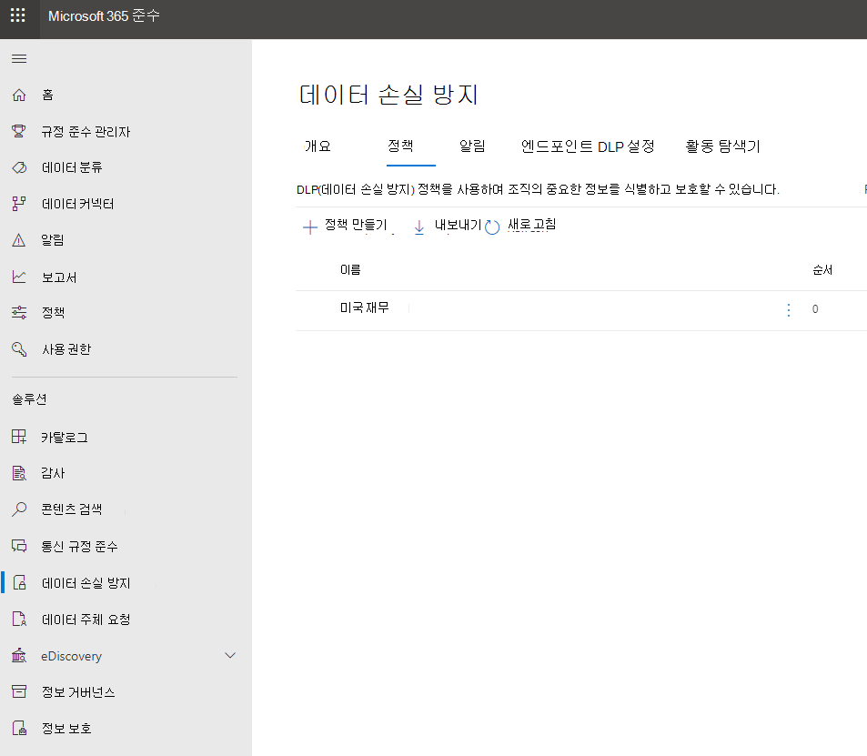

# DLP 정책에 대한 전자 메일 알림 보내기 및 정책 팁 표시Send email notifications and show policy tips for DLP policies

DLP(데이터 손실 방지) 정책을 사용하여 Office 365에서 중요한 정보를 식별, 모니터링 및 보호할 수 있습니다.You can use a data loss prevention (DLP) policy to identify, monitor, and protect sensitive information across Office 365. 이 중요한 정보로 작업하는 조직의 사람들이 DLP 정책을 준수하도록 하지만 불필요하게 작업을 완료하는 것을 차단하지는 않습니다.You want people in your organization who work with this sensitive information to stay compliant with your DLP policies, but you don't want to block them unnecessarily from getting their work done. 이러한 경우 전자 메일 알림과 정책 팁이 도움이 될 수 있습니다.This is where email notifications and policy tips can help.

정책 팁은 다른 사용자가 D Excel LP 정책과 충돌하는 콘텐츠로 작업할 때 나타나는 알림 또는 경고입니다. 예를 들어 PII(개인 식별 정보)를 포함하며 외부 사용자와 공유되는 비즈니스용 OneDrive 사이트의 비즈니스용 OneDrive 통합 문서와 같은 콘텐츠.A policy tip is a notification or warning that appears when someone is working with content that conflicts with a DLP policy—for example, content like an Excel workbook on a OneDrive for Business site that contains personally identifiable information (PII) and is shared with an external user.

전자 메일 알림 및 정책 팁을 사용하여 인식을 높이고 조직의 정책에 대해 교육할 수 있습니다.You can use email notifications and policy tips to increase awareness and help educate people about your organization's policies. 유효한 업무상 필요한 경우나 정책이 가짓 긍정을 감지하는 경우 차단되지 않을 수 있도록 정책을 다시 설정하는 옵션을 사용자들에게 제공 할 수도 있습니다.You can also give people the option to override the policy, so that they're not blocked if they have a valid business need or if the policy is detecting a false positive.

준수 센터에서 DLP 정책을 만들 때 다음에 대한 사용자 알림을 구성할 수 있습니다.In the Compliance Center, when you create a DLP policy, you can configure the user notifications to:

- 문제를 설명하는 전자 메일 알림을 선택한 사용자에 보내기Send an email notification to the people you choose that describes the issue.
> [!NOTE]
> 알림 전자 메일은 보호되지 않은 것으로 전송됩니다.Notification emails are sent unprotected.

- DLP 정책과 충돌하는 콘텐츠에 대한 정책 팁을 표시합니다.Display a policy tip for content that conflicts with the DLP policy:

  - 웹용 Outlook 및 Outlook 2013 이상에서 전자 메일의 경우 정책 팁은 메시지가 작성되는 동안 받는 사람 위에 있는 메시지의 맨 위에 표시됩니다.For email in Outlook on the web and Outlook 2013 and later, the policy tip appears at the top of a message above the recipients while the message is being composed.

  - 온라인 비즈니스용 OneDrive 또는 SharePoint 문서의 경우 정책 팁은 항목에 나타나는 경고 아이콘으로 표시됩니다.For documents in a OneDrive for Business account or SharePoint Online site, the policy tip is indicated by a warning icon that appears on the item. 자세한 내용을 확인하려면 항목을 선택한 다음  페이지의 오른쪽 위 모서리에 있는 정보 정보 창 아이콘을 선택하여 세부 정보 창을 열  있습니다.To view more information, you can select an item and then choose **Information**  in the upper-right corner of the page to open the details pane.

  - DLP 정책에 Excel 사이트 또는 SharePoint Online 사이트에 저장된 Excel, PowerPoint 및 Word 문서의 경우 정책 팁이 메시지 표시줄 및 Backstage 보기(파일 메뉴 \> **정보)에** 표시됩니다 비즈니스용 OneDrive.For Excel, PowerPoint, and Word documents that are stored on a OneDrive for Business site or SharePoint Online site that's included in the DLP policy, the policy tip appears on the Message Bar and the Backstage view (**File** menu \> **Info**).

## DLP 정책에 사용자 알림 추가Add user notifications to a DLP policy

DLP 정책을 만들 때 사용자 알림을 **사용하도록 설정할 수 있습니다.**When you create a DLP policy, you can enable **User notifications**. 사용자 알림을 사용하도록 설정하면 Microsoft 365 알림과 정책 팁이 모두 전송됩니다.When user notifications are enabled, Microsoft 365 sends out both email notifications and policy tips. 알림 전자 메일을 보낸 사용자, 전자 메일 텍스트 및 정책 팁 텍스트를 사용자 지정할 수 있습니다.You can customize who notification emails are sent to, the email text and the policy tip text.

1. [https://protection.office.com](https://protection.office.com)으로 이동합니다.Go to [https://protection.office.com](https://protection.office.com).

2. 회사 또는 학교 계정을 사용하여 로그인합니다.Sign in using your work or school account. 이제 보안 및 준수 &amp; 센터에 있습니다.You're now in the Security &amp; Compliance Center.

3. 보안 및 준수 &amp; 센터 왼쪽 탐색 데이터 손실 \> \> **방지** \> **정책** \> **+ 정책 만들기에서**.In the Security &amp; Compliance Center \> left navigation \> **Data loss prevention** \> **Policy** \> **+ Create a policy**.

    

4. 다음에 필요한 중요한 정보 유형을 보호하는 DLP 정책 템플릿을 \> **선택하십시오.**Choose the DLP policy template that protects the types of sensitive information that you need \> **Next**.

    빈 템플릿으로 시작하고 사용자 지정 **사용자** 지정 \> **정책 다음 을** \> **선택하십시오.**To start with an empty template, choose **Custom** \> **Custom policy** \> **Next**.

5. 정책 이름을 \> 다음으로 **지정합니다.**Name the policy \> **Next**.

6. DLP 정책이 보호할 위치를 선택하려는 경우 다음 중 하나를 사용합니다.To choose the locations that you want the DLP policy to protect, do one of the following:

   - 다음 **에서** 모든 위치를 \> **Office 365.**Choose **All locations in Office 365** \> **Next**.

   - Let **me choose specific locations Next(다음으로 특정 위치 선택)** \> **를 선택하세요.**Choose **Let me choose specific locations** \> **Next**.

   모든 Exchange 또는 모든 OneDrive 계정과 같은 전체 위치를 포함하거나 제외하기  위해 해당 위치의 상태를 켜거나 끄면 됩니다.To include or exclude an entire location such as all Exchange email or all OneDrive accounts, switch the **Status** of that location on or off.

   특정 SharePoint 또는 OneDrive 계정만 포함하려면 상태를 켜기로 전환한 다음 포함 아래의  링크를 클릭하여 특정 사이트 또는 계정을 선택하세요. To include only specific SharePoint sites or OneDrive accounts, switch the **Status** to on, and then click the links under **Include** to choose specific sites or accounts.

7. 고급 **설정 사용 다음** \> **을 선택합니다.**Choose **Use advanced settings** \> **Next**.

8. **+ 새 규칙** 을 선택합니다.Choose **+ New rule**.

9. 규칙 편집기에서 **사용자 알림에서** 상태를 으로 전환합니다.In the rule editor, under **User notifications**, switch the status on.

    

> [!NOTE]
> DLP 정책은 해당 문서가 새 문서이든 기존 문서이든 정책과 일치하는 모든 문서에 적용됩니다.DLP policies apply to all documents that match the policy, whether those documents are new or existing. 그러나 전자 메일 알림은 새 콘텐츠가 기존 DLP 정책과 일치하는 경우만 생성됩니다.However, an email notification is only generated when new content matches an existing DLP policy. 기존 콘텐츠는 보호되지만 전자 메일을 통해 사용자 알림을 생성하지는 않습니다.Existing content is protected, but will not generate a user notification via email.

## 전자 메일 알림을 구성하기 위한 옵션Options for configuring email notifications

DLP 정책의 각 규칙에 대해 다음 작업을 수행할 수 있습니다.For each rule in a DLP policy, you can:

- 선택한 사람에게 알림을 보냅니다. 이러한 사용자에는 콘텐츠의 소유자, 콘텐츠를 마지막으로 수정한 사람, 콘텐츠가 저장된 사이트의 소유자 또는 특정 사용자가 포함될 수 있습니다.Send the notification to the people you choose. These people can include the owner of the content, the person who last modified the content, the owner of the site where the content is stored, or a specific user.

- HTML 또는 토큰을 사용하여 알림에 포함된 텍스트를 사용자 지정합니다.Customize the text that's included in the notification by using HTML or tokens. 자세한 내용은 아래 섹션을 참조하세요.See the section below for more information.

> [!NOTE]
>  전자 메일 알림은 그룹이나 메일 그룹이 아닌 개별 받는 사람에게만 보낼 수 있습니다.Email notifications can be sent only to individual recipients—not groups or distribution lists. 새 콘텐츠만 전자 메일 알림을 트리거합니다.Only new content will trigger an email notification. 기존 콘텐츠를 편집하면 정책 팁이 트리거되지만 전자 메일 알림은 트리거되지 않습니다.Editing existing content will trigger policy tips, but not an email notification.

### 기본 전자 메일 알림Default email notification

알림에는 수행한 작업으로 시작되는 제목 줄(예: 전자 메일의 경우 &quot;알림&quot;, &quot;메시지 차단&quot; 또는 문서의 경우 &quot;액세스 차단")이 있습니다.Notifications have a Subject line that begins with the action taken, such as "Notification", "Message Blocked" for email, or "Access Blocked" for documents. 알림이 문서에 대한 알림인 경우 알림 메시지 본문에는 문서가 저장된 사이트로 연결하고 문서에 대한 정책 팁을 여는 링크가 포함되어 있으며, 이 링크를 통해 문제를 해결할 수 있습니다(정책 팁에 대한 내용은 아래 섹션 참조).If the notification is about a document, the notification message body includes a link that takes you to the site where the document's stored and opens the policy tip for the document, where you can resolve any issues (see the section below about policy tips). 알림이 메시지에 대한 경우 알림에는 DLP 정책과 일치하는 메시지의 첨부 파일로 포함됩니다.If the notification is about a message, the notification includes as an attachment the message that matches a DLP policy.

기본적으로 알림에는 사이트의 항목에 대해 다음과 비슷한 텍스트가 표시됩니다. 알림 텍스트는 각 규칙에 대해 별도로 구성되므로 일치하는 규칙에 따라 표시되는 텍스트가 달라집니다.By default, notifications display text similar to the following for an item on a site. The notification text is configured separately for each rule, so the text that's displayed differs depending on which rule is matched.

|**DLP 정책 규칙이 수행하는 작업...****If the DLP policy rule does this…**|**그런 다음 SharePoint 또는 비즈니스용 OneDrive 기본 알림에 다음이 표시됩니다.****Then the default notification for SharePoint or OneDrive for Business documents says this…**|**그런 다음 메시지의 기본 Outlook 다음 메시지가 표시됩니다.****Then the default notification for Outlook messages says this…**|
|:-----|:-----|:-----|
|알림을 보내지만 다시 설정은 허용하지 않습니다.Sends a notification but doesn't allow override    |이 항목이 조직의 정책과 충돌합니다.This item conflicts with a policy in your organization.    |전자 메일 메시지가 조직의 정책과 충돌합니다.Your email message conflicts with a policy in your organization.    |
|액세스를 차단하고, 알림을 보내고, 재정의를 허용합니다.Blocks access, sends a notification, and allows override    |이 항목이 조직의 정책과 충돌합니다.This item conflicts with a policy in your organization. 이 충돌을 해결하지 않으면 이 파일에 대한 액세스가 차단될 수 있습니다.If you don't resolve this conflict, access to this file might be blocked.    |전자 메일 메시지가 조직의 정책과 충돌합니다.Your email message conflicts with a policy in your organization. 메시지가 모든 받는 사람에게 배달되지는 않습니다.The message wasn't delivered to all recipients.    |
|액세스를 차단하고 알림을 보냅니다.Blocks access and sends a notification    |이 항목이 조직의 정책과 충돌합니다. 소유자, 마지막 수정자 및 주 사이트 모음 관리자를 제외한 모든 사람의 이 항목 액세스가 차단됩니다.This item conflicts with a policy in your organization. Access to this item is blocked for everyone except its owner, last modifier, and the primary site collection administrator.    |전자 메일 메시지가 조직의 정책과 충돌합니다.Your email message conflicts with a policy in your organization. 메시지가 모든 받는 사람에게 배달되지는 않습니다.The message wasn't delivered to all recipients.    |

### 사용자 지정 전자 메일 알림Custom email notification

최종 사용자 또는 관리자에게 기본 전자 메일 알림을 보내는 대신 사용자 지정 전자 메일 알림을 만들 수 있습니다.You can create a custom email notification instead of sending the default email notification to your end users or admins. 사용자 지정 전자 메일 알림은 HTML을 지원하며 5,000자 제한이 있습니다.The custom email notification supports HTML and has a 5,000-character limit. HTML을 사용하여 알림에 이미지, 서식 및 기타 브랜드를 포함할 수 있습니다.You can use HTML to include images, formatting, and other branding in the notification.

다음 토큰을 사용하여 전자 메일 알림을 사용자 지정할 수도 있습니다.You can also use the following tokens to help customize the email notification. 이러한 토큰은 전송되는 알림의 특정 정보로 대체되는 변수입니다.These tokens are variables that are replaced by specific information in the notification that's sent.

|**토큰****Token**|**설명****Description**|
|:-----|:-----|
|%%AppliedActions%%%%AppliedActions%%    |콘텐츠에 적용된 작업입니다.The actions applied to the content.    |
|%%ContentURL%%%%ContentURL%%    |SharePoint 온라인 사이트 또는 비즈니스용 OneDrive URL입니다.The URL of the document on the SharePoint Online site or OneDrive for Business site.    |
|%%MatchedConditions%%%%MatchedConditions%%    |콘텐츠와 일치하는 조건입니다.The conditions that were matched by the content. 이 토큰을 사용하여 콘텐츠에 대한 가능한 문제를 알릴 수 있습니다.Use this token to inform people of possible issues with the content.    |

## 정책 팁 구성 옵션Options for configuring policy tips

DLP 정책의 각 규칙에 대해 다음을 수행하도록 정책을 구성할 수 있습니다.For each rule in a DLP policy, you can configure policy tips to:

- 콘텐츠가 DLP 정책과 충돌한다는 사실을 사용자에게 알려 충돌 해결을 위한 조치를 수행할 수 있도록 합니다.Simply notify the person that the content conflicts with a DLP policy, so that they can take action to resolve the conflict. 기본 텍스트(아래 표 참조)를 사용하거나 조직의 특정 정책에 대한 사용자 지정 텍스트를 입력할 수 있습니다.You can use the default text (see the tables below) or enter custom text about your organization's specific policies.

- DLP 정책을 재정의할 수 있도록 허용합니다. 필요에 따라 다음을 수행할 수 있습니다.Allow the person to override the DLP policy. Optionally, you can:

  - 사용자에게 정책을 재정의하기 위한 업무 정당성을 입력하도록 요구합니다.Require the person to enter a business justification for overriding the policy. 이 정보는 기록되어 있으며 보안 및 준수 센터의  보고서 섹션에 있는 DLP 보고서에서 볼 &amp; 수 있습니다.This information is logged and you can view it in the DLP reports in the **Reports** section of the Security &amp; Compliance Center.

  - 가양성을 보고하고 DLP 정책을 재정의할 수 있도록 허용합니다. 이 정보 또한 보고를 위해 기록되므로 가양성을 사용하여 규칙을 미세 조정할 수 있습니다.Allow the person to report a false positive and override the DLP policy. This information is also logged for reporting, so that you can use false positives to fine tune your rules.

예를 들어 PII(개인 식별 정보)를 검색하는 비즈니스용 OneDrive 사이트에 DLP 정책을 적용할 수 있으며 이 정책에는 다음 세 가지 규칙이 있습니다.For example, you may have a DLP policy applied to OneDrive for Business sites that detects personally identifiable information (PII), and this policy has three rules:

1. 첫 번째 규칙: 문서에서 이 중요한 정보의 인스턴스가 5개 미만으로 검색되었으며 문서가 조직 내부의 사용자와 공유될 경우 **알림 보내기** 작업이 정책 팁을 표시합니다. 이 규칙은 단순히 사용자에게 알리고 액세스를 차단하지는 않으므로 정책 팁에 대해 재정의 옵션은 필요하지 않습니다.First rule: If fewer than five instances of this sensitive information are detected in a document, and the document is shared with people inside the organization, the **Send a notification** action displays a policy tip. For policy tips, no override options are necessary because this rule is simply notifying people and not blocking access.

2. 두 번째 규칙: 문서에서 이 중요한 정보의 인스턴스가 6개 이상으로 검색되었으며 문서가 조직 내부의 사용자와 공유될 경우 **콘텐츠에 대한 액세스 차단** 작업은 파일에 대한 사용 권한을 제한하고, **알림 보내기** 작업은 사용자가 업무 정당성을 제공하여 이 규칙의 작업을 재정의할 수 있도록 합니다.Second rule: If greater than five instances of this sensitive information are detected in a document, and the document is shared with people inside the organization, the **Block access to content** action restricts the permissions for the file, and the **Send a notification** action allows people to override the actions in this rule by providing a business justification. 조직의 비즈니스에서 내부 사람이 PII 데이터를 공유해야 하는 경우도 있으며 DLP 정책이 이 작업을 차단하지 못하게 하려는 경우도 있습니다.Your organization's business sometimes requires internal people to share PII data, and you don't want your DLP policy to block this work.

3. 세 번째 규칙: 문서에서 이 중요한 정보의 인스턴스가 6개 이상으로 검색되었으며 문서가 조직 외부의 사용자와 공유될 경우 **콘텐츠에 대한 액세스 차단** 작업은 파일에 대한 사용 권한을 제한하고, 이 정보가 외부로 공유될 수 있으므로 **알림 보내기** 작업은 사용자가 이 규칙의 작업을 재정의할 수 없도록 합니다. 어떠한 경우에도 조직의 사용자가 PII 데이터를 조직 외부와 공유하도록 허용하면 안 됩니다.Third rule: If greater than five instances of this sensitive information are detected in a document, and the document is shared with people outside the organization, the **Block access to content** action restricts the permissions for the file, and the **Send a notification** action does not allow people to override the actions in this rule because the information is shared externally. Under no circumstances should people in your organization be allowed to share PII data outside the organization.

다음을 통해 정책 팁을 사용하여 규칙을 재정의하는 방법을 보다 잘 이해할 수 있습니다.Here are some fine points to understand about using a policy tip to override a rule:

- 이 옵션은 규칙에 따라 수행하며, 은(는) 규칙의 모든 작업을 어버린 것입니다(알림 보내기 제외).The option to override is per rule, and it overrides all of the actions in the rule (except sending a notification, which can't be overridden).

- 콘텐츠가 DLP 정책의 여러 규칙과 일치할 수 있지만 가장 제한적인 가장 높은 우선 순위 규칙의 정책 팁만 표시됩니다.It's possible for content to match several rules in a DLP policy, but only the policy tip from the most restrictive, highest-priority rule will be shown. 예를 들어 알림을 콘텐츠 액세스를 차단하는 규칙의 정책 팁은 단순히 알림을 보내는 규칙의 정책 팁보다 우선적으로 표시됩니다.For example, a policy tip from a rule that blocks access to content will be shown over a policy tip from a rule that simply sends a notification. 따라서 정책 팁이 단계별로 표시되지는 않습니다.This prevents people from seeing a cascade of policy tips.

- 가장 제한적인 규칙의 정책 팁이 사용자의 규칙 재정의를 허용할 경우 이 규칙을 재정의하면 해당 콘텐츠가 일치하는 다른 모든 규칙이 함께 재정의됩니다.If the policy tips in the most restrictive rule allow people to override the rule, then overriding this rule also overrides any other rules that the content matched.

## 비즈니스용 OneDrive 사이트 및 SharePoint Online 사이트에 대한 정책 팁Policy tips on OneDrive for Business sites and SharePoint Online sites

비즈니스용 OneDrive 또는 SharePoint Online 사이트의 문서가 DLP 정책의 규칙과 일치하고 해당 규칙이 정책 팁을 사용하는 경우 정책 팁은 문서에 특수 아이콘을 표시합니다.When a document on a OneDrive for Business site or SharePoint Online site matches a rule in a DLP policy, and that rule uses policy tips, the policy tips display special icons on the document:

1. 규칙이 파일에 대한 알림을 보내는 경우 경고 아이콘이 표시됩니다.If the rule sends a notification about the file, the warning icon appears.

2. 규칙이 문서 액세스를 차단하는 경우 차단됨 아이콘이 나타납니다.If the rule blocks access to the document, the blocked icon appears.

   

문서에 대한 작업을 수행하려면 페이지의 오른쪽 위 모서리에 있는 정보 정보 창 아이콘을 선택하여 세부 정보 창 보기 정책 팁 을 열 수 \>   \> **있습니다.**To take action on a document, you can select an item \> choose **Information**  in the upper-right corner of the page to open the details pane \> **View policy tip**.

정책 팁에 콘텐츠에 대한 문제가 표시되고, 정책 팁이 이러한 옵션을 사용하여 구성되어 있으면 정책 팁 **해결**, **재정의** 를 선택하거나 가양성 **보고** 를 선택할 수 있습니다.The policy tip lists the issues with the content, and if the policy tips are configured with these options, you can choose **Resolve**, and then **Override** the policy tip or **Report** a false positive.

DLP 정책은 사이트와 동기화되고 정책을 기준으로 콘텐츠가 주기적으로 비동기적으로 평가되므로 DLP 정책을 만들고 빠른 시간 내에 정책 팁이 제공될 수 있습니다. 마찬가지로 정책 팁을 해결하거나 재정의한 다음 얼마 되지 않아 사이트에 있는 문서에서 해당 아이콘이 없어집니다.DLP policies are synced to sites and contented is evaluated against them periodically and asynchronously, so there may be a short delay between the time you create the DLP policy and the time you begin to see policy tips. There may be a similar delay from when you resolve or override a policy tip to when the icon on the document on the site goes away.

### 사이트의 정책 팁 기본 텍스트Default text for policy tips on sites

기본적으로 정책 팁에는 사이트의 항목에 대해 다음과 비슷한 텍스트가 표시됩니다. 알림 텍스트는 각 규칙에 대해 별도로 구성되므로 일치하는 규칙에 따라 표시되는 텍스트가 달라집니다.By default, policy tips display text similar to the following for an item on a site. The notification text is configured separately for each rule, so the text that's displayed differs depending on which rule is matched.

|**DLP 정책 규칙이 수행하는 작업...****If the DLP policy rule does this…**|**기본 정책 팁에 표시되는 내용...****Then the default policy tip says this…**|
|:-----|:-----|
|알림을 보내지만 다시 설정은 허용하지 않습니다.Sends a notification but doesn't allow override    |이 항목이 조직의 정책과 충돌합니다.This item conflicts with a policy in your organization.    |
|액세스를 차단하고, 알림을 보내고, 재정의를 허용합니다.Blocks access, sends a notification, and allows override    |이 항목이 조직의 정책과 충돌합니다.This item conflicts with a policy in your organization. 이 충돌을 해결하지 않으면 이 파일에 대한 액세스가 차단될 수 있습니다.If you don't resolve this conflict, access to this file might be blocked.    |
|액세스를 차단하고 알림을 보냅니다.Blocks access and sends a notification    |이 항목이 조직의 정책과 충돌합니다. 소유자, 마지막 수정자 및 주 사이트 모음 관리자를 제외한 모든 사람의 이 항목 액세스가 차단됩니다.This item conflicts with a policy in your organization. Access to this item is blocked for everyone except its owner, last modifier, and the primary site collection administrator.    |

### 사이트의 정책 팁에 대한 사용자 지정 텍스트Custom text for policy tips on sites

정책 팁에 대한 텍스트를 전자 메일 알림과 별도로 사용자 지정할 수 있습니다.You can customize the text for policy tips separately from the email notification. 전자 메일 알림에 대한 사용자 지정 텍스트(위 섹션 참조)와 달리 정책 팁에 대한 사용자 지정 텍스트는 HTML 또는 토큰을 허용하지 않습니다.Unlike custom text for email notifications (see above section), custom text for policy tips does not accept HTML or tokens. 대신 정책 팁에 대한 사용자 지정 텍스트는 256자 제한이 있는 일반 텍스트입니다.Instead, custom text for policy tips is plain text only with a 256-character limit.

## 2013 이상 웹용 Outlook 및 Outlook 정책 팁Policy tips in Outlook on the web and Outlook 2013 and later

웹용 Outlook 및 Outlook 2013 이상에서 새 전자 메일을 작성하면 DLP 정책의 규칙과 일치하는 콘텐츠를 추가하고 해당 규칙에서 정책 팁을 사용하는 경우 정책 팁이 표시될 수 있습니다.When you compose a new email in Outlook on the web and Outlook 2013 and later, you'll see a policy tip if you add content that matches a rule in a DLP policy, and that rule uses policy tips. 정책 팁은 메시지가 작성되는 동안 메시지 위쪽의 받는 사람 위에 표시됩니다.The policy tip appears at the top of the message, above the recipients, while the message is being composed.

정책 팁은 메시지 본문, 제목 줄 또는 메시지 첨부 파일에 중요한 정보가 표시되는지 여부에 따라 작동됩니다.Policy tips work whether the sensitive information appears in the message body, subject line, or even a message attachment as shown here.

정책 팁이 다시 적용을 허용하도록 구성된 경우  자세한 정보 다시 적용 표시를 선택하고 비즈니스 사정을 입력하거나 가짓 긍정 다시 적용을 보고할 \>  \> 수 \> **있습니다.**If the policy tips are configured to allow override, you can choose **Show Details** \> **Override** \> enter a business justification or report a false positive \> **Override**.

전자 메일에 중요한 정보를 추가할 때 중요한 정보가 추가되는 시간과 정책 팁이 표시될 때 사이에 대기 시간이 있을 수 있습니다.Note that when you add sensitive information to an email, there may be latency between when the sensitive information is added and when the policy tip appears.

### Outlook 2013 이상에서는 일부 조건에 대한 정책 팁 표시 지원Outlook 2013 and later supports showing policy tips for only some conditions

현재 Outlook 2013 이상에서는 다음 조건에 대한 정책 팁만 표시하는 것이 지원됩니다.Currently, Outlook 2013 and later supports showing policy tips only for these conditions:

- 콘텐츠 포함Content contains
- 콘텐츠 공유Content is shared

예외는 조건으로 간주되어 있으며 이러한 모든 조건은 콘텐츠와 일치하고 Outlook 보호 작업을 적용할 수 있습니다.Note that Exceptions are considered conditions and all of these conditions work in Outlook, where they will match content and enforce protective actions on content. 그러나 사용자에게 정책 팁을 표시하는 것은 아직 지원되지 않습니다.But showing policy tips to users is not yet supported.

### 보안 및 준수 Exchange 정책 팁 &amp;Policy tips in the Exchange admin center vs. the Security &amp; Compliance Center

정책 팁은 Exchange 관리 센터에서 만든 DLP 정책 및 메일 흐름 규칙 또는 보안 및 준수 센터에서 만든 DLP 정책을 사용할 수 있지만 둘 다 사용할 &amp; 수 없습니다.Policy tips can work either with DLP policies and mail flow rules created in the Exchange admin center, or with DLP policies created in the Security &amp; Compliance Center, but not both. 이러한 정책은 서로 다른 위치에 저장되지만 정책 팁은 단일 위치에서만 그릴 수 있기 때문에입니다.This is because these policies are stored in different locations, but policy tips can draw only from a single location.

Exchange 관리 센터에서 정책 팁을 구성한 경우 웹용 Outlook 및 Outlook 2013 이상에서 구성한 정책 팁은 Exchange 관리 센터에서 팁을 끄기 전까지는 웹용 Outlook 및 Outlook 2013 이상의 사용자에게 나타나지 &amp; 않습니다.If you've configured policy tips in the Exchange admin center, any policy tips that you configure in the Security &amp; Compliance Center won't appear to users in Outlook on the web and Outlook 2013 and later until you turn off the tips in the Exchange admin center. 이렇게 하면 보안 준수 Exchange 전환할 때까지 현재 메일 흐름 규칙(전송 규칙)이 계속 &amp; 작동하게 됩니다.This ensures that your current Exchange mail flow rules (also known as transport rules) will continue to work until you choose to switch over to the Security &amp; Compliance Center.

정책 팁은 단일 위치에서만 그릴 수 있는 반면, 보안 및 준수 센터와 Exchange 관리 센터 둘 다에서 DLP 정책을 사용하는 경우에도 전자 메일 알림이 항상 &amp; 전송됩니다.Note that while policy tips can draw only from a single location, email notifications are always sent, even if you're using DLP policies in both the Security &amp; Compliance Center and the Exchange admin center.

### 전자 메일의 정책 팁에 대한 기본 텍스트Default text for policy tips in email

기본적으로 정책 팁에는 전자 메일에 대해 다음과 비슷한 텍스트가 표시됩니다.By default, policy tips display text similar to the following for email.

|**DLP 정책 규칙이 수행하는 작업...****If the DLP policy rule does this…**|**기본 정책 팁에 표시되는 내용...****Then the default policy tip says this…**|
|:-----|:-----|
|알림을 보내지만 다시 설정은 허용하지 않습니다.Sends a notification but doesn't allow override    |전자 메일이 조직의 정책과 충돌합니다.Your email conflicts with a policy in your organization.    |
|액세스를 차단하고, 알림을 보내고, 재정의를 허용합니다.Blocks access, sends a notification, and allows override    |전자 메일이 조직의 정책과 충돌합니다.Your email conflicts with a policy in your organization.    |
|액세스를 차단하고 알림을 보냅니다.Blocks access and sends a notification    |전자 메일이 조직의 정책과 충돌합니다.Your email conflicts with a policy in your organization.    |

## Excel, PowerPoint 및 Word의 정책 팁Policy tips in Excel, PowerPoint, and Word

사용자가 데스크톱 버전의 Excel, PowerPoint 및 Word에서 중요한 콘텐츠로 작업하는 경우 정책 팁은 콘텐츠가 DLP 정책과 충돌하는 경우 실시간으로 알릴 수 있습니다.When people work with sensitive content in the desktop versions of Excel, PowerPoint, and Word, policy tips can notify them in real time that the content conflicts with a DLP policy. 이를 위해 다음이 필요합니다.This requires that:

- Office 문서가 비즈니스용 OneDrive 사이트 또는 SharePoint Online 사이트에 저장되어 있어야 합니다.The Office document is stored on a OneDrive for Business site or SharePoint Online site.

- 사이트는 정책 팁을 사용하도록 구성된 DLP 정책에 포함됩니다.The site is included in a DLP policy that's configured to use policy tips.

Office 데스크톱 프로그램에서 직접 DLP 정책을 Office 365 동기화한 다음 문서를 검사하여 DLP 정책과 충돌하지 않고 실시간으로 정책 팁을 표시합니다.Office desktop programs automatically sync DLP policies directly from Office 365, and then scan your documents to ensure that they don't conflict with your DLP policies and display policy tips in real time.

> [!NOTE]
> Office 데스크톱 앱에서 직접 문서를 검사하여 DLP 정책 팁을 표시해야 하는지 여부를 판단합니다. 온라인 사이트 또는 SharePoint 파일에 표시해야 비즈니스용 OneDrive 정책 팁은 표시하지 않습니다.Office desktop apps scan documents themselves to determine if DLP policy tips should be shown; they do not show policy tips that SharePoint Online sites or OneDrive for Business sites have already determined should be shown on a file. 따라서 데스크톱 앱에서 SharePoint Online 사이트 또는 비즈니스용 OneDrive DLP 정책 팁이 항상 비즈니스용 OneDrive 있습니다.As a result, you may not always see a DLP policy tip in the desktop apps that you see in the SharePoint Online sites or OneDrive for Business sites. 반면에 웹 Office 응용 프로그램에는 온라인 사이트 또는 SharePoint 사이트가 비즈니스용 OneDrive DLP 정책 팁만 표시됩니다.In contrast, the Office applications on the web only show DLP policy tips that SharePoint Online sites or OneDrive for Business sites have already determined should be shown.

DLP 정책에서 정책 팁을 구성한 방식에 따라, 사용자들은 간단히 정책 팁을 무시하거나, 업무 정당성을 지정하거나 지정하지 않은 상태로 정책을 재정의하거나, 가양성을 보고하도록 선택할 수 있습니다.Depending on how you configure the policy tips in the DLP policy, people can choose to simply ignore the policy tip, override the policy with or without a business justification, or report a false positive.

메시지 표시줄에 정책 팁이 표시됩니다.Policy tips appear on the Message Bar.

또한 Backstage 보기에도 정책 팁이 나타납니다(**파일** 탭).And policy tips also appear in the Backstage view (on the **File** tab).

DLP 정책의 정책 팁이 이러한 옵션으로 구성되어 있는 경우 정책 팁 **해결** 또는 **재정의** 를 선택하거나 가양성 **보고** 를 선택할 수 있습니다.If policy tips in the DLP policy are configured with these options, you can choose **Resolve** to **Override** a policy tip or **Report** a false positive.

이러한 각 데스크톱 Office 정책 팁을 해제할 수 있습니다.In each of these Office desktop programs, people can choose to turn off policy tips. 정책 팁을 끄면, 단순히 알림에 불과한 정책 팁은 메시지 표시줄 또는 Backstage 보기에 표시되지 것입니다(**파일** 탭).If turned off, policy tips that are simple notifications will not appear on the Message Bar or Backstage view (on the **File** tab). 그러나 차단 및 재정의에 대한 정책 팁은 계속 표시되고, 해당 사용자는 전자 메일 알림을 받게 됩니다.However, policy tips about blocking and overriding will still appear, and they will still receive the email notification. 또한 정책 팁을 꺼도 문서에 적용된 모든 DLP 정책에서 해당 문서가 제외되지 않습니다.In addition, turning off policy tips does not exempt the document from any DLP policies that have been applied to it.

### Excel 2016, PowerPoint 2016 및 Word 2016 정책 팁에 대한 기본 텍스트Default text for policy tips in Excel 2016, PowerPoint 2016, and Word 2016

기본적으로 열린 문서의 메시지 표시줄 및 Backstage 보기에 다음과 비슷한 텍스트가 정책 팁으로 표시됩니다. 알림 텍스트는 각 규칙에 대해 별도로 구성되므로 일치하는 규칙에 따라 표시되는 텍스트가 달라집니다.By default, policy tips display text similar to the following on the Message Bar and Backstage view of an open document. The notification text is configured separately for each rule, so the text that's displayed differs depending on which rule is matched.

|**DLP 정책 규칙이 수행하는 작업...****If the DLP policy rule does this…**|**기본 정책 팁에 표시되는 내용...****Then the default policy tip says this…**|
|:-----|:-----|
|알림을 보내지만 다시 설정은 허용하지 않습니다.Sends a notification but doesn't allow override    |이 파일이 조직의 정책과 충돌합니다.This file conflicts with a policy in your organization. 자세한 내용은 **파일 메뉴로** 이동하세요.Go to the **File** menu for more information.    |
|액세스를 차단하고, 알림을 보내고, 재정의를 허용합니다.Blocks access, sends a notification, and allows override    |이 파일이 조직의 정책과 충돌합니다.This file conflicts with a policy in your organization. 이 충돌을 해결하지 않으면 이 파일에 대한 액세스가 차단될 수 있습니다.If you don't resolve this conflict, access to this file might be blocked. 자세한 내용은 **파일 메뉴로** 이동하세요.Go to the **File** menu for more information.    |
|액세스를 차단하고 알림을 보냅니다.Blocks access and sends a notification    |이 파일이 조직의 정책과 충돌합니다.This file conflicts with a policy in your organization. 이 충돌을 해결하지 않으면 이 파일에 대한 액세스가 차단될 수 있습니다.If you don't resolve this conflict, access to this file might be blocked. 자세한 내용은 **파일 메뉴로** 이동하세요.Go to the **File** menu for more information.    |

### 정책 팁에 대한 사용자 지정 Excel, PowerPoint 및 WordCustom text for policy tips in Excel, PowerPoint, and Word

정책 팁에 대한 텍스트를 전자 메일 알림과 별도로 사용자 지정할 수 있습니다.You can customize the text for policy tips separately from the email notification. 전자 메일 알림에 대한 사용자 지정 텍스트(위 섹션 참조)와 달리 정책 팁에 대한 사용자 지정 텍스트는 HTML 또는 토큰을 허용하지 않습니다.Unlike custom text for email notifications (see above section), custom text for policy tips does not accept HTML or tokens. 대신 정책 팁에 대한 사용자 지정 텍스트는 256자 제한이 있는 일반 텍스트입니다.Instead, custom text for policy tips is plain text only with a 256-character limit.

## 추가 정보More information

- [데이터 손실 방지에 대해 알아보기Learn about data loss prevention](dlp-learn-about-dlp.md)
- [템플릿으로부터 DLP 정책 생성Create a DLP policy from a template](create-a-dlp-policy-from-a-template.md)
- [DLP 정책 조건, 예외 및 작업(미리 보기)DLP policy conditions, exceptions, and actions (preview)](./dlp-microsoft-teams.md)
- [FCI 또는 기타 속성을 갖는 문서를 보호하는 DLP 정책 만들기Create a DLP policy to protect documents with FCI or other properties](protect-documents-that-have-fci-or-other-properties.md)
- [DLP 정책 템플릿에 포함되는 내용What the DLP policy templates include](what-the-dlp-policy-templates-include.md)
- [중요한 정보 유형 엔터티 정의Sensitive information type entity definitions](sensitive-information-type-entity-definitions.md)