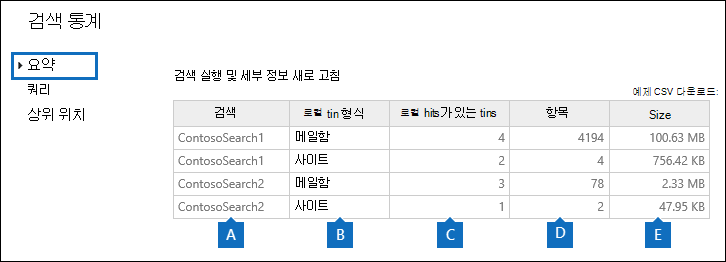

# 콘텐츠 검색 결과에 대한 키워드 통계 보기View keyword statistics for Content Search results

콘텐츠 검색을 만들고 실행한 후 예상 검색 결과에 대한 통계를 볼 수 있습니다.After you create and run a Content Search, you can view statistics about the estimated search results. 여기에는 검색 결과 요약(세부 정보 창에 표시되는 예상 검색 결과 요약), 검색 쿼리와 일치하는 항목이 있는 콘텐츠 위치 수 등의 쿼리 통계, 일치하는 항목이 가장 일치하는 콘텐츠 위치의 이름이 포함됩니다.This includes a summary of the search results (similar to the summary of the estimated search results displayed in the details pane), the query statistics such as the number of content locations with items that match the search query, and the name of content locations that have the most matching items. 하나 이상의 콘텐츠 검색에 대한 통계를 표시할 수 있습니다.You can display statistics for one or more content searches. 이렇게 하면 여러 검색에 대한 결과를 빠르게 비교하고 검색 쿼리의 효율성에 대한 의사 결정을 내릴 수 있습니다.This lets you to quickly compare the results for multiple searches and make decisions about the effectiveness of your search queries.
  
또한 검색 쿼리에서 각 키워드에 대한 통계를 반환하도록 새 검색과 기존 검색을 구성할 수 있습니다.Additionally, you can configure new and existing searches to return statistics for each keyword in a search query. 이렇게 하면 쿼리의 각 키워드에 대한 결과 수를 비교하고 여러 검색의 키워드 통계를 비교할 수 있습니다.This lets you compare the number of results for each keyword in a query and to compare the keyword statistics from multiple searches.
  
또한 검색 통계 및 키워드 통계를 CSV 파일로 다운로드할 수 있습니다.You can also download the search statistics and keyword statistics to a CSV file. 이를 통해 Excel의 필터링 및 정렬 기능을 사용하여 결과를 비교하고 검색 결과에 대한 보고서를 준비할 수 있습니다.This lets you use the filtering and sorting features in Excel to compare results, and prepare reports for your search results.
  
## 콘텐츠 검색에 대한 통계를 얻습니다.Get statistics for Content Searches

콘텐츠 검색에 대한 통계를 표시하는 경우:To display statistics for Content searches:
  
1. Microsoft 365 규정 준수 센터에서 모든 콘텐츠 검색   >  **표시로 이동하세요.**In the Microsoft 365 compliance center, go to **Show all** > **Content search**.

2. 검색 목록에서 두 개 이상의 검색을 선택한 다음  대량 작업  플라이아웃 페이지에서 검색 통계를 클릭합니다.In the list of searches, select two or more searches, and then click **Search statistics** on the **Bulk actions** flyout page.
    
    
  
3. 검색 **통계 페이지에서** 다음 링크 중 하나를 클릭하여 선택한 검색에 대한 통계를 표시합니다.On the **Search statistics** page, click one of the following links to display statistics about the selected searches. 
    
    **요약****Summary**
    
    이 페이지에는 콘텐츠 검색 페이지의 세부 정보 창에 표시되는 통계와 유사한 **통계가** 표시됩니다.This page displays statistics similar to the ones displayed in the details pane on the **Content search** page. 선택한 모든 검색에 대한 통계가 표시됩니다.Statistics for all selected searches are displayed. 이 페이지에서 선택한 검색을 다시 실행하여 통계를 업데이트할 수도 있습니다.Note that you can also re-run the selected searches from this page to update the statistics. 
    
    
  
    a.a.  콘텐츠 검색의 이름입니다.The name of the Content Search. 앞서 설명한 것 처럼 여러 검색에 대한 통계를 표시하고 비교할 수 있습니다.As previously stated, you can display and compare statistics for multiple searches.
    
    b.b. 검색된 콘텐츠 위치의 유형입니다.The type of content location that was searched. 각 행에는 지정된 검색의 사서함, 사이트 및 공용 폴더에 대한 통계가 표시됩니다.Each row displays statistics for mailboxes, sites, and public folders from the specified search.
    
    c.c. 검색 쿼리와 일치하는 항목이 포함된 콘텐츠 위치 수입니다.The number of content locations containing items that match the search query. 사서함의 경우 이 통계에는 검색 쿼리와 일치하는 항목이 포함된 보관 사서함의 수도 포함됩니다.For mailboxes, this statistic also includes the number of archive mailboxes that contain items that match the search query.
    
    d.d. 검색 쿼리와 일치하는 지정된 모든 콘텐츠 위치의 총 항목 수입니다.The total number of items of all specified content locations that match the search query. 항목 유형의 예로는 전자 메일 메시지, 일정 항목 및 문서가 있습니다.Examples of item types include email messages, calendar items, and documents. 항목에 검색되는 키워드 인스턴스가 여러 개 포함된 경우 총 항목 수에서 한 번만 계산됩니다.If an item contains multiple instances of a keyword that is being searched for, it's only counted once in the total number of items. 예를 들어 단어 "stock" 또는 "fraud"를 검색하고 전자 메일 메시지에 단어 "stock"의 세 인스턴스가 포함된 경우 항목 열에서 한 번만 **계산됩니다.**For example, if you're searching for words "stock" or "fraud" and an email message contains three instances of the word "stock", it's only counted once in the **Items** column. 
    
    e.e. 검색 쿼리와 일치하는 지정된 콘텐츠 위치에 있는 모든 항목의 총 크기입니다.The total size of all items that were found in the specified content location that match the search query. 
    
    **쿼리****Queries**
    
    이 페이지에는 검색 쿼리에 대한 통계가 표시됩니다.This page displays statistics about the search query.
    
    
  
    a.a. 행에 쿼리 통계가 포함된 콘텐츠 검색의 이름입니다.The name of the Content Search that the row contains query statistics for.
    
    b.b. 쿼리 통계를 적용할 수 있는 콘텐츠 위치의 유형입니다.The type of content location that the query statistics are applicable to.
    
    c.c. 이 열은 통계를 적용할 수 있는 검색 쿼리 부분을 나타냅니다.This column indicates which part of the search query the statistics are applicable to. **기본은** 전체 검색 쿼리를 나타냅니다.**Primary** indicates the entire search query. 검색 쿼리를 만들거나 편집할 때 키워드 목록을 사용하는 경우 쿼리의 각 구성 요소에 대한 통계가 이 표에 포함됩니다.If you use a keyword list when you create or edit a search query, statistics for each component of the query are included in this table. 자세한 내용은 이 [문서의](#get-keyword-statistics-for-content-searches) 콘텐츠 검색에 대한 키워드 통계 보기 섹션을 참조하세요.See the [Get keyword statistics for Content Searches](#get-keyword-statistics-for-content-searches) section in this article for more information. 
    
    d.d. 이 열에는 콘텐츠 검색 도구에서 실행되는 실제 검색 쿼리가 포함되어 있습니다.This column contains the actual search query that run by the Content Search tool. 이 도구는 만드는 쿼리에 몇 가지 구성 요소를 자동으로 추가합니다.Note that the tool automatically adds a few additional components to the query that you create. 

    - 키워드를 지정하지 않으면서 사서함의 모든 콘텐츠를 검색할 때 모든 항목이 반환될 수 있도록 실제 키 단어  `size>=0` 쿼리가 수행됩니다.When you search for all content in mailboxes (by not specifying any keywords), the actual key word query is  `size>=0` so that all items are returned. 
    
     - SharePoint Online 및 비즈니스용 OneDrive 사이트를 검색하면 다음 두 구성 요소가 추가됩니다.When you search SharePoint Online and OneDrive for Business sites, the two following components are added:
    
          **NOT IsExternalContent:1** - On-premises SharePoint 조직에서 콘텐츠를 제외합니다.**NOT IsExternalContent:1** - Excludes any content from an on-premises SharePoint organization. 
    
          **NOT IsOneNotePage:1** - 검색 쿼리와 일치하는 모든 문서의 복제본이기 때문에 모든 OneNote 파일을 제외합니다.**NOT IsOneNotePage:1** - Excludes all OneNote files because these would be duplicates of any document that matches the search query. 

    
    e.e. 쿼리 열에 나열된 검색 쿼리와 일치하는 항목이 포함된 콘텐츠 위치의 번호(\*\* 위치 유형 \*\* 열로 **지정)입니다.**The number of the content locations (specified by the \*\* Location type \*\* column) that contain items that match the search query listed in the **Query** column. 
    
    f.f. 쿼리 열에 나열된 검색 쿼리와 일치하는 지정된 콘텐츠 위치의 항목 **수입니다.**The number of items (from the specified content location) that match the search query listed in the **Query** column. 앞서 설명한 것 처럼 항목에 검색되는 키워드의 인스턴스가 여러 개 포함된 경우 이 열에서는 한 번만 계산됩니다.As previously explained, if an item contains multiple instances of a keyword that is being searched for, it's only counted once in the this column. 
    
    g.g. 지정된 콘텐츠 위치에 있는 쿼리 열의 검색 쿼리와 일치하는 모든 항목의 총 **크기입니다.**The total size of all items that were found (in the specified content location) that match the search query in the **Query** column. 
    
    **상위 위치****Top locations**
    
    이 페이지에는 검색된 각 콘텐츠 위치의 검색 쿼리와 일치하는 항목 수에 대한 통계가 표시됩니다.This page displays statistics about the number of items that match the search query in each content location that was searched. 주요 위치 1,000개가 표시됩니다.The top 1,000 locations are displayed. 여러 검색에 대한 통계를 보는 경우 각 검색에 대한 상위 1,000개 위치가 표시됩니다.If you view statistics for multiple searches, the top 1,000 locations for each search are displayed. 콘텐츠 위치는 검색 쿼리와 일치하는 항목이 없는 경우 이 페이지에 포함되지 않습니다.Note that a content location isn't included on this page if it doesn't contain any items that match the search query.
    
    
  
    a.a. 콘텐츠 위치의 이름입니다.The name of the content location.
    
    b.b. 위치 통계를 적용할 수 있는 콘텐츠 위치의 유형입니다.The type of content location that the location statistics are applicable to.
    
    c.c. 통계를 표시하는 각 검색에 대한 열이 있습니다.There are columns for each search that you're displaying statistics for. 이 열에는 각 콘텐츠 위치의 검색 쿼리와 일치하는 항목의 수 및 총 크기가 표시됩니다.This column shows the number (and total size) of items that match the search query in each content location. 여러 검색에 대한 통계를 표시하는 경우 이 열의 "NA"는 콘텐츠 위치가 해당 검색에 포함되지 않음을 나타냅니다.Note that when you're displaying statistics for multiple searches, the "NA" in this column indicates that the content location wasn't included in that search. 

## 콘텐츠 검색에 대한 키워드 통계를 얻습니다.Get keyword statistics for Content Searches

앞서 설명한 것 **처럼** 쿼리 페이지에는 검색 쿼리와 쿼리와 일치하는 항목의 수 및 크기가 표시됩니다.As previous explained, the **Queries** page shows the search query and the number (and size) of items that match the query. 검색 쿼리를 만들거나 편집할 때 키워드 목록을 사용하는 경우 각 키워드 또는 키워드 구와 일치하는 항목 수를 표시하는 향상된 통계를 얻을 수 있습니다.If you use a keyword list when you create or edit a search query, you can get enhanced statistics that show how many items match each keyword or keyword phrase. 이렇게하면 쿼리의 어느 부분이 가장 효과적이고 가장 효과적인지 빠르게 식별하는 데 도움이 될 수 있습니다.This can help you quickly identify which parts of the query are the most (and least) effective. 예를 들어 키워드가 많은 수의 항목을 반환하는 경우 키워드 쿼리를 구체화하여 검색 결과 범위를 좁힐 수 있습니다.For example, if a keyword returns a large number of items, you might choose to refine the keyword query to narrow the search results. 콘텐츠 검색을 만들거나 편집할 때 키워드 목록을 설정할 수 있습니다.You can set up a keyword list when you create or edit a Content Search. 

콘텐츠 검색에 대한 키워드 목록을 만들고 키워드 통계를 표시하는 경우:To create a keyword list and view keyword statistics for a Content Search:
  
1. Microsoft 365 규정 준수 센터에서 모든 콘텐츠 검색   >  **표시로 이동하세요.**In the Microsoft 365 compliance center, go to **Show all** > **Content search**.
    
2. 콘텐츠 검색 목록에서 검색을 클릭한 다음 편집   클릭합니다.In the list of content searches, click and a search, and then click **Edit** .
    
3. **쿼리를** 클릭한 다음 다음을 실행합니다.Click **Query** and then do the following things: 
    
    
  
    a.a. 키워드 목록 **표시 확인란을** 클릭합니다.Click the **Show keyword list** check box. 
    
    b.b. 키워드 테이블의 행에 키워드 또는 키워드 단계를 입력합니다.Type a keyword or keyword phase in a row in the keywords table. 예를 들어 첫 번째 행에 **예산을** 입력한 다음 두 번째 행에 보안을 입력합니다. For example, type **budget** in the first row and then type **security** in the second row. 
    
4. 검색하고 통계를 얻을 키워드를 추가한 후 **검색을** 클릭하여 수정된 검색을 실행합니다.After adding the keywords that you want to search and get statistics for, click **Search** to run the revised search. 
    
5. 검색이 완료되면 검색 목록에서 검색을 선택하고 검색 통계  검색 통계  클릭합니다.When the search is completed, select it in the list of searches, and then click **Search statistics** . 여러 검색에 대한 키워드 통계를 표시하고 비교할 수도 있습니다.You can also display and compare keyword statistics for multiple searches.
    
6. 검색 **통계 페이지에서** **쿼리를** 클릭하여 선택한 검색에 대한 키워드 통계를 표시합니다.On the **Search statistics** page, click **Query** to display the keyword statistics for the selected searches. 
    
    
  
    이전 스크린샷과 같이 각 키워드에 대한 통계가 표시됩니다. 여기에는 다음이 포함됩니다.As shown in the previous screenshot, the statistics for each keyword are displayed; this includes: 
    
    - 검색에 포함된 각 콘텐츠 위치 유형에 대한 키워드 통계입니다.The keyword statistics for each type of content location included in the search.
    
    - 검색 쿼리의 조건을 포함하는 각 키워드에 대한 실제 검색 쿼리입니다.The actual search query for each keyword, which includes any conditions from the search query. 
    
    - 전체 검색 쿼리(파트 열에서  **기본** 쿼리로 식별)와 전체 쿼리에 대한 통계입니다.The complete search query (identified as **Primary** in the **Part** column) and the statistics for the complete query. 요약 페이지에 표시되는 통계와 **동일합니다.**Note these are the same statistics displayed on the **Summary** page. 

> [!NOTE]
> 큰 키워드 목록으로 인한 문제를 줄이기 위해 이제 검색 쿼리의 키워드 목록에서 최대 20개 행으로 제한됩니다.To help reduce issues caused by large keyword lists, you're now limited to a maximum of 20 rows in the keyword list of a search query.
