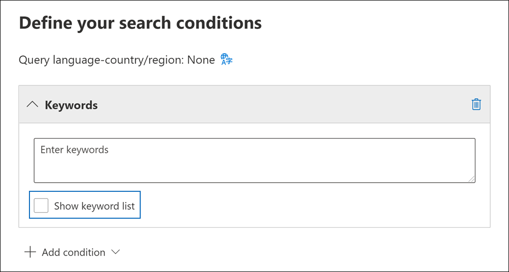

# eDiscovery 검색 결과에 대한 통계 보기

콘텐츠 검색 또는 Core eDiscovery 사례와 연결된 검색을 만들고 실행한 후 예상 검색 결과에 대한 통계를 볼 수 있습니다. 여기에는 검색 결과 요약(검색 플라이아웃 페이지에 표시되는 예상 검색 결과 요약), 검색 쿼리와 일치하는 항목이 포함된 콘텐츠 위치 수와 같은 쿼리 통계, 가장 일치하는 항목이 있는 콘텐츠 위치의 ID가 포함됩니다.
  
또한 키워드 목록을 사용하여 검색 쿼리의 각 키워드에 대한 통계를 반환하도록 검색을 구성할 수 있습니다. 이렇게 하면 쿼리의 각 키워드에서 반환되는 결과 수를 비교할 수 있습니다.
  
검색 통계를 CSV 파일에 다운로드할 수도 있습니다. 이를 통해 Excel의 필터링 및 정렬 기능을 사용하여 결과를 비교하고 검색 결과에 대한 보고서를 준비할 수 있습니다.
  
## 검색에 대한 통계를 얻습니다.

Core eDiscovery 사례와 연결된 콘텐츠 검색 또는 검색에 대한 통계를 표시하기 위해:
  
1. 다음 Microsoft 365 규정 준수 센터 모두 표시를 클릭하고 다음 중 하나를 클릭합니다. 

   - 콘텐츠 **검색을** 클릭한 다음 검색을 선택하여 플라이아웃 페이지를 표시합니다.

     또는

   - **eDiscovery**  >  **Core를 클릭하고** 사례를 선택한 다음  검색 탭에서 검색을 선택하여 플라이아웃 페이지를 표시합니다.

2. 선택한 검색의 플라이아웃 페이지에서 검색 통계 **탭을** 클릭합니다.
  
   

검색 **통계 탭에는** 검색에 대한 다양한 유형의 통계가 포함된 다음 섹션이 포함되어 있습니다.

### 콘텐츠 검색

이 섹션에는 검색에서 반환된 예상 항목에 대한 그래픽 요약이 표시됩니다. 검색 조건과 일치하는 항목 수를 나타냅니다. 이 정보는 검색에서 반환되는 예상 항목 수에 대한 아이디어를 제공합니다.

- **위치 기준 예상 항목:** 검색에서 반환된 예상 항목의 총 수입니다. 사서함에 있으며 사이트에 있는 특정 항목 수도 표시됩니다.

- **적중 횟수가 있는** 예상 위치: 검색에서 반환된 항목이 포함된 총 콘텐츠 위치 수입니다. 사서함 및 사이트 위치의 특정 수도 표시됩니다.

- **위치당 데이터 볼륨(MB)**: 검색에서 반환된 모든 예상 항목의 총 크기입니다. 사서함 항목 및 사이트 항목의 특정 크기도 표시됩니다.

### 조건 보고서

이 섹션에는 검색 쿼리에 대한 통계와 검색 쿼리의 여러 부분과 일치하는 예상 항목 수가 표시됩니다. 이러한 통계를 사용하여 검색 쿼리의 각 구성 요소와 일치하는 항목 수를 분석할 수 있습니다. 이렇게하면 검색 조건을 구체화하고 필요한 경우 범위 범위를 좁힐 수 있습니다. 이 보고서의 복사본을 CSV 형식으로 다운로드할 수도 있습니다.

- **위치 유형:** 쿼리 통계를 적용할 수 있는 콘텐츠 위치의 유형입니다. Exchange **값은** 사서함 위치를 나타냅니다. 값이 **SharePoint** 위치를 나타냅니다.

- **파트:** 검색 쿼리에서 통계를 적용할 수 있는 부분입니다. **Primary는** 전체 검색 쿼리를 나타냅니다. **Keyword는** 행의 통계가 특정 키워드에 대한 통계를 나타냅니다. 검색 쿼리에 키워드 목록을 사용하는 경우 쿼리의 각 구성 요소에 대한 통계가 이 표에 포함됩니다. 자세한 내용은 [검색에 대한 키워드 통계 보기를 참조하세요.](#get-keyword-statistics-for-searches)

- **조건:** 해당 행에 표시된 통계를 반환한 검색 쿼리의 실제 구성 요소(키워드 또는 조건)입니다.

- **적중 횟수가** 있는 위치: 조건 열에  나열된 기본 쿼리 또는 키워드 쿼리와 일치하는 항목이 포함된 콘텐츠 위치(위치 유형 열로 지정)의 **수입니다.**

- **항목:** 조건 열에 나열된 쿼리와 일치하는 항목 수(지정된 콘텐츠 위치의 항목 수)입니다.  앞서 설명한 것 처럼 항목에 검색되는 키워드의 인스턴스가 여러 개 포함된 경우 이 열에는 한 번만 계산됩니다.

- **크기(MB)**: 조건 열의 검색 쿼리와 일치하는 지정된 콘텐츠 위치에 있는 모든 항목의 총 **크기입니다.**

### 상위 위치

이 섹션에는 검색에서 반환된 항목이 가장 많은 특정 콘텐츠 위치에 대한 통계가 표시됩니다. 상위 위치 1,000개가 표시됩니다. 이 보고서의 복사본을 CSV 형식으로 다운로드할 수도 있습니다.

- 위치 이름(사서함의 전자 메일 주소 및 사이트의 URL)입니다.

- 위치 유형(사서함 또는 사이트)

- 검색에서 반환된 콘텐츠 위치에 있는 예상 항목 수입니다.

- 각 콘텐츠 위치에 있는 예상 항목의 총 크기입니다.

## 검색에 대한 키워드 통계를 얻습니다.

앞서 설명한 것  처럼 조건 보고서 섹션에는 검색 쿼리와 쿼리와 일치하는 항목의 수 및 크기가 표시됩니다. 검색 쿼리를 만들거나 편집할 때 키워드 목록을 사용하는 경우 각 키워드 또는 키워드 구와 일치하는 항목 수를 표시하는 향상된 통계를 얻을 수 있습니다. 이렇게하면 가장 효과적이고 가장 효과적인 쿼리 부분을 빠르게 식별하는 데 도움이 될 수 있습니다. 예를 들어 키워드가 많은 수의 항목을 반환하는 경우 키워드 쿼리를 구체화하여 검색 결과 범위를 좁힐 수 있습니다.

키워드 목록을 만들고 검색에 대한 키워드 통계를 표시하는 경우:
  
1. 이 Microsoft 365 규정 준수 센터 새 콘텐츠 검색 또는 Core eDiscovery 사례와 연결된 검색을 만드겠습니다.

2. 검색 **마법사의** 조건 페이지에서 키워드 목록 **표시 확인란을** 선택합니다.

   

3. 키워드 테이블의 행에 키워드 또는 키워드 단계를 입력합니다. 예를 들어 첫 번째 행에 **budget을** 입력하고 두 번째 행에 **보안을** 입력한 다음 세 번째 행에 **FY2021을** 입력합니다.

   

   > [!NOTE]
   > 큰 키워드 목록으로 인한 문제를 줄이기 위해 검색 쿼리의 키워드 목록에서 최대 20개 행으로 제한됩니다.

4. 검색하고 통계를 얻을 키워드를 목록에 추가한 후 검색을 실행합니다.

5. 검색이 완료되면 해당 검색을 선택하여 플라이아웃 페이지를 표시합니다.

6. 검색 **통계 탭에서** 조건  보고서를 클릭하여 검색에 대한 키워드 통계를 표시합니다.

    
  
    이전 스크린샷과 같이 각 키워드에 대한 통계가 표시됩니다. 여기에는 다음이 포함됩니다.

    - 검색에 포함된 각 콘텐츠 위치 유형에 대한 키워드 통계입니다.

    - 인덱서되지 않은 사서함 항목 수입니다.

    - 검색 쿼리의 조건이 포함된 각 키워드(파트  열에서 **키워드로** 식별)에 대한 실제 검색 쿼리 및 결과입니다.

    - 전체 검색 쿼리(파트  열에서  기본으로 식별) 및 각 위치 유형에 대한 전체 쿼리에 대한 통계입니다. 요약 탭에 표시되는 통계와 **동일한 통계입니다.**
