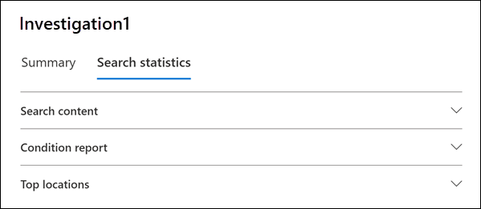

# eDiscovery 검색 결과에 대한 통계 보기View statistics for eDiscovery search results

콘텐츠 검색 또는 Core eDiscovery 사례와 연결된 검색을 만들고 실행한 후 예상 검색 결과에 대한 통계를 볼 수 있습니다.After you create and run a Content search or a search associated with a Core eDiscovery case, you can view statistics about the estimated search results. 여기에는 검색 결과 요약(검색 플라이아웃 페이지에 표시되는 예상 검색 결과 요약), 검색 쿼리와 일치하는 항목이 포함된 콘텐츠 위치 수와 같은 쿼리 통계, 가장 일치하는 항목이 있는 콘텐츠 위치의 ID가 포함됩니다.This includes a summary of the search results (similar to the summary of the estimated search results displayed on the search flyout page), the query statistics such as the number of content locations with items that match the search query, and the identity of content locations that have the most matching items.
  
또한 키워드 목록을 사용하여 검색 쿼리의 각 키워드에 대한 통계를 반환하도록 검색을 구성할 수 있습니다.Additionally, you can use the keywords list to configure a search to return statistics for each keyword in a search query. 이렇게 하면 쿼리의 각 키워드에서 반환되는 결과 수를 비교할 수 있습니다.This lets you compare the number of results returned by each keyword in a query.
  
검색 통계를 CSV 파일에 다운로드할 수도 있습니다.You can also download search statistics to a CSV file. 이를 통해 Excel의 필터링 및 정렬 기능을 사용하여 결과를 비교하고 검색 결과에 대한 보고서를 준비할 수 있습니다.This lets you use the filtering and sorting features in Excel to compare results, and prepare reports for your search results.
  
## 검색에 대한 통계를 얻습니다.Get statistics for searches

Core eDiscovery 사례와 연결된 콘텐츠 검색 또는 검색에 대한 통계를 표시하기 위해:To display statistics for a Content search or a search associated with a Core eDiscovery case.:
  
1. Microsoft 365 준수 센터에서 모두 표시를 클릭하고 다음 중 하나를 클릭합니다.In the Microsoft 365 compliance center, click **Show all**, and then do one of the following:

   - 콘텐츠 **검색을** 클릭한 다음 검색을 선택하여 플라이아웃 페이지를 표시합니다.Click **Content search** and then select a search to display the flyout page.

     또는OR

   - **eDiscovery**  >  **Core를 클릭하고** 사례를 선택한 다음  검색 탭에서 검색을 선택하여 플라이아웃 페이지를 표시합니다.Click **eDiscovery** > **Core**, select a case, and then select a search on the **Searches** tab to display the flyout page.

2. 선택한 검색의 플라이아웃 페이지에서 검색 통계 **탭을** 클릭합니다.On the flyout page of the selected search, click the **Search statistics** tab.
  
   

검색 **통계 탭에는** 검색에 대한 다양한 유형의 통계가 포함된 다음 섹션이 포함되어 있습니다.The **Search statistics** tab contains for following sections that contain different types of statistics about the search.

### 콘텐츠 검색Search content

이 섹션에는 검색에서 반환된 예상 항목에 대한 그래픽 요약이 표시됩니다.This section displays a graphical summary of the estimated items returned by the search. 검색 조건과 일치하는 항목 수를 나타냅니다.This indicates the number of items that match the search criteria. 이 정보는 검색에서 반환되는 예상 항목 수에 대한 아이디어를 제공합니다.This information gives you an idea about the estimated number of items returned by the search.

- **위치 기준 예상 항목:** 검색에서 반환된 예상 항목의 총 수입니다.**Estimated items by locations**: The total number of estimated items returned by the search. 사서함에 있으며 사이트에 있는 특정 항목 수도 표시됩니다.The specific number of items located in mailboxes and located in sites is also displayed.

- **적중 횟수가 있는** 예상 위치: 검색에서 반환된 항목이 포함된 총 콘텐츠 위치 수입니다.**Estimated locations with hits**: The total number of content locations that contain items returned by the search. 사서함 및 사이트 위치의 특정 수도 표시됩니다.The specific number of mailbox and site locations is also displayed.

- **위치당 데이터 볼륨(MB)**: 검색에서 반환된 모든 예상 항목의 총 크기입니다.**Data volume by location (in MB)**: The total size of all estimated items returned by the search. 사서함 항목 및 사이트 항목의 특정 크기도 표시됩니다.The specific size of mailbox items and site items is also displayed.

### 조건 보고서Condition report

이 섹션에는 검색 쿼리에 대한 통계와 검색 쿼리의 여러 부분과 일치하는 예상 항목 수가 표시됩니다.This section displays statistics about the search query and the number of estimated items that matched different parts of the search query. 이러한 통계를 사용하여 검색 쿼리의 각 구성 요소와 일치하는 항목 수를 분석할 수 있습니다.You can use these statistics to analyze the number of items that match each component of search query. 이렇게하면 검색 조건을 구체화하고 필요한 경우 범위 범위를 좁힐 수 있습니다.This can help you refine the search criteria and if necessary narrow the scope of the scope. 이 보고서의 복사본을 CSV 형식으로 다운로드할 수도 있습니다.You can also download a copy of this report in CSV format.

- **위치 유형:** 쿼리 통계를 적용할 수 있는 콘텐츠 위치의 유형입니다.**Location type**: The type of content location that the query statistics are applicable to. Exchange **값은** 사서함 위치를 나타냅니다. 값이 **SharePoint** 위치를 나타냅니다.The value of **Exchange** indicates a mailbox location; a value of **SharePoint** indicates a site location.

- **파트:** 검색 쿼리에서 통계를 적용할 수 있는 부분입니다.**Part**: The part of the search query the statistics are applicable to. **Primary는** 전체 검색 쿼리를 나타냅니다.**Primary** indicates the entire search query. **Keyword는** 행의 통계가 특정 키워드에 대한 통계를 나타냅니다.**Keyword** indicates the statistics in the row are for a specific keyword. 검색 쿼리에 키워드 목록을 사용하는 경우 쿼리의 각 구성 요소에 대한 통계가 이 표에 포함됩니다.If you use a keyword list for search query, statistics for each component of the query are included in this table. 자세한 내용은 [검색에 대한 키워드 통계 보기를 참조하세요.](#get-keyword-statistics-for-searches)For more information, see [Get keyword statistics for searches](#get-keyword-statistics-for-searches).

- **조건:** 해당 행에 표시된 통계를 반환한 검색 쿼리의 실제 구성 요소(키워드 또는 조건)입니다.**Condition**: The actual component (keyword or condition) of the search query that returned the statistics displayed in the corresponding row.

- **적중 횟수가** 있는 위치: 조건 열에  나열된 기본 쿼리 또는 키워드 쿼리와 일치하는 항목이 포함된 콘텐츠 위치(위치 유형 열로 지정)의 **수입니다.****Locations with hits**: The number of the content locations (specified by the **Location type** column) that contain items that match the primary or keyword query listed in the **Condition** column.

- **항목:** 조건 열에 나열된 쿼리와 일치하는 항목 수(지정된 콘텐츠 위치의 항목 수)입니다. **Items**: The number of items (from the specified content location) that match the query listed in the **Condition** column. 앞서 설명한 것 처럼 항목에 검색되는 키워드의 인스턴스가 여러 개 포함된 경우 이 열에는 한 번만 계산됩니다.As previously explained, if an item contains multiple instances of a keyword that is being searched for, it's only counted once in this column.

- **크기(MB)**: 조건 열의 검색 쿼리와 일치하는 지정된 콘텐츠 위치에 있는 모든 항목의 총 **크기입니다.****Size (MB)**: The total size of all items that were found (in the specified content location) that match the search query in the **Condition** column.

### 상위 위치Top locations

이 섹션에는 검색에서 반환된 항목이 가장 많은 특정 콘텐츠 위치에 대한 통계가 표시됩니다.This section displays statistics about the specific content locations with the most items returned by the search. 주요 위치 1,000개가 표시됩니다.The top 1,000 locations are displayed. 이 보고서의 복사본을 CSV 형식으로 다운로드할 수도 있습니다.You can also download a copy of this report in CSV format.

- 위치 이름(사서함의 전자 메일 주소 및 사이트의 URL)입니다.The name of the location name (the email address of mailboxes and the URL for sites).

- 위치 유형(사서함 또는 사이트)Location type (a mailbox or site).

- 검색에서 반환된 콘텐츠 위치에 있는 예상 항목 수입니다.Estimated number of items in the content location returned by the search.

- 각 콘텐츠 위치에 있는 예상 항목의 총 크기입니다.The total size of estimated items in each content location.

## 검색에 대한 키워드 통계를 얻습니다.Get keyword statistics for searches

앞서 설명한 것  처럼 조건 보고서 섹션에는 검색 쿼리와 쿼리와 일치하는 항목의 수 및 크기가 표시됩니다.As previous explained, the **Condition report** section shows the search query and the number (and size) of items that match the query. 검색 쿼리를 만들거나 편집할 때 키워드 목록을 사용하는 경우 각 키워드 또는 키워드 구와 일치하는 항목 수를 표시하는 향상된 통계를 얻을 수 있습니다.If you use a keyword list when you create or edit a search query, you can get enhanced statistics that show how many items match each keyword or keyword phrase. 이렇게하면 가장 효과적이고 가장 효과적인 쿼리 부분을 빠르게 식별하는 데 도움이 될 수 있습니다.This can help you quickly identify which parts of the query are the most (and least) effective. 예를 들어 키워드가 많은 수의 항목을 반환하는 경우 키워드 쿼리를 구체화하여 검색 결과 범위를 좁힐 수 있습니다.For example, if a keyword returns a large number of items, you might choose to refine the keyword query to narrow the search results.

키워드 목록을 만들고 검색에 대한 키워드 통계를 표시하는 경우:To create a keyword list and view keyword statistics for a search:
  
1. 규정 Microsoft 365 센터에서 Core eDiscovery 사례와 연결된 새 콘텐츠 검색 또는 검색을 생성합니다.In the Microsoft 365 compliance center, create a new Content search or a search associated with a Core eDiscovery case.

2. 검색 **마법사의** 조건 페이지에서On the **Conditions** page of the search wizard. 키워드 목록 **표시 확인란을** 선택합니다.select the **Show keyword list** checkbox.

   

3. 키워드 테이블의 행에 키워드 또는 키워드 단계를 입력합니다.Type a keyword or keyword phase in a row in the keywords table. 예를 들어 첫 번째 행에 **budget을** 입력하고 두 번째 행에 **보안을** 입력한 다음 세 번째 행에 **FY2021을** 입력합니다.For example, type **budget** in the first row, type **security** in the second row, and type **FY2021** in the third row.

   

   > [!NOTE]
   > 큰 키워드 목록으로 인한 문제를 줄이기 위해 검색 쿼리의 키워드 목록에서 최대 20개 행으로 제한됩니다.To help reduce issues caused by large keyword lists, you're limited to a maximum of 20 rows in the keyword list of a search query.

4. 검색하고 통계를 얻을 키워드를 목록에 추가한 후 검색을 실행합니다.After adding the keywords to the list that you want to search and get statistics for, run the search.

5. 검색이 완료되면 해당 검색을 선택하여 플라이아웃 페이지를 표시합니다.When the search is completed, select it to display the flyout page.

6. 검색 **통계 탭에서** 조건  보고서를 클릭하여 검색에 대한 키워드 통계를 표시합니다.On the **Search statistics** tab, click the **Condition report** to display the keyword statistics for the search.

    
  
    이전 스크린샷과 같이 각 키워드에 대한 통계가 표시됩니다. 여기에는 다음이 포함됩니다.As shown in the previous screenshot, the statistics for each keyword are displayed; this includes:

    - 검색에 포함된 각 콘텐츠 위치 유형에 대한 키워드 통계입니다.The keyword statistics for each type of content location included in the search.

    - 인덱서되지 않은 사서함 항목 수입니다.The number of unindexed mailbox items.

    - 검색 쿼리의 조건이 포함된 각 키워드(파트  열에서 **키워드로** 식별)에 대한 실제 검색 쿼리 및 결과입니다.The actual search query and results for each keyword (identified as **Keyword** in the **Part** column), which includes any conditions from the search query.

    - 전체 검색 쿼리(파트  열에서  기본으로 식별) 및 각 위치 유형에 대한 전체 쿼리에 대한 통계입니다.The complete search query (identified as **Primary** in the **Part** column) and the statistics for the complete query for each location type. 요약 탭에 표시되는 통계와 **동일한 통계입니다.**Note these are the same statistics displayed on the **Summary** tab.
