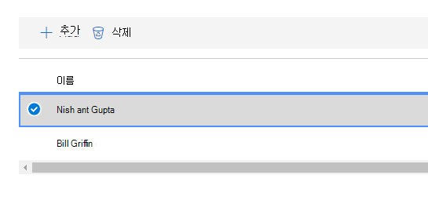

# Microsoft 준수 관리자 사용 (미리 보기)

> [!IMPORTANT]
> Microsoft 준수 관리자는 데이터 보호 및 규정 준수를 개선 하기 위한 준수 기간 및 권장 사항에 대 한 요약을 제공 하는 대시보드 및 관리 도구입니다. 준수 관리자에 제공 되는 고객 작업은 권장 사항입니다. 구현 하기 전에 해당 규정 환경에서 이러한 권장 사항의 효과를 평가 하는 것이 조직에 게 있습니다. 준수 관리자의 권장 사항을 준수 보장으로 해석하면 안 됩니다.

## 액세스 준수 관리자

Microsoft Service Trust Portal에서 준수 관리자에 액세스할 수 있습니다. Microsoft 계정 또는 Azure Active Directory 조직의 계정을 사용 하는 모든 사용자는 준수 관리자에 액세스할 수 있습니다.

1. [https://servicetrust.microsoft.com/ComplianceManager/V3](https://servicetrust.microsoft.com/ComplianceManager/V3)으로 이동합니다.

2. Microsoft 서비스 계정 (Office 365, Microsoft 365 또는 Azure Active Directory (Azure AD) 사용자 계정)을 사용 하 여 로그인 합니다.

> [!NOTE]
> 서비스 신뢰 포털에서 가장 최근 기능이 포함 된 미리 보기 버전인 **준수 관리자**를 선택 합니다. 이 설명서에서 다루지 않는 초기 릴리스 기능을 포함 하는 **준수 관리자 (클래식)** 는 선택 하지 않습니다.

## 관리

전역 관리자만 사용할 수 있으며 전역 관리자 계정으로 로그인 한 경우에만 표시 되는 특정 관리 기능이 있습니다. 전역 관리자는 사용자 권한을 할당 하 고 자동 보안 점수 업데이트를 설정할 수 있습니다.
  
### 사용자에게 준수 관리자 역할 할당

관리자가 다른 사용자에 게 준수 관리자 역할을 할당 하면 해당 사용자는 준수 관리자에서 데이터를 보고 역할에 따라 결정 된 작업을 수행할 수 있습니다. 또한 관리자는 azure [Active Directory (AZURE AD)에서 사용자에 게 전역 독자 역할](https://docs.microsoft.com/azure/active-directory/users-groups-roles/directory-assign-admin-roles#global-reader)을 할당 하 여 준수 관리자에 게 읽기 전용 액세스 권한을 부여할 수 있습니다.

각 준수 관리자 역할에는 약간 다른 사용 권한이 있습니다. 각 역할에 할당 된 사용 권한을 보고, 어떤 사용자가 역할을 하 고 있는지 확인 하 고, 서비스 트러스트 포털을 통해 해당 역할에서 사용자를 추가 하거나 제거할 수 있습니다. **관리** 메뉴 항목을 선택 하 고 보려는 **설정을** 선택 합니다.
  

  
준수 관리자 역할에서 사용자를 추가하거나 제거하려면
  
1. [https://servicetrust.microsoft.com](https://servicetrust.microsoft.com)으로 이동합니다.

2. Azure Active Directory 전역 관리자 계정으로 로그인합니다.

3. 서비스 보안 포털의 위쪽 메뉴 모음에서 **관리자** 를 선택 하 고 **설정을**선택 합니다.

4. **역할 선택** 드롭다운 목록에서 관리 하려는 역할을 선택 합니다.

5. 각 역할에 추가된 사용자는 **역할 선택** 페이지에 표시됩니다.

6. 이 역할에 사용자를 추가 하려면 **추가**를 선택 합니다. **사용자 추가** 대화 상자에서 사용자 필드를 선택 합니다. 사용 가능한 사용자 목록을 스크롤하거나 사용자 이름을 입력 하 여 검색 용어에 따라 목록을 필터링 할 수 있습니다. 해당 역할을 사용 하 여 프로 비전 된 **사용자 추가** 목록에 해당 계정을 추가할 사용자를 선택 합니다. 여러 사용자를 동시에 추가 하려면 목록을 필터링 하는 사용자 이름을 입력 하기 시작한 다음 목록에 추가할 사용자를 선택 합니다. **저장** 을 선택 하 여 해당 사용자에 게 선택한 역할을 프로 비전 합니다. 

    
  
7. 이 역할에서 사용자를 제거 하려면 사용자를 선택 하 고 **삭제**를 선택 합니다.

    

### 자동 보안 점수 업데이트 제어

보안 점수 업데이트는 모든 작업에 대해 자동으로 설정 하거나, 모든 작업에 대해 해제 하거나, 다음 단계를 수행 하 여 개별 작업을 통해 설정할 수 있습니다.

1. 전역 관리자 계정을 사용 하 여 [서비스 신뢰 포털](https://servicetrust.microsoft.com) 에 로그인 합니다.

2. 서비스 보안 포털의 위쪽 메뉴 모음에 있는 **자세히**에서 **관리자** 를 선택 하 고 **설정을**선택 합니다.

3. **보안 점수** 탭에서 **모든 동작에 대해 켤**해당 단추를 선택 하 고, **모든 작업**을 해제 하거나, 작업별 **로 설정 합니다.**

작업별 설정을 선택 하 **는** 경우 다음과 같은 추가 단계를 수행 하 여 개별 작업에 대 한 보안 점수 업데이트를 설정 합니다.

4. 위쪽 메뉴에서 **준수 관리자** 를 선택 합니다 (참고: "준수 관리자 (클래식)"는 선택 하지 않음).

5. 화면의 오른쪽 위 모서리에 있는 **테 넌 트 관리** 를 선택 합니다.

6. **고객 작업** 창의 해당 하는 **작업** 열에서 줄임표 (**...**)를 사용 하 여 원하는 작업을 찾습니다. 줄임표 (...)를 클릭 하 고 편집을 선택 **합니다.**

7. **보안 점수 연속 업데이트** 전환 스위치를 설정으로 전환 **합니다.**

8. **저장을 선택 합니다.** 이제 해당 작업에 대 한 보안 점수 지속적인 모니터링이 설정 됩니다.

**참고:** 전역 관리자만 모든 작업에 대해 자동 업데이트를 설정 하거나 해제할 수 있습니다. 준수 관리자 관리자는 개별 작업에 대해 자동 업데이트를 설정할 수 있지만 모든 작업에 대해 전역적으로 수행 되지 않습니다.

## 그룹

그룹은 평가를 구성 하 고, 동일한 또는 관련 고객 관리 컨트롤이 있는 평가 간에 일반 정보 및 워크플로 작업을 공유 하는 데 사용할 수 있는 컨테이너입니다.

평가는 연도, 표준, 서비스 또는 조직의 팀, 부서 또는 지역에 따라 논리적인 방식으로 그룹화 할 수 있습니다. 다음은 두 그룹 및 해당 기본 평가의 예입니다.
  
- **FFIEC는 평가 2020**
  - Office 365 + FFIEC가
  - Intune + FFIEC가
- **데이터 보안 및 개인 정보 보호 평가**
  - Office 365 + ISO 27001:2013
  - Office 365 + ISO 27018:2014

> [!NOTE]
> 새 평가를 추가 *하기 전에 먼저* 조직에 대 한 그룹화 전략을 결정 하는 것이 좋습니다.

시작 하려면 데이터 보호 기준을 포함 하는 **기본** 그룹이 설정 됩니다. 이 기준은 일반적인 업계 규정 및 표준을 포함 하는 컨트롤 집합입니다 ([자세한 정보](compliance-score-methodology.md#initial-score-based-on-microsoft-365-data-protection-baseline)).

### 그룹을 만드는 방법

그룹은 독립 실행형 엔터티로 만들 수 없습니다. 그룹에는 항상 하나 이상의 평가를 포함 해야 하므로 그룹을 만들려면 먼저 그룹에 배치할 평가를 만들어야 합니다.

그룹을 만들려면 다음 단계를 수행 합니다.

1. 대시보드 위쪽에 있는 **+ 추가 평가** 를 선택 하 여 새 평가를 만듭니다.
2. **평가** 플라이 아웃 창에서 평가에 대 한 제목을 입력 하 고 드롭다운 메뉴에서 템플릿을 선택 합니다.
3. **그룹을 선택 하거나 새 그룹을 추가**하 고 **새 그룹 추가** 를 선택 하 고 아래 필드에 그룹 이름을 입력 합니다.
4. 기존 그룹에서 정보를 복사 하려면 **기존 그룹에서 데이터를 복사할지 여부** 를 선택 하 시겠습니까? 설정으로 전환 **합니다.** 아래 드롭다운 메뉴에서 복사할 그룹을 선택 하 고 새 그룹에서 새 평가로 수행 하려는 모든 필드의 확인란을 선택 합니다.
5. **저장**을 선택합니다. 완료 되 면 플라이 아웃 창이 닫히고 대시보드에 새 그룹이 표시 됩니다.

그룹으로 작업할 때 알아야 할 사항:
  
- 그룹 이름 ( *그룹 id*라고도 함)은 조직 내에서 고유 해야 합니다.
- 그룹에 보안 속성이 없습니다. 모든 사용 권한은 평가와 연결 됩니다.
- 그룹에 평가를 추가한 후에는 그룹화를 변경할 수 없습니다. 평가 그룹의 이름을 바꾸어 해당 그룹과 연결 된 모든 평가에 대 한 평가 그룹화의 이름을 변경할 수 있습니다.
- 같은 그룹 내의 서로 다른 평가에서 관련 평가 컨트롤은 완료 시 자동으로 업데이트 됩니다.
- 기존 그룹에 새 평가를 추가 하는 경우 해당 그룹의 평가에 대 한 공통 정보가 새 평가로 복사 됩니다.
- 그룹은 동일한 인증 또는 규제에 대 한 평가를 포함할 수 있지만 각 그룹에는 특정 제품 인증 쌍에 대 한 평가를 하나만 포함할 수 있습니다. 예를 들어 그룹에는 Office 365 및 NIST CSF에 대 한 두 가지 평가를 포함할 수 없습니다. 그룹은 각각에 대해 해당 하는 인증 또는 규제를 서로 다른 경우에만 동일한 제품에 대해 여러 평가를 포함할 수 있습니다.
- 평가를 숨기면 해당 평가와 그룹 간의 관계가 끊어집니다. 기타 관련 평가에 대 한 추가 업데이트가 더 이상 숨겨진 평가에 반영 되지 않습니다. ([평가를 숨기는 방법에 대해 알아보세요.](#hide-a-template-or-an-assessment))
- 그룹은 삭제할 수 없습니다.
- 여러 그룹에 나타나는 작업 항목을 변경 하면 해당 변경 내용이 해당 작업 항목의 모든 인스턴스에 반영 됩니다.

## 차원, 소유자, & 고객 작업에 대 한 테 넌 트 관리

**테 넌 트 관리** 인터페이스를 사용 하면 다음과 같은 조직 차원의 설정을 관리할 수 있습니다.

- **차원:** 사용자 지정 필터 피벗을 만드는 데 사용할 수 있는 템플릿, 평가 및 작업 항목에 대 한 메타 데이터를 확인 합니다.
- **소유자:** 작업과 연결할 수 있는 책임 당사자 목록을 채웁니다.
- **고객 작업:** 준수 관리자 (미리 보기)에 포함 된 작업 항목의 전체 목록과 보안 점수와 통합 된 작업에 대 한 보안 점수 모니터링 사용/사용 안 함을 관리 합니다.

화면 오른쪽 위 모서리에서 **테 넌 트 관리** 를 선택 하 여 관리 인터페이스를 열고 아래 단계를 사용 하 여 **차원**, **소유자**및 **고객 작업**을 관리 합니다.

### 높이

차원은 템플릿, 평가 또는 작업 항목에 대 한 정보를 제공 하는 메타 데이터 집합입니다. 차원은 차원 키가 속성을 나타내는 키 및 값의 개념을 사용 하 고, 차원 값은 속성의 유효한 값을 나타냅니다. 예를 들어 준수 관리자에서 다음 세 가지 유형의 작업을 수행할 수 있습니다. 이러한 기능은 **작업 목적** 및 **예방적**, **예방용 인지**및 **정정**의 차원 값에 대 한 차원 키로 정의 됩니다.

### 소유자

소유자는 각 컨트롤을 담당 하는 사람을 식별 하는 데 사용 됩니다. 모든 기본 제공 컨트롤은 Microsoft, 고객 또는 둘 모두에 의해 소유 됩니다. 소유자에 대해 사용자 지정 값을 만들어 조직 내에서 보다 세부적인 책임을 지정 하는 데 사용할 수 있습니다. 예를 들어 조직 내의 특정 그룹, 팀 또는 비즈니스 단위를 나타내는 소유자를 만들 수 있습니다.

#### 소유자 추가

1. **테 넌 트 관리** 를 열고 **소유자**를 선택 합니다.
2. **+ 소유자 추가**를 선택 합니다.
3. 소유자의 이름과 설명을 입력 하 고 **저장**을 선택 합니다. 설명은 소유자 열에 표시 됩니다.

#### 소유자 편집

소유자 이름은 편집할 수 없지만 소유자 열에 표시 되는 설명은 수정할 수 있습니다.

1. **테 넌 트 관리** 를 열고 **소유자**를 선택 합니다.
2. 편집할 소유자를 찾은 다음 옆에 있는 줄임표 (...)를 선택 하 고 **편집**을 선택 합니다.
3. 필요에 따라 설명을 수정 하 고 **저장**을 선택 합니다.

#### 소유자 삭제

1. **테 넌 트 관리** 를 열고 **소유자**를 선택 합니다.
2. 삭제할 소유자를 찾고 옆에 있는 줄임표 (...)를 선택한 다음 **삭제**를 선택 합니다.
3. 확인 메시지가 표시 되 면 **삭제**를 선택 합니다.

### 고객 작업

고객 작업 영역에는 준수 관리자 (미리 보기)의 모든 템플릿 및 평가에 대 한 모든 고객 작업이 표시 됩니다.

작업의 제목, 소유자, 범주, 적용 및 점수를 한눈에 확인 하 고 보안 점수와 통합 되어 있는지 확인할 수 있습니다. 작업을 확장 하 고 **자세히 읽기** 를 선택 하 여 작업의 설명을 읽고 설명에 있는 링크에 액세스할 수 있습니다. 또한이 인터페이스를 사용 하 여 동작 별로 보안 점수 통합을 사용 하거나 사용 하지 않도록 설정 하 고 사용자 지정 작업을 추가할 수 있습니다. 보안 점수 통합 기능을 가진 작업에는 줄임표 (...)가 있습니다 (사용자 지정 작업 옆에는 줄임표 (...))가 있습니다.

#### 보안 점수 통합 사용 또는 사용 안 함

1. 수정할 작업의 줄임표 (...)를 선택 하 고 **편집**을 선택 합니다.
2. 보안 점수를 통한 지속적인 모니터링을 사용 하거나 사용 하지 않도록 설정 하려면 안전한 점수 연속 업데이트에 대 한 스위치를 설정 또는 해제로 전환 합니다.
3. **저장**을 선택합니다.

조직에서 Microsoft 365 또는 Office 365을 처음 배포할 때는 보안 점수가 약 7 일 정도 소요 되어 데이터를 완벽 하 게 수집 하 고 해당 점수를 파악 합니다. 이 시간 동안에는 보안 점수 연속 업데이트 스위치를 **Off** 로 설정 하 고, 수동으로 작업을 수행 하도록 **설정 하면 점수를 받을 수** 있습니다. 초기 7 일이 지나면 보안 점수 연속 업데이트를 다시 설정 하면 해당 시점부터의 지속적인 모니터링이 가능 합니다.

보안 점수 통합에서 지원 되지 않는 모든 작업은 수동으로 구현할 수 있습니다. 수동 구현은 해당 작업 그룹의 점수를 발생 시키는 기능을 합니다.

## 평가

이 섹션에서는 새 평가를 추가 하 고, 내보내고, 기존 평가에서 정보를 복사 하 고, 버전 관리를 통해 업데이트 된 상태로 유지 하는 방법을 포함 하 여 검토를 보고 작업 하는 방법에 대해 설명 합니다.

### 평가 및 작업 세부 정보 보기
  
**평가 대시보드에서 평가** 이름을 선택 하 여 열고 작업 항목 및 컨트롤 정보를 확인 합니다.

다음은 Office 365 및 ISO 27001에 대 한 평가의 예입니다. 첫 번째 보기는 준수 관리자 (미리 보기)의 새 작업 항목 보기를 보여 줍니다.

작업은 사전순으로 나열 되며 각 작업에는 점수와 소유자가 할당 됩니다. **자세히 읽기** 링크를 선택 하 여 각 작업의 세부 정보를 확인 합니다.

**검토** 링크를 선택 하 여 작업을 관리, 할당, 구현 및 테스트 합니다. 예제 작업은 다음과 같습니다.

다음 필드를 사용 하 여 작업 워크플로를 관리 합니다.

- **사용자 할당:** 이 필드를 선택 하 여이 동작을 할당할 사용자를 선택 하거나 입력 합니다. 목록을 스크롤하거나 이름을 입력 하 여 찾은 다음 선택 합니다.
- **문서 관리:** 구현 증거를 Office 문서, 이미지 파일 및 스크린샷, PowerShell 출력을 CSV 또는 TXT로 업로드 하 고 Pdf로 업로드할 수 있습니다.
- **구현 상태:** 작업의 현재 구현 상태를 나타내는 데 사용 됩니다. 가능한 값은 범위에서 구현, 구현, 대체 구현, 계획 됨 및 그렇지 않을 수 있습니다.
- **구현 날짜:** 작업을 수행한 날짜입니다.
- **테스트 결과:** 구현 유효성 검사의 결과를 표시 하는 데 사용 됩니다. 가능한 값은 평가, 성공, 실패-낮은 위험, 실패-보통 위험, 실패-높은 위험, 장애 되지 않음 및 범위에 속하지 않습니다.
- **테스트 날짜:** 유효성 검사가 발생 한 날짜입니다.
- **구현 참고 사항:** 포함 하려는 메모와 함께 조직의 구현 세부 정보를 입력 합니다.
- **테스트 계획:** 포함 하려는 메모와 함께이 작업에 대 한 테스트 계획 세부 정보를 입력 합니다.
- **추가 정보:** 포함 하려는 메모와 함께이 작업에 대 한 추가 정보나 조직에서 구현 된 방식을 입력 합니다.

**컨트롤 정보** 대시보드의 평가 및 템플릿 수준에서 컨트롤에 대 한 정보를 볼 수 있습니다. 다음은 평가를 위한 컨트롤 정보 대시보드의 예입니다.

평가의 경우에는 Controls Info 대시보드가 다음 정보를 표시 합니다.

- **그룹** 드롭다운-보려는 그룹을 선택 합니다 (여러 그룹을 사용 하는 경우).
- 확인할 평가를 선택 하는 **평가** 드롭다운입니다.
- 다음을 포함 하 여 선택한 평가에 대 한 메타 데이터입니다.
    - 전체 컨트롤 수에 대 한 평가 컨트롤 수를 보여 주는 **평가 컨트롤** 의 진행률 표시기입니다.
    - 평가에 대 한 현재 **준수 점수** 이며 백분율로 표시 됩니다.
    - 평가에 사용 되는 **인증** 및 **제품** 에 대 한 세부 정보입니다.
    - 평가의 현재 **상태** 및 마지막으로 **수정한** 날짜입니다.
- 평가에 대 한 **범위 서비스의** 목록입니다.
- 고객 작업에 대 한 링크 및 Microsoft 구현 세부 정보를 포함 하는 컨트롤에 대 한 세부 정보 (컨트롤 패밀리가 그룹화 됨)
    - 이 **작업** 을 수행 하면 일부 또는 모든 컨트롤의 요구 사항을 충족 하기 위해 수행할 수 있는 고객 작업이 표시 됩니다. 대부분의 컨트롤에는 여러 개의 동작이 연결 되어 있으며, 컨트롤에 연결 된 모든 동작이 여기에 표시 됩니다. 여기에 나와 있는 작업은 Actions 대시보드에 나열 된 것과 같은 UI를 포함 합니다.
    - **Microsoft Actions** 는 선택한 인증 컨트롤에 적용 되는 microsoft 내부 프레임 워크의 컨트롤 목록을 표시 합니다. 각 내부 컨트롤에 대해 아래와 같이 테스트 결과 및 테스트 날짜와 함께 Microsoft의 구현 및 테스트 세부 정보를 보려면 **구현** 됨을 선택 합니다.

### 평가 추가
  
1. 평가 대시보드에서 **+ 평가 추가**를 선택 합니다.

2. 블레이드가 열리면 다음 정보를 입력 합니다.

    - **제목 (필수):** 평가의 제목 입력
    - **서식 파일을 선택 하세요 (필수).** 표준 또는 사용자 지정 서식 파일 선택
    - **그룹을 선택 하거나 새 그룹을 추가 하세요 (필수).** 기존 그룹을 선택 하거나 새 그룹 추가를 선택 하 고 고유한 그룹 이름을 지정 합니다.
    - **기존 그룹에서 데이터를 복사 하 시겠습니까? (선택 사항):** 컨트롤을 전환 하 여 그룹 복사본을 사용 하도록 설정 하 고 다음을 수행 합니다.
        - **그룹을 선택 합니다 (선택 사항).** 그룹 복사본을 사용 하도록 설정 된 경우 복사할 그룹을 선택 합니다.
            - **구현 세부 정보 (선택 사항):** 구현 세부 정보를 새 그룹으로 복사 하려면 선택 합니다.
            - **테스트 계획 & 추가 정보 (선택 사항):** 테스트 계획 및 추가 정보 세부 정보를 새 그룹에 복사 하려면 선택 합니다.
            - **문서 (선택 사항):** 문서를 새 그룹으로 복사 하려면 선택 합니다.

3. **저장** 을 선택 하 여 평가를 만듭니다.

 평가 대시보드에 새 평가가 나타나고 다음 정보가 표시 됩니다.

- 평가의 제목입니다.
- 인증, 환경 및 평가에 적용 된 제품을 포함 하는 평가 차원입니다.
- 만들어진 날짜 및 마지막으로 수정한 날짜입니다.
- 평가 점수가 백분율로 표시 됩니다. 이 점수에는 Microsoft에서 관리 하는 컨트롤의 점수와 보안 점수가 자동으로 포함 됩니다.
- 평가 되는 Microsoft 관리 및 고객 관리 컨트롤 수를 보여 주는 진행률 표시기입니다.

### 기존 평가의 정보 복사

평가를 만들 때 기존 그룹에서 정보를 복사할 수 있는 옵션이 있습니다. 복사를 통해 복사 된 평가에 입력 한 정보를 새 평가의 동일한 컨트롤에 적용할 수 있습니다. 예를 들어 조직에서 모든 FFIEC 관련 평가에 대 한 그룹을 사용 하는 경우 기존 평가에서 다음 정보를 복사할 수 있습니다.

- 구현 세부 정보
- 테스트 계획 & 추가 정보
- 문서

#### 기존 평가에서 새 평가로 정보를 복사 합니다.
  
1. 평가 대시보드에서 **+ 평가 추가**를 선택 합니다.
    
2. **평가 추가** 창에서 다음 정보를 입력 합니다.

    - **제목 (필수):** 평가 제목을 입력 합니다.
    - **서식 파일을 선택 하세요 (필수).** 표준 또는 사용자 지정 서식 파일을 선택 합니다.
    - **그룹을 선택 하거나 새 그룹을 추가 하세요 (필수).** **새 그룹 추가** 를 선택 하 고 고유한 그룹 이름을 지정 합니다.
    - **기존 그룹에서 데이터를 복사 하 시겠습니까? (선택 사항):** 그룹 복사본을 사용 하도록 설정 하려면 컨트롤을 설정/해제 하 고 다음을 **선택 합니다 (선택 사항).** 그룹 복사가 사용 하도록 설정 된 경우 복사할 그룹을 선택 합니다.
            - **구현 세부 정보 (선택 사항):** 구현 세부 정보를 새 그룹으로 복사 하려면 선택 합니다.
            - **테스트 계획 & 추가 정보 (선택 사항):** 테스트 계획 및 추가 정보 세부 정보를 새 그룹에 복사 하려면 선택 합니다.
            - **문서 (선택 사항):** 문서를 새 그룹으로 복사 하려면 선택 합니다.

3. **저장** 을 선택 하 여 평가를 만듭니다.

### 평가 업데이트에 대 한 버전 관리 경고

평가에 대 한 업데이트를 사용할 수 있는 경우 알림 아이콘에 업데이트가 준비 되었음을 알리는 알림이 표시 됩니다. 해당 아이콘을 클릭 하면 팝업 창에서 업데이트에 대해 설명 하 고 사용자에 게 수락을 요청 합니다. 다음은 평가에 대 한 버전 관리 경고의 예입니다.

알림 아이콘을 선택 하면 업데이트 및 수락 여부를 설명 하는 플라이 아웃 창이 표시 됩니다.

업데이트 알림을 받을 때 모든 업데이트를 적용 하는 것이 좋습니다.

### 평가 내보내기

조직의 규정 준수 관계자 또는 외부 감사자 및 조정기에 대 한 Excel 파일에 대 한 평가를 내보낼 수 있습니다. 보고서는 보고서가 만들어진 날짜 및 시간을 평가 하는 스냅숏입니다. 이 보고서에는 평가, 컨트롤 구현 상태, 컨트롤 테스트 날짜 및 테스트 결과에 대 한 모든 Microsoft 및 고객 관리 컨트롤에 대 한 세부 정보 및 업로드 된 증거 문서에 대 한 링크를 제공 하는 정보가 포함 되어 있습니다.
  
### 평가 보고서 내보내기
  
1. 준수 관리자 대시보드에서 **컨트롤 정보** 탭을 선택 합니다.
2. 내보내려는 평가의 드롭다운 메뉴에서 **그룹** 및 **평가** 를 선택 합니다.
3. **내보내기** 단추를 선택 합니다.

평가 보고서는 브라우저 세션에서 Excel 파일로 다운로드 됩니다. Excel 파일의 파일 이름은 기본적으로 평가의 제목에 해당 합니다.

### 서식 파일 또는 평가 숨기기

템플릿이나 평가가 완료 되 고 더 이상 규정을 준수 하기 위해 필요 하지 않은 경우 보기에서 숨길 수 있습니다. 서식 파일 또는 평가를 숨기면 기본 보기에서 제거 되며이를 표시 하려면 **숨김 확인란 포함** 을 선택 해야 합니다.

> [!IMPORTANT]
> 숨겨진 평가는 업로드 된 증거 문서에 대 한 링크를 유지 하지 않습니다. 보고서에서 증거 문서에 대 한 링크를 보존 하기 위해 숨기기 전에 평가를 내보내는 것이 좋습니다.
  
#### 서식 파일 숨기기

1. **서식 파일** 대시보드를 엽니다.
2. 숨기려는 서식 파일을 찾은 다음 해당 행의 줄임표에서 **숨기기**를 선택 합니다.
3. 확인 메시지가 표시 되 면 **숨기기**를 선택 합니다.

#### 평가 숨기기

1. **평가** 대시보드를 엽니다.
2. 숨기려는 평가가 포함 된 드롭다운 목록에서 **그룹** 을 선택 합니다.
3. 숨기려는 평가를 찾고 타원에서 **숨기기**를 선택 합니다.
4. 확인 메시지가 표시 되 면 **숨기기**를 선택 합니다.

#### 숨겨진 평가 보기
  
1. **평가** 대시보드 탭을 열고 **숨김 포함** 확인란을 선택 합니다.
2. 숨겨진 평가가 **숨겨진 평가** 섹션에 표시 됩니다.

#### 평가 숨기기 취소

1. **평가** 탭에서 **숨김 확인란 포함** 을 선택 합니다.
2. 숨겨진 평가가 **숨겨진 평가** 섹션에 표시 됩니다.
3. 숨김을 취소할 평가를 찾고 타원에서 **숨기기 취소**를 선택 합니다.
4. 확인 메시지가 표시 되 면 **숨기기 취소**를 선택 합니다.

## 컨트롤 및 작업

컨트롤 및 작업은 준수 관리자 (미리 보기)에서 사용 되는 기본 데이터 피벗입니다. 이전 버전의 준수 관리자에 있던 컨트롤 피벗은 동일한 제어 패밀리에서 Microsoft 및 고객 컨트롤을 표시 하도록 향상 되었습니다. 이 통합 보기를 사용 하면 전체 공유 책임 모델을 각 컨트롤 별로 쉽게 볼 수 있습니다. Pivot Action은 준수 관리자의 새로운 기능 (미리 보기) 이며 Microsoft에서 권장 하는 모든 작업을 효율적으로 확인할 수 있도록 디자인 되었습니다.

### 컨트롤

컨트롤은 Controls Info 대시보드에서 볼 수 있습니다. 컨트롤은 표준, 인증, 규정 또는 프레임 워크의 요구 사항을 나타냅니다. 이러한 요구 사항을 여러 표준, 규정 등으로 매핑하고,이를 작업에 연결 하려면 모든 항목이 컨트롤 프레임 워크 처럼 취급 됩니다. 예를 들어 제어 프레임 워크와 같이 HIPAA와 같은 규정은 다음과 같이 섹션 별로 구분 되며 준수 관리자의 HIPAA 컨트롤은 아래와 같은 번호 매기기 체계를 사용 합니다.

컨트롤에는 다음과 같은 세 가지 유형이 있습니다.

1. **Microsoft 관리 컨트롤:** microsoft만 책임 지는 컨트롤입니다. 이러한 사용자는 box 서식 파일에 나타나며 Microsoft의 준수 관리자에 게 추가 됩니다.
2. **고객 관리 컨트롤:** 고객 에게만 책임을 지는 컨트롤입니다. 이러한 사용자는 내 서식 파일에 나타나며 고객이 준수 관리자에 게 추가 됩니다.
3. **공유 관리 컨트롤:** Microsoft와 고객 간에 책임을 공유 하는 컨트롤입니다. 이러한 파일은 in box 템플릿에 나타나며 Microsoft의 준수 관리자에 게 추가 됩니다. 고객은 Microsoft 관리 컨트롤을 편집 하거나 사용 하지 않도록 설정할 수도 있습니다.

### 작업 항목

작업 항목은 표준 또는 규제 요구 사항을 구현 하는 데 권장 되는 작업 이거나 조직의 구현 요구 사항을 테스트, 확인 및 문서화 하기 위한 것입니다. 작업은 하나 이상의 컨트롤과 연결 됩니다. 각 컨트롤에는 하나 이상의 동작이 연결 되어 있으며 각 작업을 하나 이상의 컨트롤에 연결할 수 있습니다. 작업은 조직에서 할당 하 고 추적 하 고 유효성을 검사 하는 개체 이기 때문에 준수 관리자 (미리 보기)의 핵심 워크플로에 포함 됩니다.

#### 작업 항목 할당
  
1. **작업 항목** 대시보드에서 작업을 할당 하려는 평가를 포함 하는 **그룹** 을 선택 합니다.
2. **평가** 드롭다운에서 작업을 할당 하려는 평가를 선택 하거나 드롭다운 목록에서 **모두** 를 선택 하 여 사용 가능한 모든 작업을 표시 합니다.
3. 할당 하려는 작업을 찾은 다음 **소유자** 열에서 **검토**, * * 구현 또는 **테스트**에 대 한 링크를 선택 합니다.
4. **사용자 지정** 필드를 선택 하면 조직의 사용자 목록이 표시 됩니다. 목록을 스크롤하여 사용자 이름에 입력 하 여 사용자를 선택 합니다.
5. 구현 메모 필드에 할당 된 사용자에 게 전달할 메모를 입력 합니다.
6. **저장** 을 선택 하 여 작업을 할당 합니다.

#### 작업 항목 다시 할당

이 기능을 사용 하면 조직이 새 사용자에 게 작업을 다시 할당 하 여 사용자 계정에서 활성 또는 미해결 종속성을 제거할 수 있습니다.

1. **작업 항목** 대시보드에서 작업을 다시 할당 하려는 평가가 포함 된 **그룹** 을 선택 합니다.
2. **평가** 드롭다운에서 작업을 다시 할당 하려는 평가를 선택 하거나 드롭다운 목록에서 **모두** 를 선택 하 여 사용 가능한 모든 작업을 표시 합니다.
3. 다시 할당 하려는 작업을 찾은 다음 **소유자** 열에서 **검토**, **구현**또는 **테스트할**링크를 선택 합니다.
4. **사용자 지정** 필드에서 기존 사용자를 삭제 하 고 사용자 목록에서 다른 사용자를 선택 하거나 목록을 필터링 하 여 사용자 이름에 입력 하 여 사용자를 선택 합니다.
5. 구현 메모 필드에 사용자에 게 전달할 메모를 입력 합니다.
6. **저장** 을 선택 하 여 작업을 다시 할당 합니다.

#### 일반 작업 항목이 여러 그룹에 걸쳐 상태를 동기화 합니다.

조직에 여러 평가 그룹이 있는 경우 기술 작업 (즉, 전체 조직에 영향을 주는 작업)의 동작이 수행 됩니다. 그룹 간 중복 된 작업은 이제 하나의 단일 작업으로 결합 됩니다. 이 단일 작업에는 이전에 중복 된 버전의 모든 업로드 된 메모 및 증거가 포함 됩니다. 한 그룹 또는 평가의 작업에 대 한 모든 변경 내용은 해당 작업의 모든 인스턴스에 반영 됩니다. **구현 상태**, **구현 날짜**, **테스트 상태**및 **테스트 날짜** 필드에는 최신 업데이트가 반영 됩니다.

## 템플릿

템플릿은 제품 및 인증 (예: 표준, 규정, 제어 프레임 워크 등)과 관련 된 준수 관리자 (미리 보기)의 기본 개체입니다. **서식 파일 대시보드에서 템플릿을** 보고 추가할 수 있습니다.

 
이 대시보드는 서식 파일에 연결 된 인증서 및 제품과 함께 각 서식 파일을 표시 하며, 서식 파일을 만들고 마지막으로 수정한 날짜, 고객 및 Microsoft가 관리 하는 컨트롤 수, 서식 파일의 최대 준수 점수, 서식 파일의 상태 (예: 승인 됨, 보류 중인 승인, 가져온) 등이 포함 됩니다.

### 서식 파일 만들기

다음과 같은 세 가지 방법으로 템플릿을 사용 하 여 평가를 만들 수 있습니다.

1. Microsoft에서 제공 하는 미리 구성 된 서식 파일 중 하나를 사용 합니다.
2. 확장 프로세스를 통해 사용자 고유의 동작과 컨트롤을 사용 하 여 미리 구성 된 서식 파일을 사용자 지정 합니다.
3. 고유한 서식 파일을 만들어 준수 관리자에 게 가져옵니다.

#### Microsoft 미리 구성 된 서식 파일 사용

미리 구성 된 서식 파일은 **서식 파일** 대시보드에서 사용할 수 있습니다. 새 서식 파일을 사용할 수 있을 때마다 업데이트 되는 현재 [서식 파일 목록을](compliance-manager-overview.md#templates)확인 합니다.

#### 확장 프로세스를 통해 템플릿 사용자 지정

1. **서식 파일** 대시보드를 열고 **+ 서식 파일 추가**를 선택 합니다.
2. 서식 파일 플라이 아웃 창에서 **전역 서식 파일에서 확장명 만들기** 확인란을 선택 합니다.
3. 드롭다운 메뉴에서 확장할 템플릿을 선택 합니다.
4. Excel에서 서식 파일 데이터를 아직 포맷 하지 않은 경우 Excel 파일을 다운로드 하려면 플라이 아웃 창에서 링크를 선택 합니다. 아래 Excel 지침을 사용 하 여 [서식 파일 가져오기 데이터](#import-template-data-with-excel) 에 따라 스프레드시트를 작성 하 고 로컬 드라이브에 저장 합니다.
5. **찾아보기를** 선택 하 여 Excel 파일을 업로드 하는 방법으로 사용자 지정 된 서식 파일 데이터를 가져옵니다.
6. **대시보드에 추가를**선택 합니다. 그러면 새 템플릿이 **Templates** 대시보드에 추가 되는 것을 볼 수 있습니다.

#### 고유한 서식 파일을 만들어 준수 관리자에 게 가져오기

1. **서식 파일** 대시보드를 열고 **+ 서식 파일 추가**를 선택 합니다.
2. 서식 파일 플라이 아웃 창에서 **새 서식 파일 만들기**를 선택 합니다.
3. **찾아보기를** 선택 하 여 데이터를 포함 하는 excel 파일을 업로드 하 여 서식 파일 데이터를 가져옵니다 (아래 [Excel에서 템플릿 데이터 가져오기](#import-template-data-with-excel) 참조).
4. **대시보드에 추가를**선택 합니다. 그러면 새 템플릿이 **Templates** 대시보드에 추가 되는 것을 볼 수 있습니다.

#### Excel을 사용 하 여 서식 파일 데이터 가져오기

서식 파일을 수정 하거나 서식 파일을 직접 만들려면 [Excel 스프레드시트](https://go.microsoft.com/fwlink/?linkid=2124865) 를 사용 하 여 필요한 데이터를 캡처 하 고 준수 관리자에 게 업로드 합니다. 이 스프레드시트 서식 파일은 사용 해야 하는 특정 형식 및 스키마를 포함 하거나 준수 관리자로 가져오지 않습니다.

> [!IMPORTANT]
> 이전에 준수 관리자에서 템플릿을 만들거나 사용자 지정한 경우 **이 프로세스는** 준수 관리자의 4 월 2020 릴리스 (미리 보기)의 일부로 업데이트 되었습니다. **이 섹션을 신중 하 게 검토 하세요.**

스프레드시트에는 다음과 같은 세 개의 탭이 있습니다.

1. 서식 파일 (필수)
2. ControlFamily (필수)
3. 작업 (필수)
4. 차원 (선택 사항)

스프레드시트에 **는이 순서 대로 탭이 포함 되어 있어야 하며**, 그렇지 않으면 데이터가 서식 파일로 제대로 가져오기 되지 않습니다.

##### 서식 파일 탭

**서식 파일** 탭이 필요 합니다. 이 탭의 정보는 서식 파일에 대 한 메타 데이터를 제공 합니다. 네 개의 필수 열이 있습니다. 열은 아래 나열 된 것 처럼 Excel 시트에 순서를 유지 해야 합니다. 사용자 고유의 차원을 제공 하기 위해 4 개 열 **다음** 에 자신의 열을 추가할 수 있습니다. 이 경우 [아래 지침](#dimensions-tab)을 사용 하 여 **차원** 탭에 추가 해야 합니다.

- **제목**: 서식 파일의 제목으로, 고유 해야 합니다. 이미 만든 서식 파일이 든, 아니면 Microsoft에서 제공 하는 미리 구성 된 서식 파일 인지에 관계 없이 준수 관리자에 있는 다른 서식 파일과 이름을 공유할 수 없습니다.

- **제품**: 필수 차원입니다. 서식 파일과 연결 된 제품을 나열 합니다.

- **인증**: 서식 파일에 대해 사용 중인 규정입니다.

- **inScopeServices**: 이러한 평가를 수행 하는 제품 내의 서비스 (예를 들어 Office 365을 제품별로 나열 하는 경우 Microsoft 팀은 범위 내 서비스 일 수 있음)가이에 해당 합니다. 두 개의 세미콜론으로 구분 하 여 여러 서비스를 나열할 수 있습니다.

> [!NOTE]
> 제품 및 인증에 대 한 정보: 스프레드시트를 가져온 후 **제품** 및 **인증** 셀에 삽입 하는 데이터를 편집 하 여 서식 파일을 만들거나 사용자 지정할 수 없습니다. 또한 그룹은 동일한 **제품/인증** 조합을 갖는 두 평가를 포함할 수 없습니다. 제품/인증 조합이 같은 템플릿이 여러 개 있을 수 있습니다.

##### ControlFamily 탭

**Controlfamily** 탭이 필요 합니다.  이 탭의 필수 열 (예제 스프레드시트에 제공 되는 순서를 따라야 함)은 다음과 같습니다.

- **Controlname**:이는 인증, 표준 또는 규정의 컨트롤 이름으로, 일반적으로 ID의 유형입니다. 컨트롤 이름은 서식 파일 내에서 고유 해야 합니다. 스프레드시트에 같은 이름을 가진 컨트롤이 여러 개 있을 수 없습니다.

- **controlfamily**: 광범위 한 컨트롤 그룹을 식별 하는 controlfamily 단어 또는 구를 제공 합니다. ControlFamily는 고유할 필요가 없습니다. 스프레드시트에서 두 번 이상 나열할 수 있습니다. 동일한 컨트롤 패밀리가 서로 관련 되지 않지만 여러 템플릿에 나열 될 수도 있습니다. 모든 controlFamily는 하나 이상의 컨트롤에 매핑되어야 합니다.

- **controltitle**: 컨트롤의 제목을 제공 합니다. ControlName은 참조 코드 이지만 제목 이란 규정에 일반적으로 표시 되는 서식 있는 텍스트 형식입니다.

- **controldescription**: 컨트롤에 대 한 설명을 제공 합니다.

- **Controlactiontitle**:이 컨트롤과 연결 하려는 작업의 제목입니다. 둘 사이에 공백이 없는 두 개의 세미콜론으로 구분 하 여 여러 개의 작업을 추가할 수 있습니다. 모든 컨트롤 목록에는 하나 이상의 작업이 포함 되어 있어야 하며 작업이 있어야 합니다 (즉, 같은 스프레드시트의 **작업** 탭, 다른 서식 파일에 있는 작업 또는 Microsoft에서 만든 작업을 나열할 수 있음). 서로 다른 컨트롤이 동일한 작업을 참조할 수 있습니다.

##### 동작 탭

**작업** 탭이 필요 합니다.  준수 관리자에 게 이미 존재 하는 Microsoft의 작업이 아닌 조직의 작업을 지정 합니다. 이 탭에 대 한 필수 열 (예제 스프레드시트에 제공 되는 순서를 따라야 함)은 다음과 같습니다.

- **Actiontitle**: 작업의 제목 이며 필수 필드입니다. 제공 하는 제목은 고유 해야 합니다. **중요**: 이미 존재 하는 작업 (예: 다른 서식 파일)을 참조 하 고 다음 열의 요소를 수정 하면 해당 변경 내용이 다른 서식 파일의 동일한 작업에 전파 됩니다.

- **implementationType**:이 필수 필드에는 아래의 세 가지 구현 유형 중 하나를 나열 합니다.
    - **운영** -조직 시스템, 자산, 데이터 및 직원의 기밀성, 무결성 및 가용성을 보호 하기 위해 사용자 및 프로세스에서 구현 하는 작업 (예: 보안 의식 및 교육)
    - **기술** -정보 시스템의 하드웨어, 소프트웨어 또는 펌웨어 구성 요소에 포함 된 기술 및 메커니즘을 사용 하 여 조직의 시스템 및 데이터의 기밀성, 무결성 및 가용성을 보호 합니다 (예: 다단계 인증).
    - **설명서** -문서화 된 정책 및 절차를 통해 구현 되는 작업 조직의 시스템, 자산, 데이터 및 직원의 기밀성, 무결성 및 가용성을 보호 하는 데 필요한 컨트롤 설정 및 정의 (예: 정보 보안 정책)

- **Actionscore**:이 필수 필드에 작업에 대 한 숫자 점수 값을 입력 합니다. 1에서 99 사이의 정수 여야 합니다. 0, null 또는 빈 값을 사용할 수 없습니다. 숫자가 높을수록 준수 상태를 개선 하기에 적합 합니다. 참고 사항에 대 한 자세한 내용은 아래에서 Microsoft의 컨트롤 점수를 확인 하세요.

- **actiondescription title**: 설명의 제목 이며 필수입니다. 이 설명 제목을 사용 하면 여러 템플릿에서 동일한 작업을 수행 하 고 각 템플릿에서 서로 다른 설명을 표시할 수 있습니다.  이 필드는 설명에서 참조 하는 서식 파일을 명확 하 게 보여 줍니다. 대부분의 경우 만들려는 서식 파일의 이름을이 필드에 추가할 수 있습니다.

- **Actiondescription**: 작업에 대 한 설명을 제공 합니다. 굵은 텍스트 및 하이퍼링크와 같은 서식을 적용할 수 있습니다. 필수 필드입니다.

- **차원-작업 용도**: 선택적 필드입니다. 이를 포함 하는 경우 헤더에는 "dimension-" 접두사를 포함 해야 합니다. 여기에 포함 된 모든 차원은 [준수 점수에서 필터로](compliance-score-setup.md#filtering-your-dashboard-view) 사용 되며 [준수 점수의 개선 작업 세부 정보 페이지](working-with-compliance-score.md#view-your-improvement-actions)에 표시 됩니다.

##### 차원 탭

**차원** 탭은 선택 사항입니다. 그러나 다른 곳에서 차원을 참조 하는 경우에는 이미 만들거나 Microsoft 서식 파일에 있는 서식 파일이 없는 경우 여기에 지정 해야 합니다. 이 탭의 열은 다음과 같습니다.

- **Dimensionkey**: list "product", "인증," "동작 용도"
- **Dimensionvalue**: 예: Office 365, HIPPA, 예방적, 예방용 인지

**테 넌 트 관리** 로 이동 하 여 **차원** 탭을 선택 하면 기존 차원을 볼 수 있습니다. 또한 기존 서식 파일을 내보낼 때마다 내보낸 스프레드시트에는 서식 파일에 사용 된 모든 차원이 나열 되는 **차원** 탭이 있습니다.

### 기존 서식 파일 수정

위에서 설명한 가져오기 프로세스를 사용 하 여 만들었거나 사용자 지정한 서식 파일을 변경 하려면 동일한 프로세스를 사용 하 여 해당 변경 내용을 서식 파일로 가져와야 합니다.

> [!NOTE]
> 템플릿 구성 요소를 편집할 때 주의 해야 할 몇 가지 중요 한 요소가 있는데,이 섹션을 신중 하 게 검토 하십시오.

#### 일반적인 서식 파일 수정 프로세스

조직의 기존 서식 파일 중 하나를 변경 하려면 다음 작업을 수행 합니다.

1. **서식 파일 대시보드에서 수정할** 서식 파일을 선택 하 여 사용자 **서식 파일** 탭을 표시 하는 **컨트롤 정보** 대시보드를 엽니다.
2. 여기에서 **내보내기를**선택 합니다. 모든 서식 파일 데이터가 포함 된 Excel 시트가 다운로드 됩니다.
3. 작업을 편집, 추가 또는 제거 하려면 아래 섹션을 참조 하십시오.
4. Excel 파일의 변경 작업을 마쳤으면 대시보드에서 템플릿을 선택 하 고 **가져오기를**선택 하 여 파일을 다시 서식 파일로 가져옵니다. 이제 서식 파일에 변경한 내용이 포함 됩니다.

#### 서식 파일 특성을 편집 하려면

**서식 파일** 탭에서는 **제목** 열, **inScopeServices** 열 및 추가한 기타 열에 있는 항목을 편집할 수 있습니다. 그러나 **제품** 또는 **인증** 열의 어떤 항목도 편집할 수 없습니다.

#### 서식 파일에 작업을 추가 하려면

1. **작업** 탭으로 이동 하 여 기존 작업 아래의 첫 번째 빈 행에 있는 필수 필드에 정보를 추가 합니다.
2. **Controlfamily** 탭으로 이동 하 여 작업에 매핑되는 컨트롤이 포함 된 행을 찾습니다. 새 동작을 해당 행의 **Controlactiontitle** 열에 추가 합니다 (이 필드의 여러 작업을 두 개의 세미콜론으로 구분 해야 함, 즉, 사이에 공백이 없음).
3. 로컬 컴퓨터에 스프레드시트를 저장 합니다.

#### 작업 정보를 편집 하려면

*제목을 제외한*모든 작업의 정보를 변경할 수 있습니다. 열 B 이상에서 임의의 셀을 편집할 수 있으며, 파일을 서식 파일로 다시 가져올 때 해당 템플릿의 작업에 업데이트 된 데이터가 포함 됩니다.

**Actiontitle** (열)을 편집할 수는 없는 경우 준수 관리자는이를 새 작업으로 간주 합니다. 작업의 이름을 변경 하려면 바로 아래 지침을 참조 하십시오.

#### 동작 이름을 변경 하려면

동작의 이름을 변경 하려면 기존 이름을 새 이름으로 바꾸려는 스프레드시트에서 명시적으로 지정 해야 합니다. 작업의 이름을 변경 하려면 다음 단계를 수행 합니다.

1. 스프레드시트의 **작업** 탭에서 a 열 후에 스프레드시트에 새 열을 추가 합니다.
2. 이 새 열에서 B 열은 행 1: **Oldactiontitle**의 머리글로 삽입 합니다.
3. A 열의 내용을 복사 하 여 B 열에 붙여넣습니다. 이렇게 하면 변경 하려는 기존 작업 제목이 열 B에 저장 됩니다.
4. 열 A, **Actiontitle**에서 이전 이름을 삭제 하 고 작업의 새 이름으로 바꿉니다.

#### 서식 파일에서 작업을 제거 하려면

스프레드시트의 행에서 작업을 삭제 해도 편집 중인 서식 파일에서 해당 작업이 제거 **되지는 않습니다** . 대신 다음 프로세스에 따라 작업을 제거 합니다.

1. **작업** 탭에서 새 열을 열 a 1에 삽입 하 고 머리글 행에 put **작업을 수행** 합니다.
2. 제거할 작업에 대 한 행에서 해당 행의 A 열에 **Delete** 를 입력 합니다.
3. 컨트롤이이 작업을 더 이상 참조 하지 않는지 확인 합니다. **Controlfamily** 탭으로 이동 하 여 **Controlactiontitle**인 F 열에서 작업 제목을 찾습니다.
4. **Controlactiontitle** 열에 나열 된 작업을 찾은 경우 삭제 합니다.
5. 로컬 컴퓨터에 스프레드시트를 저장 합니다.

스프레드시트를 서식 파일로 다시 가져올 때 작업이 서식 파일에서 제거 됩니다. 템플릿에서 작업을 제거 해도 작업이 완전히 제거 되지는 않습니다. 다른 템플릿에서 해당 작업을 계속 참조할 수 있습니다.

컨트롤이 참조 하는 마지막 작업을 제거 하는 경우에는 해당 컨트롤을 제거 해야 합니다.

> [!NOTE]
> 컨트롤을 제거 하려면 위에 설명 된 대로 작업을 제거 하기 위해 동일한 프로세스를 수행 합니다. **Controlfamily** 탭에서 **작업** 열을 추가 하 고 제거할 컨트롤 옆에 **삭제** 를 삽입 합니다.

### 서식 파일 업데이트

버전 관리 프로세스를 통해 평가를 업데이트할 때마다 사용자 지정 된 평가는 이러한 업데이트를 상속 하 고 사용자 지정 컨트롤을 유지 합니다. [평가 업데이트에 대 한 버전 관리 경고를](#versioning-alerts-for-assessment-updates)참조 하세요.

### JSON으로 템플릿 내보내기

준수 관리자 (미리 보기)에서는 JSON (JavaScript Object Notation) 형식으로 템플릿을 내보낼 수 있습니다. 이를 통해 준수 관리자 데이터를 JSON을 지 원하는 다른 시스템과 교환할 수 있습니다.

## 보고서

조직의 규정 준수 관계자 또는 외부 감사자 및 조정기에 대 한 Excel 파일에 대 한 평가를 내보낼 수 있습니다. 이 보고서는 내보내기의 날짜 및 시간에 대 한 평가의 스냅샷입니다. 이 보고서에는 평가, 컨트롤 구현 상태, 컨트롤 테스트 날짜, 테스트 결과 및 업로드 된 증거 문서에 대 한 링크에 대 한 Microsoft 및 고객 관리 컨트롤에 대 한 세부 정보가 포함 되어 있습니다. 숨겨진 평가는 업로드 된 문서에 대 한 링크를 유지 하지 않으므로 숨기기 전에 평가를 내보내야 합니다.

### 평가 내보내기

1. 준수 관리자 대시보드에서 **컨트롤 정보** 탭을 선택 합니다.
2. 내보내려는 평가의 드롭다운 메뉴에서 그룹 및 평가를 선택 합니다.
3. 내보내기를 선택 합니다. 평가 내보내기가 Excel 파일로 다운로드 됩니다.

## 사용 권한

다음 표에서는 각 준수 관리자 권한 및 사용자가 수행할 수 있는 작업에 대해 설명 합니다. 또한이 표에서는 각 사용 권한에 할당 되는 역할을 나타냅니다.

||**Azure AD 전역 읽기 권한자**|**준수 관리자 읽기 권한자**|**준수 관리자 참가자**|**준수 관리자 평가자**|**준수 관리자의 관리자**|**포털 관리자**|
|:-----|:-----|:-----|:-----|:-----|:-----|:-----|
|**데이터 읽기:** 사용자는 서식 파일 데이터 및 테 넌 트 관리를 제외 하 고는 데이터를 읽을 수는 없습니다.    | X | X | X | X | X  | X |
|**데이터 편집:** 사용자는 테스트 결과 및 테스트 날짜 필드를 제외한 모든 필드를 편집할 수 있습니다 (템플릿 데이터 및 테 넌 트 관리 제외).    ||| X | X  | X | X |
|**테스트 결과 편집:** 사용자는 테스트 결과 및 테스트 날짜 필드를 편집할 수 있습니다.    |||| X | X | X |
|**평가 관리:** 사용자는 평가를 만들고 보관 하 고 삭제할 수 있습니다.    ||||| X | X |
|**마스터 데이터 관리:** 사용자는 템플릿 데이터 및 테 넌 트 관리 데이터를 보고, 편집 하 고, 삭제할 수 있습니다.    ||||| X | X |
|**사용자 관리:** 사용자는 조직의 다른 사용자를 독자, 참가자, 평가자 및 관리자 역할에 추가할 수 있습니다. 조직에서 전역 관리자 역할이 있는 사용자만 포털 관리자 역할에서 사용자를 추가 하거나 제거할 수 있습니다.    |||||| X |