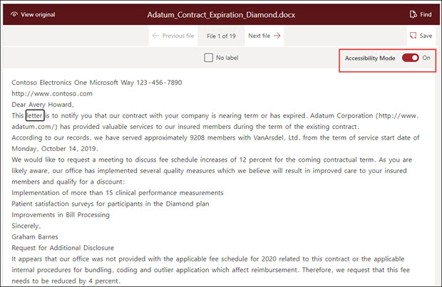

# SharePoint 신텍스 접근성 모드

[SharePoint Syntex에서](index.md)사용자는 예제 문서로 작업할 때 모든 모델 교육 단계(레이블, 교육, 테스트)에서 접근성 모드를 켜는 기능을 사용할 수 있습니다. 접근성 모드를 사용하면 저시계 사용자가 문서 뷰어에서 항목을 탐색하고 레이블을 지정하면 키보드 접근성을 보다 쉽게 사용할 수 있습니다.

이렇게 하면 사용자가 키보드를 사용하여 문서 뷰어의 텍스트를 탐색하고 선택한 값뿐만 아니라 추가 예제 문서로 모델을 학습할 때 선택한 값뿐만 아니라 작업(예: 선택한 텍스트에서 레이블 지정 또는 레이블 제거) 또는 예측된 레이블 값에 대한 설명을 들을 수 있습니다. 

## 요구 사항

내레이션의 오디오를 재생하려면 Windows 10  시스템의 내레이터 설정에서 내레이터 앱을 켜야 합니다.

## 키보드 사용자에 대한 레이블 지정

접근성 모드를 사용하는 키보드 사용자의 경우 뷰어의 예제 문서에서 텍스트에 레이블을 지정하는 경우 다음 키를 사용할 수 있습니다.

- 탭: 앞으로 이동하고 다음 단어를 선택합니다.
- 탭 + Shift: 뒤로 이동하고 이전 단어를 선택합니다.
- Enter: 레이블을 지정하거나 선택한 단어에서 레이블을 제거합니다.
- 앞 방향 화살표: 선택한 단어의 개별 문자를 따라 앞으로 이동
- 뒤로 화살표: 선택한 단어의 개별 문자를 뒤로 움직입니다.

> [!NOTE]
> 단일 레이블에 대해 여러 단어에 레이블을 지정하는 경우 각 단어에 레이블을 지정해야 합니다.

## 내레이션

내레이터 사용자가 접근성 모드를 사용하는 경우 키보드 사용자가 뷰어의 예제 문서를 탐색할 수 있도록 설명된 동일한 키보드 탐색을 사용 합니다.

예제 문서 및 레이블 문자열 값을 탐색할 때 내레이터는 사용자에게 다음과 같은 오디오 프롬프트를 제공합니다.

- 키보드를 사용하여 문서 뷰어를 탐색하면 내레이터 오디오에서 선택한 문자열을 지정합니다.
- 선택한 문자열 내에서 내레이터 오디오는 앞이나 뒤로 화살표를 사용하여 문자열의 각 문자를 선택할 때 해당 문자를 지정합니다.
- 레이블이 지정된 문자열을 선택하면 내레이터가 값을 지정한 다음 "레이블이 지정"됩니다.  예를 들어 레이블 값이 "Contoso"이면 "Costoso 레이블이 지정"으로 표시됩니다. 
- 교육 탭에서 예측된 문자열만 문서 뷰어에서 선택하면 내레이터 오디오에 값이 설명된 다음 "예측"됩니다. 이는 교육에서 사용자가 레이블을 지정한 값과 일치하지 않는 파일의 값을 예측할 때 발생합니다.
- 교육 탭에서 레이블이 지정되고 예측된 문서 뷰어에서 문자열을 선택하면 내레이터 오디오에 값이 설명된 다음 "레이블이 지정되고 예측됩니다."가 표시됩니다. 이는 교육에 성공하고 예측된 값과 사용자 레이블이 일치할 때 발생합니다.

문자열에 레이블이 지정되거나 보기에서 레이블이 제거된 후 내레이터 오디오는 종료하기 전에 변경 내용을 저장할지 경고합니다.

## 참고 항목

[추출기 만들기](create-an-extractor.md) 

[분류자 만들기](create-a-classifier.md) 

 

  
  

