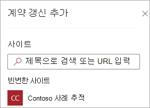
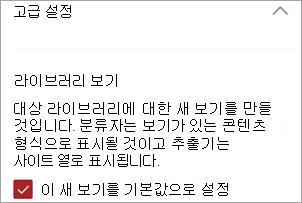
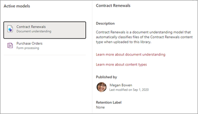

# Microsoft SharePoint 구문에서 문서 이해 모델 적용

 

> [!VIDEO https://www.microsoft.com/videoplayer/embed/RE4CSoL]

 

문서 이해 모델을 게시한 후 테넌트의 하나 이상의 SharePoint 라이브러리에 적용할 Microsoft 365 있습니다.

> [!NOTE]
> 액세스할 수 있는 문서 라이브러리에만 모델을 적용할 수 있습니다.

## 문서 라이브러리에 모델 적용

SharePoint 문서 라이브러리에 모델 적용하기:

1. 모델 홈 페이지의 라이브러리에 모델 적용 타일에서 모델 **적용을 선택합니다.**  또는 모델이 **적용되는 위치 섹션에서** **+라이브러리 추가 를 선택합니다.**

    

2. 그런 다음, 모델을 적용하려는 문서 라이브러리가 포함된 SharePoint 사이트를 선택할 수 있습니다. 사이트가 목록에 표시되지 않는 경우, 검색 상자를 사용하여 찾습니다.

    

    > [!NOTE]
    > 모델을 적용할 문서 라이브러리에 대한 *목록 관리* 권한 또는 *편집* 권한이 있어야 합니다.

3. 사이트를 선택한 후, 모델을 적용할 문서 라이브러리를 선택합니다. 샘플에서 *Contoso 사례 추적* 사이트의 *Documents* 문서 라이브러리를 선택합니다.

    

4. 모델이 콘텐츠 형식에 연결되어 있기 때문에 라이브러리에 모델을 적용하면 열로 표시하기 위해 추출한 레이블이 있는 콘텐츠 형식 및 보기가 추가됩니다. 기본적으로 이 보기는 라이브러리의 기본 보기입니다. 그러나 선택적으로 고급 설정을 선택하고 이 새 보기를  기본 보기로 설정 확인란의 선택을 취소하여 기본 보기로 설정하지 않을 **수도** 있습니다.

    

5. 라이브러리에 모델을 적용하려면 **추가** 를 선택합니다.

6. 모델 홈 페이지의 모델이  적용된 위치 섹션에 나열된 모델 사이트의 SharePoint 표시됩니다.

7. 문서 라이브러리로 이동하여 모델의 문서 라이브러리 보기에 있는지 확인합니다. 문서 라이브러리 이름 옆에 있는 정보 단추를 선택하면 문서 라이브러리에 모델이 적용되었다는 메시지가 표시됩니다.

     

    **활성 모델 보기** 선택하여 문서 라이브러리에 적용된 모델에 대한 세부 정보를 볼 수 있습니다.

8. **활성 모델** 창에서 문서 라이브러리에 적용된 모델을 볼 수 있습니다. 모델을 선택하여 모델에 대한 설명, 모델 게시자, 모델이 분류된 파일에 보존 레이블을 적용하는 경우와 같은 모델에 대한 자세한 정보를 확인합니다.

     

문서 라이브러리에 모델을 적용한 후, 사이트에 문서 업로드를 시작하고 결과를 볼 수 있습니다.

이 모델은 모델의 연결된 콘텐츠 형식이 있는 파일 및 폴더를 식별하고 보기에 나열합니다. 모델에 추출기가 있는 경우 각 파일 또는 폴더에서 추출하는 데이터의 열이 보기에 표시됩니다.

## 문서 라이브러리에 이미 있는 파일 및 폴더 콘텐츠에 모델 적용

적용된 모델은 적용된 후 문서 라이브러리에 업로드된 모든 파일 및 폴더 콘텐츠를 처리하기는 하지만, 다음을 실행하여 모델을 적용하기 전에 문서 라이브러리에 이미 있는 파일 및 폴더 콘텐츠에 대한 모델을 실행할 수도 있습니다.

1. 문서 라이브러리에서 모델에서 처리하려는 파일 및 폴더를 선택합니다.

2. 파일 및 폴더를 선택한 후 **문서** 라이브러리 리본 메뉴에 분류 및 추출이 나타납니다. **분류 및 추출** 을 선택합니다.

       

3. 선택한 파일 및 폴더가 처리될 큐에 추가됩니다.

    > [!NOTE]
    > 분류에 걸릴 수 있는 시간을 나타내는 메시지가 표시됩니다. 파일만 선택한 경우 분류에 최대 30분이 걸릴 수 있습니다. 하나 이상의 폴더를 선택한 경우 분류에 최대 24시간이 걸릴 수 있습니다.

### 분류 날짜 필드

문서 SharePoint Syntex 또는 양식 처리 모델이 문서 라이브러리에 적용될 때 분류 날짜 필드가 라이브러리 schema에 포함됩니다.  기본적으로 이 필드는 비어 있습니다. 그러나 문서가 모델에 의해 처리 및 분류될 때 이 필드는 완료 날짜-시간 스탬프로 업데이트됩니다. 

    

분류 **날짜** 필드는 Syntex 콘텐츠 이해 모델이 파일 또는 폴더 처리를 완료하고 분류 날짜 필드를 업데이트한 후 Power Automate 흐름을 실행하기 위해 콘텐츠 이해 모델 트리거에 의해 파일을 분류하는 경우 필드에 **사용됩니다.** 

   

그런 **다음 콘텐츠** 이해 모델 트리거에 의해 파일이 분류되는 경우 파일 또는 폴더에서 추출된 정보를 사용하여 다른 워크플로를 시작할 수 있습니다.

## 참고 항목

[분류자 만들기](create-a-classifier.md)

[추출기 만들기](create-an-extractor.md)

[문서 이해 개요](document-understanding-overview.md)
