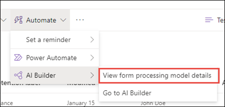
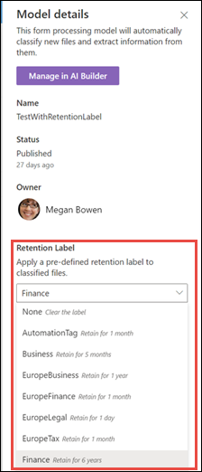

# SharePoint Syntex에서 모델에 보존 레이블 적용Apply a retention label to a model in SharePoint Syntex

 

> [!VIDEO https://www.microsoft.com/videoplayer/embed/RE4GydO]  

 

Microsoft SharePoint Syntex의 모델에 [보존 레이블](../compliance/retention.md)을 쉽게 적용할 수 있습니다.You can easily apply a [retention label](../compliance/retention.md) to a model in Microsoft SharePoint Syntex. 문서 이해 모델과 양식 처리 모델 모두에서 이 작업을 할 수 있습니다.You can do this for both document understanding and form processing models.

보존 레이블을 사용하여 모델이 식별하는 문서에 보존 설정을 적용할 수 있습니다.Retention labels let you apply retention settings to the documents that your models identify.  예를 들어, 모델이 문서 라이브러리에 업로드된 *보험 통지* 문서를 식별할 뿐만 아니라, 지정된 기간 동안(예를 들어, 다음 5개월) 문서 라이브러리에서 이러한 문서를 삭제할 수 없도록 *비즈니스* 보존 태그를 적용합니다.For example, you want your model to not only identify any *Insurance notice* documents that are uploaded to your document library, but to also apply a *Business* retention tag to them so that these documents cannot be deleted from the document library for the specified time period (the next five months, for example).

모델 홈페이지의 문서 설정을 통해 기존 보존 레이블을 모델에 적용할 수 있습니다.You can apply a pre-existing retention label to your model through your model settings on your model's home page. 

> [!Important]
> 문서 이해 모델에 적용하기 위해 보존 레이블을 사용하려면 [Microsoft 365 준수 센터에서 만들고 게시](../compliance/create-apply-retention-labels.md#how-to-create-and-publish-retention-labels)해야 합니다.For retention labels to be available to apply to your document understanding models, they need to be [created and published in the Microsoft 365 Compliance Center](../compliance/create-apply-retention-labels.md#how-to-create-and-publish-retention-labels).

## 문서 이해 모델에 보존 레이블 추가To add a retention label to a document understanding model

1. 모델 홈페이지에서 **모델 설정** 을 선택합니다.From the model home page, select **Model settings**. 
2. **모델 설정** 의 **보안 및 준수** 섹션에서 **보존 레이블** 메뉴를 선택하여 모델에 적용 가능한 보존 레이블 목록을 확인합니다.In **Model settings**, in the **Security and compliance** section, select the **Retention label** menu to see a list of retention labels that are available for your to apply to the model. 
   
3. 모델에 적용할 보존 레이블을 선택하고 **저장** 을 선택 합니다.Select the retention label you want to apply to the model, and then select **Save**. 

모델에 보존 레이블을 적용한 후, 다음에 적용할 수 있습니다.After applying the retention label to your model, you are able to apply it to a:
- 새 문서 라이브러리New document library
- 모델이 이미 적용된 문서 라이브러리Document library to which the model is already applied
 
## 모델이 이미 적용된 문서 라이브러리에 보존 레이블 적용Apply the retention label to a document library to which the model is already applied

문서 이해 모델이 이미 문서 라이브러리에 적용된 경우, 다음을 수행하여 보존 레이블 업데이트를 동기화하여 문서 라이브러리에 적용할 수 있습니다.If your document understanding model has already been applied to a document library, you can do the following to sync your retention label update to apply it to the document library: 

1. 모델 홈페이지의 **이 모델을 사용하는 라이브러리** 섹션에서 보존 레이블 업데이트를 적용할 문서 라이브러리를 선택합니다.On your model home page, in the **Libraries with this model** section, select the document library to which you want to apply the retention label update.   
2. **동기화** 를 선택합니다.Select **Sync**.  
   

업데이트를 적용한 후 모델에 동기화하면, 다음을 실행하여 이 업데이트가 적용되었는지 확인할 수 있습니다.After applying the update and syncing it to your model, you can confirm that it has been applied by doing the following:

1. 컨텐츠 센터의 **이 모델이있는 라이브러리** 섹션에서 업데이트된 모델이 적용된 라이브러리를 클릭하세요.In the content center, in the **Libraries with this model** section, click on the library to which your updated model was applied.  
2. 문서 라이브러리 보기에서 정보 아이콘을 선택하여 모델 속성을 확인합니다.In your document library view, select the information icon to check the model properties.   
3. **활성 모델** 목록에서 업데이트된 모델을 선택합니다.In the **Active models** list, select your updated model. 
4. **보존 레이블** 섹션에서 적용된 보존 레이블의 이름이 나타납니다.In the **Retention label** section you will see the name of the applied retention label. 

문서 라이브러리의 모델 보기 페이지에서 새 **보존 레이블** 열이 표시됩니다.On your model's view page in your document library, a new **Retention label** column will display.  모델이 해당 콘텐츠 유형에 속한 것으로 식별하는 파일을 분류 하고 라이브러리 보기에 나열하는 경우, 보존 레이블 열에 모델을 통해 적용된 보존 레이블 이름도 표시됩니다.As your model classifies files it identifies as belonging to it's content type and lists them in the library view, the Retention label column will also display the name of the retention label that has been applied to it through the model.

예를 들어, 모델이 식별하는 모든 *보험 통지* 문서에는 *비지니스* 보존 레이블도 적용되어 문서 라이브러리에서 5개월 동안 삭제되지 않습니다.For example, all *Insurance notice* documents that your model identifies will also have the *Business* retention label applied to them, preventing them from being deleted from the document library for five months. 문서 라이브러리에서 파일을 삭제하려는 경우, 보존 레이블이 적용되었기 때문에 삭제가 허용되지 않는다는 오류가 표시됩니다.If an attempt is made to delete the file from the document library, an error will display saying it is not allowed because of the applied retention label.

## 양식 처리 모델에 보존 레이블을 추가하는 방법To add a retention label to a form processing model

> [!Important]
> 양식 처리 모델에 적용하기 위해 보존 레이블을 사용하려면 [Microsoft 365 준수 센터에서 만들고 게시](../compliance/create-apply-retention-labels.md#how-to-create-and-publish-retention-labels)해야 합니다.For retention labels to be available to apply to your form processing model, they need to be [created and published in the Microsoft 365 Compliance Center](../compliance/create-apply-retention-labels.md#how-to-create-and-publish-retention-labels).

모델을 만들 때 양식 처리 모델에 보존 레이블을 적용하거나 기존 모델에 적용할 수 있습니다.You can either apply a retention label to a form processing model when you are creating a model, or apply it to an existing model.

### 양식 처리 모델을 만들 때 보존 레이블을 추가하는 방법To add a retention label when you create a form processing model

1. [새 양식 처리 모델](./create-a-form-processing-model.md)을 만들 때 <b>고급 설정을 선택합니다.</b>When you are [creating a new form processing model](./create-a-form-processing-model.md), select <b>Advanced settings.</b>
2. <b>고급 설정</b>의 <b>보존 레이블</b> 섹션에서 메뉴를 선택하고 모델을 적용하려는 보존 레이블을 선택합니다.</b>In <b>Advanced settings</b>, in the <b>Retention label</b> section, select the menu and then select the retention label you want to apply to the model.</b>

 
      

3.  나머지 모델 설정을 완료한 후 <b>만들기</b>를 선택하요 모델을 빌드합니다.After you've completed your remaining model settings, select <b>Create</b> to build your model.

### 기존 양식 처리 모델에 보존 레이블을 추가하는 방법To add a retention label to an existing form processing model

기존 양식 처리 모델에 보존 레이블을 다양한 방법으로 추가할 수 있습니다.You can add a retention label to an existing form processing model in different ways:
- 문서 라이브러리의 자동화 메뉴를 통해Through the Automate menu in the document library
- 문서 라이브러리의 모델 활성화 설정을 통해Through the Active model settings in the document library 

#### 자동화 메뉴를 통해 기존 양식 처리 모델에 보존 레이블을 추가하는 방법To add a retention label to an existing form processing model through the Automate menu

모델이 적용된 문서 라이브러리의 자동화 메뉴를 통해 소유한 기존 양식 처리 모델에 보존 레이블을 추가할 수 있습니다.You can add a retention label to an existing form processing model that you own through the Automate menu in the document library in which the model is applied.

1. 양식 처리 모델이 적용된 문서 라이브러리에서 <b>자동화</b> 메뉴를 선택하고 <b>AI 작성기</b>를 선택한 다음 <b>양식 처리 모델 세부 정보 보기</b>를 선택합니다.In your document library to which the form processing model is applied, select the <b>Automate</b> menu, select <b>AI Builder</b>, then select <b>View form processing model details</b>.

    

2. 모델 세부 정보의 <b>보존 레이블</b> 섹션에서 적용할 보존 레이블을 선택합니다.In the model details, in the <b>Retention Label</b> section, select the retention label you want to apply.  그런 다음 <b>저장</b>을 선택합니다.Then select <b>Save</b>.

       

#### 활성 모델 설정에서 기존 양식 처리 모델에 보존 레이블을 추가하는 방법To add a retention label to an existing form processing model in the active model settings

모델이 적용된 문서 라이브러리의 모델 설정 활성화를 통해 소유한 기존 양식 처리 모델에 보존 레이블을 추가할 수 있습니다.You can add a retention label to an existing form processing model that you own through the Active model settings in the document library in which the model is applied.

1. 모델이 적용된 SharePoint 문서 라이브러리에서 <b>활성 모델 보기</b> 아이콘을 선택하고 <b>활성 모델 보기</b>를 선택합니다.</b>In the SharePoint document library in which the model is applied, select the <b>View active models</b> icon, and then select <b>View active models</b>.</b>

     

2. <b>활성 모델</b>에서 보존 레이블을 적용할 양식 처리 모델을 선택합니다.In <b>Active models</b>, select the form processing model to which you want to apply the retention label.

       

3. 모델 세부 정보의 <b>보존 레이블</b> 섹션에서 적용할 보존 레이블을 선택합니다.In the model details, in the <b>Retention Label</b> section, select the retention label you want to apply.  그런 다음 <b>저장</b>을 선택합니다.Then select <b>Save</b>.

> [!NOTE]
> 모델 설정 창의 모델 소유자만 편집할 수 있습니다.You must be the model owner for the model settings pane to be editable. 

## 참고 항목See Also
[분류자 만들기Create a classifier](create-a-classifier.md)

[추출기 만들기Create an extractor](create-an-extractor.md)

[문서 이해 개요Document Understanding overview](document-understanding-overview.md)
