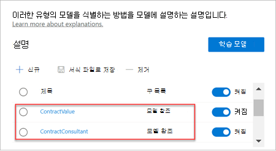

# Microsoft SharePoint Syntex에서 분류자 만들기

 

> [!VIDEO https://www.microsoft.com/videoplayer/embed/RE4CL0R]  

 

분류자는 문서 유형의 식별 및 분류를 자동화하는 데 사용할 수 있는 모델 유형입니다. 예를 들어 다음 그림과 같이 문서 라이브러리에 추가되는 모든 *계약 갱신* 문서를 식별할 수 있습니다.

분류자를 만들면 모델에 연결되는 새 [SharePoint 콘텐츠 유형](/sharepoint/governance/content-type-and-workflow-planning#content-type-overview)을 만들 수 있습니다.

분류자를 만들 때 모델을 정의하려면 *설명* 을 만들어야 합니다. 이 기능을 통해 해당 문서 유형을 일관되게 찾을 수 있는 공통 데이터를 기록할 수 있습니다. 

문서 유형의 예제("example files")를 사용하여 콘텐츠 유형이 같은 파일을 식별하도록 모델을 "교육"합니다.

분류자를 만들려면 다음을 수행해야 합니다.
1. 모델 이름을 지정합니다.
2. 예제 파일을 추가합니다.
3. 예제 파일에 레이블을 지정합니다.
4. 설명을 만듭니다.
5. 모델을 테스트합니다.

> [!NOTE]
> 모델이 분류자를 사용하여 문서 유형을 식별하고 분류하는 동안 모델에 의해 식별되는 각 파일에서 특정 정보를 가져오도록 선택할 수 있습니다. 모델에 추가할 **추출기** 를 만들어 해당 작업을 수행할 수 있습니다. [추출기 만들기](create-an-extractor.md)를 참조하세요.

## 모델 이름 지정

모델을 만들기 위한 첫 번째 단계는 이름을 지정하는 것입니다.

1. 콘텐츠 센터에서 **새 모델** 을 선택한 다음 **모델 만들기** 를 선택합니다.
2. **새 문서 이해 모델** 창에서 **이름** 필드에 모델 이름을 입력합니다. 예를 들어 계약 갱신 문서를 식별하려는 경우 *계약 갱신* 모델에 이름을 지정할 수 있습니다.
3. **만들기** 를 선택합니다. 이 작업을 통해 모델에 대한 홈페이지를 만들 수 있습니다. 

    

모델을 만들 때 새 사이트 콘텐츠 유형도 만듭니다. 콘텐츠 유형은 공통 특성을 가지는 문서의 범주를 나타내며 해당 특정 콘텐츠에 대한 열 또는 메타데이터 속성 모음을 공유합니다. SharePoint 콘텐츠 유형은 [콘텐츠 유형 갤러리](https://support.microsoft.com/office/create-or-customize-a-site-content-type-27eb6551-9867-4201-a819-620c5658a60f)를 통해 관리됩니다. 이 예제에서는 모델을 만들 때 새 *계약 갱신* 콘텐츠 유형으로 만듭니다.

SharePoint 콘텐츠 유형 갤러리에서 해당 모델을 기존 엔터프라이즈 콘텐츠 유형에 매핑하여 해당 스키마를 사용하려면 **고급 설정** 을 선택합니다. 엔터프라이즈 콘텐츠 유형은 SharePoint 관리 센터의 콘텐츠 유형 허브에 저장되며 테넌트의 모든 사이트에 등록됩니다. 기존 콘텐츠 유형을 사용하고 해당 스키마를 활용하여 식별 및 분류에 도움을 줄 수 있으나 모델이 식별하는 파일에서 정보를 추출하도록 교육해야 합니다. 

## 예제 파일 추가

모델 홈페이지에서 모델을 교육하는 데 필요한 예제 파일을 추가하여 문서 유형을 식별합니다.  
 

> [!VIDEO https://www.microsoft.com/videoplayer/embed/RE4D0iX] 

 

> [!NOTE]
> 분류자와 [추출기 교육](create-an-extractor.md)에서 동일한 파일을 사용해야 합니다. 추후에 언제든지 추가하려는 옵션이 있을 수 있지만 일반적으로 전체 예제 파일 집합을 추가합니다. 일부 모델에 레이블을 지정하여 모델을 교육하고 레이블이 지정되지 않은 나머지 모델을 테스트하여 모델 적합성을 평가합니다. 

교육 설정의 경우 긍정 예제 및 부정 예제 모두 사용할 수 있습니다.
- 긍정 예제: 문서 유형을 나타내는 문서입니다. 이러한 유형의 문서에 항상 포함되는 문자열과 정보를 다룹니다.
- 부정 예제: 분류하려는 문서를 나타내지 않는 기타 모든 문서입니다. 

모델을 교육하려면 5개 이상의 긍정 예제와 1개 이상의 부정 예제를 사용하세요.  교육 프로세스 이후 모델을 테스트하기 위해 추가 항목을 만들 수 있습니다.

예제 파일을 추가하려면 다음을 수행합니다.

1. 모델 홈페이지의 **예제 파일 추가** 타일에서 **파일 추가** 를 클릭합니다.
2. **모델에 대한 예제 파일 선택** 페이지에서 콘텐츠 센터의 교육 파일 라이브러리에 있는 예제 파일을 선택합니다. 아직 업로드되지 않은 경우에는 **업로드** 를 클릭하여 지금 파일 업로드를 선택하고 교육 파일 라이브러리에 해당 파일을 복사합니다.
3. 모델을 교육하는 데 사용할 예제 파일을 선택한 후 **추가** 를 클릭합니다.

     

## 예제 파일 레이블 지정

예제 파일을 추가한 후에 해당 파일을 긍정 예제 또는 부정 예제 중 하나로 레이블을 지정해야 합니다.

1. 모델 홈페이지의 **파일 분류 및 교육 실행** 타일에서 **분류자 교육** 을 클릭합니다.
   이를 통해 뷰어에 첫 번째 파일과 함께 예제 파일 목록이 표시되는 레이블 페이지가 표시됩니다.
2. 첫 번째 예제 파일의 맨 위에 있는 뷰어에서 파일이 사용자가 방금 만든 모델의 예제인지 묻는 텍스트를 확인할 수 있습니다. 긍정 예제인 경우 **예** 를 선택합니다. 부정 예제인 경우 **아니요** 를 선택합니다.
3. 왼쪽에 있는 **레이블이 지정된 예제** 목록에서 예제로 사용하려는 추가 파일을 선택하고 해당 파일에 레이블을 지정합니다. 

     

> [!NOTE]
> 5개 이상의 긍정 예제를 레이블 지정합니다. 1개 이상의 부정 예제에도 레이블을 지정해야 합니다. 

## 설명을 만듭니다.

다음 단계에서는 교육 페이지에 대한 설명을 만듭니다. 설명은 모델이 문서를 인식하는 방법을 이해하는 데 도움이 됩니다. 예를 들어 계약 갱신 문서에는 항상 *추가 공개에 대한 요청* 텍스트 문자열이 포함되어 있습니다.

> [!Note]
> 추출기와 함께 사용하는 경우 설명을 통해 문서에서 추출하려는 문자열을 식별합니다. 

설명을 만들려면 다음을 수행합니다.

1. 모델 홈페이지에서 **교육** 탭을 선택하여 교육 페이지로 이동합니다.
2. 교육 페이지의 **교육된 파일** 섹션에서 이전에 레이블을 지정한 샘플 파일 목록을 확인할 수 있습니다. 목록에서 긍정 예제 파일 중 하나를 선택하여 뷰어에 표시합니다.
3. 설명 섹션에서 **새 설명** 을 선택한 다음 **빈 항목** 을 선택합니다.
4. **설명 만들기** 페이지에서 다음을 수행합니다. 
    a. **이름** 을 입력합니다. (예: &quot;공개 차단") 
    b. **유형** 을 선택합니다. 샘플의 경우 텍스트 문자열을 추가하므로 **구 목록** 을 선택합니다. 
    c. **여기에 입력** 상자에 문자열을 입력합니다. 샘플의 경우 "추가 공개 요청"을 추가합니다. 문자열이 대/소문자를 구분해야 하는 경우 **대/소문자 구분** 을 선택할 수 있습니다. 
    d. **저장** 을 클릭합니다.

     
    
5. 이제 콘텐츠 센터는 사용자가 만든 설명이 레이블이 지정된 남은 예제 파일을 긍정 예제 및 부정 예제로 올바르게 식별할 수 있는지 확인할 수 있습니다. **교육된 파일** 섹션에서 교육이 완료된 이후 **평가** 열을 점검하여 결과를 확인할 수 있습니다. 파일에는 사용자가 만든 설명이 긍정 또는 부정으로 레이블을 지정한 사항과 일치하는지 여부를 나타내는 **일치** 값이 표시됩니다.

     

    레이블이 지정된 파일에서 **불일치** 를 나타난 경우 모델에 문서 유형을 식별하기 위한 보다 자세한 정보를 제공하여 추가 설명을 만들어야 할 수 있습니다. 이 경우에는 파일을 클릭하여 불일치가 발생한 원인을 보다 자세하게 알아볼 수 있습니다.

추출기를 학습한 후에는 학습된 추출기를 설명으로 사용할 수 있습니다. **설명** 섹션에서 **모델 참조** 로 표시됩니다.

## 모델 테스트

레이블이 지정된 샘플 파일에 일치가 나타난 경우 이제 해당 모델이 이전에 확인하지 못한 레이블이 지정되지 않은 남은 예제 파일에서 모델을 테스트할 수 있습니다. 이는 선택 사항이지만, 모델을 전에 보지 못한 파일에서 테스트하여 모델 사용 전에 모델의 "적합성"이나 준비 상태를 평가하는 데 유용한 단계입니다.

1. 모델 홈페이지에서 **테스트** 탭을 선택합니다. 이 경우 레이블이 지정되지 않은 샘플 파일에서 모델이 실행됩니다.
2. **테스트 파일** 목록에서 예제 파일이 표시되고 모델이 해당 예제 파일을 긍정 예제로 예상하는지 부정 예제로 예상하는지 보여줍니다. 이 정보를 사용하여 문서를 식별하는 데 필요한 분류자 효율성을 결정할 수 있습니다.

     

## 참고 항목
[추출기 만들기](create-an-extractor.md)

[문서 이해 개요](document-understanding-overview.md)

[설명 유형](explanation-types-overview.md)

[모델 적용](apply-a-model.md) 

[SharePoint Syntex 접근성 모드](accessibility-mode.md)