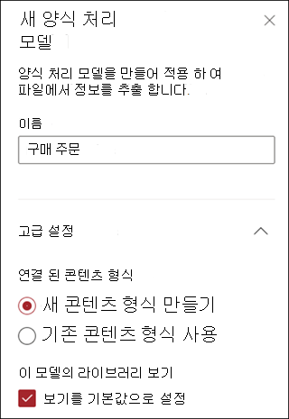
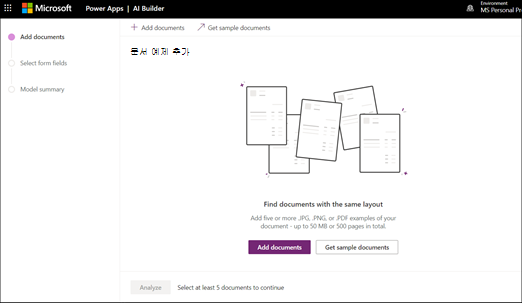
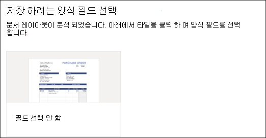

# Microsoft SharePoint Syntex에서 양식 처리 모델을 만들기

 

> [!VIDEO https://www.microsoft.com/videoplayer/embed/RE4GnhN]  

 

Microsoft PowerApps의 기능인 [AI Builder](https://docs.microsoft.com/ai-builder/overview)를 사용하여 SharePoint Syntex 사용자는 SharePoint 문서 라이브러리에서 직접 [양식 처리 모델](form-processing-overview.md)을 만들 수 있습니다. 

양식 처리 모델을 만드는 과정은 다음과 같습니다.
 - 1 단계: 양식 처리 모델을 만들어 콘텐츠 유형 만들기
 - 2 단계: 예제 파일 추가 및 분석
 - 3 단계: 양식 필드 선택
 - 4 단계: 모델 교육 및 테스트
 - 5 단계: 모델 게시
 - 6 단계: 모델 사용

## 요구 사항

사용으로 설정된 SharePoint 문서 라이브러리에서만 양식 처리 모델을 만들 수 있습니다. 양식 처리를 사용하는 경우, 문서 라이브러리의 **자동화** 메뉴에서 **AI Builder** **"양식 처리 모델 만들기”** 를 볼 수 있습니다. 문서 라이브러리에서 프로세스를 사용하도록 설정해야 하는 경우 SharePoint 관리자에게 문의해야 합니다.

  

## 1 단계: 양식 처리 모델 만들기

양식 처리 모델을 만드는 첫 단계는 먼저 이름을 지정하고 새 콘텐츠 유형을 정의한 다음 이를 위한 새 문서 라이브러리 보기를 만드는 것입니다.

1. 문서 라이브러리에서 **자동화** 메뉴를 선택하고 **AI Builder** 를 선택한 다음, **양식 처리 모델 만들기** 를 선택합니다.

     

2. **새 양식 처리 모델** 창에서 **이름** 필드에 모델 이름을 입력합니다(예: *구매 주문서*).

      

3. 양식 처리 모델을 만들 때 새 SharePoint 콘텐츠 유형을 만듭니다. SharePoint 콘텐츠 유형은 공통 특성을 가진 문서의 범주를 나타내며 해당 콘텐츠에 대한 열 또는 메타데이터 속성 모음을 공유합니다. SharePoint 콘텐츠 유형은 [콘텐츠 유형 갤러리]()를 통해 관리됩니다.

    SharePoint 콘텐츠 형식 갤러리에서 이 모델을 기존 콘텐츠 형식에 매핑하여 해당 스키마를 사용하려면 **고급 설정** 을 선택합니다. 

4. 모델은 추출된 데이터에 대한 문서 라이브러리에 새 보기를 만듭니다. 기본 보기로 설정하지 않으려면 **보기를 기본값으로 설정** 을 선택 취소합니다.

5. **만들기** 를 선택합니다.

## 2단계: 문서 추가 및 분석

새 양식 처리 모델을 만든 후에, 브라우저가 새 PowerApps AI Builder 양식 처리 모델 페이지를 엽니다. 이 페이지에서 예제 문서를 추가하 고 분석할 수 있습니다.  

> [!NOTE]
> 사용할 예제 파일을 찾을 때는 [양식 처리 모델 입력 문서 요구 사항 및 최적화 팁](https://docs.microsoft.com/ai-builder/form-processing-model-requirements)을 참조하세요. 

     
 
1. 추출할 수 있는 이름 지정된 값 쌍의 확인을 위해 분석된 예제 문서 추가를 시작하려면 **문서 추가** 를 선택합니다. 그런 다음 **로컬 저장소에서 업로드**, **SharePoint** 또는 **Azure Blob 저장소** 중에서 선택할 수 있습니다. 교육용으로 5개 이상의 파일을 사용해야 합니다.

2. 파일을 추가한 후 **분석** 을 선택하여 공통 정보가 모든 파일인지 확인합니다. 완료하는 데 몇 분 정도 걸릴 수 있습니다.  
 
      

3. 파일을 분석한 후 **저장할 양식 필드를 선택** 페이지에서 감지된 필드를 볼 파일을 선택합니다. 

      

## 3단계: 양식 필드 선택

필드에 대한 문서를 분석한 후, 찾은 필드를 확인하고 저장할 필드를 식별할 수 있습니다. 저장된 필드는 모델의 문서 라이브러리 보기에 열로 표시되고 각 문서에서 추출된 값을 표시합니다.

1. 다음 페이지는 샘플 파일 중 하나를 표시하고 시스템에서 자동으로 탐지한 모든 공통 필드를 강조 표시합니다.  

      

2. 저장하려는 필드를 선택하고 확인란을 선택하여 선택 항목을 확인합니다. 예를 들어, 구매 주문서 모델에서 *날짜*, *PO*, *전체* 필드를 선택합니다. 원하는 경우 필드 이름을 바꾸도록 선택할 수도 있습니다. 

      

3. 필드가 분석에 의해 감지되지 않았다면, 추가하도록 선택할 수 있습니다. 추출하려는 정보를 강조 표시하고 이름 상자에 원하는 이름을 입력합니다. 그런 다음 확인란을 선택합니다. 나머지 샘플 파일에서 감지되지 않은 필드를 확인해야 합니다.

4. 저장하려는 필드를 선택한 후, **필드 확인** 을 클릭합니다.  
 
      
 
5. **저장할 양식 필드를 선택** 페이지에서 선택한 필드 수가 표시됩니다. **완료** 를 선택합니다.

## 4단계: 모델 교육 및 테스트

저장할 필드를 선택한 후 **모델 요약** 페이지를 통해 모델을 교육하고 테스트할 수 있습니다.

1. **모델 요약 페이지** 에서 저장된 필드가 **선택한 필드** 섹션에 표시됩니다. **교육** 을 선택하여 예제 파일에 대한 교육을 시작할 수 있습니다. 완료하는 데 몇 분 정도 걸릴 수 있습니다. 

       

2. 교육이 완료되었다는 알림이 표시되면 **세부 정보 페이지로 이동** 을 선택합니다. 

3. **모델 세부 정보** 페이지에서 **빠른 테스트** 를 선택하여 모델 작동 방식을 테스트하도록 선택할 수 있습니다. 이렇게 하면 페이지에 파일을 끌어서 놓는 방법으로 필드가 감지되는지 확인할 수 있습니다.

      

2. 교육이 완료되었다는 알림이 표시되면 **세부 정보 페이지로 이동** 을 선택합니다. 

3. **모델 세부 정보** 페이지에서 **빠른 테스트** 를 선택하여 모델 작동 방식을 테스트하도록 선택합니다. 이렇게 하면 페이지에 파일을 끌어서 놓는 방법으로 필드가 감지되는지 확인할 수 있습니다.

## 5단계: 모델 게시

1. 모델의 결과가 만족스러우면 **게시** 를 선택하여 사용할 수 있도록 합니다.

2. 모델이 게시되면 **모델 사용** 을 선택합니다. 그러면 SharePoint 문서 라이브러리에서 실행할 수 있는 PowerAutomate 흐름이 만들어지고 모델에서 식별된 필드를 추출한 다음 **흐름 만들기** 를 선택합니다.
  
3. 작업이 완료되면 **흐름이 성공적으로 만들어졌습니다** 라는 메시지가 표시됩니다.
 
## 6 단계: 모델 사용

모델을 게시하고 PowerAutomate 흐름을 만든 후, SharePoint 문서 라이브러리에서 모델을 사용할 수 있습니다.

1. 모델을 게시한 후 **SharePoint로 이동** 을 선택하여 문서 라이브러리로 이동합니다.

2. 문서 라이브러리 모델 보기에서 선택한 필드가 열로 표시된 것을 확인합니다. 

      

3. **문서** 옆에 있는 정보 링크는 양식 처리 모델이 문서 라이브러리에 적용되었음을 나타냅니다.

       

4. 문서 라이브러리에 파일을 업로드합니다. 모델이 콘텐츠 유형으로 식별하는 모든 파일은 보기에 있는 파일을 나열하고 추출한 데이터를 열에 표시합니다. 

       

## 참고 항목
  
[파워 자동화 문서](https://docs.microsoft.com/power-automate/)

[교육: AI Builder를 사용하여 비즈니스 성과 개선](https://docs.microsoft.com/learn/paths/improve-business-performance-ai-builder/?source=learn)
