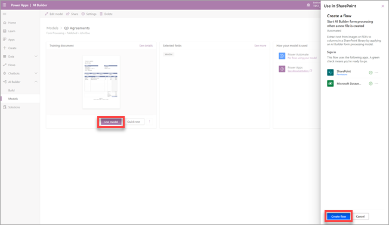

# Microsoft SharePoint Syntex에서 양식 처리 모델을 만들기

 

> [!VIDEO https://www.microsoft.com/videoplayer/embed/RE4GnhN]  

 

Microsoft PowerApps의 기능인 [AI Builder](/ai-builder/overview)를 사용하여 SharePoint Syntex 사용자는 SharePoint 문서 라이브러리에서 직접 [양식 처리 모델](form-processing-overview.md)을 만들 수 있습니다. 

양식 처리 모델을 만드는 작업에는 다음 단계들이 포함됩니다.

 - [1 단계: 양식 처리 모델 만들기](create-a-form-processing-model.md#step-1-create-a-form-processing-model)
 - [2단계: 문서 추가 및 분석](create-a-form-processing-model.md#step-2-add-and-analyze-documents)
 - [3단계: 필드 및 테이블 태그 지정](create-a-form-processing-model.md#step-3-tag-fields-and-tables)
 - [4단계: 모델 학습 및 게시](create-a-form-processing-model.md#step-4-train-and-publish-your-model)
 - [5단계: 모델 사용](create-a-form-processing-model.md#step-5-use-your-model)

## 요구 사항

사용으로 설정된 SharePoint 문서 라이브러리에서만 양식 처리 모델을 만들 수 있습니다. 양식 처리가 활성화된 경우 라이브러리 문서에서 **자동화** > **AI Builder** > **양식을 처리할 모델 만들기** 메뉴를 볼 수 있습니다. 문서 라이브러리에서 프로세스를 사용하도록 설정해야 하는 경우 SharePoint 관리자에게 문의해야 합니다.

 

## 1 단계: 양식 처리 모델 만들기

양식 처리 모델을 만드는 첫 번째 단계는 모델의 이름을 지정하고, 새 콘텐츠 형식을 정의하고, 새 문서 라이브러리 보기를 만드는 것입니다.

1. 문서 라이브러리에서 **자동화** 메뉴를 선택하고 **AI Builder** 를 선택한 다음 **양식을 처리할 모델 만들기** 를 선택합니다.

    

2. **양식을 처리할 모델 만들기** 패널의 **이름** 필드에 모델 이름(예: *구매 주문*)을 입력합니다.

     

3. 이제 SharePoint 문서 라이브러리에 있는 유사한 레이아웃(예: 청구서 또는 세금 문서)을 공유하는 구조화된 파일의 *컬렉션* 에서 정보를 자동으로 추출하고 저장할 수 있습니다. 이를 통해 여러 모델을 단일 모델로 구성하고 특정 테이블 항목 정보를 추출할 수 있습니다.

   컬렉션 이름은 모델이 적용된 문서 라이브러리의 전용 열에 저장되므로 동일한 모델에서 처리되는 다양한 파일 레이아웃을 구별할 수 있습니다.

   또한 추출된 테이블 정보는 지정된 목록에 저장되고 업로드된 파일과 연결되어 쉽게 확인하거나 추가 비즈니스 프로세스 자동화를 수행할 수 있습니다.

   연결된 목록으로 테이블 정보를 추출하려면 다음을 수행합니다.  

     1. **테이블에서 정보를 추출하시겠어요?** 섹션에서 **예** 를 선택합니다.

       

     2. **테이블 정보를 어디에 저장해야 하나요?** 섹션에서:
 
        - **새 목록**(기본 설정)을 선택하면 **새 목록 이름** 상자에 제안된 이름이 자동으로 제공됩니다. 원하는 경우 이름을 수정할 수 있습니다. 사이트 탐색에 목록을 표시하려면 **사이트 탐색에 표시** 확인란을 선택합니다.

        - **기존 목록** 을 선택한 경우 **선택한 목록** 상자에서 사용할 목록을 선택합니다.

4. 양식 처리 모델을 만들 때 새 SharePoint 콘텐츠 유형을 만듭니다. SharePoint 콘텐츠 유형은 공통 특성을 가진 문서의 범주를 나타내며 해당 콘텐츠에 대한 열 또는 메타데이터 속성 모음을 공유합니다. SharePoint 콘텐츠 형식은 SharePoint 관리 센터를 통해 관리됩니다.

   이 모델을 SharePoint 콘텐츠 유형 갤러리의 기존 콘텐츠 유형에 매핑하려면 **고급 설정** 을 선택합니다.

     

   1. **콘텐츠 유형** 섹션에서 새 콘텐츠 유형을 만들지 기존 콘텐츠 유형을 사용할지 선택합니다. 

   2. 기존 콘텐츠 유형을 사용하려면 **하나 선택** 을 선택하고 목록에서 콘텐츠 유형을 선택합니다.

   3. 모델은 추출된 데이터에 대한 문서 라이브러리에 새 보기를 만듭니다. 기본 보기로 설정하지 않으려면 **이 모델의 라이브러리 보기** 섹션에서 **보기를 기본값으로 설정** 확인란을 선택 취소합니다.

   4. 파일에 보관 레이블을 적용하려면 **보관 레이블** 섹션에서 사용할 보관 레이블을 선택합니다.

5. **만들기** 를 선택합니다.

## 2 단계: 문서 추가 및 분석

새 양식 처리 모델을 만든 후에, 브라우저가 새 PowerApps AI Builder 양식 처리 모델 페이지를 엽니다. 이 페이지에서 예제 문서를 추가하 고 분석할 수 있습니다. 

> [!NOTE]
> 사용할 예제 파일을 찾을 때는 [양식 처리 모델 입력 문서 요구 사항 및 최적화 팁](/ai-builder/form-processing-model-requirements)을 참조하세요. 
 
1. 먼저 **추출할 정보 선택** 페이지에서 모델이 추출하도록 가르칠 필드와 테이블을 정의합니다. 자세한 단계는 [추출할 필드 및 테이블 정의](/ai-builder/create-form-processing-model#define-fields-and-tables-to-extract)를 참조하세요. 

2.  모델에서 처리할 문서 레이아웃 컬렉션을 원하는 만큼 만들 수 있습니다. 자세한 단계는 [컬렉션별로 문서 그룹화](/ai-builder/create-form-processing-model#group-documents-by-collections)를 참조하세요. 

3. 컬렉션을 만들고 각각에 대한 예제 파일을 추가하면 AI Builder가 업로드된 문서를 검사하여 필드와 테이블을 감지합니다. 이 작업에는 일반적으로 몇 분 정도 걸립니다. 분석이 완료되면 문서에 태그를 지정할 수 있습니다.

## 3단계: 필드 및 테이블에 태그 지정

모델이 추출하려는 필드와 테이블 데이터를 이해하도록 가르치려면 문서에 태그를 지정해야 합니다. 자세한 단계는 [문서에 태그 지정](/ai-builder/create-form-processing-model#tag-documents)을 참조하세요.

## 4단계: 모델 학습 및 게시

1. 모델을 만들고 교육한 후에는 이를 게시하고 SharePoint에서 사용할 수 있습니다. 자세한 단계는 [양식 처리 모델 학습 및 게시](/ai-builder/form-processing-train)를 참조하세요. 

2. 모델이 게시된 후 **모델 사용** 을 선택한 다음 **흐름 만들기** 를 선택합니다. 그러면 SharePoint 문서 라이브러리에서 실행할 수 있고 모델에서 식별된 필드를 추출하는 Power Automate 흐름이 생성됩니다.

    
 
3. 완료되면 *흐름이 성공적으로 생성되었습니다* 라는 메시지가 표시됩니다.

    

4. 모델로 업데이트된 문서 라이브러리를 보려면 **SharePoint로 이동** 버튼을 선택합니다.

## 5단계: 모델 사용

1. 문서 라이브러리 모델 보기에서 선택한 필드가 열로 표시된 것을 확인합니다.

    

2. **문서** 옆에 있는 정보 링크는 양식 처리 모델이 문서 라이브러리에 적용되었음을 나타냅니다.

      

3. 문서 라이브러리에 파일 업로드 모델이 콘텐츠 유형으로 식별하는 모든 파일은 보기에 있는 파일을 나열하고 추출한 데이터를 열에 표시합니다.

     

## 참고 항목
  
[파워 자동화 문서](/power-automate/)

[교육: AI Builder를 사용하여 비즈니스 성과 개선](/learn/paths/improve-business-performance-ai-builder/?source=learn)