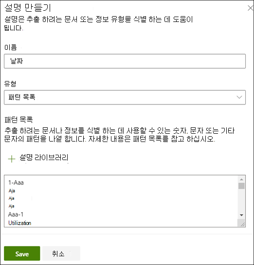
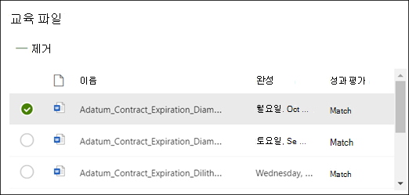

# Microsoft SharePoint Syntex에서 추출기 만들기

 

> [!VIDEO https://www.microsoft.com/videoplayer/embed/RE4CL2G]

  

특정 문서 유형의 식별 및 분류를 자동화하기 위해 분류자 모델을 만들기 전 또는 후에, 모델에 추출기를 추가하여 해당 문서에서 필요에 따라 특정 정보를 가져오도록 할 수 있습니다. 예를 들어, 문서 라이브러리에 추가된 모든 *계약 갱신* 문서를 식별할 뿐만 아니라 각 문서의 *서비스 시작 날짜* 를 문서 라이브러리의 열 값으로 표시하도록 할 수 있습니다.

추출하려는 문서의 각 엔터티에 대해 추출기를 만들어야 합니다. 예를 들어 모델로 식별된 각각의  **계약 갱신**  문서에서  **서비스 시작 날짜** 를 추출하고자 한다고 칩시다. 모든  **계약 갱신**  문서의 문서 라이브러리 보기를 각 문서의 **서비스 시작** 날짜 값을 표시하는 열을 포함하여 볼 수 있습니다. 

> [!NOTE]
> 추출기를 만들려면, 분류자를 학습시키기 위해 기존에 업로드했던 동일 파일을 이용합니다. 

## 추출기 이름 짓기

1. 모델 홈 페이지의 **추출기 만들기와 학습시키기** 타일에서 **추출기 학습시키기** 를 클릭합니다.
2. **새로운 엔터티 추출기** 화면에서 **새로운 추출기 이름** 필드에 추출기 이름을 입력합니다. 예를 들어 각 계약 갱신 문서에서 서비스 시작 날짜를 추출하려는 경우 **서비스 시작 날짜** 를 이름으로 입력합니다. 이전에 만든 열(예: 관리된 메타데이터 열)을 다시 사용하도록 선택할 수도 있습니다.
> [!NOTE]
> 새 추출기를 만든 경우에는 **새 열 유형** 을 선택하고 **단일 텍스트 줄** 을 선택하세요. 최대 문자 제한은 255자 입니다. 입력한 문자가 한도를 초과하는 경우 모두 잘립니다. 
3. 모두 마쳤으면 **만들기** 를 클릭합니다.

## 레이블 추가

다음 단계는 학습 파일 예제에 추출하려는 엔터티에 레이블을 지정하는 것입니다.

추출기 만들기를 선택하면 추출기 페이지가 열립니다. 여기 뷰어에 표시된 목록의 첫번째 파일과 함께 샘플 파일 목록이 표시됩니다.

1. 뷰어에서 파일로부터 추출하려는 데이터를 선택합니다. 예를 들어 *서비스 날짜 시작* 을 추출하려면 첫째 파일에서 날짜 값을 하이라이트 합니다.(*2019년 10월 14일 월요일*) 그 다음 **저장** 을 클릭하세요.  해당 파일의 값은 레이블된 예제 목록에서 **레이블** 열에 표시됩니다.
2. **다음 파일** 을 선택하여 자동 저장하고 뷰어의 목록에서 다음 파일을 엽니다. 또는 **저장** 을 선택한 다음 **레이블된 예제** 목록에서 다른 파일을 선택합니다.
3. 뷰어에서 1 단계와 2 단계를 반복하여 5개 파일 모두의 레이블을 저장합니다.

     

 
5개 파일의 레이블이 지정되면 학습으로 이동하라는 알림 배너가 표시됩니다. 더 많은 문서를 레이블 지정하거나, 다음 교육으로 넘어갈 수 있습니다. 

### 찾기를 사용하여 파일 검색

**찾기** 기능을 사용하여 레이블을 지정하려는 엔터티를 검색할 수 있습니다.

    

찾기 기능은 큰 문서를 검색하거나 문서에 엔터티의 인스턴스가 여러 개 있는 경우 유용합니다. 인스턴스가 여러 개 있는 경우, 검색 결과에 필요한 인스턴스를 선택하여 뷰어에서 해당 위치로 이동하여 레이블을 지정할 수 있습니다.

## 설명 추가하기

이 예제에서는 엔터티 서식 자체에 대한 힌트를 제공하는 설명과 샘플 문서에 포함될 수 있는 변형을 만듭니다. 예를 들어 날짜 값은 다음과 같이 다양한 형식으로 표시될 수 있습니다.
- 2019/10/14
- 2019년 10월 14일
- 2019년 10월 14일 월요일
 

*서비스 시작 날짜* 를 식별하는 데 도움이 되도록 패턴 설명을 만들 수 있습니다.

1. 설명 섹션에서 **신규** 를 선택한 다음 이름(예: *날짜*)을 입력합니다.
2. 입력에서 **패턴 목록** 을 선택합니다.
3. 값으로 샘플 파일에 표시되는 날짜 변형을 제공합니다. 예를 들어 0000/00/0으로 표시되는 날짜 형식이 있는 경우 문서에 표시되는 모든 변형을 다음과 같이 입력합니다.
    - 0000/0/0
    - 0000/0/00
    - 0000/00/0
    - 0000/00/00
4. **저장** 을 선택합니다.

> [!NOTE]
> 설명 유형에 대한 자세한 내용은 [설명 유형](./explanation-types-overview.md)을 참조하세요.  

### 설명 라이브러리 사용하기

날짜와 같은 항목에 대한 설명을 만들려면 수동으로 모든 변형을 입력하기보다는 [설명 라이브러리 사용하기](./explanation-types-overview.md)가 더 쉽습니다. 설명 라이브러리는 미리 작성된 구 및 패턴 설명 집합입니다. 라이브러리는 날짜, 전화 번호, 우편 번호 등과 같은 일반적인 구문 또는 패턴 목록의 모든 형식을 제공하고자 노력하고 있습니다. 

*서비스 시작 날짜* 샘플의 경우 설명 라이브러리에서 미리 작성된 *날짜* 설명을 이용하는 것이 훨씬 효율적입니다.

1. **설명 섹션** 에서 **신규** 를 선택한 다음 **설명 라이브러리 이용** 을 선택합니다.
2. 설명 라이브러리에서 **날짜** 를 선택합니다. 인식되는 모든 날짜 변형을 볼 수 있습니다.
3. **추가** 를 선택합니다. 

     

4. **설명 만들기** 페이지에서 설명 라이브러리의 *날짜* 정보가 필드에 자동으로 채워집니다. **저장** 을 선택합니다. 

     

## 모델 학습시키기 

설명을 저장하여 학습 시작하기 사용자의 모델에 레이블 지정된 예제 파일에서 데이터를 추출하기에 충분한 정보가 있을 경우 각 파일에 **일치** 라고 표시됩니다.  

 

추출하려는 데이터를 찾기에 정보가 불충분할 경우 각 파일에 **불일치** 라고 표시됩니다. **불일치** 된 파일을 클릭하여 불일치된 이유에 대한 자세한 정보를 볼 수 있습니다.

## 다른 설명 추가

일반적으로 불일치는 제공된 설명에 서비스 시작 날짜 값을 추출하여 레이블된 파일과 연결시키기에 충분한 정보가 없었다는 것을 의미합니다. 편집하거나 다른 설명을 추가해야 할 수 있습니다.

이 예제에서는 *서비스 날짜 시작* 텍스트 문자열이 항상 실제 값보다 우선한다는 것에 주목하세요. 서비스 시작 날짜를 식별하기 위해 구 설명을 만들어야 합니다.

1. 설명 섹션에서 **신규** 를 선택한 다음 이름(예: *접두사 문자열*)을 입력합니다.
2. 입력에서 **구 목록** 을 선택합니다.
3. *서비스 시작 날짜* 를 값으로 사용합니다.
4. **저장** 을 선택합니다.

     

## 모델 다시 학습시키기

설명을 저장 하면 이번에는 예제에서 두 가지 설명을 모두 사용하여 학습을 다시 시작합니다. 사용자의 모델이 레이블된 예제 파일에서 데이터를 추출하는 데 필요한 정보를 충분히 가지고 있을 경우 각 파일에 **일치** 라고 표시됩니다. 

레이블이 지정된 파일에 **불일치** 가 다시 표시된 경우 문서 유형 식별을 위해 더 많은 정보를 모델에게 제공하도록 또 다른 설명을 만들거나 기존 설명을 수정하도록 해야 합니다.

## 모델 테스트하기

레이블이 지정된 샘플 파일에 일치를 받은 경우 이제 레이블 지정되지 못한 남은 예제 파일에서 모델을 테스트할 수 있습니다. 이는 선택 사항이지만, 모델을 전에 보지 못한 파일에서 테스트하여 모델 사용 전에 모델의 "적합성"이나 준비 상태를 평가하는 데 유용한 단계입니다.

1. 모델 홈페이지에서 **테스트** 탭을 클릭합니다. 그러면 레이블이 지정되지 않은 샘플 파일에서 모델이 실행됩니다.
2. **테스트 파일** 목록에서 해당 모델이 필요한 정보를 추출할 수 있는지 여부를 보여 주는 예제 파일이 표시됩니다. 이 정보를 사용하여 문서를 식별하는 데 필요한 분류자의 효율성을 알아낼 수 있습니다.

     

## 참고 항목
[분류자 만들기](create-a-classifier.md)

[설명 유형](explanation-types-overview.md)

[추출기를 만들 때 용어 저장소 분류 활용](leverage-term-store-taxonomy.md)

[문서 이해 개요](document-understanding-overview.md)

[모델 적용](apply-a-model.md) 

[SharePoint Syntex 접근성 모드](accessibility-mode.md)