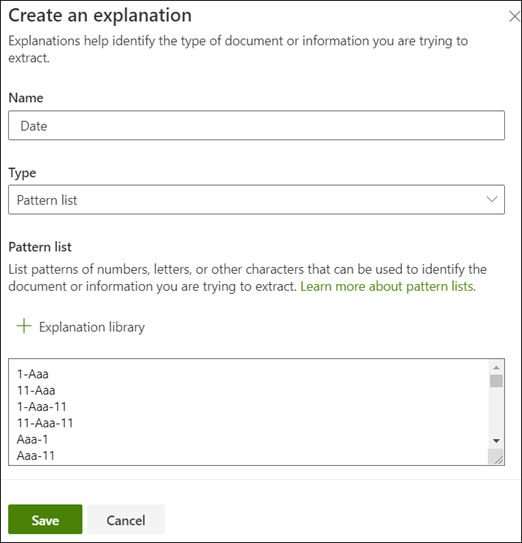

# 추출기 만들기 (미리 보기)
> [!Note] 
> 이 문서에서 설명 하는 내용은 Project Cortex 비공개 미리 보기를 위한 것입니다. [자세한 내용은 Project Cortex를 참조](https://aka.ms/projectcortex)하세요.

 

> [!VIDEO https://www.microsoft.com/videoplayer/embed/RE4CL2G]

  

특정 문서 형식의 식별 및 분류를 자동화 하기 위해 분류자 모델을 만들기 전이나 후에 추출기를 모델에 추가 하 여 이러한 문서에서 특정 정보를 가져오도록 선택할 수도 있습니다. 예를 들어 모델이 문서 라이브러리에 추가 된 모든 *계약 갱신* 문서를 식별 하는 것이 아니라, 각 문서에 대 한 *서비스 시작 날짜가* 문서 라이브러리의 열로 표시 되도록 할 수 있습니다.

추출할 문서의 각 엔터티에 대해 추출기를 만들어야 합니다. 이 예제에서는 모델로 식별 된 각 *계약 갱신* 문서에 대 한 *서비스 시작 날짜* 를 추출 하려고 합니다. 각 문서에 대 한 서비스 시작 날짜 값을 표시 하는 열을 사용 하 여 모든 *계약 갱신* 문서의 문서 라이브러리에 있는 보기를 볼 수 있어야 합니다.

> [!Note]
> 추출기를 만들기 전에 추출할 정보를 식별 하기 위해 모델을 교육 하는 데 필요한 [예제 파일을 추가](https://docs.microsoft.com/microsoft-365/contentunderstanding/create-a-classifier?view=o365-worldwide#add-your-example-files) 해야 합니다. 분류자를 만드는 데 사용한 것과 동일한 예제 파일을 사용 합니다.

## 추출기 이름

1. 모델 홈 페이지의 **추출기 만들기 및 트레인** 타일에서 **추출기 양성**을 클릭 합니다.
2. **새 entity 추출기** 화면의 **새 추출기 이름** 필드에 추출기의 이름을 입력 합니다. 예를 들어 각 계약 갱신 문서에서 서비스 시작 날짜를 추출 하려는 경우 **서비스 시작 날짜** 의 이름을 지정할 수 있습니다.
3. **만들기**를 클릭합니다.

## 레이블 추가

다음 단계에서는 예제 트레이닝 파일에서 추출할 정보에 레이블을 지정 합니다.

추출기를 만들면 예제 파일 목록이 표시 되는 추출기 페이지가 열리고, 목록에 첫 번째 파일이 뷰어에 표시 됩니다.

1. 뷰어에서 파일에서 추출 하려는 데이터를 선택 합니다. 예를 들어 *서비스 시작 날짜*를 추출 하려면 첫 번째 파일 (*월요일, 10 월 14 일, 2019*)에 해당 날짜 값을 강조 표시 합니다. 그런 다음 **저장**을 클릭합니다.  **레이블** 열 아래의 레이블이 지정 된 예제 목록에 파일에 대 한 값 표시가 표시 됩니다.
2. 자동 **저장할** **다음 파일** 을 선택 하 고 viewer의 목록에서 다음 파일을 열거나, 저장을 선택 하 고 **레이블이 지정 된 예제** 목록에서 다른 파일을 선택 합니다.
3. 뷰어에서 1 ~ 2 단계를 반복 하 고 5 개의 파일에 레이블을 저장 하기 전까지이 작업을 수행 합니다.

     

### 음수 예제 추가

분류자를 만들 때 음수 예제 파일을 추가 하는 방법과 마찬가지로 추출기에 대 한 음수 예제를 추가 해야 합니다. 이 예제에서는 서비스 시작 날짜 값이 포함 되지 않은 파일 이어야 합니다.

1. **레이블이 지정 된 예제** 목록에서 음수 예제를 선택 합니다.
2. 뷰어에서 문서 맨 위에 있는 **레이블 없음**을 선택 합니다.
3. **저장**을 클릭합니다.
 
5 개의 파일에 레이블을 지정 하면 교육으로 이동 하 라는 알림 배너가 표시 됩니다. 더 많은 문서를 선택 하거나 교육을 진행할 수 있습니다. 

## 설명 추가

이 예제에서는 엔터티 형식과 예제 문서에 있는 변형에 대 한 힌트를 제공 하는 설명을 만듭니다. 예를 들어 날짜 값의 형식은 다음과 같이 다를 수 있습니다.
- 10/14/2019
- 2019년 10월 14일
- 2019 년 10 월 14 일 월요일
 

*서비스 시작 날짜* 를 식별 하는 데 도움이 되도록 패턴 설명을 만들 수 있습니다.

1. 설명 섹션에서 **새로 만들기**를 선택 하 고 이름 (예: *날짜*)을 입력 합니다.
2. 유형에 대해 **패턴 목록을**선택 합니다.
3. 값의 경우에는 샘플 파일에 표시 되는 대로 날짜 변형을 제공 해야 합니다. 예를 들어 날짜 형식이 0/00/0000로 나타나는 경우 문서에 나타날 수 있는 모든 변형을 다음과 같이 입력 합니다.
    - 0/0/0000
    - 0/00/0000
    - 00/0/0000
    - 00/00/0000
4. **저장**을 선택합니다.

### 설명 라이브러리 사용

날짜와 같은 작업에 대 한 설명을 만들려면 모든 변형을 수동으로 입력 하는 것 보다 설명 라이브러리를 사용 하는 것이 훨씬 더 쉽습니다. 설명 라이브러리는 미리 작성 된 구 및 패턴 설명 집합입니다. 라이브러리는 날짜, 전화 번호, 우편 번호 등의 일반 구 또는 패턴 목록에 대 한 모든 형식을 제공 하려고 시도 합니다. 

*서비스 시작 날짜* 예제를 보려면 설명 라이브러리에서 이전에 작성 한 *날짜* 에 대 한 설명을 사용 하는 것이 더 효율적입니다.

1. **설명 섹션**에서 * * **새로 만들기**를 선택 하 고 **설명 라이브러리를**선택 합니다.
2. 설명 라이브러리에서 **날짜**를 선택 합니다. 인식 되는 모든 날짜 변형을 볼 수 있습니다.
3. **추가**를 선택합니다. 

     

4. **설명 만들기** 페이지에서 설명 라이브러리의 *날짜* 정보는 필드를 자동으로 다시 채움 합니다. **저장**을 선택합니다. 

     

 
## 모델 훈련 

설명을 저장 하면 교육을 시작 합니다. 모델에 레이블이 지정 된 예제 파일에서 데이터를 추출 하는 데 필요한 정보가 충분 한 경우 각 파일에 **Match**라는 레이블이 표시 됩니다.  

 

설명에 포함 된 정보가 부족 하 여 추출할 데이터를 찾을 수 없는 경우 각 파일의 레이블이 **일치**하지 않는 레이블로 지정 됩니다. 일치 하지 않는 파일을 클릭 하 여 일치 하지 않는 이유에 대 한 자세한 정보를 볼 수 있습니다.

## 다른 설명 추가

이 불일치는 제공 된 설명에서 레이블이 지정 된 파일에 맞게 서비스 시작 날짜 값을 추출 하는 데 충분 한 정보가 제공 되지 않았다는 것을 의미 하기도 합니다. 이를 편집 하거나 다른 설명을 추가 해야 할 수 있습니다.

이 예에서 텍스트 문자열은 항상 실제 값 보다 우선 하 여 *서비스 날짜를 시작* 합니다. 서비스 시작 날짜를 식별 하는 데 도움이 되도록 구문 설명을 만들 수 있습니다.

1. 설명 섹션에서 **새로 만들기**를 선택한 다음 이름 (예: *접두사 문자열*)을 입력 합니다.
2. 유형에 대해 **구 목록을**선택 합니다.
3. *서비스 시작 날짜* 를 값으로 사용 합니다.
4. **저장**을 선택합니다.

     

## 모델 훈련

설명을 저장 하면이 예제에서 두 가지 설명을 모두 사용 하 여 교육이 다시 시작 됩니다. 모델에 레이블이 지정 된 예제 파일에서 데이터를 추출 하는 데 필요한 정보가 충분 한 경우 각 파일에 **Match**라는 레이블이 표시 됩니다. 

레이블이 지정 된 파일에서 다시 **일치 하지 않는** 경우에는 더 많은 정보를 제공 하 여 문서 유형을 식별 하거나 기존 항목을 변경 하는 방법을 확인 하는 또 다른 설명을 만들어야 할 수도 있습니다.

## 모델 테스트

레이블이 지정 된 예제 파일에서 일치 하는 항목을 받은 경우에는 레이블 없는 나머지 예제 파일에서 모델을 테스트할 수 있습니다.

1. 모델 홈 페이지에서 **테스트** 탭을 클릭 합니다.  이렇게 하면 레이블이 지정 되지 않은 예제 파일에서 모델이 실행 됩니다.
2. **테스트 파일** 목록에 예제 파일이 표시 되 고 모델에서 필요한 정보를 추출할 수 있는지 여부를 표시 합니다. 이 정보를 사용 하 여 문서를 식별 하는 데 사용할 분류자의 효율성을 결정할 수 있습니다.

     

## 참고 항목
  

