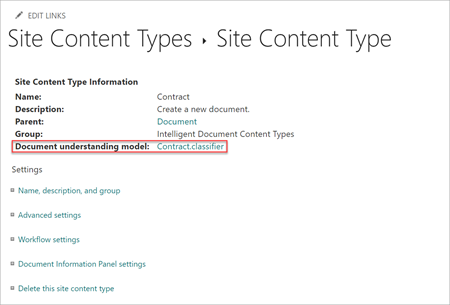

# 문서 이해와 양식 처리 모델의 차이 

Microsoft SharePoint Syntex의 콘텐츠 이해를 통해 SharePoint 문서 라이브러리에 업로드되는 문서를 식별 및 분류하고 각 파일에서 관련 정보를 추출할 수 있습니다.  예를 들어 파일이 SharePoint 문서 라이브러리에 업로드되면 *구매 주문서* 로 식별된 모든 파일이 이와 같이 분류된 다음 사용자 지정 문서 라이브러리 보기에 표시됩니다. 또한 각 파일에서 특정 정보(예: *PO 번호* 및 *전체l*)를 가져와 문서 라이브러리 보기에 열로 표시할 수 있습니다. 

컨텐츠 이해를 통해 *모듈* 을(를) 생성하여 필요한 정보를 식별하고 추출할 수 있습니다. 모델은 검색, 비즈니스 프로세스, 컴플라이언스 등의 비즈니스 문제를 해결하는 데 도움이 되는 가치를 지니고 있습니다.

사용할 수 있는 두 가지 모델 유형은 다음과 같습니다.

- [문서 이해 모델](document-understanding-overview.md)
- [양식 처리 모델](form-processing-overview.md)

두 모델은 일반적으로 동일한 목적으로 사용되지만, 아래에 나열된 주요 차이점은 사용할 수 있는 모델에 영향을 미칩니다.

> [!NOTE]
> 양식 처리 및 문서 이해 시나리오 예제에 대한 자세한 내용은 [SharePoint Syntex 채택: 시작 가이드](./adoption-getstarted.md)를 참조하세요.

## 구조화된 콘텐츠와 구조화되지 않은 콘텐츠 및 반구조화된 콘텐츠가 비교됩니다.

문서 이해 모델을 사용하여 편지나 계약서와 같은 비정형 문서로부터 추출하려는 텍스트 엔터티가 문서의 문장이나 특정 영역에 있는 데이터를 식별하고 추출합니다. 예를 들어, 비정형 문서는 다양한 방법으로 작성할 수 있는 계약 갱신 서한이 될 수 있습니다. 그러나 텍스트 문자열 *서비스 시작 날짜* 와 실제 날짜와 같은 정보는 각 계약 갱신 문서의 본문에 일관성 있게 존재합니다.

양식 처리 모델을 사용하여 파일을 식별하고 양식 또는 송장과 같은 구조적 또는 반구조적 문서에서 데이터를 추출합니다. 양식 처리 모델은 예제 문서에서 양식의 레이아웃을 이해하고 유사한 위치에서 추출해야 하는 데이터를 찾는 방법을 학습하도록 훈련되어 있습니다. 양식은 일반적으로 엔터티가 동일한 위치에 있는, 보다 구조적 레이아웃을 갖습니다(예: 세금 양식의 주민등록번호)

> [!NOTE]
> 문서 이해 모델을 작성하거나 SharePoint 문서 라이브러리에 적용하려면 컨텐츠 센터 사이트에 대한 액세스 권한이 있어야 합니다. 

## 모델이 생성되는 위치

문서 이해 모델은 SharePoint 컨텐츠 센터 사이트에서 작성 및 관리됩니다. 

> [!NOTE]
> 입력 문서에 대한 자세한 내용은 [양식 처리 모델 요구 사항 및 제한](/ai-builder/form-processing-model-requirements)을(를) 참조하시기 바랍니다. 

양식 처리 모델은 Power Apps [AI Builder](/ai-builder/overview)에서 만들어지지만, 생성은 SharePoint 문서 라이브러리에서 직접 시작됩니다. 사용자가 양식 처리 모델을 만들려면 문서 라이브러리에서 양식 처리 모델 생성을 사용하도록 설정해야 합니다. 관리자는 관리 설정을 이해하는 콘텐츠에서 양식 처리 모델 만들기를 사용하도록 설정할 수 있습니다. 양식 처리 모델은 PowerAutomate 흐름을 사용하여 파일을 문서 라이브러리에 업로드할 때 파일을 처리합니다.

문서 이해 모델을 생성할 때 SharePoint 컨텐츠 유형 갤러리에 저장되는 새 [SharePoint 컨텐츠 유형](https://support.microsoft.com/office/use-content-types-to-manage-content-consistently-on-a-site-48512bcb-6527-480b-b096-c03b7ec1d978)을 생성합니다. 또는 필요한 경우 기존 콘텐츠 유형을 사용하여 모델을 정의할 수 있습니다.

콘텐츠 형식이 만들어지고 모델과 연결되면 **사이트 콘텐츠 형식** 속성 패널에서 해당 모델을 참조할 수도 있습니다.

양식 처리 모델도 새 [SharePoint 컨텐츠 유형](https://support.microsoft.com/office/use-content-types-to-manage-content-consistently-on-a-site-48512bcb-6527-480b-b096-c03b7ec1d978)을 생성하고 SharePoint 컨텐츠 유형 갤러리에도 저장됩니다.

## 적용할 수 있는 위치입니다.

액세스 권한이 있는 SharePoint 문서 라이브러리에 문서 이해 모델을 적용할 수 있습니다. 콘텐츠 센터를 사용하여 문서 이해 모델을 작성한 후 다른 문서 라이브러리에 적용합니다. 콘텐츠 센터는 문서 이해 모델의 사용 방법과 적용 위치를 보다 중앙에서 제어할 수 있도록 합니다. 또한 이 정보는 컨텐츠 센터로 롤업해야 합니다.

양식 처리 모델은 현재 사용자가 만든 SharePoint 문서 라이브러리에만 적용할 수 있습니다. 이렇게 하면 사이트에 대한 액세스 권한을 가진 라이선스 사용자가 양식 처리 모델을 만들 수 있습니다. 관리자가 SharePoint 문서 라이브러리에서 양식 처리를 사용하도록 설정해야 라이선스가 부여된 사용자가 사용할 수 있습니다.

## 양식 처리 및 문서 이해의 비교

다음 표를 사용하여 양식 처리를 사용하는 경우와 문서 이해를 사용하는 경우를 알아보세요.

| 기능 | 양식 처리 | 문서 이해 |
| ------- | ------- | ------- |
| 모델 유형 - 각 모델을 사용해야 하는 경우 | 반구조화화된 파일 형식에 사용(예: 레이아웃 및 서식이 비슷한 송장이나 구매 주문과 같은 양식 콘텐츠의 PDF).  | 반구조화된 파일 형식에 사용(예: 레이아웃에는 차이가 있지만 비슷한 정보가 추출되는 Office 문서). |
| 모델 만들기 | SharePoint 문서 라이브러리에서 원활하게 액세스할 수 있도록 AI 작성기로 만든 모델.| 새 사이트, 콘텐츠 센터에서 SharePoint에서 만든 모델 |
| 분류 유형| 추출할 데이터에 대한 단서를 시스템에 제공하기 위해 사용되는 설정 가능한 분류자입니다.| 옵션인 추출기에서 컴퓨터 티칭을 사용하여 추출할 데이터에 대한 문서 위치를 할당하는 학습 가능한 분류자입니다.|
| 위치 | 단일 문서 라이브러리에 대해 학습합니다.| 여러 라이브러리에 적용할 수 있습니다.|
| 지원되는 파일 형식| PDF, JPG, PNG 파일 형식의 총 50MB, 500페이지에서 학습 가능합니다.| 5~10개의 PDF, Office 또는 전자 메일 파일(부정 예제 포함)에 대해 학습 가능합니다. Office 파일은 64k 문자로 잘립니다. OCR 스캔 파일은 20페이지로 제한됩니다.|
| 관리되는 메타데이터와 통합 | 아니요 | 예, 구성된 관리형 메타데이터 필드를 참조하는 교육 엔터티 추출기입니다.|
| Microsoft Information Protection을 사용하도록 설정했을 때 규정 준수 기능 통합 | 게시된 보존 레이블을 설정합니다. 민감도 레이블 설정 기능이 곧 제공됩니다. | 게시된 보존 레이블을 설정합니다. 게시된 민감도 레이블을 설정합니다. |
| 지원되는 지역| 양식 처리는 Power Platform을 기반으로 합니다. Power Platform 및 AI 작성기의 글로벌 가용성에 대한 자세한 내용은 [Power Platform 가용성](https://dynamics.microsoft.com/geographic-availability/)을 참조하세요. | 모든 지역에서 지원됩니다.|
| 트랜잭션 비용 | AI 작성기 크레딧을 사용합니다. 크레딧은 백만 크레딧 단위로 구입할 수 있습니다. 300개 이상의 SharePoint Syntex 라이선스를 구입하면 1백만 크레딧이 포함됩니다. 1백만 크레딧으로는 2,000개 파일 페이지를 처리할 수 있습니다. | 해당 없음 |
| 용량 | 기본 파워 플랫폼 환경(Dataverse 데이터베이스가 지원되는 사용자 지정 환경)을 사용합니다. | 용량 제한이 없습니다.|
| 지원되는 언어| 영어  2021년 후반에 출시 예정: 라틴 문자 알파벳 언어 | 모델은 모든 라틴어 알파벳 언어를 기반으로 작동합니다. 영어 외 언어: 독일어, 스웨덴어, 프랑스어, 스페인어, 이탈리아어 및 포르투갈어.|

## 참고 항목

[교육: AI 작성기를 사용하여 비즈니스 성과 개선](/learn/paths/improve-business-performance-ai-builder/?source=learn)

[문서 이해 개요](document-understanding-overview.md)

[양식 처리 개요](form-processing-overview.md)

[SharePoint Syntex 소개](index.md)