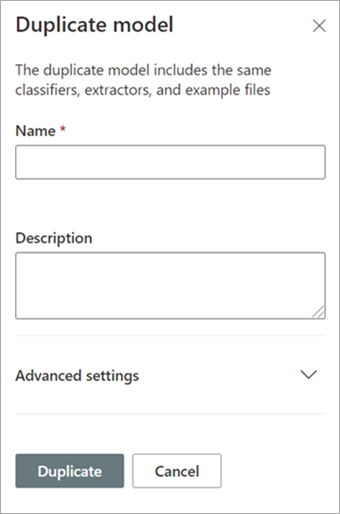

# Microsoft SharePoint Syntex에서 모델 복제

문서 이해 모델을 복제하면 새 모델을 만들어야 하하고 기존 모델이 필요한 모델과 매우 유사하다는 것을 알고 있는 경우에 시간과 노력을 절약할 수 있습니다.

예를 들어, "계약서"라는 기존 모델은 작업에 필요한 동일한 파일을 분류합니다. 새 모델은 기존 데이터의 일부를 추출하지만 일부 추가 데이터를 추출하려면 업데이트해야 합니다. 처음부터 새 모델을 만들고 교육하는 대신 모델 복제 기능을 사용하여 계약 모델의 복사본을 만들 수 있습니다. 이 복사본은 예제 파일 및 엔터티 추출기와 같은 모든 관련 교육 항목을 복사할 수도 있습니다.

모델을 복제할 때 모델 이름을 변경한 후(예: "계약 갱신"으로) 모델을 업데이트할 수 있습니다. 예를 들어, 필요 없는 기존의 추출된 필드 중 일부를 제거하도록 선택한 후 모델을 교육하여 새 필드("갱신 날짜")를 추출할 수 있습니다.

## 모델 복제

다음 단계에 따라 문서 이해 모델을 복제하세요.

1. 콘텐츠 센터에서 모델 목록을 보려면 **모델** 을 선택합니다.

2. **모델** 페이지에서 복제할 모델을 선택하세요.

3. 리본 또는 **작업 표시** 버튼(모델 이름 옆에 있음)을 사용하여 **복제** 를 선택합니다. 

      

4. **모델 복제** 패널에서 다음을 수행합니다.

   a. **이름** 에서 복제할 모델의 새 이름을 입력합니다. 

      

   b. **설명** 에서 새 모델에 대한 설명을 추가하세요.

   c. (선택 사항) **고급 설정** 에서 기존 [콘텐츠 유형](/sharepoint/governance/content-type-and-workflow-planning#content-type-overview)을 연결할지 여부를 선택합니다.

5. **복제** 를 선택합니다.

## 참고 항목
[분류자 만들기](create-a-classifier.md)

[모델 이름 변경](rename-a-model.md)

[추출자 만들기](create-an-extractor.md)

[문서 이해 개요](document-understanding-overview.md)

[설명 유형](explanation-types-overview.md)

[모델 적용](apply-a-model.md) 

[SharePoint Syntex 접근성 모드](accessibility-mode.md)