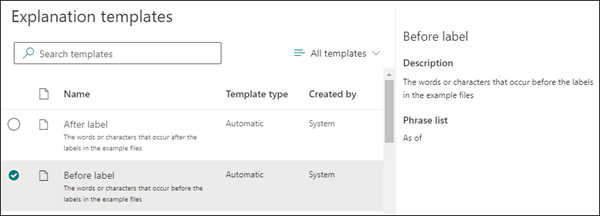
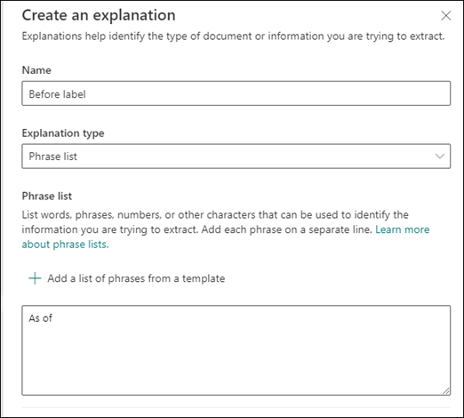
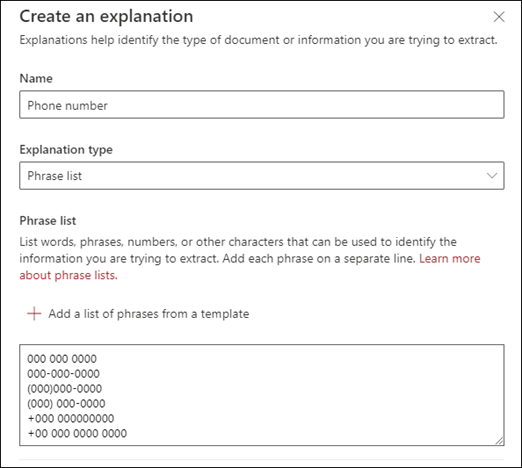
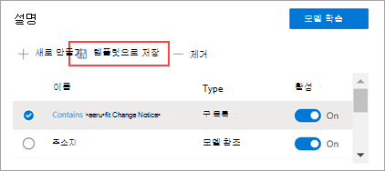
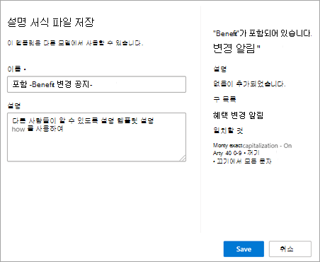

# Microsoft SharePoint Syntex에서 설명 서식 파일 사용

설명에 대한 다양한 구 목록 값을 수동으로 추가할 수 있지만, 설명 라이브러리에서 미리 작성된 서식 파일을 찾아 사용하는 것이 훨씬 쉬울 수 있습니다.

예를 들어 *날짜* 에 대한 모든 변형을 수동으로 추가하는 대신 이미 많은 구 목록 값을 포함하고 있는 *날짜* 에 대한 구 목록 템플릿을 사용할 수 있습니다.

설명 라이브러리에는 다음을 비롯하여 일반적으로 사용되는 *구 목록* 설명이 포함되어 있습니다.

- 날짜: 달력 날짜, 모든 형식입니다. 텍스트 및 숫자를 포함합니다(예: "2020년 12월 9일").
- 날짜(숫자): 달력 날짜, 모든 형식입니다. 숫자를 포함합니다(예: 1-11-2020).
- 시간: 12시간 및 24시간 형식.
- 숫자: 최대 2자리 소수점까지 양수 및 음수입니다.
- 백분율: 백분율을 나타내는 패턴 목록입니다. 예: 1%, 11%, 100% 또는 11.11%입니다.
- 전화번호: 일반적인 미국 및 국제 형식입니다. 예: 000 000 0000, 000-000-0000, (000)000-0000 혹은 (000) 000-0000 등입니다.
- 우편 번호: 미국 우편 번호 형식입니다. 예: 11111, 11111-1111
- 문장의 첫 번째 단어: 최대 9자의 단어에 대한 일반적인 패턴입니다.
- 문장의 끝: 문장의 끝에 대한 일반적인 문장 부호입니다.
- 신용 카드: 일반 신용 카드 번호 형식입니다. 예: 1111-1111-1111-1111.
- 사회 보장 번호: 미국 사회 보장 번호 형식입니다. 예를 들어 111-11-1111입니다.
- 확인란: 채워진 확인란의 변형을 나타내는 구 목록입니다. 예를 들면 _X_, _ _X_ 입니다.
- 통화: 주요 국제 기호 예: $.
- 전자 메일 CC: 'CC:'라는 용어가 있는 구 목록으로 메시지가 전송된 다른 사용자 또는 그룹의 이름 또는 전자 메일 주소 근처에 있는 경우가 많습니다.
- 전자 메일 날짜: '보낸 날짜:'라는 용어가 있는 구 목록입니다. 대개 전자 메일을 보낸 날짜 근처에 있습니다.
- 전자 메일 인사말: 전자 메일의 일반적인 첫 문장입니다.
- 전자 메일 받는 사람: '받는 사람:'이라는 용어가 있는 구 목록입니다. 대개 메시지가 전송된 사용자 또는 그룹의 이름 또는 전자 메일 주소 근처에 있습니다.
- 전자 메일 보낸 사람: '보낸 사람:'이라는 용어가 있는 구 목록입니다. 대개 보낸 사람 이름 또는 전자 메일 주소 근처에 있습니다.
- 전자 메일 제목: '제목:'이라는 용어가 있는 구 목록입니다. 대개 전자 메일의 제목 근처에 있습니다.

설명 라이브러리에는 다음을 비롯하여 또한 일반적으로 사용되는 *정규식* 설명이 포함되어 있습니다.

- 6자리에서 17자리까지의 숫자: 6자리에서 17자리까지의 모든 숫자와 일치합니다. 미국 은행 계좌 번호는 이 패턴에 맞습니다.
- 전자 메일 주소: meganb@contoso.com과 같은 일반적인 유형의 전자 메일 주소와 일치합니다.
- 미국 납세자 ID 번호: 9부터 시작하는 3자리 숫자와 7 또는 8부터 시작하는 6자리 숫자와 일치합니다.
- 웹 주소(URL): http:// 또는 https://로 시작하는 웹 주소의 형식과 일치합니다.

또한 설명 라이브러리에는 예제 파일에 레이블을 지정한 데이터를 사용하는 세 가지 자동 템플릿 형식이 포함되어 있습니다.

- 레이블 뒤: 예제 파일의 레이블 뒤에서 발생하는 단어 또는 문자입니다.
- 레이블 전: 예제 파일의 레이블 앞에 있는 단어 또는 문자입니다.
- 레이블: 예제 파일에서 처음 10개 레이블까지입니다.

자동 템플릿의 작동 방식에 대한 예제를 제공하기 위해 다음 예제 파일에서 이전 레이블 설명 템플릿을 사용하여 모델에 보다 정확한 일치를 얻기 위한 추가 정보를 제공합니다.

이전 레이블 설명 템플릿을 선택하면 예제 파일의 레이블 앞에 나타나는 첫 번째 단어 집합을 찾습니다. 예제에서 첫 번째 예제 파일에서 식별되는 단어 집합은 "As of"입니다.

서식 파일에서 **추가** 를 선택하여 설명을 만들 수 있습니다. 예제 파일을 더 추가하면 추가 단어가 식별되어 구 목록에 추가됩니다.

## 설명 라이브러리에서 서식 파일 사용

1. 모델 **학습** 페이지의 **설명** 섹션에서 **새로 만들기** 를 선택한 다음, **서식 파일에서** 를 선택합니다.

   

2.  **설명 서식 파일** 페이지에서 사용하려는 설명을 선택하고 **추가** 를 선택합니다.

    

3. 선택한 서식 파일에 대한 정보는 **설명 만들기** 페이지에 나와 있습니다. 필요한 경우 설명 이름을 편집하고 구 목록에서 항목을 추가 또는 제거합니다.

    

4. 작업을 끝낸 후 **저장** 을 선택합니다.

## 설명 라이브러리에 서식 파일 저장

설명을 서식 파일로 저장하여 다른 모델과 함께 사용할 콘텐츠 센터의 설명 라이브러리에서 사용할 수 있도록 할 수 있습니다. 서식 파일에는 설명에 대한 기본 및 고급 설정이 포함되며, 구가 문서에 표시되는 위치를 지정하는 옵션은 예외입니다.

> [!NOTE]
> 구 목록 및 정규식 설명만 서식 파일로 저장할 수 있습니다.

1. 모델의 **학습** 페이지의 **설명** 섹션에서 다음을 수행합니다.

   a. 설명 목록에서 서식 파일로 저장할 설명을 선택합니다.

   b. **서식 파일로 저장** 을 선택합니다.

    

2. **설명 저장 서식 파일** 페이지에서 다음을 수행합니다.

   a. **이름** 섹션에서 필요한 경우 설명의 이름을 바꿉니다.

   b. **설명** 섹션에서 설명을 추가하여 설명을 사용하는 방법을 다른 사람에게 알릴 수 있습니다.

   c. **저장** 을 선택합니다.

    

### 참고 항목

[Microsoft SharePoint Syntex의 설명 유형](explanation-types-overview.md)