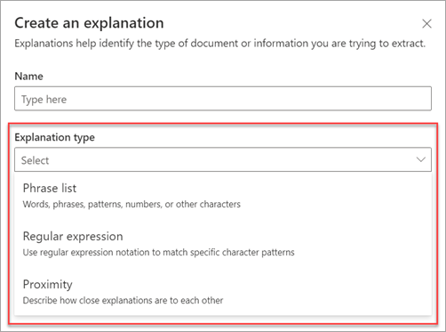
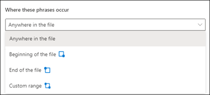
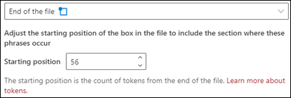
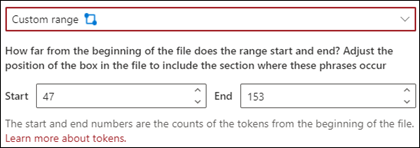

# Microsoft SharePoint Syntex의 설명 유형

설명은 Microsoft SharePoint Syntex의 모델에 대한 이해를 바탕으로 문서에 표시하고 추출하고자 하는 정보를 정의하는데 도움을 줍니다. 설명을 만들 때 설명 유형을 선택해야 합니다. 이 문서는 다양한 설명 유형과 사용 방법을 이해하는 데 도움이 됩니다.

다음 설명 유형을 사용할 수 있습니다.

- [**구 목록**](#phrase-list): 추출하는 문서나 정보에 사용할 수 있는 단어, 구, 숫자 또는 기타 문자의 목록입니다. 예를 들어 *의사 추천* 이란 텍스트 문자열은 식별 중인 모든 의료 추천 문서에 있습니다. 또는 식별 중인 모든 의료 추천 문서에서 의사 추천의 *전화 번호* 를 확인할 수 있습니다.

- [**정규식**](#regular-expression): 패턴 일치 표기법을 사용하여 특정 문자 패턴을 찾습니다. 예를 들어 정규식을 사용하여 문서 집합에서 *전자 메일 주소* 패턴의 모든 인스턴스를 찾을 수 있습니다.

- [**근접**](#proximity): 설명이 서로 얼마나 근접한지 설명합니다. 예를 들어 *번지 수* 의 구 목록은 *길 이름* 바로 전에 나오고 토큰은 둘 사이에 존재하지 않습니다.(토큰에 대한 자세한 정보는 본 문서의 뒷부분에 나옵니다.) 근사 유형을 사용하려면 모델에 두 개 이상의 설명이 있어야 하고, 그렇지 않으면 해당 옵션을 사용할 수 없습니다.

## 구 목록

일반적으로 구 목록 설명 형식은 모델을 통해 문서를 식별하고 분류하는 데 사용됩니다. *의사 추천* 레이블 예제에 설명 된 바와 같이 식별 중인 문서에서 일관되게 나타나는 단어, 구, 숫자 또는 문자의 문자열입니다.

요구 사항은 아니지만 캡처하는 구가 문서의 일관된 위치에 있는 경우 설명으로 성공률을 높일 수 있습니다. 예를 들어, *의사 추천* 이란 레이블이 문서의 첫 번째 문단에 일관되게 배치되어 있을 수 있습니다. 또한 **[문서에서 구가 발생할 위치 구성](explanation-types-overview.md#configure-where-phrases-occur-in-the-document)** 고급 설정을 사용하여 구가 위치한 특정 영역을 선택할 수 있습니다. 특히, 구가 문서의 여러 위치에서 발생할 가능성이 있는 경우에 유용합니다.

레이블을 식별하는데 대/소문자 구분이 필요하다면, 구 목록 유형을 사용하하면 **정확한 대소문자 사용** 체크박스를 선택하여 이를 설명에 지정할 수 있습니다.

구 유형은 날짜, 전화번호, 신용 카드 번호 등 다양한 형식으로 정보를 식별하고 추출하는 설명을 만들 때 특히 유용합니다. 예를 들어 날짜는 다양한 형식(1/1/2020, 1-1-2020, 01/01/20, 01/01/2020 혹은 2020년 1월 1일)으로 표시될 수 있습니다. 구 목록을 정의하면 식별하고 추출하려는 데이터의 가능한 변형을 캡처하여 설명을 더 효율적으로 만들 수 있습니다.

*전화 번호* 예제의 경우 모델이 식별하는 모든 의료 추천 문서에서 각 추천 의사의 전화 번호를 추출합니다. 설명을 만들 때 가능한 변형을 캡처할 수 있도록 문서에 표시할 수 있는 다양한 전화 번호 형식을 입력합니다.

이 예에서는 **고급 설정** 에서 **0-9 사이의 임의의 수** 확인란을 선택하여 구 목록에 사용된 각 "0" 값을 0부터 9까지의 숫자로 인식합니다.

마찬가지로 텍스트 문자를 포함하는 구 목록을 만들 경우 **a-z 사이의 임의의 문자** 확인란을 선택하여 구 목록에 사용된 각 "a" 문자를 "a"에서 "z"까지의 문자로 인식합니다.

예를 들어 **날짜** 구 목록을 만들 때 *2020년 1월 1일* 과 같은 날짜 서식이 인식되도록 하려면 다음을 수행해야 합니다.

- 구 목록에 *aaa 0, 0000* 및 *aaa 00, 0000* 을 추가합니다.
- **a부터 z 사이 아무 문자** 를 선택했는지 확인합니다.

구 목록에 대문자 표시 요구 사항이 있는 경우 **정확한 대문자 표시** 확인란을 선택할 수 있습니다. 날짜 예제의 경우 월의 첫 글자를 대문자로 표기해야 하는 경우 다음을 수행해야 합니다.

- 구 목록에 *Aaa 0, 0000* 및 *Aaa 00, 0000* 을 추가합니다.
- **정확한 대소문자 사용** 이 선택되어 있는지 확인합니다.

> [!NOTE]
> 구 목록 설명을 수동으로 만드는 대신 [설명 라이브러리](explanation-templates.md)를 사용하여 *날짜*, *전화 번호* 또는 *신용 카드 번호* 와 같은 일반적인 구 목록 서식 파일을 사용할 수 있습니다.

## 정규식

정규식 설명 형식을 사용하면 문서에서 특정 텍스트 문자열을 찾고 식별하는 데 도움이 되는 패턴을 만들 수 있습니다. 정규식을 사용하여 대량의 텍스트를 신속하게 구문 분석하여 다음을 수행할 수 있습니다.

- 특정 문자 패턴을 찾습니다.
- 텍스트의 유효성을 검사하여 미리 정의된 패턴(예: 전자 메일 주소)과 일치하는지 확인합니다.
- 텍스트 하위 문자열을 추출, 편집, 바꾸기 또는 삭제합니다.

정규식 유형은 전자 메일 주소, 은행 계좌 번호 또는 URL과 같은 유사한 형식의 정보를 식별하고 추출하는 설명을 만들 때 특히 유용합니다. 예를 들어 megan@contoso.com와 같은 전자 메일 주소가 특정 패턴으로 표시됩니다("megan"이 첫 번째 부분이고 "com"이 마지막 부분임).

전자 메일 주소의 정규식은 **[A-Za-z0-9._%-]+@[A-Za-z0-9.-]+[A-Za-z]{2,6}** 입니다.

이 식은 다음 순서로 5개의 부분으로 구성됩니다.

1. 다음 문자의 양:

   a. a에서 z까지의 문자

   b. 0-9의 숫자

   c. 마침표, 밑줄, 백분율 또는 대시

2. @ 기호

3. 전자 메일 주소의 첫 부분과 동일한 문자의 양

4. 마침표

5. 2~6자

정규식 설명 형식을 추가하려면 다음을 수행합니다.

1. **설명 만들기** 패널의 **설명 유형** 에서 **정규식** 을 선택합니다.

   

2. **정규식** 텍스트 상자에 식을 입력하거나 **템플릿에서 정규식 추가** 를 선택할 수 있습니다.

   템플릿을 사용하여 정규식을 추가하면 텍스트 상자에 이름과 정규식이 자동으로 추가됩니다. 예를 들어 **전자 메일 주소** 템플릿을 선택하면 **설명 만들기** 패널이 채워집니다.

   

### 제한 사항

다음 표는 현재 정규식 패턴에 사용할 수 없는 인라인 문자 옵션을 보여 줍니다.

|옵션  |시/도  |현재 기능  |
|---------|---------|---------|
|대/소문자 구분 | 현재 지원되지 않습니다. | 수행되는 모든 일치 항목은 대/소문자를 구분하지 않습니다.  |
|줄 앵커     | 현재 지원되지 않습니다. | 일치가 발생해야 하는 문자열의 특정 위치를 지정할 수 없습니다.   |

## 근접

근접 설명 유형은 사용자의 모델이 각각의 데이터가 서로 얼마나 근접해 있는지를 규정할 수 있도록 도와줍니다. 예를 들어 모델에서 고객 *주소 번호* 및 *전화 번호* 둘 다에 레이블을 지정하는 두 가지 설명을 정의했다고 가정합니다.

또한 고객 전화 번호는 항상 거리 주소 번호 앞에 표시된다는 것을 파악했습니다.

Alex Wilburn 
555-555-5555 
One Microsoft Way 
Redmond, WA 98034 

근접 설명을 사용하여 전화 번호 설명이 문서에서 거리 주소 번호를 식별해내기에 근접하지 않은 설명이라는 것을 규정할 수 있습니다.

> [!NOTE]
> 현재 근접 설명 형식에는 정규식을 사용할 수 없습니다.

#### 토큰이란?

근접 설명 유형을 사용하려면 토큰이 무엇인지 이해해야 합니다. 토큰 수는 근접 설명이 한 설명에서 다른 설명까지의 거리를 측정하는 방법입니다. 토큰은 문자와 숫자의 연속 범위(공백이나 문장 부호 제외)입니다.

다음 표는 한 개의 구에서 토큰 수를 확인하는 방법에 대해 예를 보여 줍니다.

|구|토큰 수|설명|
|--|--|--|
|`Dog`|1|문장 부호나 공백이 없는 단일 단어입니다.|
|`RMT33W`|1|레코드 로케이터 번호 숫자와 문자가 포함될 수 있지만 문장 부호는 포함되어 있지 않습니다.|
|`425-555-5555`|5|전화 번호 각 문장 부호 기호는 단일 토큰이므로 `425-555-5555`의 경우 5개의 토큰이 될 수 있습니다. `425` `-` `555` `-` `5555` |
|`https://luis.ai`|7 |`https` `:` `/` `/` `luis` `.` `ai` |

#### 근접 설명 유형 구성

예를 들어 근접 설정을 구성하여 *거리 주소 번호* 설명에서 *전화 번호* 설명에 있는 토큰 수의 범위를 정의합니다. 전화 번호와 거리 주소 번호 사이에는 토큰이 없기 때문에 최소 범위는 "0" 이라는 것을 알 수 있습니다.

그러나 샘플 문서의 일부 전화 번호에는 *(휴대폰)* 이 추가되어 있습니다.

Nestor Wilke 
111-111-1111(휴대폰) 
One Microsoft Way 
Redmond, WA 98034 

*(휴대폰)* 에는 세 개의 토큰이 있습니다.

|구|토큰 수|
|--|--|
|(|1|
|휴대폰|2|
|)|3 |

근접 설정이 0에서 3의 범위를 갖도록 구성합니다.

## 문서에서 구가 발생하는 위치 구성

설명을 만드는 경우 기본적으로 전체 문서에서 추출하려는 구를 검색합니다. 그러나 **문서에서 이 구가 발생하는 위치** 고급 설정을 사용하면 문서에서 이러한 구가 발생하는 위치를 설정하는 데 도움이 될 수 있습니다. 이 설정은 문서의 다른 위치에 유사한 구의 인스턴스가 표시될 수 있고 올바른 구가 선택되어 있는지 확인하려는 경우에 유용합니다.

의료 추천 문서 예제를 참조하면 *추천 의사* 는 항상 문서의 첫 번째 단락에서 언급됩니다. 이 예에서는 **이러한 구가 발생하는 위치** 설정을 사용하여 문서의 시작 부분 또는 이 구가 발생할 수 있는 다른 위치에서만 이 레이블을 검색하도록 설명을 구성할 수 있습니다.

이 설정에 대해 다음 옵션 중에서 선택할 수 있습니다.

- 파일의 모든 위치: 전체 문서에서 구를 검색합니다.

- 파일의 시작: 문서가 처음부터 구 위치까지 검색합니다.

   

    뷰어에서 구가 발생하는 위치를 포함하기 위해 선택 상자를 수동으로 조정할 수 있습니다. **끝 위치** 값이 업데이트되어 선택한 영역에 포함된 토큰 수가 표시됩니다. **끝 위치** 값을 업데이트하여 선택한 영역을 조정할 수도 있습니다.

   

- 파일의 끝: 문서가 끝부터 구 위치까지 검색됩니다.

   

    뷰어에서 구가 발생하는 위치를 포함하기 위해 선택 상자를 수동으로 조정할 수 있습니다. **시작 위치** 값이 업데이트되어 선택한 영역에 포함된 토큰 수가 표시됩니다. 시작 위치 값을 업데이트하고 선택한 영역을 조정할 수도 있습니다.

   

- 사용자 지정 범위: 문서가 지정된 구 위치 범위 내에서 검색됩니다.

   

    뷰어에서 구가 발생하는 위치를 포함하기 위해 선택 상자를 수동으로 조정할 수 있습니다. 이 설정의 경우 시작 **시작** 과 **끝** 위치를 선택해야 합니다. 이러한 값은 문서의 시작 부분의 토큰 수를 나타냅니다. 이러한 값은 수동으로 입력할 수 있지만 뷰어에서 선택 상자를 수동으로 조정하는 것이 더 쉽습니다.

### 참고 항목

[SharePoint Syntex에서 설명 서식 파일 사용](explanation-templates.md)