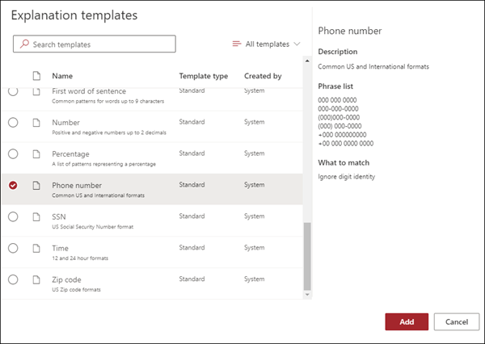

# 설명 유형 소개Introduction to explanation types

설명은 Microsoft SharePoint Syntex의 모델을 이해하는 문서에서 레이블을 지정하고 추출할 정보를 정의하는 데 도움이 됩니다. 설명을 작성할 때 설명 유형을 선택해야 합니다. 이 문서는 다양한 설명 유형과 사용 방법을 이해하는 데 도움이 됩니다.Explanations are used to help to define the information you want to label and extract in your document understanding models in Microsoft SharePoint Syntex. When creating an explanation, you need to select an explanation type. This article helps you understand the different explanation types and how they are used. 

    
   
다음과 같은 설명 유형을 사용할 수 있습니다.These explanation types are available:

- **구문 목록**: 추출하는 문서 또는 정보에 사용할 수 있는 단어, 구, 숫자 또는 기타 문자의 목록입니다. 예를 들어, 텍스트 문자열 **참조 의사** 는 식별 중인 모든 의료 참조 문서에 있습니다.**Phrase list**: List of words, phrases, numbers, or other characters you can use in the document or information that you are extracting. For example, the text string **Referring Doctor** is in all Medical Referral documents you are identifying. 

- **패턴 목록**: 추출하는 정보를 식별하는 데 사용할 수 있는 숫자, 문자 또는 기타 문자의 패턴을 나열합니다. 예를 들어, 식별 중인 모든 의료 참조 문서에서 참조 의사의 **전화 번호** 를 추출할 수 있습니다.**Pattern list**: List patterns of numbers, letters, or other characters that you can use to identify the information that you are extracting. For example, you can extract the **Phone number** of the referring doctor from all Medical Referral document that you are identifying. 

- **근접**: 서로에 대한 설명이 얼마나 가까운지 설명합니다. 예를 들어, *번지 번호* 패턴 목록은 *번지 이름* 구 목록 바로 앞에 있으며, 그 사이에 토큰이 없습니다(이 문서의 뒷부분에서 토큰에 대해 배우게 됩니다). 근접 유형을 사용하려면 모델에서 두 개 이상의 설명이 있어야 합니다. 그렇지 않으면 옵션이 비활성화됩니다.**Proximity**: Describes how close explanations are to each other. For example, a *street number* pattern list goes right before the *street name* phrase list, with no tokens in between (you'll learn about tokens later in this article). Using the proximity type requires you to have at least two explanations in your model or the option will be disabled. 
 
## 구 목록Phrase list

구문 목록 설명 유형은 일반적으로 모델을 통해 문서를 식별하고 분류하는 데 사용됩니다. *참조 의사* 라벨 예에서 설명한 대로, 식별하는 문서에서 일관되게 단어, 구, 숫자 또는 문자의 문자열입니다.A phrase list explanation type is typically used to identify and classify a document through your model. As described in the *Referring Doctor* label example, it is a string of words, phrases, numbers, or characters that is consistently in the documents that you are identifying.

캡처 중인 구문이 문서의 일관된 위치에 있는 경우 설명을 통해 더 나은 성공을 거둘 수 있습니다. 예를 들어, *참조 의사* 라벨은 문서의 첫 번째 단락에 일관되게 위치할 수 있습니다.While not a requirement, you can achieve better success with your explanation if the phrase you are capturing is located in a consistent location in your document. For example, the *Referring Doctor* label may be consistently located in the first paragraph of the document.

레이블을 식별하는데 대/소문자 구분이 필요하다면, 구 목록 유형을 사용하하면 **정확한 대소문자 사용** 체크박스를 선택하여 이를 설명에 지정할 수 있습니다.If case sensitivity is a requirement in identifying your label, using the phrase list type allows you to specify it in your explanation by selecting the **Only exact capitalization** checkbox.

    

## 패턴 목록Pattern lists

패턴 목록 유형은 문서를 식별하고 문서에서 정보를 추출하는 설명을 작성할 때 특히 유용합니다. 일반적으로 날짜, 전화 번호 및 신용카드 번호와 같은 다양한 형식으로 표시됩니다. 예를 들어, 날짜는 다양한 형식(1/1/2020, 1-1-2020, 01/01/20, 01/01/2020, 2020년 1월 1일 등)으로 표시할 수 있습니다. 패턴 목록을 정의하면 식별 및 추출하려는 데이터의 가능한 변형을 캡처하여 설명을 보다 효율적으로 수행할 수 있습니다.A pattern list type is especially useful when you create an explanation that identifies and extracts information from a document. It is typically presented in different formats, such as dates, phone numbers, and credit card numbers. For example, a date can be displayed in a number of different formats (1/1/2020, 1-1-2020, 01/01/20, 01/01/2020, Jan 1,2020, etc.). Defining a pattern list makes your explanation more efficient by capturing any possible variations in the data that you are trying to identify and extract. 

**전화 번호** 예제의 경우 모델이 식별하는 모든 의료 참조 문서에서 각 참조 의사의 전화 번호를 추출합니다. 설명을 만들 때 패턴 목록 유형을 선택하여 반환될 것으로 예상되는 다양한 형식을 허용합니다.For the **Phone number** example, you extract the phone number for each referring doctor from all Medical Referral documents that the model identifies. When you create the explanation, select the Pattern list type to allow the different formats that you may expect to be returned.

   

이 예에서는 **0-9 사이의 임의의 수** 확인란을 선택하여 패턴 목록에 사용된 각 "0" 값을 0부터 9까지의 숫자로 인식합니다.For this example, select the **Any digit from 0-9** checkbox to recognize each "0" value used in your pattern list to be any digit from 0 through 9.

   

마찬가지로 텍스트 문자를 포함하는 패턴 목록을 만들 경우 **a-z 사이의 임의의 문자** 확인란을 선택하여 패턴 목록에 사용된 각 "a" 문자를 "a"에서 "z"까지의 문자로 인식합니다.Similarly, if you create a pattern list that includes text characters, select the **Any letter from a-z** checkbox to recognize each "a" character used in the pattern list to be any character from "a" to "z".

예를 들어 **날짜** 패턴 목록을 만들 때 *2020년 1월 1일* 과 같은 날짜 서식이 인식되도록 하려면 다음을 수행해야 합니다.For example, if you create a **Date** pattern list and you want to make sure that a date format such as *Jan 1, 2020* is recognized, you need to:
- *0000 aaa 0* 과 *0000 aaa 00* 을 패턴 목록에 추가합니다.Add *aaa 0, 0000* and *aaa 00, 0000* to your pattern list.
- **a부터 z 사이 아무 문자** 를 선택했는지 확인합니다.Make sure that **Any letter from a-z** is also selected.

   

또한 패턴 목록에 대문자화 요구 사항이 있는 경우 **정확한 대문자화만** 확인란을 선택할 수 있습니다. 날짜 예제의 경우 월의 첫 번째 문자를 대문자로 표시해야 하는 경우 다음이 필요합니다.Additionally, if you have capitalization requirements in your pattern list, you have the option to select the **Only exact capitalization** checkbox. For the Date example, if you require the first letter of the month to be capitalized, you need to:

- *0000 Aaa 0* 과 *0000 Aaa 00* 을 패턴 목록에 추가합니다.Add *Aaa 0, 0000* and *Aaa 00, 0000* to your pattern list.
- **정확한 대소문자 사용** 이 선택되어 있는지 확인합니다.Make sure that **Only exact capitalization** is also selected.

   

> [!NOTE]
> 패턴 목록 설명을 수동으로 만드는 대신 [설명 라이브러리](https://docs.microsoft.com/microsoft-365/contentunderstanding/explanation-types-overview#use-explanation-templates)를 사용하여 *날짜*, *전화 번호*, *신용카드 번호* 등 일반 패턴 목록의 서식파일을 사용할 수 있습니다.Instead of manually creating a pattern list explanation, use the [explanation library](https://docs.microsoft.com/microsoft-365/contentunderstanding/explanation-types-overview#use-explanation-templates) to use pattern list templates for a common pattern list, such as *date*, *phone number*, *credit card number*, etc.

## 근접Proximity 

근접 설명 유형을 사용하면 다른 데이터가 얼마나 가까운지 정의하여 모델을 통해 데이터를 식별할 수 있습니다. 예를 들어 모델에서 고객 *거리 주소 번호* 및 *전화 번호* 모두에 레이블을 지정하는 두 가지 설명을 정의했다고 가정합니다.The proximity explanation type helps your model identify data by defining how close another piece of data is to it. For example, in your model say you have defined two explanations that label both the customer *Street address number* and *Phone number*. 

또한 고객 전화 번호는 항상 거리 주소 번호 앞에 표시된다는 것을 파악했습니다.Notice that customer phone numbers always appear before the street address number. 

Alex WilburnAlex Wilburn 
555-555-5555555-555-5555 
One Microsoft WayOne Microsoft Way 
Redmond, WA 98034Redmond, WA 98034 

근접 설명을 사용하여 전화 번호 설명이 문서에서 거리 주소 번호를 식별해내기에 근접하지 않은 설명이라는 것을 규정할 수 있습니다.Use the proximity explanation to define how far away the phone number explanation is to better identify the street address number in your documents.

    

#### 토큰이란?What are tokens?

근사 설명 유형을 사용하려면 근접 설명이 두 개의 설명 간의 거리를 어떻게 측정하는지 토큰의 수로 알 수 있으므로 토큰이 무엇인지를 이해해야 합니다. 토큰은 문자와 숫자의 연속적인 범위(공백이나 구두점은 포함하지 않음)입니다.In order to use the proximity explanation type, you need to understand what a token is, as the number of tokens is how the proximity explanation measures distance from one explanation to another. A token is a continuous span (not including spaces or punctuation) of letters and numbers. 

다음 표는 한 개의 구에서 토큰 수를 확인하는 방법에 대해 예를 보여 줍니다.The following table shows examples for how to determine the number of tokens in a phrase.

|구Phrase|토큰 수Number of tokens|설명Explanation|
|--|--|--|
|`Dog`|11|문장 부호나 공백이 없는 단일 단어입니다.A single word with no punctuation or spaces.|
|`RMT33W`|11|레코드 로케이터 번호입니다. 숫자 및 문자를 포함할 수 있지만 구두점이 없습니다.A record locator number. It may include numbers and letters, but does not have punctuation.|
|`425-555-5555`|55|전화 번호입니다. 각 문장 부호는 단일 토큰이므로 `425-555-5555`은(는) 5개의 토큰입니다.A phone number. Each punctuation mark is a single token, so `425-555-5555` is 5 tokens: `425` `-` `555` `-` `5555` |
|`https://luis.ai`|77|`https` `:` `/` `/` `luis` `.` `ai` |

#### 근접 설명 유형 구성Configure the proximity explanation type

예를 들어 *거리 주소 번호* 설명에서 *전화 번호* 설명에 있는 토큰 수 범위를 정의하도록 근접 설정을 구성합니다. 전화 번호와 거리 주소 번호 사이에는 토큰이 없으므로 최소 범위는 "0"입니다.For the example, configure the proximity setting to define the range of the number of tokens in the *Phone number* explanation from the *Street address number* explanation. Notice that the minimum range is "0", because there are no tokens between the phone number and street address number.

그러나 샘플 문서의 일부 전화 번호에는 *(휴대폰)* 이 추가되어 있습니다.But some phone numbers in the sample documents are appended with *(mobile)*.

Nestor WilkeNestor Wilke 
111-111-1111(휴대폰)111-111-1111 (mobile) 
One Microsoft WayOne Microsoft Way 
Redmond, WA 98034Redmond, WA 98034 

*(휴대폰)* 에는 세 개의 토큰이 있습니다.There are three tokens in *(mobile)*:

|구Phrase|토큰 수Token count|
|--|--|
|((|11|
|휴대폰mobile|22|
|))|33|

근접 설정이 0에서 3의 범위를 갖도록 구성합니다.Configure the proximity setting to have a range of 0 through 3.

    

## 설명 서식 파일 사용Use explanation templates

설명에 대한 다양한 패턴 목록 값을 수동으로 추가할 수 있지만, 설명 라이브러리에서 미리 작성된 서식 파일을 찾아 사용하는 것이 훨씬 쉬울 수 있습니다.While you can manually add various pattern list values for your explanation, it can be easier to use the templates provided to you in the explanation library.

예를 들어 *날짜* 에 대한 모든 변형을 수동으로 추가하는 대신 이미 여러 패턴 목록 값을 포함하고 있는 *날짜* 패턴 목록 서식 파일을 사용할 수 있습니다.For example, instead of manually adding all the variations for *Date*, you can use the pattern list template for *Date* as it already includes a number of pattern lists values: 

    
 
설명 라이브러리에는 다음을 비롯하여 일반적으로 사용되는 몇 가지 패턴 목록 설명이 포함되어 있습니다.The explanation library includes commonly used pattern list explanations, including: 

- 날짜Date 
- 날짜(숫자)Date (numeric) 
- 시간Time 
- 숫자Number 
- 전화 번호Phone number 
- 우편 번호Zip code 
- 문장의 첫 번째 단어First word of sentence 
- 신용카드Credit card 
- 주민등록번호Social security number 

또한 설명 라이브러리에는 다음을 포함한 구 목록 설명의 서식 파일도 포함하고 있습니다.Note that the explanation library also includes templates for phrase list explanations:
- 문장의 끝End of sentence
- 통화Currency

#### 설명 라이브러리에서 서식 파일을 사용하려면To use a template from the explanation library

1. 모델의 **교육** 페이지의 **설명** 구역에서 **신규** 를 선택한 다음 **서식 파일 사용** 을 선택합니다.From the **Explanations** section of your model's **Train** page, select **New**, then select **From a template**. 

    

2.  **설명 서식 파일** 페이지에서 사용하려는 설명을 선택하고 **추가** 를 선택합니다.On the **Explanation templates** page, select the explanation you want to use, then select **Add**. 

        

3. 선택한 템플릿에 대한 정보가 **설명 만들기** 페이지에 표시됩니다. 필요한 경우 설명 이름을 편집하고 패턴 목록에서 항목을 추가하거나 제거합니다.The information for the template you selected displays on the **Create an explanation** page. If needed, edit the explanation name and add or remove items from the pattern list.   

    

4. 작업을 끝낸 후 **저장** 을 선택합니다.When finished, select **Save**.
