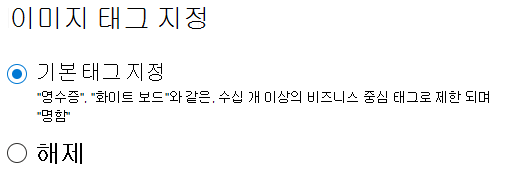

# SharePoint Syntex에서 이미지 태그 지정

(준비 중)

SharePoint Syntex의 이미지 태그를 사용 하면 사용자가 이미지 태그를 검색 하여 이미지를 찾고, 이미지 태그에 따라 워크플로를 만들 수 있습니다. 기본적으로 SharePoint 및 OneDrive에 대해 기본 이미지 태그 지정 기능이 설정됩니다. 두 위치 중 하나에 업로드된 이미지는 자동으로 검색되며 가능한 경우 해당 태그가 37개의 기본 태그 목록에서 적용됩니다. 사용자는 이미지 태그 검색을 통해 이미지를 찾을 수 있습니다.

사용자가 이미지를 업로드하면 태그 지정 프로세스가 자동으로 실행됩니다. 이미지를 편집하는 경우 태그 지정 프로세스를 다시 실행하여 태그를 업데이트합니다.

이미지 파일에 대한 사용 권한이 있는 사용자는 파일 정보 패널 또는 검색 결과 페이지에서 태그를 확인하고 편집할 수 있습니다. 사용자가 이미지 태그를 편집한 후에는 해당 이미지가 편집되더라도 이미지에 자동 태그를 지정하지 않습니다.

태그 지정을 해제하면 이미지에 더 이상 자동으로 태그가 지정되지 않습니다. 기존 태그는 제거되지 않습니다.

> [!NOTE]
> 이미지나 태그 기술이 업데이트 되면 세스템에서 생성된 태그가 변경 될 수 있습니다.

## 이미지 태그 지정 구성

[SharePoint Syntex](set-up-content-understanding.md)이후에는 Microsoft 365 관리 센터에서 이미지 태그를 구성 할 수 있습니다.  

이미지 태그 지정 설정 또는 해제 방법

1. 설치 Microsoft 365 관리 센터 설치 를 <a href="https://go.microsoft.com/fwlink/p/?linkid=2171997" target="_blank">**선택합니다.**</a>

2. **조직 지식** 에서 **콘텐츠 이해 자동화** 를 클릭합니다.

3. **관리** 를 클릭합니다.

4. **이미지 태그 지정** 탭에서 **편집** 을 클릭합니다.

5. **기본 태그 지정** 을 허용하거나 태그 지정 **해제** 를 선택합니다.

6. **저장** 을 클릭합니다.

    
