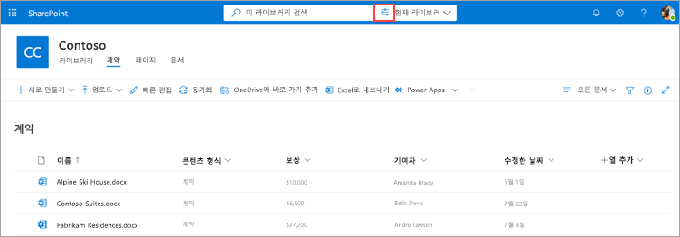
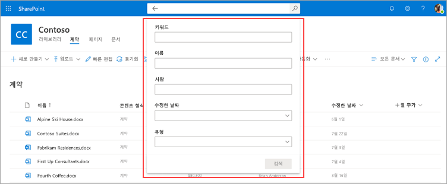

# Microsoft SharePoint Syntex의 문서 라이브러리에서 메타데이터 검색

SharePoint Syntex의 고급 메타데이터 검색 기능을 사용하면 SharePoint 문서 라이브러리에서 특정 메타데이터 기반 쿼리를 수행할 수 있습니다. 단순히 키워드를 검색하는 것보다 특정 메타데이터 열 값을 기반으로 더 빠르고 정확한 쿼리를 만들 수 있습니다.

고급 메타데이터 검색을 통해 문서와 연결된 메타데이터를 사용하여 SharePoint 문서 라이브러리에서 파일을 찾을 수 있습니다. 이는 문서가 마지막으로 수정된 시간, 파일과 연결된 특정 사람 또는 특정 파일 형식과 같이 검색하려는 특정 정보가 있는 경우에 특히 유용합니다.

> [!NOTE]
> 이 기능은 SharePoint Syntex 라이선스가 있는 사용자만 사용할 수 있습니다. 

## 고급 메타데이터 검색을 사용하려면

1. SharePoint 문서 라이브러리의 **이 라이브러리 검색** 상자에서 메타데이터 검색 아이콘()을 클릭하거나 탭합니다.

    

2. 메타데이터 검색 창에서 텍스트를 입력하거나 하나 이상의 검색 필드에서 찾으려는 매개 변수를 선택합니다.

    

   현재 5개의 메타데이터 검색 필드를 사용할 수 있습니다. 앞으로 더 많은 필드가 추가될 예정입니다.

   |필드    |이 필드를 사용하여  |
   |---------|---------|
   |키워드 |메타데이터 또는 문서의 전체 텍스트에서 문자열 일치를 검색합니다. |
   |이름     |라이브러리의 **이름** 열에서 검색합니다.          |
   |사용자   |라이브러리의 모든 열에 있는 사용자에 대한 일치 항목을 검색합니다.   |
   |수정됨 |라이브러리의 **수정됨** 열에서 선택한 날짜 범위로 검색합니다.         |
   |유형     |선택한 파일 형식으로 검색합니다.        |

3. **검색** 을 선택합니다. 메타데이터 검색과 일치하는 문서가 결과 페이지에 표시됩니다. 
