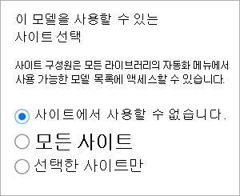
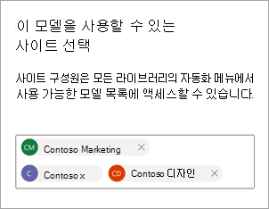
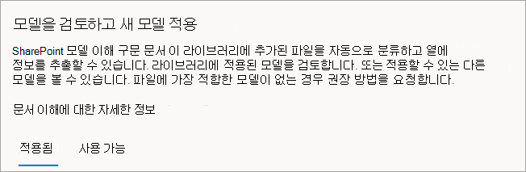
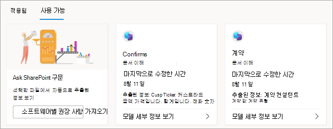
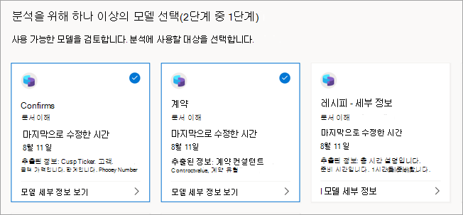
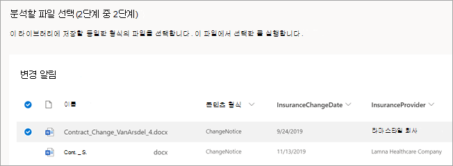
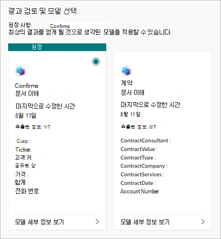

# Microsoft SharePoint Syntex에서 모델 게시 및 검색

다른 사용자가 SharePoint 문서 라이브러리에서 직접 보고 사용할 수 있도록 훈련된 문서 이해 모델을 만들 수 있습니다. 

조직의 다른 사용자가 만든 다른 콘텐츠 센터에서 훈련된 모델을 찾고 평가할 수도 있습니다. 파일을 분류하거나 파일에서 특정 정보를 추출하는 데 가장 유용한 모델을 선택하세요. 

> [!NOTE]
> 이 기능은 아직 양식 처리 모델에 사용할 수 없습니다.

## 다른 사용자가 모델을 검색할 수 있도록 설정

훈련된 모델을 다른 사용자가 사용할 수 있도록 하려면:

1. 모델의 **모델** 페이지에서 **모델 설정** 을 선택합니다.

2. **모델 설정** 패널의 **이 모델을 사용할 수 있는 사이트** 섹션에서 **편집** 을 선택합니다.

3. 이때 **이 모델을 사용할 수 있는 사이트 선택** 패널은 관리자 여부에 따라 달라집니다. 

    관리자인 경우 이 보기가 표시됩니다.

    

    - **어떤 사이트에서도 사용할 수 없음** – 다른 사용자가 모델을 사용할 수 없습니다.
    - **모든 사이트** – 다른 사용자가 사용할 수 있도록 콘텐츠 유형 갤러리에서 모델을 사용할 수 있습니다.
    - **선택한 사이트만** – 모델을 사용할 수 있는 사이트(들)를 선택할 수 있습니다. 텍스트 상자를 클릭하여 모델을 적용할 사이트를 검색하고 선택합니다. 액세스 권한이 있는 사이트만 표시됩니다.

    관리자가 *아닌* 경우 이 보기가 표시됩니다.

    

    이미 액세스 권한이 있는 특정 사이트에만 가용성을 추가하거나 제거할 수 있습니다.

4. 다른 사용자가 모델을 적용할 수 있도록 하려는 사이트를 선택한 다음 **저장** 을 선택합니다.

## 다른 훈련된 모델 살펴보기

콘텐츠에 적합할 수 있는 학습된 모델을 찾으려면:

1. 모델의 문서 라이브러리에서 **자동화** > **문서 이해 모델 보기** 를 선택합니다.

2. **모델 검토 및 새 모델 적용** 페이지에서 적용된 모델과 문서 라이브러리에 적용할 수 있는 모델을 검토할 수 있습니다.

    

   - **적용됨** 탭에서 라이브러리에 적용된 모델을 확인합니다. 설명, 추출기 및 기타 설정과 같은 모델에 대한 정보를 보려면 **모델 세부 정보 보기** 를 선택합니다.
   
   - **사용 가능** 탭에서 라이브러리에 적용할 수 있는 학습된 모델을 확인합니다.

### 학습된 모델을 라이브러리에 적용

콘텐츠에 대해 학습된 모델을 평가하여 가장 적합한 모델을 찾을 수 있습니다. 라이브러리에 적용할 모델을 선택하려면:

1. **모델 검토 및 새 모델 적용** 페이지에서 **사용 가능** 탭을 선택하여 목록의 모델을 검토합니다.

    

2. 최상의 결과를 얻을 수 있다고 생각되는 모델을 선택하고 **모델 세부 정보 보기** 를 선택한 다음 **라이브러리에 적용** 을 선택합니다.

### 학습된 모델에 대한 추천 받기

파일에 가장 적합한 모델이 무엇인지 확실하지 않은 경우 권장 사항을 요청할 수 있습니다. 권장 사항에는 최대 10개의 모델이 포함될 수 있습니다.

1. **모델 검토 및 새 모델 적용** 페이지에서 **사용 가능** 탭을 선택합니다.

2. 첫 번째 타일에서 **추천 받기** 를 선택합니다.

    

3. **분석을 위한 하나 이상의 모델 선택** 페이지에서 가장 적합하다고 생각되는 모델을 선택하고 **다음** 을 선택합니다.

    

4. **분석할 파일 선택** 페이지에서 라이브러리에 저장할 동일하거나 유사한 유형의 파일을 선택합니다. 그런 다음 **선택** 을 선택합니다.

    

5. **결과 검토 및 모델 선택** 페이지의 **권장사항** 아래에 권장 파일이 표시됩니다. 권장 모델을 적용할 필요는 없습니다. 더 적합하다고 생각되면 다른 모델을 적용하도록 선택할 수 있습니다.

    

6. 최상의 결과를 얻을 것으로 생각되는 모델에 대해 **모델 세부 정보 보기** 를 선택한 다음 **라이브러리에 적용** 을 선택합니다.

7. 선택한 파일을 기반으로 하는 권장 모델이 없으면 돌아가서 다른 파일을 선택하거나 다른 모델을 선택할 수 있습니다.

### 적용된 모델 제거

문서 라이브러리에서 적용된 모델을 제거하려면:

1. **모델 검토 및 새 모델 적용** 페이지의 **적용됨** 탭에서 라이브러리에 적용된 모델을 확인합니다.

2. 제거하려는 모델에서 **모델 세부 정보 보기** 를 선택한 다음 **라이브러리에서 제거** 를 선택합니다.

## 참고 항목

[문서 이해 모델 적용](apply-a-model.md)

[문서 이해 개요](document-understanding-overview.md)
