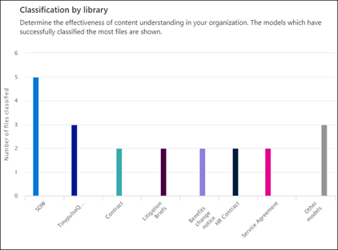

# Microsoft SharePoint Syntex의 문서 이해 모델 사용 현황 분석

 

> [!VIDEO https://www.microsoft.com/videoplayer/embed/RE4GnhX]  

 

SharePoint Syntex 콘텐츠 센터는 콘텐츠 센터에서 게시된 모델이 어떻게 사용되는지에 대한 더 많은 정보를 제공하기 위해 모델 사용 현황 분석을 제공합니다. 콘텐츠 센터의 <b>최근 30일 동안 모델의 성능</b> 섹션에는 다음 챠트 및 목록에 제공되는 30일 간의 사용 현황 분석 테이터 롤업이 포함되어 있습니다.

- 모델별 분류
- 라이브러리별 분류
- 모델 사용 

   

### 기본 콘텐츠 센터에서 모델 사용 현황 데이터 롤업

SharePoint Syntex에서 기본 콘텐츠 센터는 설치 중에 만들어집니다. 필요한 경우 추가 콘텐츠 센터를 만들 수도 있습니다. 예를 들어 부서에서 자체 콘텐츠 센터를 만들어 모델을 만들고 관리할 수 있습니다. 

모델 사용 현황 분석과 관련하여 다음에 유의하세요.

- 기본 콘텐츠 센터에는 추가 콘텐츠 센터에서 만든 모델을 포함하여 조직의 모든 콘텐츠 센터 및 모델에 대한 모델 사용 현황 분석을 표시합니다. 이를 통해 콘텐츠 관리자 및 기타 이해 관계자에게 회사 전체의 콘텐츠 센터 및 모델을 관리 감독할 수 있는 중앙 집중식 포털을 제공합니다.  
- 다른 콘텐츠 센터에서는 해당 콘텐츠 센터에서 만든 모델에 대한 모델 사용 현황 분석만 표시합니다. 이로써 콘텐츠 관리자는 관심있어 하는 모델에 대해서만 사용 현황 데이터에 대한 통찰력을 얻을 수 있습니다.

## 모델별 분류

     

**모델별 분류** 원형 차트에서는 가장 많은 파일을 분류한 모델이 표시됩니다. 게시된 각 모델은 콘텐츠 센터에 게시된 모든 모델에서 처리한 총 파일의 백분율로 표시됩니다.

각 모델은 모델에 의해 성공적으로 분석된 업로드 된 파일의 백분율인 **완성율** 을 보여줍니다. 낮은 완성율은 모델 혹은 분석된 파일에 문제가 있음을 의미 할 수도 있습니다.

## 라이브러리별 분류

     

**라이브러리별 분류** 막대 차트는 조직에서 콘텐츠 이해의 효율성을 결정하도록 돕습니다.  각 모델에서 시간에 따라 처리된 파일 수를 보여줄 뿐만 아니라 챠트의 열을 선택하면 모델이 적용된 문서 라이브러리도 표시합니다.

## 모델 사용

모델 사용 목록에는 콘텐츠 센터를 통해 만들어진 모델에 대한 사용 현황 분석이 표시됩니다.  

> [!NOTE]
> 기본 콘텐츠 센터에 있으며 조직에 추가 콘텐츠 센터가 있는 경우 모델 사용 목록은 콘텐츠 센터별로 그룹화됩니다.

모델 사용 목록에 있는 각 모델에는 사용 현황 데이터가 표시됩니다.

- 분류된 항목 수: 모델별로 처리되는 파일 수입니다.
- 평균 신뢰도 점수: 파일에 대해 실행할 때 모델의 평균 정확도 점수입니다.
- 대상 목록 URL: 모델이 적용되는 SharePoint 문서 라이브러리입니다.

## 참고 항목
[분류자 만들기](create-a-classifier.md)

[추출기 만들기](create-an-extractor.md)

[문서 이해 개요](document-understanding-overview.md)

[양식 처리 모델 만들기](create-a-form-processing-model.md)  
