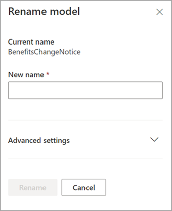

# Microsoft SharePoint Syntex에서 모델 이름 변경

문서 이해 모델의 이름을 변경하고 싶은 경우가 있을 수 있습니다. 일반적인 예로는 모델의 초기 초안을 작성할 때 최종 이름에 대해 많은 생각을 하지 않았을 수 있습니다(예: "AlexWilburModel1"이라는 이름을 붙였을 수 있습니다). 모델을 마무리하고 사용하는 단계에 가까워져서 더 적절한 이름이 "계약 갱신"이라는 것을 알게 되고 이름을 바꾸고 싶습니다.  

또 다른 예로는 조직에서 프로세스 또는 문서 유형을 다른 이름으로 참조하도록 결정할 때가 해당합니다. 예를 들어, 모델을 만들고 적용할 준비가 된 후에는 조직에서 모든 "계약"을 "계약"으로 공식 지칭하도록 강제할 수 있습니다. 필요한 경우 모델 이름을 "계약 갱신"에서 "계약 갱신"으로 변경할 수 있습니다.

> [!IMPORTANT]
> 문서 라이브러리에 적용되지 않은 문서 이해 모델만 이름을 변경할 수 있습니다. 

모델 이름을 바꾸면 모델과 연결된 [ 컨텐츠 유형](/sharepoint/governance/content-type-and-workflow-planning#content-type-overview)의 이름도 변경됩니다.

## 모델 이름 변경

다음 단계에 따라 문서 이해 모델의 이름을 변경합니다.

1. 콘텐츠 센터에서 모델 목록을 보려면 **모델** 을 선택합니다.

2. **모델** 페이지에서 이름을 변경할 모델을 선택합니다.

3. 리본 또는 **작업 표시** 버튼(모델 이름 옆에 있음)을 사용하여 **이름 변경** 을 선택합니다.  

      

4. **모델 이름 변경** 패널에서 다음을 수행합니다.

   a. **새 이름** 에서 이름을 변경할 모델의 새 이름을 입력합니다. 

      

   b. (선택 사항) **고급 설정** 에서 기존 [콘텐츠 유형](/sharepoint/governance/content-type-and-workflow-planning#content-type-overview)을 연결할지 여부를 선택합니다. **기존 컨텐츠 유형 사용** 을 선택하면 선택한 컨텐츠 유형과 일치하도록 모델 이름이 변경됩니다.

5. **이름 변경** 을 선택합니다.

## 참고 항목
[분류자 만들기](create-a-classifier.md)

[추출자 만들기](create-an-extractor.md)

[추출기 이름 변경](rename-an-extractor.md)

[문서 이해 개요](document-understanding-overview.md)

[설명 유형](explanation-types-overview.md)

[모델 적용](apply-a-model.md) 
