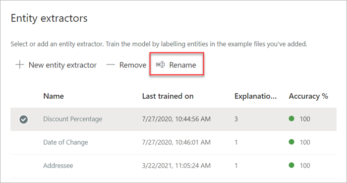
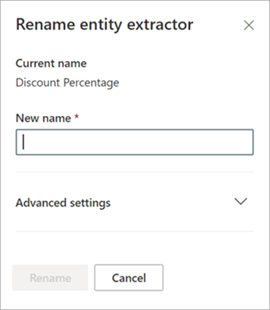

# Microsoft SharePoint Syntex에서 추출기 이름 변경

추출된 데이터 필드를 다른 이름으로 참조하려는 경우 어느 시점에서 추출기의 이름을 변경해야 할 수 있습니다. 예를 들어, 조직에서 계약 문서를 변경하기로 결정하고 문서에서 "고객"을 "클라이언트"라고 합니다. 모델에서 "고객" 필드를 추출한 경우 이름을 "클라이언트"로 변경하도록 선택할 수 있습니다.

업데이트된 모델을 SharePoint 문서 라이브러리에 동기화하면 문서 라이브러리 보기에 새로운 "클라이언트" 열이 표시됩니다. 보기는 과거 활동의 경우 "고객" 열을 유지하지만, 모델에서 처리하는 모든 새 문서에 대한 새 "클라이언트" 열을 업데이트합니다. 

> [!IMPORTANT]
>  표시할 새 열 이름의 경우 이전에 적용한 문서 라이브러리에 업데이트된 모델을 동기화해야 합니다. 

## 추출기 이름 변경

다음 단계에 따라 엔터티 추출기 이름을 변경합니다.

1. 콘텐츠 센터에서 모델 목록을 보려면 **모델** 을 선택합니다.

2. **모델** 페이지의 **이름** 열에서 추출기의 이름을 변경할 모델을 선택합니다.

3. **엔터티 추출기** 에서 이름을 변경할 추출기의 이름을 선택한 다음 **이름 바꾸기** 를 선택합니다. 

      

4. **엔터티 추출기 이름 변경** 패널에서:

   a. **새 이름** 에서 추출기의 새 이름을 입력합니다. 

      

   b. (선택 사항) **고급 설정** 에서 기존 사이트 열을 연결할지 여부를 선택합니다.

5. **이름 변경** 을 선택합니다.

## 참고 항목
[추출기 만들기](create-an-extractor.md)

[분류자 만들기](create-a-classifier.md)

[모델 이름 변경](rename-a-model.md)

[설명 유형](explanation-types-overview.md)

[추출기를 만들 때 용어 저장소 분류 활용](leverage-term-store-taxonomy.md)

[문서 이해 개요](document-understanding-overview.md)

[모델 적용](apply-a-model.md) 
