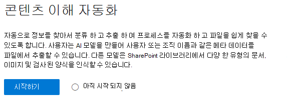
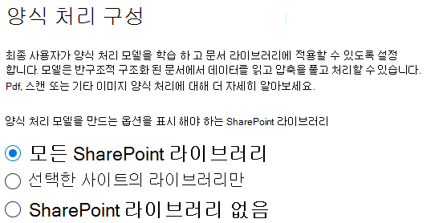
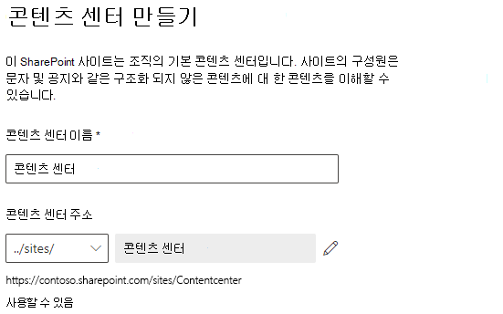

# 콘텐츠 이해 설정 (미리 보기)Set up content understanding (Preview)

> [!Note] 
> 이 문서에서 설명 하는 내용은 Project Cortex 비공개 미리 보기를 위한 것입니다.The content in this article is for Project Cortex Private Preview. [자세한 내용은 Project Cortex를 참조](https://aka.ms/projectcortex)하세요.[Find out more about Project Cortex](https://aka.ms/projectcortex).

관리자는 Microsoft 365 관리 센터를 사용 하 여 콘텐츠 이해를 설정 및 구성할 수 있습니다.Admins can use the Microsoft 365 admin center to set up and configure content understanding. 

설치 전에 환경에서 콘텐츠 이해를 설정 하 고 구성 하는 최상의 방법을 계획 해야 합니다.Prior to setup, make sure to plan for the best way to set up and configure content understanding in your environment. 예를 들어 다음과 같은 사항을 고려해 야 합니다.For example, you will need to make considerations about the following:
- 양식 처리를 사용 하도록 설정할 SharePoint 사이트Which SharePoint sites will you enable form processing? 사이트를 모두 또는 선택 하 시겠습니까?All of them, some, or select sites?
- 콘텐츠 센터의 이름 및 기본 사이트 관리자 인 사용자Name of your content center, and who is the primary site admin?

관리자는 설치 후에 Microsoft 365 관리 센터에서 콘텐츠를 이해 하는 방법을 통해 선택한 설정을 언제 든 지 변경할 수도 있습니다.An admin can also make changes to your selected settings anytime after setup through the content understanding management settings in the Microsoft 365 admin center.

## 요구 사항Requirements 
Microsoft 365 관리 센터에 액세스 하 고 콘텐츠 이해를 설정할 수 있으려면 전역 관리자 또는 SharePoint 관리자 권한이 있어야 합니다.You must have Global Admin or SharePoint admin permissions to be able to access the Microsoft 365 admin center and set up content understanding.

## 콘텐츠 이해를 설정 하려면To set up content understanding

1. Microsoft 365 관리 센터에서 **설치**를 선택 하 고 **조직의 기술 자료** 섹션을 확인 합니다.In the Microsoft 365 admin center, select **Setup**, and then view the **Organizational knowledge** section.
2. **조직의 기술 자료** 섹션에서 **콘텐츠 이해 자동화**를 선택 합니다.In the **Organizational knowledge** section, select **Automate content understanding**. 

     

3. **콘텐츠 이해 자동화** 페이지에서 **시작** 을 클릭 하 여 설치 프로세스를 안내 합니다.On the **Automate content understanding** page, click **Get started** to walk you through the setup process. 

     

4. **양식 처리 구성** 페이지에서는 사용자가 AI Builder를 사용 하 여 특정 SharePoint 문서 라이브러리에서 양식 처리 모델을 만들 수 있도록 할 것인지 여부를 선택할 수 있습니다.On the **Configure Form Processing** page, you can choose if you want to let users be able to use AI Builder to create form processing models in specific SharePoint document libraries. 문서 라이브러리 리본 메뉴에서 사용 가능 하도록 설정 된 SharePoint 문서 라이브러리에 **양식 처리 모델을 만들려면** 이 옵션을 사용할 수 있습니다.A menu option will be available in the document library ribbon to **Create a form processing model** in SharePoint document libraries in which it is enabled.
 
     **SharePoint 라이브러리에서 양식 처리 모델을 만드는 옵션을 표시 해야 하는**경우 다음을 선택할 수 있습니다.For **Which SharePoint libraries should show option to create a form processing model**, you can select: 
    - **모든 sharepoint 라이브러리** 를 사용 하 여 테 넌 트의 모든 sharepoint 라이브러리에서이를 사용할 수 있도록 합니다.**All SharePoint libraries** to make it available to all SharePoint libraries in your tenant. 
    - **선택한 사이트의 라이브러리 에서만**사용 가능 하도록 설정할 사이트를 선택 합니다.**Only libraries in selected sites**, and then select the sites in which you want to make it available. 
    - **SharePoint 라이브러리가 없기** 때문에 사이트에서 현재 사용할 수 없습니다 (설치 후에 변경할 수 있음).**No SharePoint libraries** if you currently don't want to make it available to any sites (you can change this after setup).
 

   

 

   > [!Note]
   > SharePoint 문서 라이브러리에서이 설정을 사용 하도록 설정 해도 라이브러리에 적용 된 기존 모델이 나 라이브러리에 문서 이해 모델을 적용 하는 기능에는 영향을 주지 않습니다.Enabling this setting on a SharePoint document library does not affect existing models applied to the library or the ability to apply document understanding models to a library. 

    
5. **콘텐츠 센터 만들기** 페이지에서는 사용자가 문서 이해 모델을 만들고 관리할 수 있는 SharePoint 콘텐츠 센터 사이트를 만들 수 있습니다.On the **Create Content Center** page, you can create a SharePoint content center site on which your users can create and manage document understanding models.  
    a.a. **사이트 이름**에 콘텐츠 센터 사이트에 지정할 이름을 입력 합니다.For **Site name**, type the name you want to give your content center site. 
    b.b. 사이트 **주소** 에는 사이트 이름으로 선택한 사항을 기반으로 하 여 사이트의 URL이 표시 됩니다.The **Site address** will show the URL for your site, based on what you selected for the site name. 

    > [!Note] 
    > 지원 되는 언어를 선택할 수 있지만 콘텐츠 이해 모델은 영어에만 만들 수 있습니다.While you can select any supported language, note that content understanding models can only be created for English. 

       

    **다음**을 선택합니다.Select **Next**.
6. **마침 및 검토** 페이지에서 선택한 설정을 확인 하 고 변경 작업을 선택할 수 있습니다.On the **Finish and review** page, you can look at your selected setting and choose to make changes. 선택에 만족 하면 **활성화**를 선택 합니다.If you are satisfied with your selections, select **Activate**.

7. 시스템에서 양식 처리 기본 설정을 추가 하 고 콘텐츠 센터 사이트를 만들기를 확인 하 여 **정품 인증 된 콘텐츠를 이해** 하는 페이지를 표시 합니다.The **Content understanding activated** page will display, confirming that the system has added your form processing preferences and creating the Content Center site. **완료**를 선택합니다.Select **Done**.

8. **콘텐츠 자동화를 이해** 하는 페이지를 반환 합니다.You'll be returned to your **Automate content understanding** page. 이 페이지에서 **관리** 를 선택 하 여 구성 설정을 변경할 수 있습니다.From this page, you can select **Manage** to make any changes to your configuration settings. 

## 참고 항목See also

  

