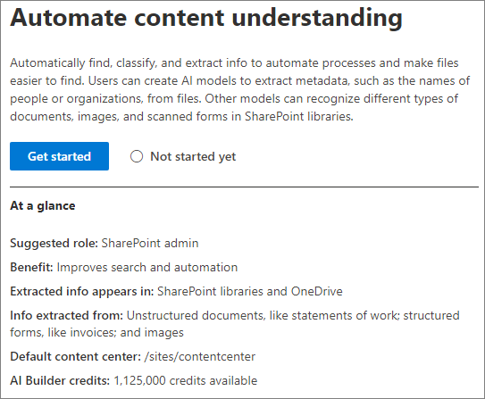

# SharePoint Syntex 설정Set up SharePoint Syntex

관리자는 Microsoft 365 관리 센터를 사용 하 여 설치 및 Microsoft SharePoint Syntex을 설정할 수 있습니다.Admins can use the Microsoft 365 admin center to set up and Microsoft SharePoint Syntex. 

시작 하기 전에 다음 사항을 고려 하십시오.Consider the following before you start:

- 양식 처리를 사용 하도록 설정할 SharePoint 사이트Which SharePoint sites will you enable form processing? 사이트를 모두 또는 선택 하 시겠습니까?All of them, some, or select sites?
- 콘텐츠 센터의 이름과 기본 사이트 관리자를 선택 합니다.What will you name of your content center, and who is the primary site admin?

Microsoft 365 관리 센터의 초기 설치 후에 설정을 변경할 수 있습니다.You can change your settings after initial setup in the Microsoft 365 admin center.

이 문서에서 설명 하는 내용은 Project Cortex 비공개 미리 보기에 대 한 것입니다.The content in this article is for the Project Cortex Private Preview. [자세한 내용은 Project Cortex를 참조](https://aka.ms/projectcortex)하세요.[Find out more about Project Cortex](https://aka.ms/projectcortex).

설치 전에 환경에서 콘텐츠 이해를 설정 하 고 구성 하는 최상의 방법을 계획 해야 합니다.Prior to setup, make sure to plan for the best way to set up and configure content understanding in your environment. 예를 들어 다음 이름에 대 한 고려 사항을 고려해 야 합니다.For example, you need to make considerations about the following names of:

- 모든 해당, 일부 또는 선택한 사이트의 양식 처리를 사용 하도록 설정 하려는 SharePoint 사이트The SharePoint sites that you want to enable form processing - all of them, some, or selected sites
- 콘텐츠 센터 및 기본 사이트 관리자의 이름Your content center and the name of the primary site admin

## 요구 사항Requirements 

> [!NOTE]
> Microsoft 365 관리 센터에 액세스 하 고 콘텐츠 이해를 설정할 수 있으려면 전역 관리자 또는 SharePoint 관리자 권한이 있어야 합니다.You must have Global admin or SharePoint admin permissions to be able to access the Microsoft 365 admin center and set up content understanding.

관리자는 설치 후와 Microsoft 365 관리 센터의 콘텐츠를 이해 하는 콘텐츠에 따라 선택한 설정을 언제 든 지 변경할 수도 있습니다.As an admin, you can also make changes to your selected settings anytime after setup, and throughout the content understanding management settings in the Microsoft 365 Admin Center.

## SharePoint Syntex를 설정 하려면To set up SharePoint Syntex

1. Microsoft 365 관리 센터에서 **설치**를 선택 하 고 **조직의 기술 자료** 섹션을 확인 합니다.In the Microsoft 365 admin center, select **Setup**, and then view the **Organizational knowledge** section.

2. **조직의 기술 자료** 섹션에서 **콘텐츠 이해 자동화**를 선택 합니다.In the **Organizational knowledge** section, select **Automate content understanding**. 

     

3. **SharePoint Syntex 자동화** 페이지에서 **시작** 을 클릭 하 여 설정 프로세스를 안내 합니다.On the **Automate SharePoint Syntex** page, click **Get started** to walk through the setup process. 

     

4. 이미지 태그 설정 페이지에서 [이미지 태그](image-tagging.md)지정을 허용할 것인지 여부를 선택 합니다.On the Turn on image tagging page, choose if you want to allow [image tagging](image-tagging.md).

     

5. **양식 처리 구성** 페이지에서는 사용자가 AI Builder를 사용 하 여 특정 SharePoint 문서 라이브러리에서 양식 처리 모델을 만들 수 있도록 할 것인지 여부를 선택할 수 있습니다.On the **Configure Form Processing** page, you can choose if you want to let users be able to use AI Builder to create form processing models in specific SharePoint document libraries. 문서 라이브러리 리본 메뉴에서 사용 가능 하도록 설정 된 SharePoint 문서 라이브러리에 **양식 처리 모델을 만들려면** 이 옵션을 사용할 수 있습니다.A menu option will be available in the document library ribbon to **Create a form processing model** in SharePoint document libraries in which it is enabled.
 
     **SharePoint 라이브러리에서 양식 처리 모델을 만드는 옵션을 표시 해야 하는**경우 다음을 선택할 수 있습니다.For **Which SharePoint libraries should show option to create a form processing model**, you can select: 
      - **모든 sharepoint 라이브러리** 를 조직의 모든 sharepoint 라이브러리에서 사용할 수 있도록 하는 데 사용 됩니다.**All SharePoint libraries** to make it available to all SharePoint libraries in your organization. 
      - **선택한 사이트의 라이브러리 에서만**사용 가능 하도록 설정할 사이트를 선택 합니다.**Only libraries in selected sites**, and then select the sites in which you want to make it available. 

   

   > [!Note]
   > SharePoint 문서 라이브러리에서이 설정을 사용 하도록 설정 해도 라이브러리에 적용 된 기존 모델이 나 라이브러리에 문서 이해 모델을 적용 하는 기능에는 영향을 주지 않습니다.Enabling this setting on a SharePoint document library does not affect existing models applied to the library or the ability to apply document understanding models to a library. 
    
6. **콘텐츠 센터 만들기** 페이지에서는 사용자가 문서 이해 모델을 만들고 관리할 수 있는 SharePoint 콘텐츠 센터 사이트를 만들 수 있습니다.On the **Create Content Center** page, you can create a SharePoint content center site on which your users can create and manage document understanding models.  
    a.a. **사이트 이름**에 콘텐츠 센터 사이트에 지정할 이름을 입력 합니다.For **Site name**, type the name you want to give your content center site. 
    b.b. 사이트 **주소** 에는 사이트 이름으로 선택한 사항을 기반으로 하 여 사이트의 URL이 표시 됩니다.The **Site address** will show the URL for your site, based on what you selected for the site name. 변경 하려면 **편집**을 클릭 합니다.If you want to change it, click **Edit**. 

       

    **다음**을 선택합니다.Select **Next**.

7. **검토 및 마침** 페이지에서 선택한 설정을 확인 하 고 변경 작업을 선택할 수 있습니다.On the **Review and finish** page, you can look at your selected setting and choose to make changes. 선택에 만족 하면 **활성화**를 선택 합니다.If you are satisfied with your selections, select **Activate**.

8. 확인 페이지에서 **완료**를 클릭 합니다.On the confirmation page, click **Done**.

9. **콘텐츠 자동화를 이해** 하는 페이지를 반환 합니다.You'll be returned to your **Automate content understanding** page. 이 페이지에서 **관리** 를 선택 하 여 구성 설정을 변경할 수 있습니다.From this page, you can select **Manage** to make any changes to your configuration settings. 

## 라이선스 할당Assign licenses

SharePoint Syntex를 구성한 후에는 양식 처리 및 문서 이해 기능을 사용할 사용자에 대 한 라이선스를 할당 해야 합니다.Once you have configured SharePoint Syntex, you must assign licenses for the users who will be using form processing and document understanding features.

라이선스를 할당 하려면:To assign licenses:

1. Microsoft 365 관리 센터의 **사용자**에서 **활성 사용자**를 클릭 합니다.In the Microsoft 365 admin center, under **Users**, click **Active users**.

2. 라이선스를 부여할 사용자를 선택 하 고 **제품 라이선스 관리**를 클릭 합니다.Select the users that you want to license, and click **Manage product licenses**.

3. **추가 할당**을 선택 합니다.Select **Assign more**.

4. **지능형 콘텐츠 서비스**를 선택 합니다.Select **Intelligent Content Services**. **앱**에서 지능형 콘텐츠 서비스와 **지능형 콘텐츠** 서비스 **에 대 한 공통 데이터 서비스가** 모두 선택 되어 있는지 확인 합니다.Under **Apps**, make sure **Common Data Service for Intelligent Content Services** and **Intelligent Content Services** are both selected.

    

5. **변경 내용 저장**을 클릭합니다.Click **Save changes**.

## AI 건축 제작진AI Builder credits

조직에 sharepoint Syntex에 대 한 SharePoint Syntex 라이선스가 300 개 이상 있는 경우 100만 AI Builder 크레딧이 할당 됩니다.If you have 300 or more SharePoint Syntex licenses for SharePoint Syntex in your organization, you will be allocated one million AI Builder credits. 라이선스 수가 300 개 미만이 면 양식 처리를 사용 하기 위해 AI 빌더 제작진을 구입 해야 합니다.If you have fewer than 300 licenses, you must purchase AI Builder credits in order to use forms processing.

[Ai builder 계산기](https://powerapps.microsoft.com/ai-builder-calculator)로 적합 한 ai 작성기 용량을 추정할 수 있습니다.You can estimate the AI Builder capacity that’s right for you with the [AI Builder calculator](https://powerapps.microsoft.com/ai-builder-calculator).

1. [Power Platform 관리 센터로](https://admin.powerplatform.microsoft.com/resources/capacity) 이동 하 여 크레딧 및 사용 현황을 확인 합니다.Go to the [Power Platform admin center](https://admin.powerplatform.microsoft.com/resources/capacity) to check your credits and usage.

    > [!NOTE]
    > SharePoint 문서 라이브러리에서이 설정을 사용 하도록 설정 해도 라이브러리에 적용 된 기존 모델이 나 라이브러리에 문서 이해 모델을 적용할 수 있는 기능에는 영향을 주지 않습니다.Enable this setting on a SharePoint document library does not affect existing models applied to the library or the ability to apply document understanding models to a library. 
    
2. **콘텐츠 센터 만들기** 페이지에서는 사용자가 문서 이해 모델을 만들고 관리할 수 있는 SharePoint 콘텐츠 센터 사이트를 만들 수 있습니다.From the **Create Content Center** page, you can create a SharePoint content center site for which users can create and manage document understanding models.  
    a.a. **사이트 이름**에 대해 콘텐츠 센터 사이트에 사용할 이름을 입력 합니다.For **Site name**, type the name you want for the content center site. 
    b.b. 사이트 **주소** 는 사이트 이름을 기반으로 사이트의 URL을 표시 합니다.The **Site address** shows the URL for your site, based on the site name. 

    > [!NOTE] 
    > 지원 되는 언어를 선택할 수 있지만 콘텐츠 이해 모델은 영어에만 만들 수 있습니다.While you can select any supported language, content understanding models can only be created for English. 

       

3. **다음**을 선택합니다.Select **Next**.

4. **마침 및 검토** 페이지에서 선택한 설정을 확인 하 고 변경을 선택 합니다.On the **Finish and review** page, look at your selected setting and choose to make changes. 선택에 만족 하면 **활성화**를 선택 합니다.If you are satisfied with your selections, select **Activate**.

5. 사용자가 양식 처리 기본 설정을 추가 하 고 콘텐츠 센터 사이트를 만들었기를 확인 하 여 **정품 인증 된 콘텐츠 이해** 됨 페이지를 표시 합니다.The **Content understanding activated** page displays, confirming the system added your form processing preferences and created the Content Center site. **완료**를 선택합니다.Select **Done**.

6. **콘텐츠 자동화를 이해** 하는 페이지를 반환 합니다.You'll be returned to your **Automate content understanding** page. 이 페이지에서 **관리** 를 선택 하 여 구성 설정을 변경할 수 있습니다.From this page, you can select **Manage** to make any changes to your configuration settings. 

## 참고 항목See also

[양식 처리 모델 개요Overview of the form processing model](https://docs.microsoft.com/ai-builder/form-processing-model-overview)

[단계별: 문서 이해 모델을 작성 하는 방법 (비디오)Step-by-Step: How to Build a Document Understanding Model (video)](https://www.youtube.com/watch?v=DymSHObD-bg)

