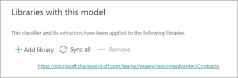

# 1단계. 사용자 SharePoint Syntex 사용하여 계약 파일을 식별하고 데이터 추출

조직에서는 받은 많은 파일에서 모든 계약 문서를 식별하고 분류하는 방법이 필요합니다. 또한 식별된 각 계약 파일의 여러 주요 요소(예: *클라이언트,* 계약자 및 수수료 금액)를 빠르게 볼 *수 있습니다.* 이 작업을 위해 문서 이해 [모델을](index.md) SharePoint Syntex 라이브러리에 적용하면 됩니다.

## 프로세스 개요

[문서 이해는](document-understanding-overview.md) 인공 지능(AI) 모델을 사용하여 파일 분류 및 정보 추출을 자동화합니다. 문서 이해 모델은 필요한 정보가 테이블이나 양식(예: 계약)에 포함되어 있지 않은 구조화되지 않은 문서 및 반구조적 문서에서 정보를 추출할 때도 최적의 모델입니다. 

문서 이해 모델에서는 OCR(광학 인식) 기술을 사용하여 예제 파일이 있는 모델을 교육하고 문서 라이브러리의 파일에 대해 모델을 실행할 때 모두 PDF, 이미지 및 TIFF 파일을 스캔합니다.

1. 먼저 식별하려는 콘텐츠 형식(계약)에 특정한 특성을 검색하기 위해 모델을 "학습"하는 데 사용할 수 있는 5개 이상의 예제 파일을 찾아야 합니다. 

2. 이 SharePoint Syntex 사용하여 새 문서 이해 모델을 만들 수 있습니다. 예제 파일을 사용하여 분류자 [를 만들어야 합니다.](create-a-classifier.md) 분류자에 예제 파일을 교육하여 회사 계약에서 볼 수 있는 특징을 검색하도록 교육합니다. 예를 들어 서비스 계약, 계약 조건 및 보상과 같이 계약에 있는 특정 문자열을 검색하는 ["설명"을](create-a-classifier.md#create-an-explanation) *만들 수 있습니다.* 문서의 특정 섹션에서 또는 다른 문자열 옆에 있는 이러한 문자열을 검색하도록 설명을 교육할 수도 있습니다. 필요한 정보를 사용하여 분류자 교육을 했다고 생각되는 경우 예제 파일 예제 집합에서 모델을 테스트하여 효율성을 볼 수 있습니다. 테스트 후 필요한 경우 설명을 보다 효율적으로 변경하기 위해 변경할 수 있습니다. 

3. 모델에서 각 계약에서 특정 데이터 조각을 끌어오는 추출기 만들기를 만들 수 있습니다.  예를 들어 각 계약에 대해 가장 우려되는 정보는 클라이언트의 사용자, 계약자 이름 및 총 비용입니다.

4. 모델을 성공적으로 만든 후 SharePoint [라이브러리에 적용합니다.](apply-a-model.md) 문서 라이브러리에 문서를 업로드하면 문서 이해 모델이 실행되고 모델에서 정의한 계약 콘텐츠 형식과 일치하는 모든 파일을 식별하고 분류합니다. 계약으로 분류된 모든 파일은 사용자 지정 라이브러리 보기에 표시됩니다. 파일에는 추출기에서 정의한 각 계약의 값도 표시됩니다.

   

5. 계약에 대한 보존 또는 보안 요구 사항이 있는 경우 모델을  사용하여 보존  레이블 또는 민감도 레이블을 적용하여 지정된 기간 동안 계약이 삭제되지 않도록 방지하거나 계약에 액세스할 수 있는 사용자도 제한할 수 있습니다.

## 모델을 만들고 교육하는 단계

> [!NOTE]
> 이러한 단계의 경우 계약 관리 솔루션 자산 리포지토리의 예제 [파일을 사용할 수 있습니다.](https://github.com/pnp/syntex-samples/tree/main/scenario%20assets/Contracts%20Management) 이 리포지토리의 예제에는 문서 이해 모델 파일과 모델을 학습하는 데 사용되는 파일이 모두 포함되어 있습니다.

### 계약 모델 만들기

첫 번째 단계는 계약 모델을 만드는 것입니다.

1. 콘텐츠 센터에서 **새 모델** 을 선택한 다음 **모델 만들기** 를 선택합니다.

2. 새 문서 **이해 모델** 창의 **이름** 필드에 모델 이름을 입력합니다. 이 계약 관리 솔루션의 경우 모델 계약의 이름을 으로 할 수 *있습니다.*

4. **만들기** 를 선택합니다. 이 작업을 통해 모델에 대한 홈페이지를 만들 수 있습니다. 

    

### 파일 형식을 분류하기 위해 모델 교육

#### 모델에 대한 예제 파일 추가

계약 문서인 예제 파일과 계약 문서가 아닌 예제 파일(예: 작업 설명)을 5개 이상 추가해야 합니다. 

1. 모델 > **계약** 페이지의 주요 작업 예제 파일  >  추가에서 파일 **추가를 선택합니다.**

   

2. 모델에 대한 예제 파일 선택 **페이지에서** 계약 폴더를 열고 사용할 파일을 선택한 다음 추가를 **선택합니다.** 예제 파일이 없는 경우 추가하려면  업로드 선택합니다.

#### 파일에 양수 또는 음수 예제로 레이블 지정

1. 모델 > **계약 페이지의** 주요 작업 파일 분류 및 교육  >  **실행에서** **분류자 교육을 선택합니다.**

   

2. Models **> Contract > Contract 분류자** 페이지의 첫 번째 예제 파일 맨 위에 있는 뷰어에 파일이 만든 계약 모델의 예로 묻는 텍스트가 표시됩니다. 긍정 예제인 경우 **예** 를 선택합니다. 부정 예제인 경우 **아니요** 를 선택합니다.

3. 왼쪽의 **레이블이 붙은** 예제 목록에서 예제로 사용할 다른 파일을 선택하고 레이블을 지정합니다. 

     

#### 분류자 교육을 위해 하나 이상의 설명 추가 

1. 모델 > **계약 > 분류자 페이지에서** 교육 **탭을** 선택합니다.

2. 학습된 **파일 섹션에는** 이전에 레이블을 지정한 예제 파일 목록이 표시됩니다. 목록에서 양수 파일 중 하나를 선택하여 보기에 표시합니다.

3. 설명 **섹션에서** 새로 **고치고** 빈 을 **선택합니다.**

4. **설명 만들기** 페이지에서 다음을 수행합니다.

    a. 이름 **필드에** 설명의 이름(예: &quot;계약")을 입력합니다.

    b. 텍스트 **문자열을 추가하기 때문에 설명** 유형 필드에서 **구** 목록 을 선택합니다.

    c. 구 **목록 상자에** 문자열(예: "AGREEMENT")을 입력합니다. 문자열이 **대소문자** 구분을 필요로 하는 경우 대소문자 구분을 선택할 수 있습니다.

    d. 저장 **및 교육을 선택합니다.**

     

#### 모델 테스트하기

이전과는 다른 예제 파일에서 계약 모델을 테스트할 수 있습니다. 이는 선택 사항이지만 유용한 모범 사례일 수 있습니다.

1. 모델 > **계약 > 분류자 페이지에서** 테스트 **탭을** 선택합니다. 이렇게 하여 모델이 사용되지 않는 예제 파일에서 실행됩니다.

2. 테스트 **파일 목록에서** 예제 파일은 모델에서 양수 또는 음수로 예측한 파일을 표시하고 표시합니다. 이 정보를 사용하여 문서를 식별하는 데 필요한 분류자의 효율성을 알아낼 수 있습니다.

     

3. 완료되면 교육 **종료 를 선택합니다.**

### 추출기 만들기 및 교육

1. 모델 > **계약 페이지의** 주요 작업 추출기 만들기  >  **및 교육에서** **추출기 만들기를 선택합니다.**

   

2. 새 **엔터티 추출기 패널의** 새 **이름 필드에** 추출기 이름을 입력합니다. 예를 들어 각 계약에서 클라이언트 이름을 추출하려는 경우 이름을 *Client로* 지정합니다.

3. 완료되면 만들기를 **선택합니다.**

#### 추출할 엔터티에 레이블 지정

추출을 만들면 추출기 페이지가 열립니다. 여기 뷰어에 표시된 목록의 첫번째 파일과 함께 샘플 파일 목록이 표시됩니다.

 

엔터티에 레이블을 지정합니다.

1. 뷰어에서 파일로부터 추출하려는 데이터를 선택합니다. 예를 들어 클라이언트 를 추출하려면 첫 번째 파일(이 예에서는 Best *For You Organics)에서* 클라이언트 값을 강조 표시한 다음 저장을 **선택합니다.** 레이블이 지정한 예제 목록의 레이블  열 아래에 파일에서 값이 **표시됩니다.**

2. 자동 **저장하려면** 다음 파일을 선택하고 뷰어의 목록에서 다음 파일을 여는 방법을 선택합니다. 또는 **저장 을** 선택한 다음 레이블이 붙은 예제 목록에서 다른 **파일을** 선택합니다.

3. 뷰어에서 1단계와 2단계를 반복한 다음 레이블을 모든 파일에 저장할 때까지 반복합니다.

파일에 레이블을 지정하면 교육으로 이동을 알리는 알림 배너가 표시됩니다. 더 많은 문서에 레이블을 지정하거나 교육으로 진행할 수 있습니다.

#### 설명 추가하기

엔터티 형식 자체 및 예제 파일에 있을 수 있는 변형에 대한 힌트를 제공하는 설명을 만들 수 있습니다. 예를 들어 날짜 값은 다음과 같은 다양한 형식일 수 있습니다.

- 2019/10/14
- 2019년 10월 14일
- 2019년 10월 14일 월요일

계약 시작 날짜를 식별하기 위해 *패턴* 설명을 만들 수 있습니다.

1. 설명 **섹션에서** 새로 **고치고** 빈 을 **선택합니다.**

2. **설명 만들기** 페이지에서 다음을 수행합니다.

    a. 이름 **필드에** 설명의 이름(예: 날짜)을 *입력합니다.*

    b. 설명 유형 **필드에서** 패턴 **목록 을 선택합니다.**

    c. 값 **필드에** 예제 파일에 나타나는 날짜 변형을 제공합니다. 예를 들어 0000/00/0으로 표시되는 날짜 형식이 있는 경우 문서에 표시되는 모든 변형을 다음과 같이 입력합니다.

    - 0000/0/0
    - 0000/0/00
    - 0000/00/0
    - 0000/00/00

4. 저장 **및 교육을 선택합니다.**

#### 모델 다시 테스트

이전과는 다른 예제 파일에서 계약 모델을 테스트할 수 있습니다. 이는 선택 사항이지만 유용한 모범 사례일 수 있습니다.

1. 모델 > **계약 > 분류자 페이지에서** 테스트 **탭을** 선택합니다. 이렇게 하여 모델이 사용되지 않는 예제 파일에서 실행됩니다.

2. 테스트 **파일 목록에서** 예제 파일이 표시하고 모델에서 필요한 정보를 추출할 수 있는지 표시합니다. 이 정보를 사용하여 문서를 식별하는 데 필요한 분류자의 효율성을 알아낼 수 있습니다.

3. 완료되면 교육 **종료 를 선택합니다.**

### 문서 라이브러리에 모델 적용

모델을 문서 라이브러리에 SharePoint:

1. 모델 > **계약** 페이지의 주요 작업 라이브러리에 모델  >  **적용에서** 모델 **적용을 선택합니다.**

   

2. 계약 **추가** 패널에서 모델을 SharePoint 라이브러리가 포함된 사이트 사이트를 선택합니다. 사이트가 목록에 표시되지 않는 경우, 검색 상자를 사용하여 찾습니다. **추가** 를 선택합니다.

    > [!NOTE]
    > 모델을 적용할 문서 라이브러리에 대한 *목록 관리* 권한 또는 *편집* 권한이 있어야 합니다.

3. 사이트를 선택한 후 모델을 적용할 문서 라이브러리를 선택합니다.

4. 모델이 콘텐츠 형식에 연결되어 있기 때문에 라이브러리에 모델을 적용하면 열로 표시하기 위해 추출한 레이블이 있는 콘텐츠 형식 및 보기가 추가됩니다. 이 보기는 기본적으로 라이브러리의 기본 보기이지만 선택적으로 고급 설정을 선택하고 이 새 보기를 기본 보기로  설정 확인란의 선택을 취소하여 기본 보기가 아니게 할 수 있습니다. 

5. 라이브러리에 모델을 적용하려면 **추가** 를 선택합니다.

6. 모델 > **계약** 페이지의 이 모델이 있는 라이브러리 섹션에 나열된 모델 사이트의 URL이 SharePoint 표시됩니다. 

    

7. 라이브러리 **설정**  >  **아래에서**:

   - 상태라는 **열을 추가하고** **선택을** 열 유형으로 선택합니다.
   - 검토 **중,** **승인됨** 및 **거부된 값을 적용합니다.**

이 모델을 문서 라이브러리에 적용한 후 사이트에 문서 업로드를 시작하고 결과를 볼 수 있습니다.

## 다음 단계

[2단계. 이 Microsoft Teams 사용하여 계약 관리 채널 만들기](solution-manage-contracts-step2.md)