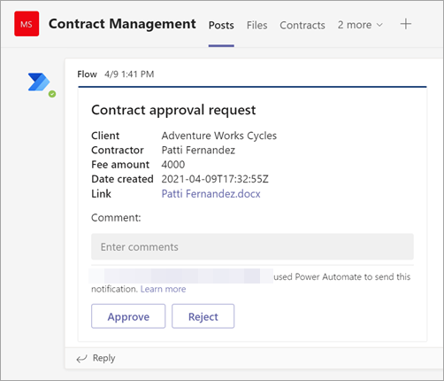

# <a name="step-3-use-power-automate-to-create-the-flow-to-process-your-contracts"></a>3단계. 이 Power Automate 사용하여 계약을 처리하기 위한 흐름 만들기

계약 관리 채널을 만들며 문서 라이브러리에 SharePoint 있습니다. 다음 단계는 Power Automate 모델이 식별하고 분류하는 계약을 SharePoint Syntex 흐름을 만드는 것입니다. 이 단계는 문서 라이브러리에서 Power Automate 흐름을 만들어 [SharePoint 있습니다.](https://support.microsoft.com/office/create-a-flow-for-a-list-or-library-in-sharepoint-or-onedrive-a9c3e03b-0654-46af-a254-20252e580d01)

계약 관리 솔루션의 경우 다음과 같은 작업을 Power Automate 흐름을 만들 수 있습니다.

-  SharePoint Syntex 모델에 의해 계약이 분류된 후 계약 상태를 검토 중으로 **변경합니다.**
- 그러면 계약이 검토된 후 승인되거나 거부됩니다.
- 승인된 계약의 경우 계약 정보는 결제 처리를 위해 탭에 게시됩니다.
- 거부된 계약의 경우 팀에서 추가 분석을 위해 통보됩니다. 

다음 다이어그램은 계약 관리 Power Automate 대한 흐름을 보여 주며,


## <a name="prepare-your-contract-for-review"></a>검토를 위한 계약 준비

사용자 문서 이해 모델을 통해 계약을 식별하고 SharePoint Syntex 경우 Power Automate 흐름은 먼저 상태를 검토 중으로 **변경합니다.**


파일을 체크 아웃한 후 상태 값을 검토 중으로 **변경합니다.**


다음 단계는 계약이 검토를 기다리고 계약 관리 채널에 게시할 수 있는 적응형 카드를 만드는 것입니다.




다음 코드는 Power Automate 흐름에서 이 단계에 사용되는 JSON입니다.

```JSON
{
"$schema": "http://adaptivecards.io/schemas/adaptive-card.json",
"type": "AdaptiveCard",
"version": "1.0",
"body": [
    {
    "type": "TextBlock",
    "text": "Contract approval request",
    "size": "large",
    "weight": "bolder",
     "wrap": true
    },
        {
            "type": "Container",
            "items": [
                {
                    "type": "FactSet",
                    "spacing": "Large",
                    "facts": [
                        {
                            "title": "Client",
                            "value": "@{triggerOutputs()?['body/Client']}"
                        },
                        {
                            "title": "Contractor",
                            "value": "@{triggerOutputs()?['body/Contractor']}"
                        },
                        {
                            "title": "Fee amount",
                            "value": "@{triggerOutputs()?['body/FeeAmount']}"
                        },
                        {
                            "title": "Date created",
                            "value": "@{triggerOutputs()?['body/Modified']} "
                        },
                        {
                            "title": "Link",
                            "value": "[@{triggerOutputs()?['body/{FilenameWithExtension}']}](@{triggerOutputs()?['body/{Link}']})"
                        }
                    ]
                }
            ]
         },
    {
    "type": "TextBlock",
    "text": "Comment:"
    },
        {
            "type": "Input.Text",
            "placeholder": "Enter comments",
            "id": "acComments"
        }
],
"actions": [
    {
    "type": "Action.Submit",
    "title": "Approve",
    "data": {
        "x": "Approve"
    }
    },
    {
    "type": "Action.Submit",
    "title": "Reject",
    "data": {
        "x": "Reject"
    }
    }
]
}
```


## <a name="conditional-context"></a>조건부 컨텍스트

흐름에서 다음으로 계약이 승인되거나 거부되는 조건을 [만들어야 합니다.](#if-the-contract-is-rejected) [](#if-the-contract-is-approved)


## <a name="if-the-contract-is-approved"></a>계약이 승인된 경우

계약이 승인되면 다음과 같은 상황이 발생합니다.

- 계약 **탭에서** 계약 카드의 상태가 **승인됨으로 변경됩니다.**

   

- 흐름에서 상태가 **승인됨으로 변경됩니다.**

   

- 이 솔루션에서는 지급을 관리할 수  있도록 계약 데이터가 지급용 탭에 추가됩니다. 이 프로세스를 확장하여 흐름이 타사 금융 응용 프로그램(예: Dynamics CRM)의 결제 계약을 제출할 수 있도록 할 수 있습니다.

   

- 흐름에서 다음 항목을 만들어 승인된 계약을 지급용 **탭으로** 이동합니다.

   

    카드에서 필요한 정보에 대한 식을 Teams 표에 나와 있는 값을 사용합니다.
 
    |이름     |Expression |
    |---------|-----------|
    | 승인 상태  | body('Post_an_Adaptive_Card_to_a_Teams_channel_and_wait_for_a_response')? ['submitActionId']         |
    | 승인자     | body('Post_an_Adaptive_Card_to_a_Teams_channel_and_wait_for_a_response')? ['responder'] ['displayName']        |
    | 승인 날짜     | body('Post_an_Adaptive_Card_to_a_Teams_channel_and_wait_for_a_response')? ['responseTime']         |
    | 댓글     | body('Post_an_Adaptive_Card_to_a_Teams_channel_and_wait_for_a_response')? ['data'] ['acComments']         |
    
    다음은 수식 상자를 사용하여 식을 Power Automate 예제입니다.

       

- 계약이 승인된 적응형 카드가 생성되고 계약 관리 채널에 게시됩니다.

   

   


   다음 코드는 Power Automate 흐름에서 이 단계에 사용되는 JSON입니다.

```JSON
{ 
    "type": "AdaptiveCard",
    "body": [
        {
            "type": "Container",
            "style": "emphasis",
            "items": [
                {
                    "type": "ColumnSet",
                    "columns": [
                        {
                            "type": "Column",
                            "items": [
                                {
                                    "type": "TextBlock",
                                    "size": "Large",
                                    "weight": "Bolder",
                                    "text": "CONTRACT APPROVED"
                                }
                            ],
                            "width": "stretch"
                        }
                    ]
                }
            ],
            "bleed": true
        },
        {
            "type": "Container",
            "items": [
                {
                    "type": "FactSet",
                    "spacing": "Large",
                    "facts": [
                        {
                            "title": "Client",
                            "value": "@{triggerOutputs()?['body/Client']}"
                        },
                        {
                            "title": "Contractor",
                            "value": "@{triggerOutputs()?['body/Contractor']}"
                        },
                        {
                            "title": "Fee amount",
                            "value": "@{triggerOutputs()?['body/FeeAmount']}"
                        },
                        {
                            "title": "Approval by",
                            "value": "@{body('Post_an_Adaptive_Card_to_a_Teams_channel_and_wait_for_a_response')?['responder']['displayName']}"
                        },
                        {
                            "title": "Approved date",
                            "value": "@{body('Post_an_Adaptive_Card_to_a_Teams_channel_and_wait_for_a_response')?['responseTime']}"
                        },
                        {
                            "title": "Approval comment",
                            "value": "@{body('Post_an_Adaptive_Card_to_a_Teams_channel_and_wait_for_a_response')?['data']['acComments']}"
                        },
                        {
                            "title": " ",
                            "value": " "
                        },
                        {
                            "title": "Status",
                            "value": "Ready for payout"
                        }
                    ]
                }
            ]
        }
    ],
    "$schema": "http://adaptivecards.io/schemas/adaptive-card.json",
    "version": "1.2",
    "fallbackText": "This card requires Adaptive Cards v1.2 support to be rendered properly."
}
```

## <a name="if-the-contract-is-rejected"></a>계약이 거부된 경우

계약이 거부된 경우 다음과 같은 상황이 발생합니다.

- 계약 **탭에서** 계약 카드의 상태가 거부 **으로 변경됩니다.**

   

- 흐름에서 계약 파일을 체크 아웃하고 상태를 거부된 것으로 변경한 다음 파일을 다시 체크 인합니다. 

   

- 흐름에서 계약이 거부된 적응형 카드를 생성합니다.

   

다음 코드는 Power Automate 흐름에서 이 단계에 사용되는 JSON입니다.

```JSON
{ 
    "type": "AdaptiveCard",
    "body": [
        {
            "type": "Container",
            "style": "attention",
            "items": [
                {
                    "type": "ColumnSet",
                    "columns": [
                        {
                            "type": "Column",
                            "items": [
                                {
                                    "type": "TextBlock",
                                    "size": "Large",
                                    "weight": "Bolder",
                                    "text": "CONTRACT REJECTED"
                                }
                            ],
                            "width": "stretch"
                        }
                    ]
                }
            ],
            "bleed": true
        },
        {
            "type": "Container",
            "items": [
                {
                    "type": "FactSet",
                    "spacing": "Large",
                    "facts": [
                        {
                            "title": "Client",
                            "value": "@{triggerOutputs()?['body/Client']}"
                        },
                        {
                            "title": "Contractor",
                            "value": "@{triggerOutputs()?['body/Contractor']}"
                        },
                        {
                            "title": "Fee amount",
                            "value": "@{triggerOutputs()?['body/FeeAmount']}"
                        },
                        {
                            "title": "Rejected by",
                            "value": "@{body('Post_an_Adaptive_Card_to_a_Teams_channel_and_wait_for_a_response')?['responder']['displayName']}"
                        },
                        {
                            "title": "Rejected date",
                            "value": "@{body('Post_an_Adaptive_Card_to_a_Teams_channel_and_wait_for_a_response')?['responseTime']}"
                        },
                        {
                            "title": "Comment",
                            "value": "@{body('Post_an_Adaptive_Card_to_a_Teams_channel_and_wait_for_a_response')?['data']['acComments']}"
                        },
                        {
                            "title": " ",
                            "value": " "
                        },
                        {
                            "title": "Status",
                            "value": "Needs review"
                        }
                    ]
                }
            ]
        }
    ],
    "$schema": "http://adaptivecards.io/schemas/adaptive-card.json",
    "version": "1.2",
    "fallbackText": "This card requires Adaptive Cards v1.2 support to be rendered properly."
}
```

- 카드가 계약 관리 채널에 게시됩니다.

   