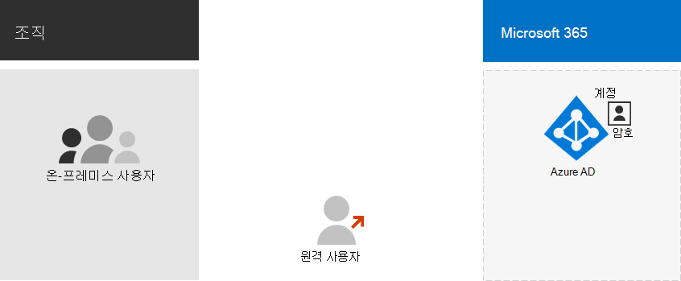

# Microsoft 365 모델 및 Azure Active Directory

*이 문서는 Microsoft 365 Enterprise와 Office 365 Enterprise에 모두 적용됩니다.*

Microsoft 365 구독에 Azure Active Directory 클라우드 기반 사용자 ID 및 인증 서비스인 Azure AD(Microsoft 365)를 사용하여 사용자 ID 및 인증을 Microsoft 365. ID 인프라를 올바르게 구성하는 것은 조직에 대한 사용자 액세스 및 Microsoft 365 관리하는 데 중요합니다.

시작하기 전에 Microsoft 365에 대한 인증과 ID 모델의 개요에 대한 비디오를 시청하십시오.

 

> [!VIDEO https://www.microsoft.com/videoplayer/embed/RE2Pjwu]

첫 번째 계획 선택은 Microsoft 365 모델입니다.

## Microsoft 365 ID 모델

사용자 계정을 계획하려면 먼저 사용자 계정의 두 ID 모델을 이해해야 Microsoft 365. 조직의 ID는 클라우드에서만 유지 관리하거나, 사용자가 클라우드 서비스에 액세스할 때 인증에 사용할 수 있는 AD DS(Active Directory 도메인 서비스) ID를 유지 관리하고 Microsoft 365 있습니다.

다음은 두 가지 유형의 ID와 가장 잘 맞는 이점입니다.

| 특성 | 클라우드 전용 ID | 하이브리드 ID |
|:-------|:-----|:-----|
| **정의** | 사용자 계정은 사용자 구독의 Azure AD 테넌트에만 Microsoft 365 있습니다. | 사용자 계정이 AD DS에 있으며 복사본은 사용자 구독의 Azure AD 테넌트에도 Microsoft 365 있습니다. Azure AD의 사용자 계정에 이미 해시된 AD DS 사용자 계정 암호의 해시된 버전이 포함되어 있을 수도 있습니다. |
| **사용자 Microsoft 365 인증하는 방법** | Microsoft 365 구독의 Azure AD 테넌트는 클라우드 ID 계정으로 인증을 수행 합니다. | Microsoft 365 구독의 Azure AD 테넌트는 인증 프로세스를 처리하거나 사용자를 다른 ID 공급자로 리디렉션합니다. |
| **최적 시나리오** | 사내 AD DS가 필요하지 않은 조직. | AD DS 또는 다른 ID 공급자를 사용하는 조직 |
| **가장 큰 혜택** | 사용하기 간편합니다. 추가 디렉터리 도구 또는 서버는 필요하지 않습니다. | 사용자는 사내 또는 클라우드 기반 리소스에 액세스할 때 동일한 자격 증명을 사용할 수 있습니다. |
||||

## 클라우드 전용 ID

클라우드 전용 ID는 Azure AD에만 있는 사용자 계정을 사용합니다. 클라우드 전용 ID는 일반적으로 사내 서버가 없는 소규모 조직이나 AD DS를 사용하여 로컬 ID를 관리하지 않는 조직에서 사용됩니다.

다음은 클라우드 전용 ID의 기본 구성 요소입니다.

사내 및 원격(온라인) 사용자는 모두 Azure AD 사용자 계정 및 암호를 사용하여 클라우드 Microsoft 365 액세스합니다. Azure AD는 저장된 사용자 계정과 암호를 기준으로 사용자 자격 증명을 인증합니다.

### 관리
사용자 계정은 Azure AD에만 저장되어 있기 때문에 클라우드 ID를 관리하기 위해 Microsoft 365 관리 센터 [Windows PowerShell.](/admin)

## 하이브리드 ID

하이브리드 ID는 사내 AD DS에서 시작된 계정을 사용하며, 이 계정의 Azure AD 테넌트에 Microsoft 365 있습니다. 그러나 대부분의 변경 내용은 한 가지 방법으로만 흐를 수 있습니다. AD DS 사용자 계정의 변경 내용은 Azure AD의 복사본과 동기화됩니다. 그러나 Azure AD의 클라우드 기반 계정(예: 새 사용자 계정)은 AD DS와 동기화되지 않습니다.

Azure AD 커넥트 계정 동기화를 제공합니다. 이 서버는 사내 서버에서 실행되어 AD DS의 변경 내용을 확인한 다음 Azure AD에 전달합니다. Azure AD 커넥트 동기화할 계정과 PHS(암호 해시 동기화)라고 하는 해시된 버전의 사용자 암호를 동기화할지 여부를 필터링하는 기능을 제공합니다.

하이브리드 ID를 구현하는 경우, 온-프레미스 AD DS가 계정 정보에 대한 권한 있는 원본입니다. 즉, 주로 사내에서 관리 작업을 수행한 다음 Azure AD와 동기화됩니다.

다음은 하이브리드 ID의 구성 요소입니다.

Azure AD 테넌트에는 AD DS 계정의 복사본이 있습니다. 이 구성에서는 클라우드 서비스에 액세스하는 Microsoft 365 및 원격 사용자가 모두 Azure AD에 대해 인증합니다.

> [!NOTE]
> 하이브리드 ID에 대한 사용자 계정을 커넥트 Azure AD 계정을 항상 사용해야 합니다. 라이선스 할당 및 그룹 관리를 수행하고, 사용 권한을 구성하고, 사용자 계정을 구성하는 기타 관리 작업을 수행하려면 Azure AD에서 동기화된 사용자 계정이 필요합니다.

### 관리

원본 및 권한이 있는 사용자 계정은 사내 AD DS에 저장되어 있기 때문에 AD DS를 관리하는 도구와 동일한 도구를 사용하여 ID를 관리합니다.

Azure AD에서 동기화된 사용자 Microsoft 365 관리 센터 관리하기 위해 Microsoft 365 PowerShell을 사용하지 않습니다.

## 다음 단계

클라우드 전용 ID 모델이 필요한 경우 클라우드 전용 ID [를 참조합니다.](cloud-only-identities.md)

하이브리드 ID 모델이 필요한 경우 하이브리드 ID [를 참조합니다.](plan-for-directory-synchronization.md)

## 참고 항목

[Microsoft 365 Enterprise 개요](microsoft-365-overview.md)
