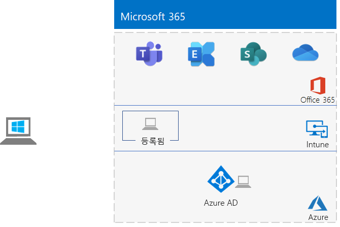

# <a name="identity-and-device-access-prerequisites-for-cloud-only-in-your-microsoft-365-test-environment"></a>Microsoft 365 테스트 환경에서 클라우드 전용 ID 및 장치 액세스 필수 구성 요소

*이 테스트 랩 가이드는 엔터프라이즈 테스트 환경에 Microsoft 365 사용할 수 있습니다.*

[ID 및 장치 액세스](../security/office-365-security/microsoft-365-policies-configurations.md) 구성은 Azure AD(Azure AD)와 통합된 모든 서비스에 대한 액세스를 보호하기 위한 권장 구성 및 조건부 액세스 Azure Active Directory 집합입니다.

이 문서에서는 ID 및 장치 액세스를 위해 [클라우드 전용 필수 구성](../security/office-365-security/identity-access-prerequisites.md#prerequisites)의 요구 사항을 충족하는 Microsoft 365 테스트 환경을 구성하는 방법에 대해 설명합니다.

이 테스트 환경의 8가지 주요 설정 단계는 다음과 같습니다.

1. 간단한 테스트 환경 빌드
2. 명명된 위치 구성
3. 셀프 서비스 암호 재설정 구성
4. Multi-Factor Authentication를 구성합니다.
5. 도메인에 가입된 컴퓨터의 자동 장치 Windows 사용
6. Azure AD 암호 보호 구성 
7. Azure AD Identity Protection 사용
8. Exchange Online 및 비즈니스용 Skype Online에 대한 최신 인증을 실행합니다.

## <a name="phase-1-build-out-your-lightweight-microsoft-365-test-environment"></a>1단계: 간단한 Microsoft 365 테스트 환경 빌드

[간단한 기본 구성](lightweight-base-configuration-microsoft-365-enterprise.md)의 지침을 따릅니다.
구성 결과는 다음과 같습니다.


 
## <a name="phase-2-configure-named-locations"></a>2단계: 명명된 위치 구성

먼저 조직에서 사용하는 공개 IP 주소 또는 주소 범위를 결정합니다.

그 다음 [Azure Active Directory](/azure/active-directory/reports-monitoring/quickstart-configure-named-locations)에서 명명된 위치 구성의 지침에 따라 주소 또는 주소 범위를 명명된 위치로 추가합니다. 

## <a name="phase-3-configure-self-service-password-reset"></a>3단계: 셀프 서비스 암호 재설정 구성

[암호 재설정 테스트 랩 가이드의 3단계](password-reset-m365-ent-test-environment.md#phase-3-configure-and-test-password-reset)에 있는 지침을 따릅니다. 

특정 Azure AD 그룹의 계정에 대한 비밀번호 재설정을 활성화 할 때 다음 계정을 **비밀번호 재설정** 그룹에 추가합니다.

- 사용자 2
- 사용자 3
- 사용자 4
- 사용자 5

사용자 2 계정에 대해서만 암호 재설정을 테스트합니다.

## <a name="phase-4-configure-multi-factor-authentication"></a>4단계: 다단계 인증 구성

다음 사용자 계정에 대해 [다중 요소 인증 테스트 랩 가이드의  2 단계](multi-factor-authentication-microsoft-365-test-environment.md#phase-2-enable-and-test-multi-factor-authentication-for-the-user-2-account) 지침을 따르십시오.

- 사용자 2
- 사용자 3
- 사용자 4
- 사용자 5

사용자 2 계정에 대해서만 다단계 인증을 테스트합니다.

## <a name="phase-5-enable-automatic-device-registration-of-domain-joined-windows-computers"></a>5단계: 도메인에 가입된 컴퓨터의 자동 장치 Windows 사용 

다음 [지침에 따라](/azure/active-directory/devices/hybrid-azuread-join-plan) 도메인에 가입된 컴퓨터의 자동 장치 등록을 Windows.

## <a name="phase-6-configure-azure-ad-password-protection"></a>6단계: Azure AD 암호 보호 구성 

다음 [지침에 따라](/azure/active-directory/authentication/concept-password-ban-bad) 알려진 약한 암호 및 해당 변형을 차단합니다.

## <a name="phase-7-enable-azure-ad-identity-protection"></a>7단계: Azure Active Directory Identity Protection 사용

[Azure AD ID 보호 테스트 랩 가이드의 2 단계](azure-ad-identity-protection-microsoft-365-test-environment.md#phase-2-use-azure-ad-identity-protection) 지침을 따릅니다. 

## <a name="phase-8-enable-modern-authentication-for-exchange-online-and-skype-for-business-online"></a>8단계: Exchange Online 및 Skype for Business Online에 대한 최신 인증을 실행합니다.

Exchange Online의 경우에는 [이 지침](/Exchange/clients-and-mobile-in-exchange-online/enable-or-disable-modern-authentication-in-exchange-online#enable-or-disable-modern-authentication-in-exchange-online-for-client-connections-in-outlook-2013-or-later)을 따릅니다. 

Online 비즈니스용 Skype의 경우:

1. [온라인 비즈니스를 위한 Skype에 연결](/SkypeForBusiness/set-up-your-computer-for-windows-powershell/set-up-your-computer-for-windows-powershell).

2. 이 명령을 실행합니다.

  ```powershell
  Set-CsOAuthConfiguration -ClientAdalAuthOverride Allowed
  ```

3. 이 명령을 사용하여 변경되었는지 확인합니다.

  ```powershell
  Get-CsOAuthConfiguration
  ```

그 결과 ID 및 장치 액세스에 [](../security/office-365-security/identity-access-prerequisites.md#prerequisites) 대한 클라우드 전용 선행 조건 구성의 요구 사항을 충족하는 테스트 환경이 됩니다. 

## <a name="next-step"></a>다음 단계

[일반 ID 및 장치 액세스 정책](../security/office-365-security/identity-access-policies.md)을 사용하여 필수 구성 요소를 기반으로 구축되고 ID 및 장치를 보호하는 정책을 구성합니다.

## <a name="see-also"></a>참고 항목

[추가 ID 테스트 랩 가이드](m365-enterprise-test-lab-guides.md#identity)

[ID 로드맵](identity-roadmap-microsoft-365.md)

[엔터프라이증용 Microsoft 365 테스트 랩 가이드](m365-enterprise-test-lab-guides.md)

[엔터프라이즈용 Microsoft 365 개요](microsoft-365-overview.md)

[기업용 Microsoft 365 설명서](/microsoft-365-enterprise/)
