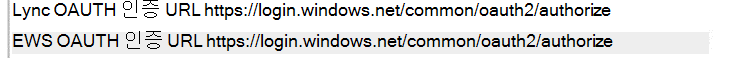

# <a name="how-to-configure-skype-for-business-on-premises-to-use-hybrid-modern-authentication"></a>하이브리드 최신 인증을 사용하도록 비즈니스용 Skype 온-프레미스를 구성하는 방법

*이 문서는 Microsoft 365 Enterprise와 Office 365 Enterprise에 모두 적용됩니다.*

최신 인증은 보다 안전한 사용자 인증 및 권한 부여를 제공하는 ID 관리 방법으로, 비즈니스용 Skype 서버의 Exchange 서버와 도메인 분할 하이브리드에 사용할 비즈니스용 Skype 있습니다.

 **중요** MA(최신 인증)와 회사 또는 조직에서 이 인증을 사용하는 것을 선호하는 이유에 대해 알아 두시겠습니까? 이 [문서에서](hybrid-modern-auth-overview.md) 개요를 확인할 수 있습니다. MA에서 지원되는 비즈니스용 Skype 토폴로지가 필요한 경우 여기에 설명되어 있습니다.

 **시작하기 전에** 다음 용어를 사용 합니다.

- MA(최신 인증)

- 하이브리드 최신 인증(HMA)

- Exchange(EXCH)

- Exchange Online(EXO)

- 비즈니스용 Skype(SFB)

- 비즈니스용 Skype 온라인(SFBO)

또한 이 문서의 그래픽에 회색으로 표시되거나 희미해진 개체가 있는 경우  이는 회색으로 표시된 요소가 MA 관련 구성에 포함되지 않음을 나타냅니다.

## <a name="read-the-summary"></a>요약 읽기

이 요약은 프로세스를 실행 중에 손실될 수 있는 단계로 세분화하고 전체 검사 목록에서 프로세스의 위치를 추적하는 데 좋습니다.

1. 먼저 모든 선행 요구 사항을 충족해야 합니다.

1. 많은 **사전** 요구 사항들이 비즈니스용 Skype 및 Exchange 일반적이기 때문에 사전 요구 사항 검사 목록의 개요 문서를 [참조하세요.](hybrid-modern-auth-overview.md) 이  *문서의*  단계를 시작하기 전에 이 작업을 수행합니다.

1. 파일 또는 파일에서 필요한 HMA 관련 정보를 OneNote.

1. EXO에 대한 최신 인증을 켜기(아직 켜져 있지 않은 경우).

1. SFBO에 대한 최신 인증을 켜기(아직 켜져 있지 않은 경우).

1. 하이브리드 최신 인증을 설정하여 Exchange.

1. 하이브리드 최신 인증을 설정하여 비즈니스용 Skype.

이러한 단계에서는 SFB, SFBO, EXCH 및 EXO에 대해 MA를 켜야 합니다. 즉, SFB 및 SFBO의 HMA 구성에 참여할 수 있는 모든 제품(EXCH/EXO에 대한 종속성 포함) 즉, 사용자가 하이브리드의 일부(EXO + SFBO, EXO + SFB, EXCH + SFBO 또는 EXCH + SFB)에 사서함을 만들거나 있는 경우 완성된 제품은 다음과 같이 표시됩니다.


MA를 켜는 네 개의 다른 위치가 있습니다! 최상의 사용자 환경을 위해 이러한 네 위치에서 모두 MA를 켜는 것이 좋습니다. 이러한 모든 위치에서 MA를 끄지 못하면 환경에 필요한 위치에서만 MA를 켜게 단계를 조정합니다.

지원되는 [토폴로지의](/skypeforbusiness/plan-your-deployment/modern-authentication/topologies-supported) 경우 MA를 비즈니스용 Skype 지원 가능성 항목을 참조하세요.

 **중요** 시작하기 전에 모든 선행 조문을 충족하는지 다시 한 번 확인 합니다. 이 정보는 하이브리드 최신 인증 개요 및 선행 준비 사항 [에서 찾을 수 있습니다.](hybrid-modern-auth-overview.md)

## <a name="collect-all-hma-specific-info-youll-need"></a>필요한 모든 HMA 관련 정보 수집

최신 인증을 사용하기 위한 선행 [](hybrid-modern-auth-overview.md) 요구 사항을 충족하는지 다시 확인한 후(위의 참고 참조) 앞서 설명된 단계에서 HMA를 구성하는 데 필요한 정보를 저장하는 파일을 만들어야 합니다. 이 문서에 사용된 예제:

- **SIP/SMTP 도메인**

  - 예: contoso.com(Office 365)

- **테넌트 ID**

  - 사용자 테넌트(Office 365 로그인 시)를 나타내는 GUID contoso.onmicrosoft.com.

- **SFB 2015 CU5 웹 서비스 URL**

배포된 모든 SfB 2015 풀에 대해 내부 및 외부 웹 서비스 URL이 필요합니다. 이러한 정보를 얻었다면 관리 셸에서 비즈니스용 Skype 실행합니다.

```powershell
Get-CsService -WebServer | Select-Object PoolFqdn, InternalFqdn, ExternalFqdn | FL
```

- 예: 내부: https://lyncwebint01.contoso.com

- 예: 외부: https://lyncwebext01.contoso.com

Standard Edition 서버를 사용하는 경우 내부 URL은 비어 있습니다. 이 경우 내부 URL에 풀 fqdn을 사용합니다.

## <a name="turn-on-modern-authentication-for-exo"></a>EXO에 대한 최신 인증 켜기

지침에 따라 다음을 Exchange Online: 최신 인증을 위해 [테넌트가 사용하도록 설정하는 방법.](https://social.technet.microsoft.com/wiki/contents/articles/32711.exchange-online-how-to-enable-your-tenant-for-modern-authentication.aspx)

## <a name="turn-on-modern-authentication-for-sfbo"></a>SFBO에 대한 최신 인증 켜기

온라인 비즈니스용 Skype 지침에 따라 최신 인증을 위해 [테넌트 사용](https://social.technet.microsoft.com/wiki/contents/articles/34339.skype-for-business-online-enable-your-tenant-for-modern-authentication.aspx).

## <a name="turn-on-hybrid-modern-authentication-for-exchange-on-premises"></a>하이브리드 최신 인증을 설정하여 Exchange 설정

하이브리드 최신 인증을 사용하도록 Exchange Server 구성하는 방법의 [지침을 따릅니다.](configure-exchange-server-for-hybrid-modern-authentication.md)

## <a name="turn-on-hybrid-modern-authentication-for-skype-for-business-on-premises"></a>하이브리드 최신 인증을 설정하여 비즈니스용 Skype 설정

### <a name="add-on-premises-web-service-urls-as-spns-in-azure-active-directory"></a>프레미스 웹 서비스 URL을 2016년 12월에 SPNS로 Azure Active Directory

이제 명령을 실행하여 SFBO에서 URL(이전 수집)을 서비스 사용자로 추가해야 합니다.

 **참고** SPNS(서비스 사용자 이름)는 웹 서비스를 식별하고 보안 주체(예: 계정 이름 또는 그룹)와 연결하여 서비스가 인증된 사용자를 대신하여 작업할 수 있도록 합니다. 서버에 인증하는 클라이언트는 SPNS에 포함된 정보를 활용합니다.

1. 먼저 다음 Azure Active Directory (Azure AD)에 [연결합니다.](/powershell/azure/active-directory/overview)

2. SFB 웹 서비스 URL 목록을 얻습니다.

   AppPrincipalId는 로 `00000004` 시작됩니다. 이 특성은 비즈니스용 Skype 온라인에 해당합니다.

   이 명령의 출력(및 나중에 비교를 위해 스크린샷)을 확인합니다. 이 명령의 출력에는 SE 및 WS URL이 포함되지만 대부분 으로 시작하는 SPNS로 `00000004-0000-0ff1-ce00-000000000000/` 구성됩니다.

```powershell
Get-MsolServicePrincipal -AppPrincipalId 00000004-0000-0ff1-ce00-000000000000 | Select -ExpandProperty ServicePrincipalNames
```

3. 예를 **들어,** 내부 또는 외부 SFB URL이 없는 경우(예: 이 목록에 해당 특정 레코드를 https://lyncwebint01.contoso.com https://lyncwebext01.contoso.com) 추가해야 합니다.

    아래의 예제  *URL을* 추가 명령에서 실제 URL로 바꾸세요!

```powershell
$x= Get-MsolServicePrincipal -AppPrincipalId 00000004-0000-0ff1-ce00-000000000000
$x.ServicePrincipalnames.Add("https://lyncwebint01.contoso.com/")
$x.ServicePrincipalnames.Add("https://lyncwebext01.contoso.com/")
Set-MSOLServicePrincipal -AppPrincipalId 00000004-0000-0ff1-ce00-000000000000 -ServicePrincipalNames $x.ServicePrincipalNames
```

4. 2단계에서 **Get-MsolServicePrincipal** 명령을 다시 실행하고 출력을 확인하여 새 레코드가 추가된지 확인 이전의 목록 또는 스크린샷을 새 SPNS 목록과 비교합니다. 레코드의 새 목록을 스크린샷할 수도 있습니다. 성공하면 목록에 두 개의 새 URL이 표시됩니다. 이 예제에서는 이제 SPNS 목록에 특정 URL 및 을 https://lyncwebint01.contoso.com https://lyncwebext01.contoso.com/ 포함합니다.

### <a name="create-the-evosts-auth-server-object"></a>EvoSTS Auth 서버 개체 만들기

관리 셸에서 다음 비즈니스용 Skype 실행합니다.

```powershell
New-CsOAuthServer -Identity evoSTS -MetadataURL https://login.windows.net/common/FederationMetadata/2007-06/FederationMetadata.xml -AcceptSecurityIdentifierInformation $true -Type AzureAD
```

### <a name="enable-hybrid-modern-authentication"></a>하이브리드 최신 인증 사용

이는 실제로 MA를 켜는 단계입니다. 클라이언트 인증 흐름을 변경하지 않고도 이전의 모든 단계를 미리 실행할 수 있습니다. 인증 흐름을 변경할 준비가 되면 관리 셸의 비즈니스용 Skype 실행합니다.

```powershell
Set-CsOAuthConfiguration -ClientAuthorizationOAuthServerIdentity evoSTS
```

## <a name="verify"></a>확인

HMA를 사용하도록 설정하면 클라이언트의 다음 로그인에서 새 인증 흐름을 사용하게 됩니다. HMA를 켜면 클라이언트에 대한 재인식이 트리거되지 않습니다. 클라이언트는 인증 토큰 및/또는 보유한 인증의 수명을 기반으로 다시 인증합니다.

HMA가 사용하도록 설정한 후 작동하고 있는지 테스트하려면 테스트 SFB 클라이언트에서 로그아웃하고 Windows '내 자격 증명 삭제'를 클릭해야 합니다. 다시 로그인합니다. 이제 클라이언트는 최신 인증 흐름을 사용하게 되기  때문에 이제 로그인에 클라이언트가 서버에 연결하고 로그인하기 Office 365 바로 전에 '직장 또는 학교' 계정에 대한 Office 365 프롬프트가 포함됩니다.

또한 클라이언트에서 'OAuth 비즈니스용 Skype'에 대한 '구성 정보'를 확인해야 합니다. 클라이언트 컴퓨터에서 이 작업을 실행하려면 Ctrl 키를 눌러서 알림 비즈니스용 Skype 아이콘을 마우스 오른쪽 단추로 Windows 클릭합니다. 나타나는 **메뉴에서** 구성 정보를 클릭합니다. 바탕 화면에 비즈니스용 Skype '구성 정보 확인' 창에서 다음을 찾아 봐야 합니다.



또한 Outlook 클라이언트(Windows 알림 트레이에서도)의 아이콘을 마우스 오른쪽 단추로 클릭하고 '연결 상태'를 클릭하는 동시에 Ctrl 키를 눌러야 합니다. OAuth에 사용되는 bearer 토큰을 나타내는 'Bearer'의 AuthN 유형에 대해 클라이언트의 SMTP 주소를 \* 찾아야 합니다.

## <a name="related-articles"></a>관련 문서

[최신 인증 개요로 다시 연결합니다.](hybrid-modern-auth-overview.md)

클라이언트에 대해 ADAL(최신 인증)을 사용하는 방법을 알아야 비즈니스용 Skype 있나요? 여기에 단계가 [있습니다.](./hybrid-modern-auth-overview.md)