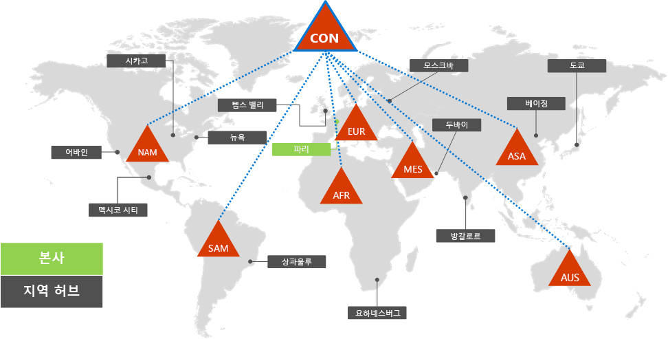
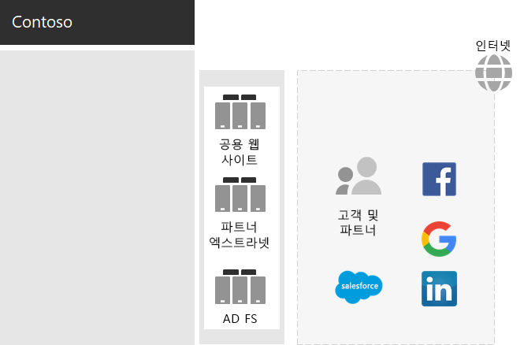
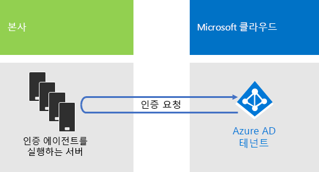
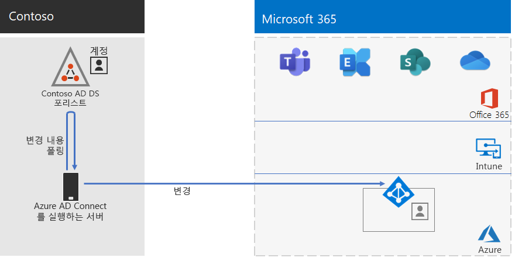
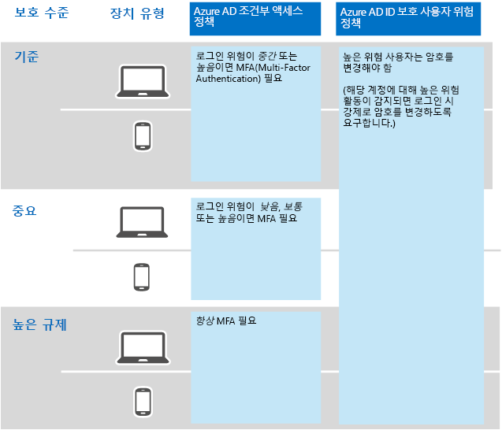

# Contoso Corporation의 ID

**요약:** Contoso가 IDaaS(Identity as a Service)를 활용하고 직원을 위해 클라우드 기반 인증을 제공하고, 파트너 및 고객을 위해 페더레이션 인증을 제공하는 방법을 알아봅니다.

Microsoft는 Azure AD(Active Directory)와 함께 해당 클라우드 제품에서 IDaaS(ID as a Service)를 제공합니다. Microsoft 365 Enterprise를 도입하기 위해 Contoso의 IDaaS 솔루션은 해당 온-프레미스 ID 공급자를 활용하고, 기존의 신뢰할 수 있는 타사 ID 공급자와 함께 페더레이션 인증을 포함해야 했습니다.

## Contoso의 Windows Server AD 포리스트

Contoso는 하위 도메인 7개가 포함된 contoso.com용으로 단일 Windows Server AD(Active Directory) 포리스트를 사용합니다. 각 도메인은 전 세계의 각 지역에 사용됩니다. 본사, 지역 허브 사무소 및 위성 사무소에는 로컬 인증 및 권한 부여용 도메인 컨트롤러가 있습니다.

그림 1에서는 지역 허브를 포함하는 전 세계 여러 지역에 대한 지역별 도메인을 포함하는 Contoso 포리스트를 보여 줍니다.

 
**그림 1: Contoso의 전 세계 포리스트 및 도메인**

Contoso는 클라우드 기반 앱과 작업의 인증 및 권한 부여를 위해 contoso.com 포리스트의 계정과 그룹을 사용하고자 합니다.

## Contoso의 페더레이션 인증 인프라

Contoso는 다음을 허용합니다.

- 고객이 Microsoft, Facebook 또는 Google Mail 계정을 사용하여 공용 웹 사이트에 로그인할 수 있습니다.
- 공급업체 및 파트너가 LinkedIn, Salesforce 또는 Google Mail 계정을 사용하여 파트너 엑스트라넷에 로그인할 수 있습니다.

그림 2에서는 공개 웹 사이트, 파트너 엑스트라넷 및 AD FS(Active Directory Federation Services) 서버 집합을 포함하는 Contoso DMZ를 보여 줍니다. 이 DMZ는 고객, 파트너 및 인터넷 서비스를 포함하는 인터넷에 연결되어 있습니다.

**그림 2: Contoso의 고객 및 파트너에 대한 페더레이션 인증 지원**
 
DMZ의 AD FS 서버는 공용 웹 사이트 액세스용 고객 자격 증명과 파트너 엑스트라넷 액세스용 파트너 자격 증명을 인증합니다.

Contoso는 이 인프라를 유지하고 고객 및 파트너 인증에만 사용하기로 결정했습니다. Contoso ID 엔지니어는 이러한 인프라를 Azure AD [B2B](https://docs.microsoft.com/azure/active-directory/b2b/hybrid-organizations) 및 [B2C](https://docs.microsoft.com/azure/active-directory-b2c/solution-articles) 솔루션으로 전환하는 작업을 조사하고 있습니다.

## 클라우드 기반 인증을 위해 통과 인증을 사용하는 하이브리드 ID

Contoso는 Microsoft 365 클라우드 리소스에서 인증을 받기 위해 해당 온-프레미스 Windows Server AD 포리스트를 활용하려고 했습니다. 따라서 PHS(암호 해시 동기화)를 사용한 PTA(통과 인증)을 채택하기로 결정했습니다.

### PTA 인증

사용자 자격 증명의 인증을 위해 Contoso는 PTA를 사용하고 있습니다. Contoso 사용자가 클라우드 기반 리소스에 액세스할 때 전송하는 자격 증명은 Azure AD를 통해 Contoso 본사 데이터 센터에서 인증 에이전트를 실행하는 서버로 전달됩니다. 이러한 인증 에이전트 서버 중 하나가 Azure AD를 대신해서 사용자 자격 증명이 유효한지 검사합니다.

그림 3에서는 인증 에이전트를 실행하는 Contoso 본사의 서버 집합을 보여 줍니다. 이러한 서버는 Azure AD에서 전달받은 인증 요청을 처리합니다. 

 
**그림 3: Contoso의 통과 인증 인프라**

Contoso는 모든 인증 시도에 대해 사용자 계정 상태, 암호 정책의 즉각적인 변경 및 온-프레미스 Windows Server AD 포리스트에 대한 로그인 시간 변경을 발생하는지 평가되도록 하는 보안 요구를 이행하기 위해 PTA를 선택했습니다.

### PHS

PHS는 온-프레미스 Windows Server AD 포리스트를 해당 Microsoft 365 Enterprise 구독의 Azure AD 테넌트와 동기화하고 사용자 및 그룹 계정과 해시된 버전의 사용자 계정 암호를 복사합니다. Contoso는 PTA를 사용할 수 없는 경우에 Azure AD 테넌트에서 직접 인증할 수 있는 대체 방법을 제공하기 위해 PHS를 사용하기로 결정했습니다.

지속적인 디렉터리 동기화를 수행하기 위해 Contoso는 파리 데이터 센터의 서버에 Azure AD Connect 도구를 배포했습니다. 그림 4는 Azure AD Connect에서 실행되는 서버가 Contoso Windows Server AD 포리스트에서 변경 내용을 폴링하고 해당 변경 내용을 Azure AD 테넌트와 동기화하는 모습을 보여 줍니다.

 
**그림 4: Contoso의 PHS 디렉터리 동기화 인프라**

## ID에 대한 조건부 액세스 정책

Contoso는 Azure AD가 인증 요청에 대한 로그인 위험이 있다고 판단할 경우 다단계 인증 및 암호 변경을 적용하도록 하기 위해 Azure AD [조건부 액세스 정책](identity-access-policies.md) 집합을 만들었습니다.

그림 5에서는 ID에 대한 조건부 액세스 정책의 결과 집합을 보여 줍니다.

 
**그림 5: Contoso의 ID 기반 조건부 액세스 정책**

## 다음 단계

Contoso가 해당 System Center Configuration Manager 인프라를 활용하여 조직 내에서 최신 Windows 10 Enterprise를 배포하고 유지하는 방법을 [알아봅니다](contoso-win10.md).

## 참고 항목

[Microsoft 365 Enterprise의 ID](identity-infrastructure.md)

[배포 가이드](deploy-microsoft-365-enterprise.md)

[테스트 랩 가이드](m365-enterprise-test-lab-guides.md)
