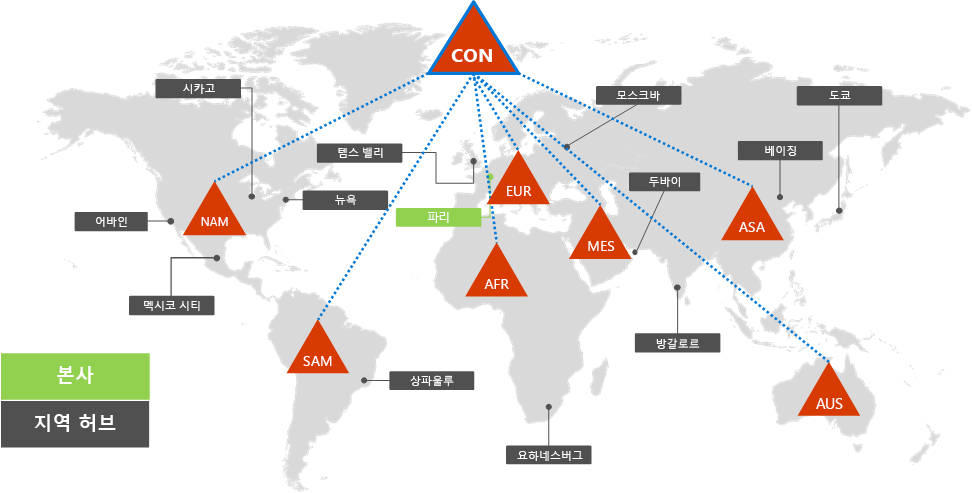
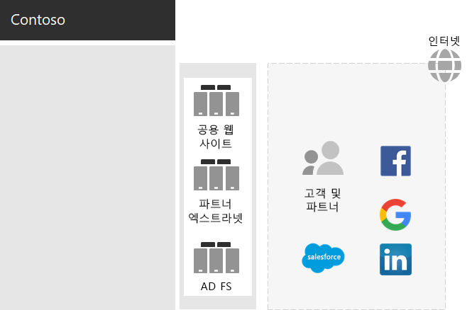
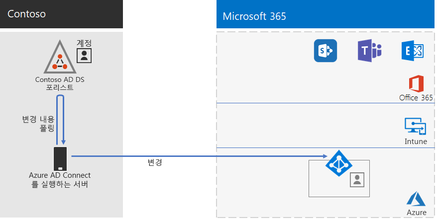
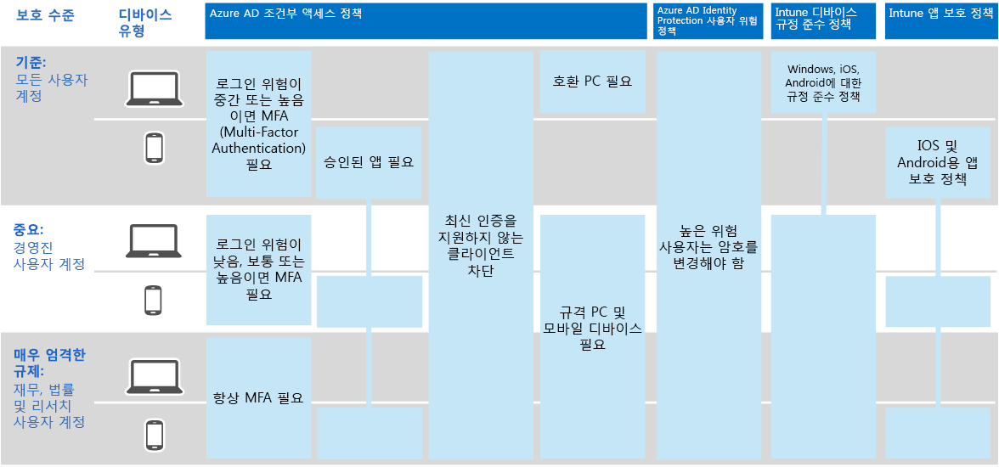

# Contoso Corporation의 ID

Microsoft는 Azure AD(Azure AD)를 통해 클라우드 서비스 전반에 걸쳐 IDaaS(identity as a service)를 Azure Active Directory 제공합니다. 엔터프라이즈용 Microsoft 365 채택하기 위해 Contoso IDaaS 솔루션은 해당 사내 ID 공급자를 사용하며 기존의 신뢰할 수 있는 타사 ID 공급자와의 페더임 인증을 포함해야 합니다.

## Contoso Active Directory 도메인 서비스 포리스트

Contoso는 7개의 하위 도메인이 있는 contoso com에 대해 단일 AD DS(Active Directory 도메인 서비스) \. 포리스트를 사용하게 됩니다. 본사, 지역 허브 사무실 및 위성 사무실에는 로컬 인증 및 권한 부여를 위한 도메인 컨트롤러가 있습니다.

다음은 지역 허브를 포함하는 전 세계 여러 지역을 위한 지역 도메인이 있는 Contoso 포리스트입니다.

 
Contoso는 contoso com 포리스트의 계정 및 그룹을 사용하여 해당 워크로드 및 서비스에 대한 인증 \. 및 Microsoft 365 사용하기로 결정했습니다.

## Contoso 페더전 인증 인프라

Contoso는 다음을 허용합니다.

- 고객은 Microsoft, Facebook 또는 Google Mail 계정을 사용하여 회사의 공용 웹 사이트에 로그인합니다.
- 공급업체 및 파트너는 LinkedIn, Salesforce 또는 Google Mail 계정을 사용하여 회사의 파트너 엑스트라넷에 로그인합니다.

다음은 공용 웹 사이트, 파트너 엑스트라넷 및 AD FS(Active Directory Federation Services) 서버 집합을 포함하는 Contoso DMZ입니다. DMZ는 고객, 파트너 및 인터넷 서비스가 포함된 인터넷에 연결됩니다.

 
DMZ의 AD FS 서버는 공용 웹 사이트에 액세스하기 위해 ID 공급자가 고객 자격 증명을 인증하고 파트너 엑스트라넷에 액세스하기 위한 파트너 자격 증명을 쉽게 인증할 수 있도록 합니다.

Contoso는 이 인프라를 보관하고 고객 및 파트너 인증에 전담하기로 결정했습니다. Contoso ID 설계자는 이 인프라를 Azure AD [B2B](/azure/active-directory/b2b/hybrid-organizations) 및 [B2C](/azure/active-directory-b2c/solution-articles) 솔루션으로 변환하는 방법을 조사하고 있습니다.

## 클라우드 기반 인증을 위해 암호 해시 동기화를 사용하는 하이브리드 ID

Contoso는 클라우드 리소스에 대한 인증을 위해 해당 Microsoft 365 원했습니다. PHS(암호 해시 동기화)를 사용하기로 결정했습니다.

PHS는 사용자 및 그룹 계정과 해시된 버전의 사용자 계정 암호를 복사하여 Microsoft 365 엔터프라이즈 구독의 Azure AD 테넌트와 동기화합니다.

디렉터리 동기화를 위해 Contoso는 파리 데이터 센터의 서버에 Azure AD 커넥트 도구를 배포했습니다.

다음은 Azure AD 2013을 실행하는 커넥트 Contoso AD DS 포리스트에서 변경 내용을 폴링한 다음 Azure AD 테넌트와 동기화하는 것입니다.

 
## ID 및 디바이스 액세스에 대한 조건부 액세스 정책

Contoso는 다음 세 가지 보호 수준에서 Azure AD 및 Intune [조건부 액세스 정책](../security/office-365-security/identity-access-policies.md) 세트를 만들었습니다.

- *기준 보호는* 모든 사용자 계정에 적용됩니다.
- *중요한* 보호는 고위 경영진 및 임원진에게 적용됩니다.
- *높은 규제 대상* 보호는 높은 규제 대상 데이터에 액세스할 수 있는 재무, 법률 및 연구 부서의 특정 사용자에게 적용됩니다.

Contoso ID 및 장치 조건부 액세스 정책의 결과 집합은 다음과 있습니다.

 
## 다음 단계

Contoso가 해당 Microsoft Endpoint Configuration Manager 인프라를 사용하여 조직 전체에서 최신 Windows 10 Enterprise [방법을](contoso-win10.md) 알아보습니다.

## 참고 항목

[Microsoft 365의 ID 로드맵](identity-roadmap-microsoft-365.md)

[엔터프라이즈용 Microsoft 365 개요](microsoft-365-overview.md)

[테스트 랩 가이드](m365-enterprise-test-lab-guides.md)