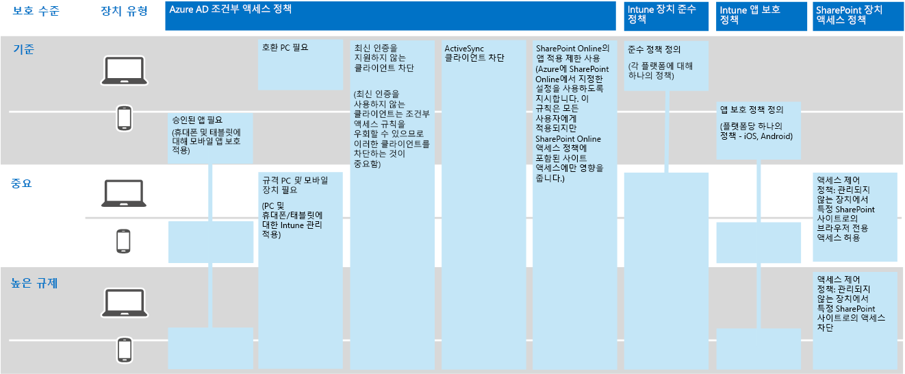

# Contoso Corporation의 정보 보호

**요약:** Contoso에서 Microsoft 365 Enterprise의 정보 보호 기능을 사용하여 클라우드에서 디지털 자산을 보호하는 방법을 이해합니다.

Contoso는 정보 보안 및 보호 문제를 중요하게 생각합니다. 예를 들어, 제품 디자인 및 독점적인 제조 기법을 설명하는 지적 재산권이 누출되거나 손상되면 경쟁력이 떨어질 수 있습니다.

따라서 중요하고 가장 가치 있는 디지털 자산을 클라우드로 이동하기 전에, Microsoft 365 Enterprise의 클라우드 기반 서비스에서 온-프레미스 정보 분류 및 보호 요구 사항이 지원되고 구현되는지 확인했습니다.

## Contoso의 데이터 보안 분류

Contoso는 데이터를 분석하고 다음과 같은 수준을 결정했습니다.

||||
|:-------|:-----|:-----|
| **수준 1: 기본 데이터** | **수준 2: 중요 데이터** | **수준 3: 높은 규제 대상 데이터** |
| 데이터가 암호화되며 인증된 사용자에게만 제공됨     온-프레미스 및 클라우드 기반 저장소와 작업(예: Office 365)에 저장된 모든 데이터에 대해 제공됩니다. 데이터는 서비스에 상주하는 동안, 그리고 서비스 및 클라이언트 장치 간에 전송될 때 암호화됩니다.    수준 1 데이터의 예로는 관리/영업/지원 담당자의 파일 및 일반적인 업무 관련 통신 내용(전자 메일)이 있습니다. | 수준 1의 기능과 함께 높은 수준의 인증 및 데이터 손실 방지 기능 제공     높은 수준의 인증에는 SMS 유효성 검사를 통한 다단계 인증이 포함됩니다. 데이터 손실 방지 기능을 사용하면 민감하거나 중요한 정보가 온-프레미스 네트워크 외부로 전송되지 않습니다.    수준 2 데이터의 예로는 신제품 연구 개발 데이터 및 재무/법률 정보가 있습니다. | 수준 2의 기능과 함께 최고 수준의 암호화, 인증 및 감사 기능 제공      미사용 데이터 및 클라우드의 데이터에 대해 지역별 규정을 준수하는 최고 수준의 암호화 기능이 제공되며, 스마트 카드를 사용하는 다단계 인증과 세분화된 감사/경고 기능도 함께 제공됩니다.     수준 3 데이터의 예로는 고객/파트너의 개인 식별이 가능한 정보와 제품 엔지니어링 사양 및 재산적 가치를 가지는 제조 기술 등이 있습니다.  |
||||

## Contoso의 정보 정책
다음 표에는 Contoso의 정보 정책이 나와 있습니다.

|||||
|:-------|:-----|:-----|:-----|
|  | **액세스** | **데이터 보존** | **정보 보호** |
| 수준 1: 비즈니스 가치가 낮은 데이터(기본 데이터) | 모든 사용자에 대해 액세스 허용  | 6개월 | 암호화 사용 |
| 수준 2: 비즈니스 가치가 중간 정도인 데이터(중요 데이터) | Contoso 직원, 하도급업자 및 파트너에 대해 액세스 허용     MFA(Multi-Factor Authentication), TLS(전송 계층 보안) 및 MAM(모바일 응용 프로그램 관리) 사용 | 2년  | 데이터 무결성을 위해 해시 값 사용  |
| 수준 3: 비즈니스 가치가 높은 데이터(높은 규제 대상 데이터) | 엔지니어링/제조 부문 임원과 책임자에 대해 액세스 허용     관리되는 네트워크 장치만 있는 RMS(권한 관리 시스템)  | 7년  | 거부 없음이 설정된 디지털 서명 사용  |
|||||

## Microsoft 365 Enterprise를 사용한 Contoso의 정보 보호 경로

Contoso는 다음 단계를 사용하여 정보 보호 요구에 맞게 Microsoft 365 Enterprise를 준비했습니다.

1. 보호할 정보 식별

   Contoso는 온-프레미스 SharePoint 사이트 및 파일 공유에 있는 기존의 디지털 자산을 광범위하게 검토하고 각 자산을 분류했습니다.

2. 데이터 수준에 대한 액세스, 보존 및 정보 보호 정책 결정

   Contoso는 데이터 수준에 따라, 자세한 정책 요구 사항을 결정했습니다. 이러한 요구 사항은 기존 디지털 자산이 클라우드로 전환될 때 보호하는 데 사용되었습니다.

3. 다양한 정보 수준에 대해 Azure Information Protection 레이블 및 설정 생성

   Contoso는 해당 데이터 수준과 일치하는 제목으로 기본 Azure Information Protection 레이블을 수정하고, 중요한 데이터 및 높은 규제 대상 데이터 레이블을 Azure 클라우드 키로 암호화되도록 구성했습니다. 또한 특정 유형의 영업 비밀 데이터에 대해 높은 규제 대상 데이터 레이블의 하위 레이블을 만들고 해당 액세스를 특정 연구 및 개발 그룹으로 제한했습니다. 그뿐 아니라 모든 Windows PC 및 장치에 Azure Information Protection 클라이언트를 배포했습니다.

4. 액세스를 잠그는 권한을 사용하여 중요한 데이터 및 높은 규제 대상 데이터에 대해 보호된 SharePoint Online 사이트 생성

   중요 및 높은 규제 대상 사이트 모두 [격리된 사이트](https://docs.microsoft.com/office365/enterprise/isolated-sharepoint-online-team-sites)로 구성되었습니다. 이러한 사이트에서는 기본 SharePoint Online 팀 사이트 권한이 Azure AD 그룹으로 사용자 지정되었습니다. 또한 중요 및 높은 규제 대상 SharePoint Online 사이트도 기본 Office 365 레이블로 구성했습니다. 높은 규제 대상 SharePoint Online 사이트에 저장된 파일은 범위가 지정된 정책의 AIP(Azure Information Protection) 하위 레이블로 보호됩니다. 자세한 내용은 [높은 규제 대상 데이터에 대한 Microsoft Teams 및 SharePoint Online 사이트](teams-sharepoint-online-sites-highly-regulated-data.md) 시나리오를 참조하세요.

5.  온-프레미스 SharePoint 사이트 및 파일 공유의 데이터를 새 SharePoint Online 사이트로 이동

    새 SharePoint Online 사이트로 마이그레이션된 파일에는 해당 사이트에 할당된 기본 Office 365 레이블이 상속되었습니다.

6.  직원에게 새 문서에 대해 Azure Information Protection 레이블을 사용하는 방법, 새 SharePoint Online 사이트를 만들 때 Contoso IT와 상호 작용하는 방법을 학습시키고 항상 SharePoint Online 사이트에 디지털 자산을 저장하도록 교육

    클라우드에 대한 정보 보호 전환에서 가장 어려운 부분을 고려하면서 Contoso IT 및 관리 부서는 조직의 직원들이 나타내는 나쁜 정보 저장 습관을 변경하여 항상 디지털 자산에 레이블을 지정하도록 하고 온-프레미스 파일 공유를 절대 사용하지 않도록 변경해야 했습니다.

## 정보 보호에 대한 조건부 액세스 정책

해당 ID 및 모바일 장치 관리 인프라에 따라, Exchange Online 및 SharePoint Online에 대한 롤아웃의 일환으로, Contoso는 다음과 같은 조건부 액세스 정책 집합을 구성하고 해당 Azure AD 그룹에 적용했습니다.

- [장치 정책에 대한 관리 및 비관리 응용 프로그램 액세스](identity-access-policies.md)
- [Exchange Online 액세스 정책](secure-email-recommended-policies.md)
- [SharePoint Online 액세스 정책](sharepoint-file-access-policies.md)

그림 1에서는 Contoso의 정보 보호를 위한 정책 결과 집합을 보여 줍니다.

**그림 1: 장치, Exchange Online 및 SharePoint Online 조건부 액세스 정책**
 
>[!Note]
>또한 Contoso는 ID 및 로그인에 대한 조건부 액세스 정책을 추가로 구성했습니다. [Contoso Corporation ID](contoso-identity.md)를 참조하세요.
>

이러한 정책은 다음을 보장합니다.

- 앱 보호 정책은 허용되는 앱과 조직 데이터로 수행할 수 있는 작업을 정의합니다.
- PC 및 모바일 장치는 규격이어야 합니다.
- Exchange Online은 Exchange Online에 대해 Office 365 메시지 암호화를 사용합니다.
- SharePoint Online은 앱 적용 제한을 사용합니다.
- SharePoint Online은 브라우저 전용 액세스에 대해 액세스 제어 정책을 사용하고 관리되지 않는 장치에 대한 액세스를 차단합니다.

## Microsoft 365 Enterprise 기능을 Contoso의 데이터 수준에 매핑

다음 표에서는 Contoso의 데이터 수준이 Microsoft 365 Enterprise의 정보 보호 기능에 어떻게 매핑되는지를 보여 줍니다.

|||||
|:-------|:-----|:-----|:-----|
| | **Office 365** | **Windows 10 및 Office 365 ProPlus** | **EMS** |
| 수준 1: 기본 데이터  | SharePoint Online 및 Exchange Online 조건부 액세스 정책   SharePoint Online 사이트에 대한 권한 | Azure Information Protection 클라이언트   BitLocker   Windows Information Protection | 장치 조건부 액세스 정책 및 모바일 응용 프로그램 관리 정책 |
| 수준 2: 중요한 데이터 | 수준 1: 기본 데이터 외 다음 추가     Azure Information Protection 레이블   SharePoint Online 사이트에 대한 Office 365 레이블   SharePoint Online 및 Exchange Online에 대한 Office 365 데이터 손실 방지   격리된 SharePoint Online 사이트  | 수준 1: 기본 데이터 외 다음 추가     디지털 자산에 대한 Azure Information Protection 레이블   Office 365 고급 데이터 거버넌스 | 수준 1: 기본 데이터 |
| 수준 3: 높은 규제 대상 데이터 | 수준 2: 중요한 데이터 외 다음 추가    영업 비밀 정보에 대한 BYOK(Bring Your Own Key) 암호화 및 보호   Office 365 서비스와 상호 작용하는 LOB(기간 업무) 응용 프로그램에 대한 Azure Key Vault | 수준 2: 중요한 데이터 | 수준 1: 기본 데이터 |
|||||

## 다음 단계

Contoso에서 어떻게 액세스 관리, 위협 방지, 정보 보호 및 보안 관리를 위해 Microsoft 365 Enterprise의 보안 기능을 사용했는지 [알아봅니다](contoso-security-summary.md).

## 참고 항목

[Microsoft 365 Enterprise의 정보 보호](infoprotect-infrastructure.md)

[배포 가이드](deploy-microsoft-365-enterprise.md)

[테스트 랩 가이드](m365-enterprise-test-lab-guides.md)

