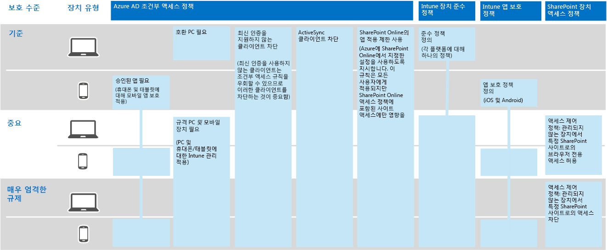
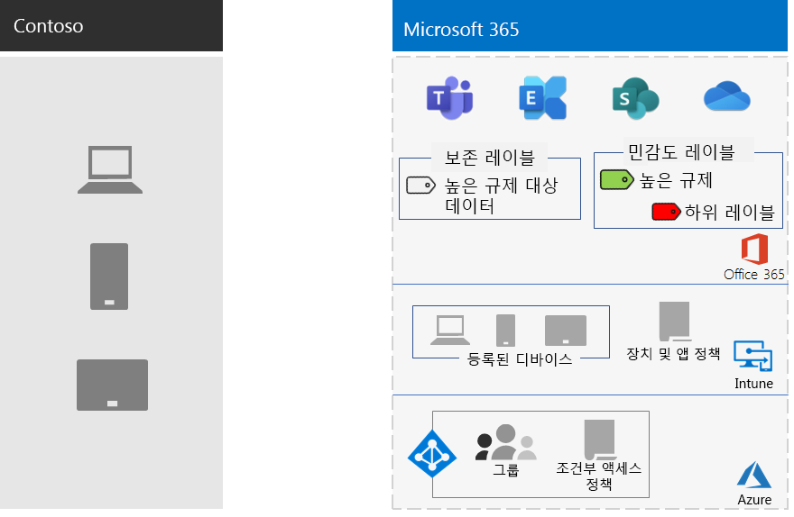

# Contoso Corporation의 정보 보호

Contoso는 정보 보안에 대해 심각하게 생각하고 있습니다. 제품 디자인 및 독점 제조 기술을 설명하는 지적 재산의 유출 또는 폐기는 경쟁적 불리한 단점이 있습니다.

Contoso는 중요한 디지털 자산을 클라우드로 이동하기 전에 엔터프라이즈용 클라우드 기반 서비스의 클라우드 기반 서비스에서 해당 Microsoft 365 정보 분류 및 보호 요구 사항을 지원할 수 있는지 확인했습니다.

## Contoso 데이터 보안 분류

Contoso는 데이터를 분석하고 다음 분류 수준을 결정했습니다.

| 수준 1: 기본 데이터 | 수준 2: 중요 데이터 | 수준 3: 높은 규제 대상 데이터 |
|:-------|:-----|:-----|
| 데이터가 암호화되며 인증된 사용자에게만 제공됩니다.    클라우드 기반 저장소 및 워크로드에 저장된 모든 데이터에 대해 제공됩니다. 데이터는 서비스에 있는 동안 그리고 서비스 및 클라이언트 장치 간에 전송되는 동안 암호화됩니다.   수준 1 데이터의 예로는 관리/영업/지원 담당자의 파일 및 일반적인 업무 관련 통신 내용(전자 메일)이 있습니다. | 수준 1의 기능과 함께 높은 수준의 인증 및 데이터 손실 방지 기능을 제공합니다.    강력한 인증에는 SMS 유효성 검사가 포함된 Azure AD MFA(Multi-Factor Authentication)가 포함됩니다. 데이터 손실 방지는 중요하거나 중요한 정보가 Microsoft 클라우드 외부로 이동하지 않도록 합니다.  수준 2 데이터의 예로는 신제품 연구 개발 데이터 및 재무/법률 정보가 있습니다. | 수준 2의 기능과 함께 최고 수준의 암호화, 인증 및 감사 기능 제공  미사용 데이터 및 클라우드의 데이터에 대해 지역별 규정을 준수하는 최고 수준의 암호화 기능이 제공되며, 스마트 카드를 사용하는 MFA와 세분화된 감사/경고 기능도 함께 제공됩니다.   수준 3 데이터의 예로는 고객 및 파트너 개인 정보, 제품 엔지니어링 사양 및 독점 제조 기술이 있습니다.  |
||||

## Contoso 정보 정책
다음 표에는 Contoso 정보 정책이 나열됩니다.

| 값 | 액세스 | 데이터 보존 | 정보 보호 |
|:-------|:-----|:-----|:-----|
| 비즈니스 가치가 낮은 데이터(수준 1: 기본 데이터) | 모두에 대한 액세스를 허용합니다.  | 6개월 | 암호화 사용. |
| 비즈니스 가치가 중간 정도인 데이터(수준 2: 중요 데이터) | Contoso 직원, 하도급업자 및 파트너에 대한 액세스를 허용합니다.    MFA, TLS(전송 계층 보안) 및 MAM(모바일 응용 프로그램 관리) 사용. | 2년  | 데이터 무결성을 위해 해시 값 사용.  |
| 비즈니스 가치가 높은 데이터(수준 3: 높은 규제 대상 데이터) | 엔지니어링/제조 부문 임원과 책임자에 대해 액세스 허용.     관리되는 네트워크 장치만 있는 RMS(권한 관리 시스템).  | 7년  | 거부 없음이 설정된 디지털 서명 사용.  |
|||||

## 엔터프라이즈용 보안 기능을 통해 정보 보호를 Microsoft 365 Contoso 경로

Contoso는 다음 단계를 수행하여 정보 보호 요구 사항에 Microsoft 365 엔터프라이즈를 준비했습니다.

1. 보호할 정보 식별

   Contoso는 사이트 및 파일 공유에 있는 기존 디지털 자산을 SharePoint 및 각 자산을 분류했습니다.

2. 데이터 수준에 대한 액세스, 보존 및 정보 보호 정책 결정

   Contoso는 데이터 수준에 따라, 자세한 정책 요구 사항을 결정했습니다. 이러한 요구 사항은 기존 디지털 자산이 클라우드로 전환될 때 보호하는 데 사용되었습니다.

3. 다양한 정보 수준에 대한 민감도 레이블 및 해당 설정 만들기

   Contoso는 암호화, 사용 권한 및 워터마크를 포함하여 높은 규제 대상 레이블을 사용하여 데이터 수준에 맞게 민감도 레이블을 만들었습니다.

4. 사이트 및 파일 공유를 SharePoint 사이트 및 파일 공유에서 새 SharePoint 이동

    새 SharePoint 사이트로 마이그레이션된 파일에는 해당 사이트에 할당된 기본 보존 레이블이 상속되었습니다.

5. 직원에게 새 문서에 민감도 레이블을 사용하는 방법, 새 SharePoint 사이트를 만들 때 Contoso IT와 상호 작용하는 방법 및 디지털 자산을 SharePoint 교육

    잘못된 작업자 정보 저장 습관을 변경하는 것은 종종 클라우드의 정보 보호 전환에서 가장 어려운 부분으로 간주됩니다. Contoso IT 및 경영진은 직원들이 항상 디지털 자산에 레이블을 지정하고 클라우드에 저장하고, 사내 파일 공유를 사용하지 말고, 타사 클라우드 저장소 서비스 또는 USB 드라이브를 사용하지 못하게 하는 데 필요했습니다.

## 정보 보호에 대한 조건부 액세스 정책

Contoso는 Exchange Online 및 SharePoint 롤아웃의 일환으로 다음과 같은 조건부 액세스 정책 집합을 구성하고 해당 그룹에 적용했습니다.

- [장치 정책에 대한 관리 및 비관리 응용 프로그램 액세스](../security/office-365-security/identity-access-policies.md)
- [Exchange Online 액세스 정책](../security/office-365-security/secure-email-recommended-policies.md)
- [SharePoint 액세스 정책](../security/office-365-security/sharepoint-file-access-policies.md)

정보 보호를 위한 Contoso 정책의 결과 집합은 다음과 있습니다.

>[!Note]
>또한 Contoso는 ID 및 로그인에 대한 조건부 액세스 정책을 추가로 구성했습니다. [Contoso Corporation ID](contoso-identity.md#conditional-access-policies-for-identity-and-device-access)를 참조하세요.
>

이러한 정책은 다음을 보장합니다.

- 허용되는 앱과 조직 데이터로 수행할 수 있는 작업은 앱 보호 정책에 의해 정의됩니다.
- PC 및 모바일 장치는 규격이어야 합니다.
- Exchange Online OME(Office 365 암호화)를 Exchange Online.
- SharePoint 앱 적용 제한을 사용하는지.
- SharePoint는 브라우저 전용 액세스에 대해 액세스 제어 정책을 사용하고 관리되지 않는 장치에 대한 액세스를 차단합니다.

## 엔터프라이즈 Microsoft 365 Contoso 데이터 수준에 대한 매핑

다음 표에서는 Contoso 데이터 수준을 엔터프라이즈용 앱의 정보 보호 기능에 Microsoft 365 매핑합니다.

| 수준 | Microsoft 365 클라우드 서비스 | Windows 10 및 엔터프라이즈용 Microsoft 365 앱 | 보안 및 규정 준수 |
|:-------|:-----|:-----|:-----|
| 수준 1: 기본 데이터  | SharePoint 및 Exchange Online 조건부 액세스 정책   SharePoint 사이트에 대한 권한 | 민감도 레이블   BitLocker   Windows Information Protection | 장치 조건부 액세스 정책 및 모바일 응용 프로그램 관리 정책 |
| 수준 2: 중요 데이터 | 수준 1 추가:     민감도 레이블   SharePoint 사이트의 Microsoft 365 보존 레이블   SharePoint Online 및 Exchange Online용 데이터 손실 방지   격리된 SharePoint 사이트  | 수준 1 추가:     디지털 자산의 민감도 레이블  | 수준 1 |
| 수준 3: 높은 규제 대상 데이터 | 수준 2 추가:    BYOK(Bring your own key) encryption and protection for trade secret information   서비스 및 서비스에서 상호 작용하는 업무용 응용 프로그램용 Azure Microsoft 365 자격 증명 모음 | 수준 2 | 수준 1 |
|||||

결과 Contoso 정보 보호 구성은 다음과 있습니다.

## 다음 단계

Contoso에서 ID 및 액세스 관리Microsoft 365 위협 [방지,](contoso-security-summary.md) 정보 보호 및 보안 관리를 위해 엔터프라이즈용 보안 기능을 사용하는 방법에 대해 자세히 알아보습니다.

## 참고 항목

[보안 로드맵](../security/office-365-security/security-roadmap.md)

[엔터프라이즈용 Microsoft 365 개요](microsoft-365-overview.md)

[테스트 랩 가이드](m365-enterprise-test-lab-guides.md)