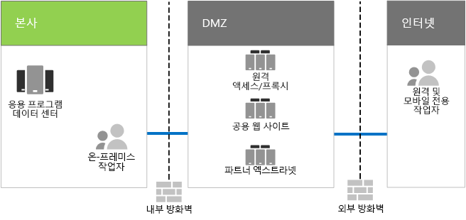

# Contoso의 IT 인프라 및 비즈니스 요구 사항Contoso's IT infrastructure and business needs

**요약:** Contoso 온-프레미스 IT 인프라의 기본 구조와 Microsoft 365 Enterprise로 해당 비즈니스 요구를 충족하는 방법을 이해합니다.**Summary:** Understand the basic structure of Contoso's on-premises IT infrastructure and how its business needs can be met by Microsoft 365 Enterprise.

Contoso는 중앙 집중식 온-프레미스 IT 인프라에서 클라우드 기반 개인 생산성 워크로드 및 응용 프로그램을 통합하는 클라우드 포함 인프라로의 전환을 진행하고 있습니다.Contoso has been transitioning from an on-premises, centralized IT infrastructure to a cloud-inclusive one that incorporates cloud-based personal productivity workloads and applications.

## Contoso의 기존 IT 인프라Contoso's existing IT infrastructure

Contoso는 주로 중앙 집중식 온-프레미스 IT 인프라를 사용하며, 응용 프로그램 데이터 센터는 파리 본사에 있습니다.Contoso uses a mostly centralized on-premises IT infrastructure, with application datacenters in the Paris headquarters.

그림 1에서는 데이터 센터, DMZ 및 인터넷이 구비된 본사 사무실을 볼 수 있습니다.Figure 1 shows a headquarters office with application datacenters, a DMZ, and the Internet.

**그림 1: Contoso의 기존 IT 인프라****Figure 1: Contoso's existing IT infrastructure**
 
온-프레미스 응용 프로그램 데이터 센터에서는 다음과 같은 것들을 호스팅합니다.The on-premises application datacenters host: 

- SQL Server 및 기타 Linux 데이터베이스를 사용하는 사용자 지정 LOB(기간 업무) 응용 프로그램Custom line of business applications that use SQL Server and other Linux databases.
- 레거시 SharePoint 서버 집합A set of legacy SharePoint servers.
- 파일 저장을 위한 조직 및 팀 수준 서버Organization and team-level servers for file storage.

또한 비슷한 응용 프로그램 집합으로 서버 집합을 지원하는 각 지역의 허브 사무실. 이러한 서버는 지역의 IT 부서에서 관리합니다.Additionally, each regional hub office that supports a set of servers with a similar set of applications. These servers are under the control of regional IT departments.

이러한 별도의 다중 지역 데이터 센터에 있는 응용 프로그램 및 데이터에 대한 검색 가능성은 계속해서 해결 과제로 남아 있습니다.Searchability across the applications and data of these separate multi-geographical datacenters continues to be a challenge.

Contoso의 본사 DMZ에서는 각 서버 집합이 다음을 제공합니다.In Contoso's headquarters DMZ, different sets of servers provide:

- 파리 본사 직원을 위한 Contoso 인트라넷 및 웹 프록시에 대한 VPN 기반 원격 액세스 기능VPN-based remote access to the Contoso intranet and web proxying for workers in the Paris headquarters.
- Contoso 공용 웹 사이트 호스팅 기능. 이러한 사이트에서 고객이 제품, 부품, 소모품 또는 서비스를 주문할 수 있습니다.Hosting for the Contoso public web site, from which customers can order products, parts, supplies, or service.
- 파트너와의 정보 교환 및 공동 작업을 위한 Contoso 파트너 엑스트라넷 호스팅 기능Hosting for the Contoso partner extranet for partner communication and collaboration.

## Contoso의 비즈니스 요구 사항Contoso's business needs

Contoso의 비즈니스 요구 사항은 다섯 가지 주요 범주로 나뉩니다.Contoso's business needs fall into five main categories.

생산성:Productivity:

- 보다 쉽게 공동으로 작업Make collaboration easier

  전자 메일 및 파일 공유 기반 공동 작업을 실시간으로 문서 변경, 보다 간편해진 온라인 모임, 캡처한 대화 스레드를 지원하는 온라인 모델로 대체합니다.Replace the email and file share-based collaboration with an online model that allows real-time changes on documents, easier online meetings, and captured conversation threads.
- 원격 및 모바일 작업자의 생산성 향상Improve productivity for remote and mobile workers

  많은 직원들이 가정 또는 현장에서 작업하는 경우, 병목 상태가 나타나는 VPN 솔루션을 클라우드의 Contoso 데이터 및 리소스 액세스 방식으로 대체하여 성능을 높입니다.With many employees working from homes or in the field, replace the bottlenecked VPN solution with performant access to Contoso data and resources in the cloud.
- 창의성 및 혁신 증대Increase creativity and innovation

  수동 입력과 3D 시각화를 포함하여 최신 수준의 시각적 학습 및 아이디어 개발 방식을 활용할 수 있습니다.
Take advantage of the latest visual learning and idea development methods, including inking and 3D visualization.

보안:Security:

- ID 및 액세스 관리Identity and access management

  다중 요소 및 기타 형태의 인증을 적용하고 사용자 및 관리자 계정 자격 증명을 보호합니다.Enforce multi-factor and other forms of authentication and protect user and administrator account credentials.

- 위협 방지Threat protection

  맬웨어를 포함하는 외부 보안 위협으로부터 보호 -> 맬웨어를 포함하여 외부 보안 위협으로부터 보호Protect against external security threats, including email and operating system-based malware.

- 정보 보호Information protection

  고객 데이터, 디자인 사양 및 직원 정보와 같은 고가치 디지털 자산에 대한 액세스를 잠그고 암호화합니다.Lock down access to and encrypt high-value digital assets, such as customer data, design specifications, and employee information.

- 보안 관리Security management

  보안 환경을 모니터링하고 위협을 실시간으로 감지하고 대응할 수 있습니다.Monitor security posture and be able to detect and respond to threats in real time.

원격 및 모바일 액세스 및 비즈니스 파트너:Remote and mobile access and business partners:

- 원격 및 모바일 작업자를 위한 향상된 보안Better security for remote and mobile workers

  BYOD(Bring Your Own Device) 및 회사 소유의 장치 관리를 도입하여 보안 액세스, 올바른 응용 프로그램 동작 및 회사 데이터 보호를 보장합니다.Institute Bring Your Own Device (BYOD) and company-owned device management to ensure secured access, correct application behavior, and company data protection.

- 직원을 위한 원격 액세스 인프라 감소Reduce remote access infrastructure for employees

  일반적으로 액세스하는 리소스를 클라우드로 이동하여 유지 관리 및 지원 비용을 절감하고 원격 액세스 솔루션의 성능을 향상시킵니다.Reduce maintenance and support costs and improve performance for remote access solution by moving resources commonly accessed to the cloud.

- B2B(기업 간) 거래에 대해 더 나은 연결 제공 및 오버헤드 감소Provide better connectivity and lower overhead for Business-to-Business (B2B) transactions

  페더레이션 인증을 사용하는 클라우드 기반 솔루션으로 노후되고 비용이 많이 드는 파트너 엑스트라넷을 교체합니다.Replace aging and expensive partner extranet with a cloud-based solution that uses federated authentication.

규정 준수Compliance:

- 지역별 규정 준수Adhere to regional regulatory requirements

  데이터 저장소, 암호화, 데이터 개인 정보 보호에 대한 업계 및 지역별 규정과 개인 데이터 규정[예: 유럽 연합을 위한 GDPR(일반 데이터 보호 규정)]을 준수합니다.Become and remain compliant with industry and regional regulations for data storage, encryption, data privacy, and personal data regulations, such as the General Data Protection Regulation (GDPR) for the Europe Union.

관리:Management:

- 클라이언트 PC 및 장치에서 실행되는 소프트웨어를 관리하기 위한 IT 오버헤드를 줄입니다.Lower the IT overhead for managing software running on client PCs and devices

  조직 전체에서 Windows 운영 체제 및 Microsoft Office의 업데이트 설치를 자동화합니다.Automate the installation of updates to the Windows operating system and Microsoft Office across the organization.

## Contoso의 비즈니스 요구 사항에 맞는 Microsoft 365 Enterprise 제품 찾기Mapping Contoso's business needs to Microsoft 365 Enterprise

Contoso의 IT 부서는 배포 전에 비즈니스 요구에 맞는 다음과 같은 Microsoft 365 Enterprise E5 기능을 파악했습니다.Contoso's IT department determined the following mapping of business needs to Microsoft 365 Enterprise E5 features prior to deployment:

||||
|:-------|:-----|:-----|
| **범주****Category** | **비즈니스 요구****Business need** | **Microsoft 365 Enterprise 제품 또는 기능****Microsoft 365 Enterprise products or features** |
| 생산성Productivity |  |  |
|  | 보다 쉽게 공동으로 작업Make collaboration easier | Teams, SharePoint Online, 비즈니스용 Skype OnlineTeams, SharePoint Online, Skype for Business Online |
|  | 원격 및 모바일 작업자의 생산성 향상Improve productivity for remote and mobile workers | Office 365 워크로드 및 클라우드 기반 데이터Office 365 workloads and cloud-based data |
|  | 창의성 및 혁신 증대Increase creativity and innovation | Windows Ink, Cortana at Work, PowerPointWindows Ink, Cortana at Work, PowerPoint |
| 보안Security |  |  |
|  | ID 및 액세스 관리Identity & access management | MFA(Multi-Factor Authentication) 및 Azure PIM(Privileged Identity Management다)를 포함하는 전용 전역 관리자 계정Dedicated global administrator accounts with Multi-factor authentication (MFA) and Azure AD Privileged Identity Management (PIM)   모든 사용자 계정에 대한 MFAMFA for all user accounts   조건부 액세스Conditional access   Windows HelloWindows Hello   Windows Credential GuardWindows Credential Guard |
|  | 위협 방지Threat protection | Advanced Threat AnalyticsAdvanced Threat Analytics   Windows DefenderWindows Defender   Advanced Threat ProtectionAdvanced Threat Protection   Office 365 Advanced Threat ProtectionOffice 365 Advanced Threat Protection   Office 365 위협 조사 및 응답Office 365 threat investigation and response   |
|  | 정보 보호Information protection | Azure 정보 보호Azure Information Protection   Office 365 DLP(데이터 손실 방지)Office 365 Data Loss Prevention (DLP)   Windows Information ProtectionWindows Information Protection   Microsoft Cloud App SecurityMicrosoft Cloud App Security   Microsoft IntuneMicrosoft Intune |
|  | 보안 관리Security management | Azure Security CenterAzure Security Center    Windows Defender 보안 센터Windows Defender Security Center |
| 원격 및 모바일 액세스 및 비즈니스 파트너Remote and mobile access and business partners |  |  |
|  | 원격 및 모바일 작업자를 위한 향상된 보안Better security for remote and mobile workers | Microsoft IntuneMicrosoft Intune |
|  | 직원을 위한 원격 액세스 인프라 감소Reduce remote access infrastructure for employees | Office 365 워크로드 및 클라우드 기반 데이터Office 365 workloads and cloud-based data |
|  | B2B 거래에 대해 더 나은 연결 제공 및 오버헤드 감소Provide better connectivity and lower overhead for B2B transactions | 페더레이션된 인증 및 클라우드 기반 리소스Federated authentication and cloud-based resources |
| 규정 준수Compliance |  |  |
|  | 지역별 규정 준수Adhere to regional regulatory requirements | Office 365의 GDPR 기능GDPR features in Office 365 |
| 관리Management |  |  |
|  | 클라이언트 업데이트 설치에 대한 IT 오버헤드 감소Lower the IT overhead for installing client updates | 배포 링Deployment rings   Windows 10 현재 위치 업그레이드 및 AutopilotWindows 10 upgrade in place and Autopilot   Office 365 ProPlusOffice 365 ProPlus |
||||

## 다음 단계Next step

Contoso Corporation의 온-프레미스 네트워크 및 이러한 네트워크가 조직 전체에서 Microsoft 365 클라우드 기반 리소스에 대해 최적화된 액세스 및 대기 시간을 지원하는 방식을 [자세히 알아봅니다](contoso-networking.md).[Learn](contoso-networking.md) about the Contoso Corporation’s on-premises network and how it was optimized for access and latency to Microsoft 365 cloud-based resources across its organization.

## 참고 항목See also

[배포 가이드Deployment guide](deploy-microsoft-365-enterprise.md)

[테스트 랩 가이드Test lab guides](m365-enterprise-test-lab-guides.md)
