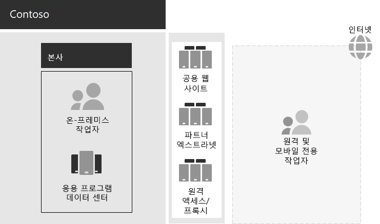

# Contoso IT 인프라 및 비즈니스 요구 사항

Contoso는 온-프레미스 중앙 IT 인프라에서 클라우드 기반 개인 생산성 워크 로드 및 응용 프로그램을 통합 하는 클라우드 포함 설정으로 전환 하 고 있습니다.

## 기존 Contoso IT 인프라

Contoso는 주로 중앙 집중식 온-프레미스 IT 인프라를 사용하며, 응용 프로그램 데이터 센터는 파리 본사에 있습니다.

여기에는 응용 프로그램 데이터 센터, DMZ 및 인터넷이 포함 된 본사 office가 있습니다.

온-프레미스 응용 프로그램 데이터 센터에서는 다음과 같은 것들을 호스팅합니다. 

- SQL Server 및 기타 Linux 데이터베이스를 사용 하는 사용자 지정 lob (기간 업무) 응용 프로그램
- 레거시 SharePoint 서버 집합
- 파일 저장을 위한 조직 및 팀 수준 서버

또한 각 지역 허브 사무소는 유사한 응용 프로그램 집합을 가진 서버 집합을 지원합니다. 이 서버들은 지역 IT부서의 통제를 받습니다.

이러한 별도의 다중 지역 데이터 센터에 있는 응용 프로그램 및 데이터에 대한 검색 가능성은 계속해서 해결 과제로 남아 있습니다.

Contoso 본사 DMZ에서는 각 서버 집합이 다음을 제공 합니다.

- 고객이 제품, 부품, 소모품 및 서비스를 주문할 수 있는 Contoso 공용 웹 사이트용 호스팅입니다.
- 파트너와의 정보 교환 및 공동 작업을 위한 Contoso 파트너 엑스트라넷 호스팅 기능
- 파리 본사 직원을 위한 Contoso 인트라넷 및 웹 프록시에 대한 VPN (가상 사설망) 기반 원격 액세스 기능

## Contoso 비즈니스 요구 사항

Contoso 비즈니스 요구 사항은 다음과 같은 다섯 가지 주요 범주로 나뉩니다.

**생산성**

- 보다 쉽게 공동으로 작업

  전자 메일 및 파일 공유 기반 공동 작업을 문서에 대 한 실시간 변경, 보다 쉬운 온라인 모임 및 캡처된 대화 스레드를 지 원하는 온라인 모델로 대체 합니다.
- 원격 및 모바일 작업자의 생산성 향상

  집 이나 현장에서 근무 하는 직원이 많은 경우에는 병목 현상이 일어난 VPN 솔루션을 클라우드의 Contoso 데이터 및 리소스에 대 한 성능이 뛰어난 액세스로 교체 합니다.
- 창의성 및 혁신 증대

  수동 입력과 3D 시각화를 포함하여 최신 수준의 시각적 학습 및 아이디어 개발 방식을 활용할 수 있습니다.

**보안**

- ID 및 액세스 관리

  다단계 및 기타 형태의 인증을 적용 하 고 사용자 및 관리자 계정 자격 증명을 보호 합니다.

- 위협 방지

  맬웨어를 포함하는 외부 보안 위협으로부터 보호 -> 맬웨어를 포함하여 외부 보안 위협으로부터 보호

- 정보 보호

  고객 데이터, 디자인 및 제조 사양 및 직원 정보와 같은 고가치 디지털 자산에 대한 액세스를 잠그고 암호화합니다.

- 보안 관리

  보안 환경을 모니터링 하 고 위협을 실시간으로 감지 하 고 대응 합니다.

**원격 및 모바일 액세스 및 비즈니스 파트너**

- 원격 및 모바일 작업자에 대 한 보안 강화

  사용자 고유의 장치 (BYOD) 및 회사 소유 장치 관리를 가져와 보안 액세스, 올바른 응용 프로그램 동작 및 회사 데이터 보호를 보장 합니다.

- 직원을 위한 원격 액세스 인프라 감소

  일반적으로 액세스 하는 리소스를 클라우드로 이동 하 여 유지 관리 및 지원 비용을 줄이고 원격 액세스 솔루션의 성능을 향상 시킵니다.

- B2B (susiness) 트랜잭션에 대 한 보다 효율적인 연결 및 오버 헤드를 제공 합니다.

  에이징 및 비싼 파트너 엑스트라넷을 페더레이션 인증을 사용 하는 클라우드 기반 솔루션으로 바꿉니다.

**규정 준수**

- 지역별 규정 준수

  유럽 연합의 GDPR (일반 데이터 보호 규정)과 같은 개인 데이터 규정, 데이터 저장, 암호화, 데이터 개인 정보 보호에 대 한 업계 및 지역별 규정 준수를 보장 합니다.

**관리**

- 클라이언트 Pc 및 장치에서 실행 되는 소프트웨어를 관리 하기 위한 IT 오버 헤드 감소

  조직 전체에서 Windows 운영 체제 및 Microsoft 365 앱에 대 한 업데이트 설치를 자동화 합니다.

## Contoso 비즈니스 요구 사항을 엔터프라이즈에 대 한 Microsoft 365로 매핑

Contoso IT 부서는 배포 전에 Microsoft 365 E5 기능에 다음과 같은 비즈니스 요구 사항을 매핑하는 것을 확인 했습니다.

| 범주 | 비즈니스 요구 | Enterprise 제품 또는 기능에 대 한 Microsoft 365 |
|:-------|:-----|:-----|
| 생산성 |  |  |
|  | 보다 쉽게 공동으로 작업 | Microsoft Teams, SharePoint, OneDrive |
|  | 원격 및 모바일 작업자의 생산성 향상 | Microsoft 365 워크로드 및 클라우드 기반 데이터 |
|  | 창의성 및 혁신 증대 | Windows Ink, Cortana at Work, PowerPoint |
| 보안 |  |  |
|  | ID & 액세스 관리 | Azure MFA (Multi-Factor Authentication) 및 Azure PIM (Privileged Identity Management다)를 포함하는 전용 전역 관리자 계정   모든 사용자 계정에 대한 MFA   조건부 액세스   Windows Hello   Windows Credential Guard |
|  | 위협 방지 | Advanced Threat Analytics   Windows Defender   Office 365용 Microsoft Defender   Microsoft Defender for Office 365   Microsoft 365 위협 조사 및 대응   |
|  | 정보 보호 | Azure Information Protection   DLP(데이터 손실 방지)   WIP(Windows Information Protection)   Microsoft Cloud App Security   Microsoft Intune |
|  | 보안 관리 | Azure Defender *    Windows Defender 보안 센터 |
| 원격 및 모바일 액세스 및 비즈니스 파트너 |  |  |
|  | 원격 및 모바일 작업자를 위한 향상된 보안 | Microsoft Intune |
|  | 직원을 위한 원격 액세스 인프라 감소 | Microsoft 365 워크로드 및 클라우드 기반 데이터 |
|  | B2B 거래에 대 한 연결 및 오버 헤드 감소 | 페더레이션된 인증 및 클라우드 기반 리소스 |
| 규정 준수 |  |  |
|  | 지역별 규정 준수 | Microsoft 365의 GDPR 기능 |
| 관리 |  |  |
|  | 클라이언트 업데이트 설치에 대 한 IT 오버 헤드 감소 | Windows 10 Enterprise 업데이트   Microsoft Office 365 ProPlus 업데이트 |
||||

## 다음 단계

Contoso Corporation [온-프레미스 네트워크](contoso-networking.md) 와 Microsoft 365 클라우드 기반 리소스에 대 한 액세스 및 대기 시간에 최적화 된 방식을 알아봅니다.

## 참고 항목

[엔터프라이즈용 Microsoft 365 개요](microsoft-365-overview.md)

[테스트 랩 가이드](m365-enterprise-test-lab-guides.md)
