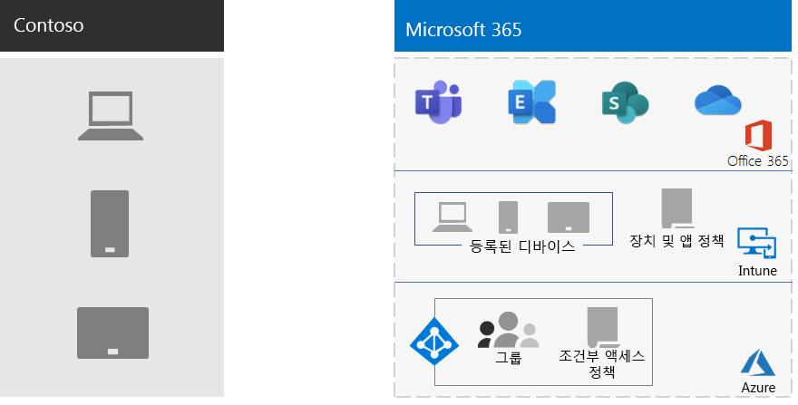

# Contoso의 모바일 장치 관리

Microsoft 365 엔터프라이즈용 앱에는 모바일 장치 및 응용 프로그램 관리 및 보안을 지원하는 Azure 서비스 집합과 Intune이 포함되어 있습니다.

Contoso에는 많은 모바일 지원 직원이 있습니다. 일부에는 Contoso 위치에 사무실이 있으며, 일부는 사무실이 없습니다. Contoso는 직원의 생산성을 유지하지만 장치, 해당 장치에 저장된 Contoso 데이터 및 응용 프로그램 동작을 안전하게 유지하는 방법이 필요했습니다.

## 계획

Contoso는 엔터프라이즈용 모바일 장치 관리의 다음과 같은 Intune 사용 사례를 Microsoft 365 확인했습니다.

- 모바일 Exchange Online 안전하게 액세스할 수 있도록 전자 메일 및 데이터를 보호합니다.
- Contoso 직원을 위한 BYOD(Bring Your Own Device) 프로그램을 구현합니다.
- Contoso 직원에게 조직 소유의 휴대폰 및 제한된 사용이 제한된 공유 태블릿을 발급합니다.

Contoso는 다음을 위해 Intune을 사용하지 않습니다.

- 직원이 관리되지 않는 공개 키오스크에서 Microsoft 365 안전하게 액세스할 수 있도록 합니다.
- 모바일 장치에서 안전하게 액세스할 수 있도록 프레미스 전자 메일 및 데이터를 보호합니다. 이 경우 Microsoft는 모바일 장치에서 안전하게 액세스할 수 Exchange 있습니다.

## 배포

Contoso가 모바일 장치 관리 인프라를 설정하는 방법은 다음과 같습니다.

- Intune을 MDM(모바일 장치 관리) 기관으로 설정하고 Azure에서 Intune을 사용하여 콘텐츠를 관리하고 장치를 관리합니다.
- 등록 Azure Active Directory 및 Intune 설정 및 장치 기반 조건부 액세스 정책에 대한 Azure AD(Azure AD) 그룹 생성

  자세한 내용은 [Contoso 조건부 액세스 정책 을 참조하세요.](contoso-identity.md#conditional-access-policies-for-identity-and-device-access)

- iPad, iMacs 및 iPhone 및 회사 소유의 iPhone을 사용하는 직원을 지원하기 위해 Apple 장치 플랫폼을 사용하도록 설정
- 모바일 장치에 Contoso의 회사 포털을 설치하는 동안 표시되는 Contoso 고유의 사용 약관 정책 생성
- 등록되지 않은 장치의 경우 MAM(모바일 응용 프로그램 관리) 정책 집합을 구현하여 Microsoft 365 서비스에 액세스하기 위해 인증을 요구했습니다.
- 다음을 적용하는 Intune 정책 생성:
  - 허용된 앱.
  - 무단 액세스를 방지하는 데 도움이 되는 장치 암호화입니다.
  - 6자리 PIN 또는 암호입니다.
  - 비활성 시간 제한 기간입니다.
  - 바이러스 백신 및 맬웨어 보호, Windows Defender 장치에서 Windows 10 업데이트
  - 최신 보안 Windows 10 포함된 장치용 자동 업데이트.
  - 관리되는 장치에 인증서 푸시
  - 기업 및 개인 데이터의 명확한 분리. 사용자 또는 관리자는 그림, 개인 전자 메일 계정 및 개인 파일과 같은 개인 데이터는 그대로 두면서 장치에서 회사 데이터를 선택적으로 초기화할 수 있습니다.

Contoso는 등록된 PC 및 회사 소유의 스마트폰 및 태블릿을 해당 Intune 장치 그룹에 추가하여 배포했습니다. 또한 직원이 개인 장치를 등록할 수 있도록 BYOD 프로그램을 설정했습니다. 등록된 장치는 관리되고 보안이 유지되는 장치와 응용 프로그램을 보장하는 Intune 정책을 받게 됩니다. 등록되지 않은 장치에는 허용되는 응용 프로그램을 지정하는 MAM(모바일 응용 프로그램 관리) 정책이 있습니다.

다음은 Contoso 모바일 장치 관리 배포 아키텍처입니다.

## 다음 단계

Contoso가 엔터프라이즈용  엔터프라이즈의 정보 보호 기능을 사용하여 Microsoft 365 중요한 디지털 자산을 분류, 식별 및 보호하는 방법을 알아보습니다.

## 참고 항목

[사용자에 대한 장치 Microsoft 365](device-management-roadmap-microsoft-365.md)

[엔터프라이즈용 Microsoft 365 개요](microsoft-365-overview.md)

[테스트 랩 가이드](m365-enterprise-test-lab-guides.md)

