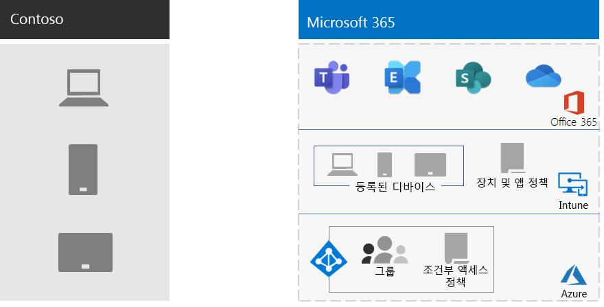

# Contoso의 모바일 장치 관리

Microsoft 365 Enterprise에는 모바일 장치 및 응용 프로그램의 관리와 보안을 지원하기 위한 Azure 서비스 집합과 Intune이 포함되어 있습니다.

Contoso에는 많은 모바일 사용 직원이 있으며, 일부는 Contoso 위치에 사무실을 보유하고, 일부는 사무실이 없습니다. Contoso는 직원 생산성을 유지하면서 장치, 해당 장치에 저장된 Contoso 데이터 및 응용 프로그램 동작을 안전하게 유지하는 방법이 필요했습니다.

## 계획

Microsoft 365 Enterprise의 모바일 장치 관리를 초기에 분석하면서 Contoso는 다음과 같은 Intune 사용 사례를 확인했습니다.

- 모바일 장치에서 안전하게 액세스할 수 있도록 Exchange Online 전자 메일 및 데이터 보호
- Contoso 직원들을 위해 BYOD(Bring Your Own Device) 프로그램 구현
- Contoso 직원에게 조직 소유의 휴대폰 및 사용이 제한된 공유 태블릿 발급

Contoso는 다음 작업에는 Intune을 사용하지 않습니다.

- 직원들이 관리되지 않는 공용 키오스크에서 Office 365에 안전하게 액세스하도록 허용
- 모바일 장치에서 안전하게 액세스할 수 있도록 온-프레미스 전자 메일 및 데이터 보호(온-프레미스 Microsoft Exchange 서버는 더 이상 제공되지 않기 때문)

## 배포

Contoso가 모바일 장치 관리 인프라를 설정하는 방법은 다음과 같습니다.

- Intune을 MDM(모바일 장치 관리) 기관으로 설정하고 Azure에서 Intune을 사용하여 콘텐츠 및 장치 관리
- 등록과 Intune 설정 및 디바이스 기반 조건부 액세스 정책에 대한 디바이스의 Azure AD 그룹 생성

  자세한 내용은 [Contoso의 조건부 액세스 정책](contoso-identity.md#conditional-access-policies-for-identity-and-device-access)을 참조하세요.

- iPad, iMac, iPhone 및 iPhone 기반 회사 소유 휴대폰이 있는 직원을 지원하기 위한 Apple 장치 플랫폼을 사용하도록 설정
- 모바일 장치에 Contoso의 회사 포털을 설치하는 동안 표시되는 Contoso 고유의 사용 약관 정책 생성
- 등록된 장치의 경우, Office 365 서비스에 액세스하기 위해 인증을 요구하는 MAM(모바일 응용 프로그램 관리) 정책 집합
- 다음을 적용하는 Intune 정책 생성:
  - 허용되는 앱
  - 무단된 액세스를 방지하기 위한 장치 암호화
  - 6자리 PIN 또는 암호
  - 비활성화 시간 초과 기간
  - Windows 10 장치의 Windows Defender를 사용한 바이러스 백신 및 맬웨어 보호, 서명 업데이트
  - 최신 보안 업데이트를 포함하는 Windows 10 장치의 자동 업데이트
  - 관리되는 장치로 인증서 푸시
  - 기업 및 개인 데이터의 명확한 분리. 사용자 또는 관리자는 그림, 개인 전자 메일 계정 및 개인 파일과 같은 개인 데이터는 그대로 두면서 장치에서 회사 데이터를 선택적으로 초기화할 수 있습니다.

배포가 끝난 후에 Contoso는 PC 및 회사 소유의 스마트폰과 태블릿을 해당 Intune 장치 그룹에 추가하여 등록한 후, 직원이 개인 장치를 등록할 수 있는 BYOD 프로그램을 롤아웃했습니다. 등록된 장치에는 Intune 정책이 수신되므로 장치 및 해당 응용 프로그램을 관리하고 보안을 유지할 수 있습니다. 등록되지 않은 장치에는 허용되는 응용 프로그램을 지정하는 MAM(모바일 응용 프로그램 관리) 정책이 적용됩니다.

여기 Contoso의 모바일 장치 관리 배포 구조가 있습니다.

## 다음 단계

Contoso에서 Microsoft 365 Enterprise의 정보 보호 기능을 사용하여 조직에서 중요한 디지털 자산을 분류하고, 식별하고, 보호하는 방법을 [알아봅니다](contoso-info-protect.md).

## 참고 항목

[Microsoft 365 Enterprise의 모바일 장치 관리](mobility-infrastructure.md)

[배포 가이드](deploy-microsoft-365-enterprise.md)

[테스트 랩 가이드](m365-enterprise-test-lab-guides.md)

